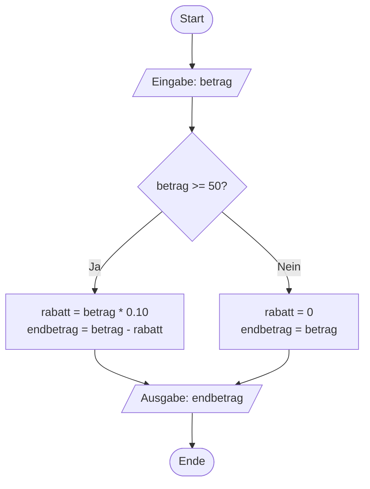
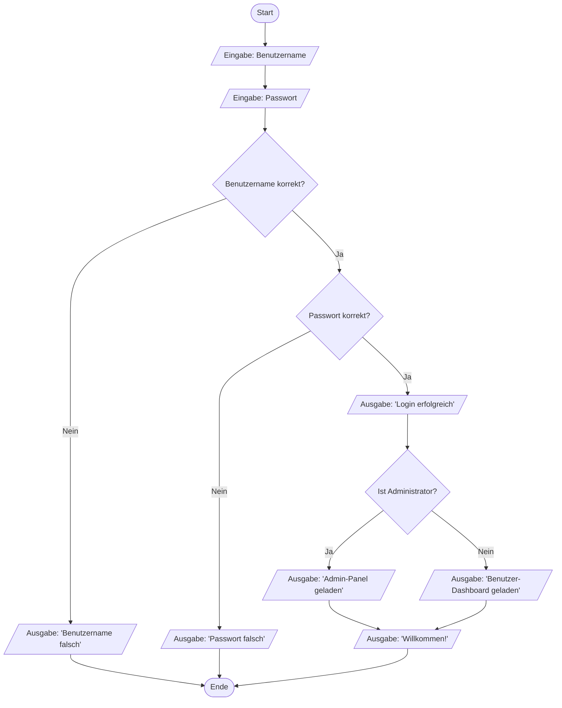
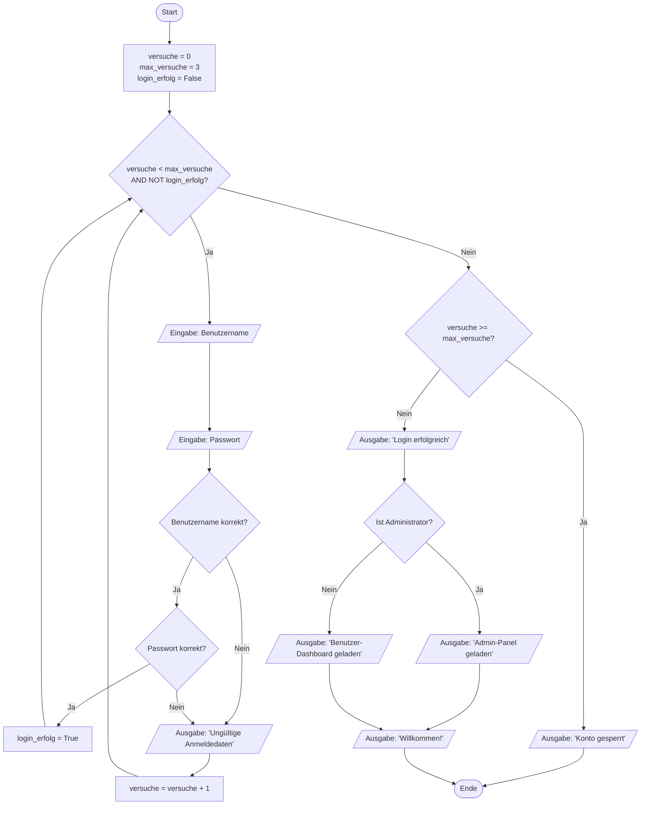

# V05: Lösungen - Programm-Ablauf-Pläne & Verzweigungen

> [!WARNING]
> Versuche die Aufgaben zuerst selbstständig zu lösen, bevor du die Lösungen ansiehst!

---

## Teil A: Theorie-Aufgaben - Lösungen

### Lösung T1: PAP-Symbole identifizieren

**Lösung**:

1. **Abgerundetes Rechteck (Oval)** → **B) Start oder Ende des Programms**
2. **Rechteck** → **D) Prozess / Anweisung**
3. **Raute (Diamant)** → **C) Entscheidung / Verzweigung**
4. **Parallelogramm** → **A) Ein-/Ausgabe-Operation**

**Zusatzfrage - Normen:**
- **DIN 66001** (deutscher Standard, erstmals 1966)
- **ISO 5807** (internationaler Standard, 1985)

**Erklärung**:

Diese vier Symbole sind die Grundbausteine jedes Programm-Ablauf-Plans. Das **abgerundete Rechteck** markiert eindeutig Anfang und Ende eines Ablaufs – es gibt keinen Kontrollfluss, der in ein Startsymbol hineinführt oder aus einem Endsymbol herausführt. Das **Rechteck** ist das Arbeitspferd der PAPs und repräsentiert alle Arten von Operationen: Zuweisungen, Berechnungen, Funktionsaufrufe. Die **Raute** ist das einzige Symbol, das zu einer Aufspaltung des Kontrollflusses führt – aus ihr gehen mindestens zwei Pfeile heraus, die mit den möglichen Entscheidungsausgängen beschriftet sind. Das **Parallelogramm** unterscheidet sich durch seine geneigte Form deutlich von anderen Symbolen und macht sofort klar, dass hier eine Interaktion mit der Außenwelt (Benutzer, Dateien, Netzwerk) stattfindet.

Die Standardisierung durch DIN 66001 und ISO 5807 gewährleistet, dass Ingenieure und Entwickler weltweit die gleichen Symbole verwenden und verstehen. Dies ist besonders wichtig in internationalen Projekten und beim Austausch von Dokumentation.

**Häufige Fehler**:
- **Verwechslung von Rechteck und Parallelogramm**: Das Parallelogramm hat geneigte Seiten und ist spezifisch für I/O-Operationen. Ein Rechteck ist für alle anderen Anweisungen.
- **Unklare Beschriftung bei Rauten**: Vergiss nicht, die ausgehenden Pfeile mit "Ja" / "Nein" zu beschriften – ohne Beschriftung ist unklar, welcher Pfad zu welchem Ergebnis führt.

---

### Lösung T2: PAP erstellen für einfachen Algorithmus

**Lösung**:



**Erklärung**:

Der PAP beginnt mit dem **Startsymbol** und endet mit dem **Endsymbol**. Die erste Operation ist eine **Ein-/Ausgabe** (Parallelogramm), da der Benutzer den Betrag eingeben muss. Danach folgt eine **Entscheidung** (Raute), die prüft, ob der Betrag mindestens 50 Euro beträgt.

Bei der **Ja-Verzweigung** (betrag >= 50) werden zwei Berechnungen durchgeführt, die beide in **eine Prozess-Box** geschrieben werden können (durch Zeilenumbruch getrennt). Alternativ könnten dies auch zwei separate Prozess-Boxen sein, was aber zu einem längeren Diagramm führt. Bei der **Nein-Verzweigung** (betrag < 50) werden ebenfalls zwei Zuweisungen vorgenommen.

Beide Pfade führen zur **Ausgabe** (Parallelogramm), wo der Endbetrag angezeigt wird. Dieser Zusammenführungspunkt ist wichtig für die Lesbarkeit – nach einer Verzweigung sollten sich Pfade wieder vereinen, bevor das Programm fortgesetzt wird. Schließlich endet der PAP mit dem **Endsymbol**.

**Lösungsweg Schritt für Schritt**:
1. **Startsymbol** platzieren (oben)
2. **Ein-/Ausgabe-Symbol** für die Eingabe
3. **Entscheidungssymbol** (Raute) mit Bedingung "betrag >= 50?"
4. Zwei **Prozess-Boxen** für die beiden Verzweigungspfade
5. **Ein-/Ausgabe-Symbol** für die Ausgabe (Zusammenführungspunkt)
6. **Endsymbol** (unten)
7. Alle Elemente mit **Pfeilen** verbinden
8. Pfeile bei der Entscheidung mit **"Ja" und "Nein"** beschriften

**Häufige Fehler**:
- **Vergessene Beschriftung**: Die Pfeile aus der Raute müssen mit "Ja" / "Nein" beschriftet sein.
- **Keine Zusammenführung**: Manche Lösungen lassen die Pfade getrennt bis zum Ende laufen – dies ist zwar nicht falsch, aber weniger übersichtlich.
- **Falsches Symbol**: Die Eingabe muss ein Parallelogramm sein, kein Rechteck.
- **Mehrere Operationen, mehrere Boxen**: Es ist in Ordnung, `rabatt` und `endbetrag` in eine Box zu schreiben (mit Zeilenumbruch), oder zwei separate Boxen zu verwenden. Beide Varianten sind korrekt.

---

### Lösung T3: Grundstrukturen analysieren und optimieren

**Lösung Teil (a) – Identifiziere die drei Grundstrukturen**:

**Sequenzen** (einfache Folgen ohne Verzweigung):
- Schritte 1-3: Start → Eingabe Benutzername → Eingabe Passwort (Sequenz)
- Schritte 6-9: Nach erfolgreichem Login bis Willkommensmeldung (Sequenz mit eingebetteter Verzweigung)

**Verzweigungen** (if-else Strukturen):
- Schritt 4: Prüfung des Benutzernamens (binäre Verzweigung)
- Schritt 5: Prüfung des Passworts (binäre Verzweigung)
- Schritt 7: Prüfung, ob Administrator (binäre Verzweigung)

**Schleifen** (Wiederholungen):
- **Keine Schleife vorhanden** im ursprünglichen Algorithmus
- **Sinnvolle Einbaumöglichkeit**: Man könnte eine Schleife um die Schritte 2-5 legen, um dem Benutzer mehrere Versuche zu geben, falls Benutzername oder Passwort falsch sind.

**Lösung Teil (b) – Vollständiger PAP**:



**Lösung Teil (c) – Optimierungsvorschlag mit Schleife**:



**Erklärung**:

Im optimierten PAP wird eine **Schleife** eingeführt, die dem Benutzer bis zu 3 Login-Versuche ermöglicht. Die Schleife nutzt eine **Zählvariable** `versuche` und ein **Boolean-Flag** `login_erfolg`. Die Schleifenbedingung ist **zusammengesetzt**: Die Schleife läuft, solange `versuche < max_versuche` UND `login_erfolg == False`. Dies ist eine **kopfgesteuerte Schleife** (while-Schleife), da die Bedingung vor jedem Durchlauf geprüft wird.

Der Schleifenrumpf enthält die Eingabe von Benutzername und Passwort sowie die Validierung. Bei **fehlgeschlagener Validierung** wird `versuche` inkrementiert und die Schleife wiederholt. Bei **erfolgreicher Validierung** wird `login_erfolg = True` gesetzt, wodurch die Schleifenbedingung `False` wird und die Schleife beendet wird.

Nach Verlassen der Schleife wird geprüft, ob das Maximum der Versuche erreicht wurde. Wenn `versuche >= 3` und `login_erfolg == False`, wird "Konto gesperrt" ausgegeben. Ansonsten war der Login erfolgreich und das Programm setzt mit der Administrator-Prüfung fort.

**Lösungsweg Schritt für Schritt**:

1. **Initialisierung**: Führe Variablen `versuche`, `max_versuche` und `login_erfolg` ein
2. **Schleifenkopf**: Platziere eine Raute mit kombinierter Bedingung
3. **Schleifenrumpf**: Eingabe und Validierung
4. **Fehlerbehandlung**: Bei Fehler Zähler erhöhen, Schleife wiederholen
5. **Erfolgsbehandlung**: Bei Erfolg Flag setzen, Schleife beenden
6. **Nach der Schleife**: Prüfen, ob gesperrt oder erfolgreich
7. **Restlicher Ablauf**: Wie im Original-PAP

**Alternative Lösungsansätze**:

**Ansatz 1: Getrennte Zähler für Benutzername und Passwort**
- ✅ Vorteile: Kann separate Limits für verschiedene Fehlerarten setzen
- ❌ Nachteile: Komplexer, mehr Variablen, für diese Aufgabe überdimensioniert

**Ansatz 2: Fußgesteuerte Schleife (do-while äquivalent)**
- ✅ Vorteile: Mindestens ein Durchlauf garantiert (aber hier sowieso gegeben)
- ❌ Nachteile: In Python nicht direkt verfügbar, würde Umweg über `while True` mit `break` erfordern

**Häufige Fehler**:
- **Vergessen, die Schleife zu verlassen**: Wenn `login_erfolg` nicht gesetzt wird, läuft die Schleife bis `max_versuche` auch bei erfolgreichem Login
- **Falsche Schleifenbedingung**: `OR` statt `AND` würde dazu führen, dass die Schleife immer läuft, solange eine der Bedingungen wahr ist
- **Inkrementierung bei Erfolg**: Manche Lösungen inkrementieren `versuche` auch bei erfolgreichem Login, was das Limit unnötig verbraucht
- **Keine Ausgabe nach Schleife**: Es ist wichtig, nach der Schleife zu prüfen und dem Benutzer Feedback zu geben ("Konto gesperrt" oder "Login erfolgreich")

---

## Teil B: Python-Aufgaben - Lösungen

### Lösung P1: Einfache if-Anweisung - CNC-Drehzahl-Warnung

**Vollständiger Code**:
```python
# Lösung P1: CNC-Drehzahl-Warnung
drehzahl = int(input("Aktuelle Spindeldrehzahl (U/min): "))

# Prüfe, ob Drehzahl >= 3000 U/min
if drehzahl >= 3000:
    print("⚠️ WARNUNG: Hohe Drehzahl! Werkzeugverschleiß prüfen.")

# Programm endet hier (mit oder ohne Warnung, je nach Drehzahl)
```

**Erklärung**:

Die Lösung verwendet eine **einfache if-Anweisung ohne else-Zweig**. Die aktuelle Spindeldrehzahl wird mit `input()` eingelesen und mit `int()` in eine Ganzzahl konvertiert. Die Bedingung `drehzahl >= 3000` prüft, ob die Drehzahl den kritischen Schwellenwert erreicht oder überschreitet. Wenn die Bedingung **wahr** ist, wird die eingerückte Zeile mit der Warnung ausgegeben. Wenn die Bedingung **falsch** ist (Drehzahl unter 3000 U/min), wird die eingerückte Zeile übersprungen und das Programm endet ohne weitere Ausgabe.

**Praxisbezug**:

In CNC-Werkstätten sind solche Schwellenwert-Prüfungen essentiell für die **vorbeugende Wartung (Predictive Maintenance)**. Hohe Spindeldrehzahlen führen zu erhöhtem Werkzeugverschleiß, höherer Temperatur und damit zu Qualitätseinbußen. Die Grenze von 3000 U/min ist ein typischer Wert, ab dem bei vielen Bearbeitungsverfahren die Überwachungsintensität erhöht werden muss.

**Typische Drehzahlbereiche in der Praxis:**
- **Bohren**: 1000-3000 U/min (abhängig von Durchmesser und Material)
- **Fräsen**: 2000-8000 U/min (Hochgeschwindigkeits-Fräsen bis 20.000 U/min)
- **Drehen**: 500-2000 U/min (große Durchmesser), 3000-5000 U/min (kleine Durchmesser)

**Warum diese Lösung?**

Die Aufgabe verlangt explizit eine **einfache if-Anweisung** ohne else-Zweig. Dies ist das grundlegendste Konstrukt für bedingte Ausführung. Es demonstriert, dass Code nur unter bestimmten Umständen ausgeführt wird. Im industriellen Kontext wird diese Form oft für **Warn- und Alarmsysteme** verwendet, bei denen nur im Fehlerfall eine Aktion erfolgt.

**Häufige Fehler**:
- **Fehler**: Vergessener Doppelpunkt nach if
  - **Warum falsch**: Python erfordert einen Doppelpunkt, um den Beginn des if-Blocks zu markieren
  - **Richtig**: `if drehzahl >= 3000:`

- **Fehler**: Fehlende Einrückung
  ```python
  if drehzahl >= 3000:
  print("⚠️ WARNUNG...")  # Fehler: Nicht eingerückt
  ```
  - **Warum falsch**: Python verwendet Einrückung zur Definition von Blöcken
  - **Richtig**: `print()` muss 4 Leerzeichen eingerückt sein

- **Fehler**: Verwendung von `=` statt `>=`
  ```python
  if drehzahl = 3000:  # Falsch: Zuweisung statt Vergleich
  ```
  - **Warum falsch**: `=` ist eine Zuweisung, keine Bedingung. Dies führt zu einem `SyntaxError`
  - **Richtig**: Für Vergleiche `>=` verwenden (größer oder gleich)

- **Fehler**: Falscher Schwellenwert-Operator (`>` statt `>=`)
  - **Problem**: Bei exakt 3000 U/min würde keine Warnung ausgegeben, obwohl dies bereits kritisch ist
  - **Richtig**: `>=` verwenden, um den Schwellenwert einzuschließen

---

### Lösung P2: if-else für binäre Entscheidung - Hydraulikdruck-Monitor

**Vollständiger Code**:
```python
# Lösung P2: Hydraulikdruck-Monitor
druck = float(input("Systemdruck (bar): "))

# Binäre Verzweigung: Druck zu niedrig oder OK
if druck < 50:
    print(f"❌ FEHLER: Druck zu niedrig ({druck} bar). Pumpe prüfen!")
else:
    print(f"✅ Druck OK ({druck} bar). System betriebsbereit.")
```

**Lösung mit Zusatzaufgabe (PSI-Umrechnung)**:
```python
# Lösung P2 mit Zusatzaufgabe: PSI-Berechnung
druck = float(input("Systemdruck (bar): "))

# Berechne PSI-Entsprechung (Pound per Square Inch)
psi = druck * 14.5038

# Binäre Verzweigung: Druck zu niedrig oder OK
if druck < 50:
    print(f"❌ FEHLER: Druck zu niedrig ({druck} bar / {psi:.2f} PSI). Pumpe prüfen!")
else:
    print(f"✅ Druck OK ({druck} bar / {psi:.2f} PSI). System betriebsbereit.")

# Alternative: PSI-Ausgabe außerhalb der Verzweigung
# print(f"Entspricht {psi:.2f} PSI")
```

**Erklärung**:

Diese Lösung demonstriert die **if-else-Anweisung**, bei der **immer genau einer der beiden Blöcke** ausgeführt wird. Die Bedingung `druck < 50` ist eine **binäre Frage** mit zwei sich gegenseitig ausschließenden Ergebnissen. Wenn der Druck unter 50 bar liegt, deutet dies auf einen Fehler hin (Leckage, defekte Pumpe, falsches Ventil). Andernfalls (else) ist das System betriebsbereit.

Die Verwendung von `float()` statt `int()` ist wichtig, da Druckwerte oft Dezimalstellen haben (z.B. 45.5 bar oder 180.3 bar). Die f-Strings ermöglichen eine formatierte Ausgabe mit eingebetteten Variablen und Emojis für bessere Lesbarkeit.

**Praxisbezug**:

In hydraulischen Systemen ist die Drucküberwachung ein kritischer Sicherheitsaspekt. Die Grenze von 50 bar ist typisch für Niederdruck-Warngrenzen in Industriehydraulik-Systemen:

- **< 50 bar**: Fehlfunktion (Pumpe defekt, Leckage, Ventil offen)
- **50-150 bar**: Normalbetrieb für viele Anwendungen
- **150-350 bar**: Hochdruck-Anwendungen (Pressen, mobile Hydraulik)
- **> 350 bar**: Spezialanwendungen (Wasserstrahlschneiden)

Bei der **Zusatzaufgabe** wird der Druck in PSI (Pound per Square Inch) umgerechnet. PSI ist vor allem in den USA gebräuchlich. Die Umrechnungsformel lautet:

$$\text{PSI} = \text{bar} \times 14.5038$$

Die Ausgabe erfolgt mit zwei Dezimalstellen (`.2f`). Die PSI-Ausgabe kann entweder in beiden Zweigen wiederholt werden oder **außerhalb der if-else-Struktur** einmal platziert werden – letzteres ist effizienter und vermeidet Code-Duplikation.

**Schritt-für-Schritt Durchlauf**:

**Eingabe: 35.5**
1. `druck = 35.5` (float-Konvertierung)
2. Bedingung: `35.5 < 50` → `True`
3. if-Block wird ausgeführt: "❌ FEHLER: Druck zu niedrig..."
4. else-Block wird übersprungen
5. Programm endet
6. **Diagnose**: Pumpe prüfen, Leckage suchen, Ventilstellung überprüfen

**Eingabe: 180.0**
1. `druck = 180.0`
2. Bedingung: `180.0 < 50` → `False`
3. if-Block wird übersprungen
4. else-Block wird ausgeführt: "✅ Druck OK..."
5. Programm endet
6. **Status**: System betriebsbereit, normale Produktion möglich

**Häufige Fehler**:
- **Fehler**: Verwendung von `int()` statt `float()`
  - **Warum problematisch**: Bei Eingabe "45.5" würde `int()` einen `ValueError` werfen
  - **Richtig**: `float()` für Dezimalzahlen verwenden (Standard in der Messtechnik)

- **Fehler**: Falsche Bedingung (`<=` statt `<`)
  - **Problem**: Bei exakt 50 bar (Grenzwert) würde "Fehler" ausgegeben, obwohl dies noch akzeptabel ist
  - **Richtig**: `< 50` verwenden, um den Grenzwert 50 bar als "noch OK" zu werten
  - **Alternative**: Je nach Anwendung kann auch `<= 50` sinnvoll sein – dies hängt von der spezifischen Norm ab

- **Fehler**: Code-Duplikation bei Zusatzaufgabe
  ```python
  if druck < 50:
      psi = druck * 14.5038
      print(f"... {psi:.2f} PSI")
  else:
      psi = druck * 14.5038  # Duplikat!
      print(f"... {psi:.2f} PSI")
  ```
  - **Besser**: Berechnung vor if-else durchführen, dann in beiden Zweigen verwenden

- **Fehler**: Fehlende Formatierung bei PSI-Ausgabe
  - **Problem**: `print(f"{psi}")` ohne `.2f` zeigt zu viele Dezimalstellen (z.B. 2900.7639999)
  - **Richtig**: `{psi:.2f}` für 2 Dezimalstellen (industrietypisch)

---

### Lösung P3: if-elif-else für mehrfache Verzweigung - Materialspannungs-Klassifikation

**Vollständiger Code**:
```python
# Lösung P3: Materialspannungs-Klassifikator
kraft = float(input("Kraft F (N): "))
flaeche = float(input("Querschnittsfläche A (mm²): "))

# Prüfung: Division durch Null vermeiden
if flaeche == 0:
    print("❌ FEHLER: Querschnittsfläche darf nicht 0 sein!")
else:
    # Spannung berechnen (N/mm² = MPa)
    sigma = kraft / flaeche
    
    # Klassifikation bestimmen (mehrfache Verzweigung)
    if sigma < 100:
        klassifikation = "Niedrigspannung"
        beschreibung = "Sicher, weit unter Streckgrenze"
    elif sigma < 235:
        klassifikation = "Betriebsspannung"
        beschreibung = "Normal, im zulässigen Bereich"
    elif sigma < 360:
        klassifikation = "Grenzspannung"
        beschreibung = "Achtung! Nahe/über Streckgrenze"
    else:
        klassifikation = "Bruchspannung"
        beschreibung = "GEFAHR! Material versagt!"
    
    # Ausgabe
    print(f"Spannung σ: {sigma:.2f} MPa")
    print(f"Klassifikation: {klassifikation} ({beschreibung})")
```

**Erklärung**:

Diese Lösung zeigt die **if-elif-else-Struktur** mit mehreren Verzweigungen und kombiniert sie mit einer **Fehlerbehandlung** (Division durch Null). Die Spannungsberechnung erfolgt mit der Formel:

$$\sigma = \frac{F}{A}$$

wobei $ F $ in Newton [N], $ A $ in mm² und das Ergebnis $ \sigma $ automatisch in MPa (Megapascal) ist, da $ 1 \, \text{N/mm}^2 = 1 \, \text{MPa} $.

Die Klassifikation nutzt **vier Spannungsbereiche**, die auf den Kennwerten von Baustahl S235 basieren:
1. **< 100 MPa**: Niedrigspannung (Sicherheitsfaktor > 2)
2. **100-235 MPa**: Betriebsspannung (normaler Arbeitsbereich)
3. **235-360 MPa**: Grenzspannung (plastische Verformung beginnt bei 235 MPa)
4. **≥ 360 MPa**: Bruchspannung (Material bricht)

**Praxisbezug**:

In der Festigkeitslehre ist die mechanische Spannung die fundamentale Größe zur Beurteilung von Bauteilsicherheit. Die Grenzwerte basieren auf DIN EN 10025 für Baustahl S235:
- **Streckgrenze** $ R_e = 235 \, \text{MPa} $: Ab hier beginnt plastische (bleibende) Verformung
- **Zugfestigkeit** $ R_m = 360-510 \, \text{MPa} $: Maximale Spannung vor dem Bruch
- **Sicherheitsfaktor** $ S $: In der Praxis meist $ S = 1.5-3.0 $, d.h. maximale Betriebsspannung $ \sigma_{zul} = R_e / S \approx 80-160 \, \text{MPa} $

**Konzepte in dieser Lösung**:
- **Verkettete elif-Anweisungen**: Ermöglichen vier Ausführungspfade
- **Verschachtelte if-else**: Äußeres if prüft auf Division-durch-Null
- **Implizite Bereichsprüfung**: Die Reihenfolge der Bedingungen definiert die Spannungsbereiche
- **String-Formatierung mit f-Strings**: `{sigma:.2f}` rundet auf 2 Dezimalstellen
- **Physikalische Einheiten**: Beachtung der Einheitenkonsistenz (N, mm², MPa)

**Schritt-für-Schritt Durchlauf**:

**Eingabe: F = 50000 N, A = 250 mm²**
1. Prüfung: $ A \neq 0 $ → OK
2. Berechnung: $ \sigma = 50000 / 250 = 200 \, \text{MPa} $
3. Klassifikation:
   - $ 200 < 100 $? Nein
   - $ 200 < 235 $? **Ja** → Betriebsspannung
4. Ausgabe: "Spannung σ: 200.00 MPa, Klassifikation: Betriebsspannung (Normal, im zulässigen Bereich)"

**Eingabe: F = 100000 N, A = 250 mm²**
1. Prüfung: $ A \neq 0 $ → OK
2. Berechnung: $ \sigma = 100000 / 250 = 400 \, \text{MPa} $
3. Klassifikation:
   - $ 400 < 100 $? Nein
   - $ 400 < 235 $? Nein
   - $ 400 < 360 $? Nein
   - else → **Bruchspannung**
4. Ausgabe: "Spannung σ: 400.00 MPa, Klassifikation: Bruchspannung (GEFAHR! Material versagt!)"

**Häufige Fehler**:
- **Fehler**: Fehlende Prüfung auf Division durch Null
  ```python
  sigma = kraft / flaeche  # Crash bei flaeche=0!
  ```
  - **Warum gefährlich**: `ZeroDivisionError` führt zum Programmabsturz
  - **Richtig**: Vor Division prüfen: `if flaeche == 0: ... else: ...`

- **Fehler**: Falsche Reihenfolge der Bedingungen
  ```python
  if sigma < 360:  # Zu allgemein zuerst!
      klassifikation = "Grenzspannung"
  elif sigma < 235:  # Wird nie erreicht bei sigma=200
      klassifikation = "Betriebsspannung"
  ```
  - **Warum falsch**: Alle Spannungen < 235 werden als "Grenzspannung" klassifiziert
  - **Richtig**: Von klein zu groß prüfen: `< 100`, dann `< 235`, dann `< 360`, dann `else`

- **Fehler**: Inkonsistente Einheiten
  ```python
  kraft = 50  # kN statt N?
  flaeche = 0.00025  # m² statt mm²?
  ```
  - **Problem**: Ergebnis wäre in falscher Einheit
  - **Richtig**: Einheiten dokumentieren und konsistent verwenden (hier: N und mm² → MPa)

- **Fehler**: Vergessener else-Zweig
  - **Problem**: Variable `klassifikation` bleibt undefiniert bei $ \sigma \geq 360 $, führt zu `NameError`
  - **Richtig**: Immer einen else-Zweig für den "Rest" einbauen

---

### Lösung P4: Verschachtelte Bedingungen - CNC-Bearbeitungskosten-Rechner

**Vollständiger Code**:
```python
# Lösung P4: CNC-Bearbeitungskosten-Rechner

# === Eingaben ===
bearbeitungszeit = float(input("Bearbeitungszeit (h): "))
material_code = int(input("Material-Code (1=Alu, 2=Stahl, 3=Edelstahl): "))
materialgewicht = float(input("Materialgewicht (kg): "))
komplexitaet = int(input("Komplexität (1=Einfach, 2=Mittel, 3=Komplex): "))
stueckzahl = int(input("Stückzahl: "))
express = input("Express-Bearbeitung? (j/n): ").lower()

# === Konstanten ===
GRUNDKOSTEN = 80  # EUR/h Maschinenstundensatz

# === Materialkosten pro kg ===
if material_code == 1:
    material_name = "Aluminium"
    materialpreis_kg = 15
elif material_code == 2:
    material_name = "Stahl"
    materialpreis_kg = 10
elif material_code == 3:
    material_name = "Edelstahl"
    materialpreis_kg = 25
else:
    material_name = "Unbekannt"
    materialpreis_kg = 0
    print("⚠️ Ungültiger Material-Code! Verwende 0 EUR/kg.")

# === Komplexitätszuschlag pro Stunde ===
if komplexitaet == 1:
    komplexitaets_name = "Einfach"
    komplexitaets_zuschlag = 0
elif komplexitaet == 2:
    komplexitaets_name = "Mittel (3D-Fräsen)"
    komplexitaets_zuschlag = 20
elif komplexitaet == 3:
    komplexitaets_name = "Komplex (5-Achs)"
    komplexitaets_zuschlag = 50
else:
    komplexitaets_name = "Unbekannt"
    komplexitaets_zuschlag = 0
    print("⚠️ Ungültige Komplexität! Verwende 0 EUR/h Zuschlag.")

# === Berechnung ===
# Schritt 1: Maschinenkosten
stundensatz = GRUNDKOSTEN + komplexitaets_zuschlag
maschinenkosten = stundensatz * bearbeitungszeit

# Schritt 2: Materialkosten
materialkosten = materialpreis_kg * materialgewicht

# Schritt 3: Stückkosten
stueckkosten = maschinenkosten + materialkosten

# Schritt 4: Gesamtkosten (vor Rabatt)
gesamtkosten = stueckkosten * stueckzahl

# Schritt 5: Mengenrabatt
if stueckzahl >= 100:
    rabatt_prozent = 30
elif stueckzahl >= 50:
    rabatt_prozent = 20
elif stueckzahl >= 10:
    rabatt_prozent = 10
else:
    rabatt_prozent = 0

rabatt_betrag = gesamtkosten * (rabatt_prozent / 100)
gesamtkosten_nach_rabatt = gesamtkosten - rabatt_betrag

# Schritt 6: Express-Zuschlag (nach Rabatt!)
if express == 'j':
    express_zuschlag = gesamtkosten_nach_rabatt * 0.5
    endkosten = gesamtkosten_nach_rabatt + express_zuschlag
    express_text = "Ja (+50%)"
else:
    express_zuschlag = 0
    endkosten = gesamtkosten_nach_rabatt
    express_text = "Nein"

# === Ausgabe ===
print("\n=== CNC-Bearbeitungskosten ===")
print(f"Maschinenkosten: {maschinenkosten:.2f} EUR ({stundensatz} EUR/h × {bearbeitungszeit} h)")
print(f"Materialkosten: {materialkosten:.2f} EUR ({materialpreis_kg} EUR/kg × {materialgewicht} kg {material_name})")
print(f"Stückkosten: {stueckkosten:.2f} EUR")
print(f"Gesamtkosten: {gesamtkosten:.2f} EUR ({stueckzahl} Stück)")
print(f"Mengenrabatt: {rabatt_prozent}%", end="")
if rabatt_prozent > 0:
    print(f" → {gesamtkosten_nach_rabatt:.2f} EUR")
else:
    print()
print(f"Express-Zuschlag: {express_text}", end="")
if express == 'j':
    print(f" → {endkosten:.2f} EUR")
else:
    print()
print("─" * 30)
print(f"ENDKOSTEN: {endkosten:.2f} EUR")
```

**Alternative Lösung mit verschachtelten if-Anweisungen**:

```python
# Alternative: Stärker verschachtelt (funktioniert, aber weniger lesbar)
grundpreis = 12.0
alter = int(input("Alter: "))
wochentag = int(input("Wochentag (1-7): "))
ist_student = input("Student? (j/n): ").lower()

preis = grundpreis

# Altersrabatt
if alter < 12:
    preis = preis * 0.5
elif alter >= 65:
    preis = preis * 0.7

# Tag/Student-Rabatt (verschachtelt)
if wochentag == 1:
    # Montag hat Vorrang
    preis = preis * 0.8
else:
    # Nicht-Montag
    if ist_student == 'j':
        preis = preis * 0.85

print(f"Dein Ticketpreis: {preis:.2f} EUR")
```

**Erklärung**:

Diese Aufgabe demonstriert **mehrfache Rabattstufen**, die nacheinander angewendet werden. Die Logik ist in **zwei Phasen** unterteilt:

**Phase 1: Altersrabatt**
- Kinder (< 12): 50% Rabatt → Preis × 0.5
- Senioren (>= 65): 30% Rabatt → Preis × 0.7
- Erwachsene (12-64): Kein Rabatt → Preis bleibt

**Phase 2: Tag- oder Studenten-Rabatt** (sich gegenseitig ausschließend)
- Wenn Montag: 20% Rabatt (Vorrang vor Studenten-Rabatt)
- Wenn nicht Montag UND Student: 15% Rabatt
- Sonst: Kein zusätzlicher Rabatt

Die Rabatte werden **multiplikativ angewendet**. Beispiel: Kind (50%) an einem Montag (20%) → `12 × 0.5 × 0.8 = 4.80 EUR`. Die Verwendung von `.lower()` bei der Studenten-Abfrage macht die Eingabe case-insensitive (sowohl "j" als auch "J" werden akzeptiert).

**Design-Entscheidungen**:
- **Sequenzielle Anwendung**: Rabatte werden nacheinander angewendet, nicht alle gleichzeitig berechnet
- **Vorrang-Regel**: Montag-Rabatt hat Vorrang vor Studenten-Rabatt (durch if-elif-Struktur)
- **Multiplikative Rabatte**: Rabatte werden auf den bereits reduzierten Preis angewendet, nicht auf den Grundpreis

**Schritt-für-Schritt Durchlauf (Beispiel: Alter=10, Wochentag=3, Student=n)**:
1. `preis = 12.0` (Grundpreis)
2. Altersrabatt: `alter < 12` → `True` → `preis = 12.0 * 0.5 = 6.0`
3. Tag-Rabatt: `wochentag == 1` → `False` (Wochentag ist 3)
4. Studenten-Rabatt: `ist_student == 'j'` → `False` (Eingabe war 'n')
5. Ausgabe: "Dein Ticketpreis: 6.00 EUR"

**Schritt-für-Schritt Durchlauf (Beispiel: Alter=22, Wochentag=1, Student=j)**:
1. `preis = 12.0`
2. Altersrabatt: `alter < 12` → `False`, `alter >= 65` → `False` → Kein Rabatt, `preis = 12.0`
3. Tag-Rabatt: `wochentag == 1` → `True` → `preis = 12.0 * 0.8 = 9.6`
4. Studenten-Rabatt wird **nicht geprüft** (elif wird übersprungen, da if-Bedingung erfüllt war)
5. Ausgabe: "Dein Ticketpreis: 9.60 EUR"

**Warum nicht alle Rabatte kombinieren?** Die Aufgabe spezifiziert, dass Tag-Rabatt und Studenten-Rabatt **nicht kombinierbar** sind. Dies ist eine realistische Geschäftsregel – viele Angebote schließen sich gegenseitig aus.

**Komplexitätsanalyse**:
- **Zeitkomplexität**: O(1) – konstante Anzahl von Prüfungen, unabhängig von Eingabegröße
- **Speicherkomplexität**: O(1) – feste Anzahl von Variablen

**Häufige Fehler**:
- **Fehler**: Alle Rabatte auf Grundpreis anwenden
  ```python
  preis1 = grundpreis * 0.5  # Kinderrabatt
  preis2 = preis1 * 0.8      # Aber dann auf Grundpreis statt preis1!
  ```
  - **Problem**: Rabatte werden nicht kumuliert, sondern getrennt berechnet
  - **Richtig**: Jeden Rabatt auf den aktuellen Preis anwenden (`preis = preis * faktor`)

- **Fehler**: Studenten- und Tag-Rabatt kombiniert
  ```python
  if wochentag == 1:
      preis = preis * 0.8
  if ist_student == 'j':  # Falsches if statt elif!
      preis = preis * 0.85
  ```
  - **Problem**: Beide Rabatte werden angewendet, wenn Montag UND Student
  - **Richtig**: `elif` verwenden, um sich gegenseitig ausschließende Fälle zu modellieren

- **Fehler**: Falsche Bereichsprüfung für Erwachsene
  ```python
  elif alter >= 12 and alter < 65:  # Unnötig explizit
      preis = preis  # No-op
  ```
  - **Nicht falsch, aber überflüssig**: Der else-Zweig ist implizit für den Bereich 12-64
  - **Besser**: Diesen Zweig weglassen oder nur als Kommentar dokumentieren

---

### Lösung P5: PAP zu Python-Code übersetzen - Werkstoffprüfung-Validator

**Vollständiger Code**:
```python
# Lösung P5: Werkstoffprüfungs-Validator (DIN EN ISO 6892-1)
protokoll = input("Protokoll-ID: ")

# Initialisiere Qualitäts-Punkte
qualitaet = 0

# Kriterium 1: Länge >= 8 Zeichen
if len(protokoll) >= 8:
    qualitaet += 1
    laenge_status = "✅ Länge: Ausreichend"
else:
    laenge_status = "❌ Länge: Zu kurz (< 8 Zeichen)"

# Kriterium 2: Beginnt mit "ZV-" (Zugversuch)
if protokoll.startswith("ZV-"):
    qualitaet += 1
    format_status = "✅ Format: Korrekt (beginnt mit 'ZV-')"
else:
    format_status = "❌ Format: Fehlerhaft (beginnt nicht mit 'ZV-')"

# Kriterium 3: Enthält mindestens eine Ziffer
if any(zeichen.isdigit() for zeichen in protokoll):
    qualitaet += 1
    ziffer_status = "✅ Ziffern: Vorhanden"
else:
    ziffer_status = "❌ Ziffern: Fehlen"

# Kriterium 4: Enthält mindestens einen Großbuchstaben
if any(zeichen.isupper() for zeichen in protokoll):
    qualitaet += 1
    gross_status = "✅ Großbuchstaben: Vorhanden"
else:
    gross_status = "❌ Großbuchstaben: Fehlen"

# Kriterium 5: Enthält mindestens einen Bindestrich
if "-" in protokoll:
    qualitaet += 1
    bindestrich_status = "✅ Bindestriche: Vorhanden"
else:
    bindestrich_status = "❌ Bindestriche: Fehlen"

# Bewertung der Qualität
if qualitaet == 5:
    bewertung = "Vollständig normkonform (DIN EN ISO 6892-1)"
elif qualitaet == 4:
    bewertung = "Weitgehend konform (1 Kriterium fehlt)"
elif qualitaet == 3:
    bewertung = "Teilweise konform (2 Kriterien fehlen)"
else:  # qualitaet <= 2
    bewertung = "Nicht normkonform (Protokoll ungültig)"

# Ausgabe
print(f"\nProtokoll-Analyse: {protokoll}")
print(laenge_status + f" ({len(protokoll)} Zeichen)")
print(format_status)
print(ziffer_status)
print(gross_status)
print(bindestrich_status)
print("─" * 30)
print(f"Qualität: {qualitaet}/5 Punkte")
print(f"Bewertung: {bewertung}")
```

**Alternative Implementierung mit for-Schleifen (für Lernende, die V06 schon kennen)**:

```python
# Alternative: Ohne any(), mit expliziten for-Schleifen
passwort = input("Passwort: ")
staerke = 0

# Kriterium 1: Länge
if len(passwort) >= 8:
    staerke += 1

# Kriterium 2: Ziffer (manuell mit Schleife)
hat_ziffer = False
for zeichen in passwort:
    if zeichen.isdigit():
        hat_ziffer = True
        break  # Frühzeitiger Abbruch, sobald eine Ziffer gefunden
if hat_ziffer:
    staerke += 1

# Kriterium 3: Großbuchstabe
hat_gross = False
for zeichen in passwort:
    if zeichen.isupper():
        hat_gross = True
        break
if hat_gross:
    staerke += 1

# Kriterium 4: Kleinbuchstabe
hat_klein = False
for zeichen in passwort:
    if zeichen.islower():
        hat_klein = True
        break
if hat_klein:
    staerke += 1

# Kriterium 5: Sonderzeichen
hat_sonder = False
sonderzeichen = "!@#$%^&*"
for zeichen in passwort:
    if zeichen in sonderzeichen:
        hat_sonder = True
        break
if hat_sonder:
    staerke += 1

# Bewertung (wie oben)
if staerke == 5:
    bewertung = "Sehr stark"
elif staerke == 4:
    bewertung = "Stark"
elif staerke == 3:
    bewertung = "Mittel"
else:
    bewertung = "Schwach"

print(f"Passwort-Stärke: {bewertung} ({staerke}/5 Punkte)")
```

**Erklärung**:

Diese Lösung übersetzt den PAP direkt in Python-Code. Jeder Schritt des PAPs wird zu einer entsprechenden Python-Anweisung. Die **Stärke-Punkte** werden durch eine Zählvariable `staerke` repräsentiert, die bei 0 startet und bei jedem erfüllten Kriterium um 1 erhöht wird.

Die **`any()`-Funktion** ist besonders elegant für diese Aufgabe. Sie nimmt ein Iterable (hier: ein Generator-Ausdruck) und gibt `True` zurück, sobald **mindestens ein Element** `True` ist. Die Generator-Ausdrücke `zeichen.isdigit() for zeichen in passwort` erzeugen für jedes Zeichen einen Boolean-Wert und `any()` prüft, ob irgendein Wert `True` ist.

**Architektur-Überblick**:

1. **Eingabe**: Passwort als String einlesen
2. **Initialisierung**: Stärke-Zähler auf 0 setzen
3. **Kriterien-Prüfung**: Fünf separate if-Anweisungen, jede inkrementiert bei Erfüllung
4. **Bewertung**: if-elif-else-Kette zur Kategorisierung basierend auf Punktzahl
5. **Ausgabe**: Formatierte Ausgabe mit Bewertung und Punktzahl

**Schritt-für-Schritt Erklärung**:

**Beispiel: Passwort = "Test123"**

1. **Initialisierung**: `staerke = 0`
2. **Kriterium 1 (Länge)**: `len("Test123") = 7` → `7 >= 8` → `False` → `staerke = 0`
3. **Kriterium 2 (Ziffer)**: "Test123" enthält '1', '2', '3' → `True` → `staerke = 1`
4. **Kriterium 3 (Großbuchstabe)**: "Test123" enthält 'T' → `True` → `staerke = 2`
5. **Kriterium 4 (Kleinbuchstabe)**: "Test123" enthält 'e', 's', 't' → `True` → `staerke = 3`
6. **Kriterium 5 (Sonderzeichen)**: "Test123" enthält keine von "!@#$%^&*" → `False` → `staerke = 3`
7. **Bewertung**: `staerke == 3` → `bewertung = "Mittel"`
8. **Ausgabe**: "Passwort-Stärke: Mittel (3/5 Punkte)"

**Beispiel: Passwort = "MyP@ssw0rd!"**

1. `staerke = 0`
2. Länge: `len("MyP@ssw0rd!") = 11` → `11 >= 8` → `True` → `staerke = 1`
3. Ziffer: '0' vorhanden → `True` → `staerke = 2`
4. Großbuchstabe: 'M', 'P' vorhanden → `True` → `staerke = 3`
5. Kleinbuchstabe: 'y', 's', 's', 'w', 'r', 'd' vorhanden → `True` → `staerke = 4`
6. Sonderzeichen: '@', '!' vorhanden → `True` → `staerke = 5`
7. Bewertung: `staerke == 5` → `bewertung = "Sehr stark"`
8. Ausgabe: "Passwort-Stärke: Sehr stark (5/5 Punkte)"

**Bonus-Challenge Lösung (mit Verbesserungsvorschlägen)**:

```python
# Bonus: Mit konkreten Verbesserungsvorschlägen
passwort = input("Passwort: ")
staerke = 0
verbesserungen = []

# Kriterium 1: Länge
if len(passwort) >= 8:
    staerke += 1
else:
    verbesserungen.append("- Verwende mindestens 8 Zeichen")

# Kriterium 2: Ziffer
if any(zeichen.isdigit() for zeichen in passwort):
    staerke += 1
else:
    verbesserungen.append("- Füge mindestens eine Ziffer hinzu")

# Kriterium 3: Großbuchstabe
if any(zeichen.isupper() for zeichen in passwort):
    staerke += 1
else:
    verbesserungen.append("- Füge Großbuchstaben hinzu")

# Kriterium 4: Kleinbuchstabe
if any(zeichen.islower() for zeichen in passwort):
    staerke += 1
else:
    verbesserungen.append("- Füge Kleinbuchstaben hinzu")

# Kriterium 5: Sonderzeichen
sonderzeichen = "!@#$%^&*"
if any(zeichen in sonderzeichen for zeichen in passwort):
    staerke += 1
else:
    verbesserungen.append("- Füge Sonderzeichen hinzu (!@#$%^&*)")

# Bewertung
if staerke == 5:
    bewertung = "Sehr stark"
elif staerke == 4:
    bewertung = "Stark"
elif staerke == 3:
    bewertung = "Mittel"
else:
    bewertung = "Schwach"

# Ausgabe
print(f"Passwort-Stärke: {bewertung} ({staerke}/5 Punkte)")

# Verbesserungsvorschläge ausgeben (falls vorhanden)
if verbesserungen:
    print("\nVerbesserungsvorschläge:")
    for vorschlag in verbesserungen:
        print(vorschlag)
```

**Ausgabe für "Test123":**
```
Passwort-Stärke: Mittel (3/5 Punkte)

Verbesserungsvorschläge:
- Verwende mindestens 8 Zeichen
- Füge Sonderzeichen hinzu (!@#$%^&*)
```

**Alternative Lösungsansätze**:

**Ansatz 1: Alle Checks in einer Schleife (sehr kompakt, aber weniger lesbar)**
```python
checks = [
    (len(passwort) >= 8, "Länge >= 8"),
    (any(c.isdigit() for c in passwort), "Ziffer"),
    (any(c.isupper() for c in passwort), "Großbuchstabe"),
    (any(c.islower() for c in passwort), "Kleinbuchstabe"),
    (any(c in "!@#$%^&*" for c in passwort), "Sonderzeichen")
]
staerke = sum(1 for check, _ in checks if check)
```
- ✅ Vorteile: Sehr kompakt, leicht erweiterbar
- ❌ Nachteile: Für Anfänger schwerer zu verstehen, nutzt Tupel und List Comprehension

**Ansatz 2: Separate Funktionen für jeden Check (clean, modular)**
```python
def hat_mindestlaenge(pw):
    return len(pw) >= 8

def hat_ziffer(pw):
    return any(c.isdigit() for c in pw)

# ... weitere Funktionen

staerke = sum([
    hat_mindestlaenge(passwort),
    hat_ziffer(passwort),
    hat_gross(passwort),
    hat_klein(passwort),
    hat_sonder(passwort)
])
```
- ✅ Vorteile: Sehr lesbar, testbar, wiederverwendbar
- ❌ Nachteile: Mehr Code, setzt Funktionsdefinition voraus (wird erst in V10 behandelt)

**Häufige Fehler**:
- **Fehler**: Falsche Verwendung von `any()`
  ```python
  if any(passwort.isdigit()):  # Falsch: passwort ist String, nicht Iterable von Bools
  ```
  - **Warum falsch**: `passwort.isdigit()` gibt einen einzelnen Boolean zurück (prüft ob ALLE Zeichen Ziffern sind)
  - **Richtig**: `any(zeichen.isdigit() for zeichen in passwort)`

- **Fehler**: Verwendung von `if staerke >= 3` statt `== 3`
  ```python
  if staerke >= 5:
      bewertung = "Sehr stark"
  elif staerke >= 3:  # Problem: fängt auch 4 und 5 ab!
      bewertung = "Mittel"
  ```
  - **Warum falsch**: Wenn die Reihenfolge stimmt, ist es OK, aber wenn Bedingungen vertauscht werden, gibt es Fehler
  - **Besser**: Exakte Werte mit `==` für klare Zuordnung, oder Reihenfolge von spezifisch zu allgemein

- **Fehler**: Vergessen von `in` bei Sonderzeichen-Check
  ```python
  if any(zeichen == sonderzeichen for zeichen in passwort):  # Falsch: vergleicht mit ganzem String
  ```
  - **Warum falsch**: `zeichen == sonderzeichen` prüft, ob ein einzelnes Zeichen dem gesamten String "!@#$%^&*" entspricht
  - **Richtig**: `zeichen in sonderzeichen` prüft Mitgliedschaft im String

**Konzepte in dieser Lösung**:
- **Akkumulator-Pattern**: `staerke` wird schrittweise aufgebaut
- **Generator-Ausdrücke**: Kompakte Syntax für Iteration und Bedingung
- **`any()`-Funktion**: Prüft Existenz mindestens eines True-Wertes
- **String-Methoden**: `.isdigit()`, `.isupper()`, `.islower()` für Zeichenklassifikation
- **Membership-Test**: `zeichen in sonderzeichen` für Zugehörigkeitsprüfung
- **if-elif-else-Kette**: Mehrfache Kategorisierung basierend auf Zähler
