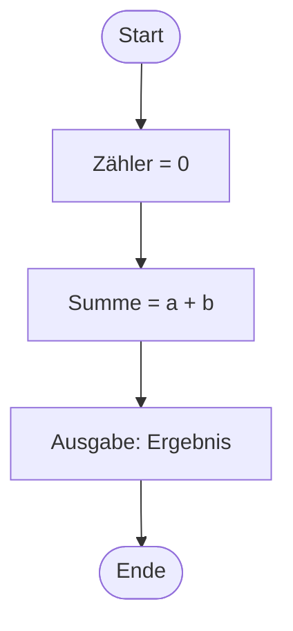

# V05: Programm-Ablauf-Pläne – Teil 1

> [!NOTE]
> **Lernziele dieser Vorlesung**:
> - Verstehen, was **Programm-Ablauf-Pläne (PAPs)** sind und wofür sie verwendet werden
> - Die **Symbole und Notation** nach DIN 66001 / ISO 5807 kennen und anwenden können
> - Die drei **Grundstrukturen** (Sequenz, Verzweigung, Schleife) identifizieren und unterscheiden
> - Einfache **PAPs erstellen und lesen** können
> - **Python if-Anweisungen** verstehen und schreiben können
> - **if-else** für binäre Entscheidungen einsetzen
> - **if-elif-else** für mehrfache Verzweigungen verwenden
> - **Verschachtelte Bedingungen** lesbar formulieren
> - Den **ternären Operator** für kompakte Ausdrücke nutzen

---

## Teil 1: Theorie - Programm-Ablauf-Pläne

### Überblick

In der Softwareentwicklung ist es essenziell, komplexe Abläufe und Algorithmen zu visualisieren, bevor man mit der Implementierung beginnt. **Programm-Ablauf-Pläne** (PAPs), auch **Flussdiagramme** oder **Flowcharts** genannt, sind eine grafische Darstellungsmethode, die den Ablauf eines Programms oder Algorithmus Schritt für Schritt zeigt. Sie wurden bereits in den 1960er Jahren standardisiert und sind bis heute ein wichtiges Werkzeug in der Softwareentwicklung, Prozessmodellierung und im Requirements Engineering.

PAPs bieten mehrere zentrale Vorteile. Sie ermöglichen eine **sprachunabhängige Kommunikation** über Algorithmen, da die Symbole weltweit standardisiert sind. Dadurch können Entwickler, Projektmanager und Stakeholder ohne tiefe Programmierkenntnisse den Ablauf verstehen. PAPs helfen auch beim **Strukturieren des Denkprozesses** – das Zeichnen eines PAPs zwingt dazu, alle Entscheidungen und Schritte explizit zu durchdenken, bevor man Code schreibt. Zudem unterstützen sie die **Fehlersuche**, da logische Fehler im Ablauf oft im Diagramm leichter zu erkennen sind als im Code. Schließlich dienen PAPs als **Dokumentation**, die auch Jahre später noch verständlich bleibt, selbst wenn der ursprüngliche Code nicht mehr verfügbar ist.

> [!NOTE]
> **Programm-Ablauf-Plan (PAP)**: Eine grafische Darstellung eines Algorithmus oder Programmablaufs durch standardisierte Symbole, die die Reihenfolge der Operationen, Entscheidungen und Datenflüsse zeigt.

> [!NOTE]
> **Algorithmus**: Eine präzise, endliche Folge von Anweisungen zur Lösung eines Problems oder zur Durchführung einer Aufgabe. Algorithmen sind die Grundlage jeder Programmierung.

### Standardisierung: DIN 66001 und ISO 5807

PAPs sind international standardisiert, um eine einheitliche Verständigung zu gewährleisten. Die wichtigsten Standards sind **DIN 66001** (deutscher Standard, erstmals 1966 veröffentlicht) und **ISO 5807** (internationaler Standard von 1985). Beide Standards definieren die **Form der Symbole**, die **Bedeutung jedes Symbols** und die **Richtlinien für die Anordnung**. 

Die Standards legen fest, dass Pfeile den **Kontrollfluss** zeigen, also die Reihenfolge der Ausführung. Der Ablauf erfolgt üblicherweise **von oben nach unten** und **von links nach rechts**, sofern Pfeile keine andere Richtung angeben. Symbole werden mit geraden Linien verbunden, und Verzweigungen werden klar beschriftet (z.B. "Ja" / "Nein" bei Entscheidungen). Diese Standardisierung stellt sicher, dass ein in Deutschland erstellter PAP auch von Ingenieuren in Japan oder den USA problemlos verstanden wird.

### Die wichtigsten PAP-Symbole

#### Startsymbol und Endsymbol


Das **Startsymbol** markiert den Einstiegspunkt eines Programms oder Algorithmus. Es wird als abgerundetes Rechteck (auch Oval oder "Terminator" genannt) dargestellt und enthält typischerweise das Wort "Start" oder "Anfang". Jeder PAP hat genau ein Startsymbol. Das **Endsymbol** markiert den Austrittspunkt und signalisiert das Ende des Programms oder Algorithmus. Es hat die gleiche Form wie das Startsymbol und enthält üblicherweise "Ende", "Stop" oder "Halt". Ein PAP kann mehrere Endsymbole haben, wenn es verschiedene Abbruchbedingungen gibt (z.B. bei Fehlerbehandlung).

> [!NOTE]
> **Startsymbol / Endsymbol**: Abgerundete Rechtecke, die den Beginn und das Ende eines Programmablaufs kennzeichnen. Sie dienen als Ein- und Ausstiegspunkte.

#### Prozess-Box (Operationen/Anweisungen)



Die **Prozess-Box** ist ein Rechteck und repräsentiert eine einzelne Anweisung oder Operation. Typische Inhalte sind **Zuweisungen** (z.B. "x = 5"), **Berechnungen** (z.B. "Summe = a + b"), **Funktionsaufrufe** (z.B. "Berechne Wurzel von x") oder **allgemeine Aktionen** (z.B. "Schalte Motor ein"). Prozess-Boxen enthalten keine Entscheidungen oder Verzweigungen – diese werden durch separate Symbole dargestellt.

> [!NOTE]
> **Prozess-Box**: Ein Rechteck, das eine einzelne Operation oder Anweisung darstellt. Es beschreibt eine Aktion, die ausgeführt wird, ohne Verzweigung oder Wiederholung.

#### Entscheidungssymbol (Verzweigung)


Das **Entscheidungssymbol** ist eine Raute (Diamant-Form) und stellt eine Bedingung oder Frage dar, die zu einer Verzweigung im Programmablauf führt. Die Raute enthält eine **Ja/Nein-Frage** oder **Bedingung** (z.B. "x > 0?", "Passwort korrekt?"). Aus der Raute führen mindestens zwei Pfeile heraus, üblicherweise beschriftet mit "Ja" / "Nein", "True" / "False" oder "Wahr" / "Falsch". Entscheidungssymbole sind der Kern von Verzweigungslogik und ermöglichen es, verschiedene Ausführungspfade basierend auf Bedingungen zu modellieren.

> [!NOTE]
> **Entscheidungssymbol**: Eine Raute, die eine Bedingung darstellt, die zu unterschiedlichen Ausführungspfaden führt. Die Ausgänge werden mit "Ja" und "Nein" beschriftet.

> [!TIP]
> **Formulierung von Bedingungen**: Stelle Bedingungen als **geschlossene Fragen** dar, die mit Ja/Nein beantwortet werden können. Beispiel: Nicht "Wert von x prüfen", sondern "x > 10?".

#### Ein-/Ausgabe-Symbol


Das **Ein-/Ausgabe-Symbol** ist ein Parallelogramm und kennzeichnet Operationen, bei denen Daten in das Programm eingelesen oder aus dem Programm ausgegeben werden. Typische Verwendungen sind **Benutzereingaben** (z.B. "Eingabe: Name", "Lies Temperatur"), **Ausgaben** (z.B. "Ausgabe: Ergebnis", "Zeige Meldung") oder **Dateioperationen** (z.B. "Lies Datei config.txt", "Schreibe in log.txt"). Das Parallelogramm unterscheidet sich visuell deutlich von der Prozess-Box und macht sofort klar, dass hier eine Interaktion mit der Außenwelt stattfindet.

> [!NOTE]
> **Ein-/Ausgabe-Symbol**: Ein Parallelogramm, das Operationen zum Einlesen von Daten (Input) oder Ausgeben von Daten (Output) darstellt. Es markiert die Schnittstelle zur Außenwelt.

#### Schleifensymbol (Wiederholung)


Schleifen werden in PAPs durch eine Kombination aus **Entscheidungssymbol** und **Rückwärtspfeil** dargestellt. Die Raute enthält die **Abbruchbedingung** der Schleife (z.B. "Zähler <= 10?"). Ein Pfeil führt bei erfüllter Bedingung zum **Schleifenrumpf** (die zu wiederholenden Anweisungen), und von dort führt ein Pfeil zurück zur Entscheidungsraute. Wenn die Bedingung nicht mehr erfüllt ist, führt der andere Pfeil aus der Raute heraus und das Programm setzt nach der Schleife fort. Dieses Pattern entspricht einer **while-Schleife** in den meisten Programmiersprachen.

> [!NOTE]
> **Schleife**: Eine Kontrollstruktur, die einen Codeblock wiederholt ausführt, solange eine Bedingung erfüllt ist. In PAPs wird dies durch eine Raute mit Rückwärtspfeil dargestellt.

### Die drei Grundstrukturen der strukturierten Programmierung

Die **strukturierte Programmierung** basiert auf drei fundamentalen Kontrollstrukturen, die sich in jedem Programm wiederfinden. Diese wurden in den 1960er Jahren von Böhm und Jacopini mathematisch bewiesen als ausreichend, um jeden berechenbaren Algorithmus darzustellen.

#### 1. Sequenz (Folge)


Die **Sequenz** ist die einfachste Struktur. Anweisungen werden **nacheinander in festgelegter Reihenfolge** ausgeführt. Es gibt keine Verzweigungen oder Wiederholungen. Die Sequenz entspricht dem natürlichen Lesen eines Programmcodes von oben nach unten. Beispiel: Erst wird eine Variable initialisiert, dann wird ein Wert berechnet, dann wird das Ergebnis ausgegeben. Jeder Schritt wird genau einmal ausgeführt.

> [!NOTE]
> **Sequenz**: Die lineare Ausführung von Anweisungen in einer festen Reihenfolge, ohne Verzweigung oder Wiederholung. Jede Anweisung wird genau einmal ausgeführt.

#### 2. Verzweigung (Selektion)


Die **Verzweigung** ermöglicht **bedingte Ausführung**. Basierend auf einer Bedingung wird einer von mehreren Ausführungspfaden gewählt. Die einfachste Form ist die **binäre Verzweigung** (if-else), bei der zwischen zwei Pfaden gewählt wird. Es existieren auch **mehrfache Verzweigungen** (if-elif-else), bei denen aus mehr als zwei Pfaden ausgewählt wird. Verzweigungen sind essenziell für intelligentes Verhalten von Programmen, da sie Reaktionen auf unterschiedliche Eingaben oder Zustände ermöglichen.

> [!NOTE]
> **Verzweigung (Selektion)**: Eine Kontrollstruktur, die basierend auf einer Bedingung einen von mehreren Ausführungspfaden auswählt. Sie ermöglicht bedingte Logik.

#### 3. Wiederholung (Iteration/Schleife)


Die **Wiederholung** ermöglicht **wiederholte Ausführung** eines Codeblocks, solange eine Bedingung erfüllt ist. Dies vermeidet redundanten Code und ermöglicht die Verarbeitung großer Datenmengen. Es gibt verschiedene Arten von Schleifen. Die **kopfgesteuerte Schleife** (while) prüft die Bedingung vor jedem Durchlauf – wenn die Bedingung initial falsch ist, wird der Schleifenrumpf nie ausgeführt. Die **fußgesteuerte Schleife** (do-while, in Python selten) prüft die Bedingung nach jedem Durchlauf – der Schleifenrumpf wird mindestens einmal ausgeführt. Die **Zählschleife** (for) wiederholt eine festgelegte Anzahl von Durchläufen.

> [!NOTE]
> **Wiederholung (Iteration)**: Eine Kontrollstruktur, die einen Codeblock mehrfach ausführt, solange eine Bedingung erfüllt ist. Sie ermöglicht effiziente Verarbeitung wiederkehrender Aufgaben.

### Richtlinien für gute PAPs

Beim Erstellen von PAPs sollten mehrere Best Practices beachtet werden. PAPs sollten **von oben nach unten** fließen, da dies der natürlichen Leserichtung entspricht. Verzweigungen sollten **eindeutig beschriftet** sein mit "Ja" / "Nein" oder "Wahr" / "Falsch". Pfade sollten sich nach einer Verzweigung oder Schleife wieder zusammenführen, um den Ablauf klar zu strukturieren. 

**Kreuzungen von Linien** sollten vermieden werden, da sie die Lesbarkeit stark beeinträchtigen – bei komplexen Diagrammen können Konnektoren (Kreise mit Buchstaben) verwendet werden. **Jede Box sollte genau eine Aufgabe** beschreiben (Single Responsibility Principle). Verwende **klare, präzise Beschriftungen** – statt "Verarbeitung" schreibe "Berechne Durchschnitt aus Werten". PAPs sollten **hierarchisch strukturiert** sein – bei komplexen Algorithmen können Teilprozesse in eigene PAPs ausgelagert und durch "Unterprogramm: Name" referenziert werden.

> [!WARNING]
> **Vermeidung von Spaghetti-Code**: PAPs mit vielen Rücksprüngen und Kreuzungen sind schwer zu lesen und deuten auf schlechte Strukturierung hin. Refaktoriere solche Diagramme durch Aufteilung in Unterprogramme.

### Praktische Anwendungen von PAPs

PAPs werden in vielen Bereichen eingesetzt. Im **Requirements Engineering** helfen sie, Geschäftsprozesse zu visualisieren und mit Stakeholdern zu diskutieren, bevor Code geschrieben wird. Bei **Algorithmen-Design** wird die Logik vor der Implementierung durchdacht und optimiert. In der **Fehlersuche und Debugging** können PAPs helfen, logische Fehler zu identifizieren, indem man den Ablauf Schritt für Schritt nachvollzieht. Als **Dokumentation** dienen PAPs als zeitlose Referenz, die auch ohne Kenntnis der ursprünglichen Programmiersprache verständlich bleibt. In **Schulung und Lehre** vermitteln PAPs algorithmisches Denken, bevor Syntaxdetails einer Programmiersprache gelernt werden.

### Von PAPs zu Code und zurück

Ein wesentlicher Vorteil von PAPs ist ihre **Sprachunabhängigkeit**. Ein PAP kann in Python, Java, C++ oder jede andere Programmiersprache übersetzt werden. Die Übersetzung folgt klaren Regeln. Eine **Prozess-Box** wird zu einer einfachen Anweisung im Code. Ein **Entscheidungssymbol** wird zu einer if-Anweisung. Eine **Schleife** (Raute mit Rückwärtspfeil) wird zu einer while- oder for-Schleife. **Ein-/Ausgabe-Symbole** werden zu Input- oder Print-Anweisungen.

Umgekehrt kann man aus bestehendem Code einen PAP erstellen, um die Logik zu visualisieren. Dies ist besonders hilfreich beim **Verstehen von Legacy-Code**, beim **Code-Review** (Logikfehler sind im Diagramm oft offensichtlicher) und bei der **Optimierung** (Redundante Pfade oder unnötige Verzweigungen werden sichtbar).

> [!TIP]
> **Workflow-Empfehlung**: Erstelle zuerst einen groben PAP, bevor du mit dem Programmieren beginnst. Dies hilft, die Struktur zu klären. Verfeinere den PAP iterativ, während du implementierst. Nutze den finalen PAP als Dokumentation.

### Zusammenfassung Theorie

Programm-Ablauf-Pläne sind ein unverzichtbares Werkzeug in der Softwareentwicklung und im Engineering. Sie bieten eine **standardisierte, visuelle Darstellung** von Algorithmen, die **sprachunabhängig** und für verschiedene Zielgruppen verständlich ist. Die wichtigsten Symbole sind **Startsymbol/Endsymbol** (abgerundete Rechtecke), **Prozess-Box** (Rechteck für Anweisungen), **Entscheidungssymbol** (Raute für Verzweigungen) und **Ein-/Ausgabe-Symbol** (Parallelogramm für I/O-Operationen).

Die drei **Grundstrukturen** Sequenz, Verzweigung und Wiederholung sind ausreichend, um jeden Algorithmus darzustellen. PAPs helfen beim **Entwurf, Verständnis, Debugging und der Dokumentation** von Software. Sie zwingen zu **strukturiertem Denken** und machen Logikfehler oft früher sichtbar als im Code. Die Einhaltung von **Standards (DIN 66001, ISO 5807)** gewährleistet internationale Verständlichkeit.

---

## Teil 2: Python-Praxis - Verzweigungen (if, if-elif-else)

> [!WARNING]
> **Python-Konsistenz beachten**: Prüfe [../../python_topics.md](../../python_topics.md) für bereits eingeführte Konzepte!

### Überblick

Nachdem wir in Teil 1 die theoretischen Grundlagen von Verzweigungen in Programm-Ablauf-Plänen kennengelernt haben, setzen wir diese nun in Python-Code um. **Verzweigungen** sind eine der fundamentalen Kontrollstrukturen in jeder Programmiersprache. Sie ermöglichen es, Code **bedingt auszuführen** – das heißt, basierend auf Bedingungen unterschiedliche Aktionen durchzuführen.

In Python werden Verzweigungen durch **if-Anweisungen** realisiert. Diese erlauben es, Codeblöcke nur dann auszuführen, wenn bestimmte Bedingungen erfüllt sind. Ohne Verzweigungen könnten Programme nur sequenziell ablaufen und nicht auf unterschiedliche Eingaben oder Situationen reagieren. Verzweigungen sind essenziell für **Validierung von Eingaben**, **Fehlerbehandlung**, **Geschäftslogik** (z.B. "Wenn Benutzer Premium-Mitglied, dann gewähre Zugriff"), und **Algorithmen** (z.B. Sortieren, Suchen).

### Die einfache if-Anweisung

Die einfachste Form der Verzweigung ist die **if-Anweisung ohne else-Zweig**. Sie führt einen Codeblock nur dann aus, wenn eine Bedingung erfüllt ist. Ist die Bedingung nicht erfüllt, wird der Block übersprungen und das Programm setzt nach dem if-Block fort.

**Syntax:**
```python
if Bedingung:
    # Dieser Code wird ausgeführt, wenn Bedingung True ist
    Anweisung1
    Anweisung2
    # ...
# Programm setzt hier fort (unabhängig von Bedingung)
```

Die **Bedingung** ist ein Ausdruck, der zu einem Boolean-Wert (`True` oder `False`) evaluiert wird. Dies kann ein **Vergleich** sein (z.B. `x > 10`), ein **logischer Ausdruck** (z.B. `a and b`), oder direkt ein **Boolean-Wert** (z.B. `is_active`). Der **Codeblock** nach dem Doppelpunkt muss **eingerückt** sein – Python verwendet Einrückung zur Definition von Codeblöcken (üblicherweise 4 Leerzeichen). Alle Zeilen mit gleicher Einrückung gehören zum selben Block.

> [!NOTE]
> **if-Anweisung**: Eine Kontrollstruktur, die einen Codeblock nur dann ausführt, wenn eine Bedingung als `True` evaluiert wird. Die Syntax erfordert einen Doppelpunkt nach der Bedingung und Einrückung des Codeblocks.

> [!TIP]
> ```python
> # Beispiel: Zugriffsprüfung
> alter = 20
> 
> if alter >= 18:
>     print("Zugriff erlaubt")
>     print("Willkommen!")
> 
> print("Programmende")
> ```
> 
> **Ausgabe:**
> ```
> Zugriff erlaubt
> Willkommen!
> Programmende
> ```
> 
> Wenn `alter < 18` wäre, würde nur "Programmende" ausgegeben.

> [!WARNING]
> **Einrückung ist in Python verpflichtend!** Vergessene oder falsche Einrückung führt zu einem `IndentationError`. Verwende konsistent entweder 4 Leerzeichen (Standard) oder Tabs, aber nie beides gemischt.

### Die if-else-Anweisung (binäre Verzweigung)

Die **if-else-Anweisung** erweitert die einfache if-Anweisung um einen **Alternative-Zweig**. Wenn die Bedingung `True` ist, wird der if-Block ausgeführt. Wenn die Bedingung `False` ist, wird stattdessen der else-Block ausgeführt. Es wird **immer genau einer der beiden Blöcke** ausgeführt, niemals beide und niemals keiner.

**Syntax:**
```python
if Bedingung:
    # Wird ausgeführt, wenn Bedingung True
    Anweisungen_wenn_wahr
else:
    # Wird ausgeführt, wenn Bedingung False
    Anweisungen_wenn_falsch
# Programm setzt hier fort
```

Die if-else-Struktur entspricht der **binären Verzweigung** in PAPs – die Raute mit zwei Ausgängen ("Ja" und "Nein"). Sie wird verwendet, wenn **genau zwei Ausführungspfade** existieren, die sich gegenseitig ausschließen.

> [!NOTE]
> **if-else-Anweisung**: Eine Kontrollstruktur mit zwei sich gegenseitig ausschließenden Pfaden. Wenn die Bedingung `True` ist, wird der if-Block ausgeführt, andernfalls der else-Block.

> [!TIP]
> ```python
> # Beispiel: Gerade oder ungerade Zahl
> zahl = int(input("Gib eine Zahl ein: "))
> 
> if zahl % 2 == 0:
>     print(f"{zahl} ist gerade")
> else:
>     print(f"{zahl} ist ungerade")
> 
> print("Prüfung abgeschlossen")
> ```
> 
> **Eingabe:** 7  
> **Ausgabe:**
> ```
> 7 ist ungerade
> Prüfung abgeschlossen
> ```

**PAP-Darstellung:**


### Die if-elif-else-Anweisung (mehrfache Verzweigung)

Wenn mehr als zwei Ausführungspfade existieren, wird die **if-elif-else-Anweisung** verwendet. Das Schlüsselwort **elif** (kurz für "else if") ermöglicht das Testen mehrerer Bedingungen nacheinander. Die Bedingungen werden von oben nach unten geprüft. **Sobald eine Bedingung `True` ist, wird der zugehörige Block ausgeführt und alle weiteren Bedingungen werden übersprungen.** Wenn keine Bedingung erfüllt ist, wird der else-Block ausgeführt (falls vorhanden).

**Syntax:**
```python
if Bedingung1:
    # Wird ausgeführt, wenn Bedingung1 True
    Anweisungen1
elif Bedingung2:
    # Wird ausgeführt, wenn Bedingung1 False und Bedingung2 True
    Anweisungen2
elif Bedingung3:
    # Wird ausgeführt, wenn Bedingung1 und Bedingung2 False, aber Bedingung3 True
    Anweisungen3
else:
    # Wird ausgeführt, wenn keine der Bedingungen True ist
    Anweisungen_sonst
# Programm setzt hier fort
```

Die Anzahl der elif-Zweige ist unbegrenzt. Der else-Zweig ist optional – wenn er fehlt und keine Bedingung erfüllt ist, wird keiner der Blöcke ausgeführt. Die if-elif-else-Struktur ist effizienter als mehrere separate if-Anweisungen, da nach dem ersten `True`-Match alle weiteren Prüfungen übersprungen werden.

> [!NOTE]
> **elif (else if)**: Ein Schlüsselwort in Python, das eine zusätzliche Bedingung nach einem `if` einführt. Es ermöglicht mehrfache Verzweigungen und wird nur geprüft, wenn alle vorherigen Bedingungen `False` waren.

> [!TIP]
> ```python
> # Beispiel: Notenbewertung
> punkte = int(input("Erreichte Punktzahl (0-100): "))
> 
> if punkte >= 90:
>     note = "Sehr gut (1)"
> elif punkte >= 80:
>     note = "Gut (2)"
> elif punkte >= 70:
>     note = "Befriedigend (3)"
> elif punkte >= 60:
>     note = "Ausreichend (4)"
> else:
>     note = "Nicht bestanden (5)"
> 
> print(f"Deine Note: {note}")
> ```
> 
> **Eingabe:** 85  
> **Ausgabe:**
> ```
> Deine Note: Gut (2)
> ```

**PAP-Darstellung:**


> [!WARNING]
> **Reihenfolge der Bedingungen beachten!** Bei if-elif-else wird nur die **erste erfüllte Bedingung** ausgeführt. Wenn du `punkte >= 60` vor `punkte >= 90` prüfst, würden alle Werte >= 60 als "Ausreichend" klassifiziert, auch wenn sie eigentlich "Sehr gut" wären. Prüfe immer **von spezifisch zu allgemein** oder **von groß zu klein**.

### Verschachtelte if-Anweisungen

**Verschachtelung** bedeutet, dass ein if-Block innerhalb eines anderen if-Blocks liegt. Dies ermöglicht **komplexere Entscheidungslogik** mit mehreren Ebenen. Allerdings kann tiefe Verschachtelung die Lesbarkeit stark beeinträchtigen.

> [!NOTE]
> **Verschachtelte Bedingungen**: if-Anweisungen innerhalb anderer if-Anweisungen, die mehrstufige Entscheidungslogik ermöglichen. Jede Ebene wird durch zusätzliche Einrückung dargestellt.

> [!TIP]
> ```python
> # Beispiel: Rabattberechnung
> kunde_typ = "Premium"
> bestellwert = 150
> 
> if kunde_typ == "Premium":
>     if bestellwert >= 100:
>         rabatt = 0.20  # 20% Rabatt
>         print("20% Premium-Rabatt angewendet")
>     else:
>         rabatt = 0.10  # 10% Rabatt
>         print("10% Premium-Rabatt angewendet")
> else:
>     if bestellwert >= 100:
>         rabatt = 0.05  # 5% Rabatt
>         print("5% Standard-Rabatt angewendet")
>     else:
>         rabatt = 0.0  # Kein Rabatt
>         print("Kein Rabatt")
> 
> endpreis = bestellwert * (1 - rabatt)
> print(f"Endpreis: {endpreis:.2f} EUR")
> ```
> 
> **Ausgabe:**
> ```
> 20% Premium-Rabatt angewendet
> Endpreis: 120.00 EUR
> ```

**PAP-Darstellung verschachtelter Bedingungen:**


> [!WARNING]
> **Zu viele Verschachtelungsebenen vermeiden!** Mehr als 2-3 Ebenen machen Code schwer lesbar. Verwende stattdessen **logische Operatoren** (`and`, `or`) oder **frühe Returns** (wenn innerhalb von Funktionen, wird in V10 behandelt).

**Alternative mit logischen Operatoren:**

```python
# Besser lesbar: Kombination von Bedingungen
if kunde_typ == "Premium" and bestellwert >= 100:
    rabatt = 0.20
elif kunde_typ == "Premium" and bestellwert < 100:
    rabatt = 0.10
elif kunde_typ != "Premium" and bestellwert >= 100:
    rabatt = 0.05
else:
    rabatt = 0.0
```

Diese Variante ist flacher und leichter zu erfassen, da die Bedingungen parallel statt verschachtelt formuliert sind.

### Der ternäre Operator (Conditional Expression)

Der **ternäre Operator** ist eine kompakte Schreibweise für einfache if-else-Anweisungen. Er ermöglicht es, eine Zuweisung basierend auf einer Bedingung in einer einzigen Zeile zu formulieren. Der ternäre Operator ist besonders nützlich für **einfache Zuweisungen** oder **inline-Entscheidungen** in Funktionsaufrufen.

**Syntax:**
```python
wert_wenn_wahr if Bedingung else wert_wenn_falsch
```

Die Bedingung wird in der Mitte platziert, davor steht der Wert für den True-Fall, danach der Wert für den False-Fall. Das Ergebnis des Ausdrucks kann einer Variable zugewiesen oder direkt verwendet werden.

> [!NOTE]
> **Ternärer Operator (Conditional Expression)**: Eine kompakte Syntax für einfache if-else-Zuweisungen in einer Zeile. Die Form ist: `wert_wenn_wahr if Bedingung else wert_wenn_falsch`.

> [!TIP]
> ```python
> # Beispiel: Absolute Betrag ohne abs()-Funktion
> x = -7
> 
> # Normale if-else-Schreibweise:
> if x >= 0:
>     absolut = x
> else:
>     absolut = -x
> 
> # Ternäre Operator-Schreibweise:
> absolut = x if x >= 0 else -x
> 
> print(f"Der Absolutbetrag von {x} ist {absolut}")
> ```
> 
> **Ausgabe:**
> ```
> Der Absolutbetrag von -7 ist 7
> ```

**Weitere Beispiele:**

```python
# Status-Message basierend auf Login
ist_eingeloggt = True
status = "Willkommen zurück!" if ist_eingeloggt else "Bitte einloggen"
print(status)  # Ausgabe: Willkommen zurück!

# Maximum von zwei Zahlen
a, b = 10, 20
maximum = a if a > b else b
print(f"Größere Zahl: {maximum}")  # Ausgabe: Größere Zahl: 20

# Inline-Verwendung in print
alter = 25
print(f"Du bist {'volljährig' if alter >= 18 else 'minderjährig'}")
# Ausgabe: Du bist volljährig
```

> [!WARNING]
> **Lesbarkeit vs. Kompaktheit**: Der ternäre Operator sollte nur für **einfache, einzeilige Entscheidungen** verwendet werden. Bei komplexen Bedingungen oder mehreren Anweisungen pro Zweig wird der Code schnell unlesbar. In solchen Fällen ist klassisches if-else vorzuziehen.

```python
# Schlecht: Unleserlich
ergebnis = (x + y) * 2 if (a > b and c < d) or (e == f and g != h) else (x - y) / 3 if z > 0 else 0

# Gut: Klar strukturiert
if (a > b and c < d) or (e == f and g != h):
    ergebnis = (x + y) * 2
elif z > 0:
    ergebnis = (x - y) / 3
else:
    ergebnis = 0
```

### Pass-Statement (Platzhalter für leere Blöcke)

Manchmal möchte man die Struktur einer if-Anweisung definieren, aber den Inhalt eines Blocks noch nicht implementieren. Python erlaubt keine leeren Blöcke – das würde einen `IndentationError` verursachen. Für solche Fälle gibt es das **pass-Statement**.

Das **pass-Statement** ist eine Null-Operation, die nichts tut. Es dient als **syntaktischer Platzhalter** und signalisiert "hier soll später Code stehen". Pass kann in if-Blöcken, Schleifen, Funktionen und Klassen verwendet werden.

> [!NOTE]
> **pass-Statement**: Ein Schlüsselwort, das als Platzhalter für syntaktisch erforderliche, aber noch nicht implementierte Codeblöcke dient. Es führt keine Aktion aus.

> [!TIP]
> ```python
> # Beispiel: Gerüst für spätere Implementierung
> benutzer_rolle = "Admin"
> 
> if benutzer_rolle == "Admin":
>     pass  # TODO: Admin-Funktionen implementieren
> elif benutzer_rolle == "Moderator":
>     pass  # TODO: Moderator-Funktionen implementieren
> else:
>     print("Normaler Benutzer - eingeschränkter Zugriff")
> ```

Pass wird häufig während der Entwicklung verwendet, wenn die Struktur bereits klar ist, aber Teile der Implementierung noch fehlen. Es ist auch nützlich in Ausnahmefällen, wenn explizit "nichts tun" die gewünschte Aktion ist.

### Häufige Fehler und Lösungen

> [!WARNING]
> **Fehler 1: Vergessener Doppelpunkt nach if/elif/else**
> 
> ```python
> # Falsch:
> if x > 10
>     print("Groß")
> ```
> 
> **Fehler:** `SyntaxError: invalid syntax`
> 
> **Lösung:** Doppelpunkt nach der Bedingung nicht vergessen:
> ```python
> # Richtig:
> if x > 10:
>     print("Groß")
> ```

> [!WARNING]
> **Fehler 2: Fehlende oder inkonsistente Einrückung**
> 
> ```python
> # Falsch:
> if x > 10:
> print("Groß")  # Nicht eingerückt!
> ```
> 
> **Fehler:** `IndentationError: expected an indented block`
> 
> **Lösung:** Alle Zeilen im if-Block müssen gleich eingerückt sein (4 Leerzeichen):
> ```python
> # Richtig:
> if x > 10:
>     print("Groß")
>     print("Sehr groß sogar")
> ```

> [!WARNING]
> **Fehler 3: Verwechslung von = und ==**
> 
> ```python
> # Falsch:
> if x = 10:  # Zuweisung statt Vergleich!
>     print("x ist 10")
> ```
> 
> **Fehler:** `SyntaxError: invalid syntax`
> 
> **Lösung:** Verwende `==` für Vergleiche, `=` nur für Zuweisungen:
> ```python
> # Richtig:
> if x == 10:
>     print("x ist 10")
> ```

> [!WARNING]
> **Fehler 4: Falsche Reihenfolge bei if-elif-else**
> 
> ```python
> # Problematisch:
> punkte = 95
> if punkte >= 50:
>     print("Bestanden")
> elif punkte >= 90:
>     print("Sehr gut")  # Wird nie erreicht!
> ```
> 
> **Problem:** Die erste Bedingung `punkte >= 50` ist bereits bei 95 erfüllt, also wird "Bestanden" ausgegeben und die zweite Bedingung nie geprüft.
> 
> **Lösung:** Spezifischere Bedingungen zuerst prüfen:
> ```python
> # Richtig:
> if punkte >= 90:
>     print("Sehr gut")
> elif punkte >= 50:
>     print("Bestanden")
> ```

> [!WARNING]
> **Fehler 5: Mehrere separate if statt if-elif-else**
> 
> ```python
> # Ineffizient:
> if temperatur < 0:
>     print("Gefroren")
> if temperatur >= 0 and temperatur < 20:
>     print("Kühl")
> if temperatur >= 20:
>     print("Warm")
> ```
> 
> **Problem:** Alle drei Bedingungen werden immer geprüft, auch wenn die erste bereits zutrifft.
> 
> **Lösung:** Verwende if-elif-else für sich gegenseitig ausschließende Fälle:
> ```python
> # Effizienter:
> if temperatur < 0:
>     print("Gefroren")
> elif temperatur < 20:
>     print("Kühl")
> else:
>     print("Warm")
> ```

### Zusammenfassung Python

Verzweigungen sind fundamentale Kontrollstrukturen, die bedingtes Ausführen von Code ermöglichen. Die **einfache if-Anweisung** führt einen Block nur bei erfüllter Bedingung aus. Die **if-else-Anweisung** bietet zwei sich ausschließende Pfade. Die **if-elif-else-Anweisung** ermöglicht mehrfache Verzweigungen mit beliebig vielen Bedingungen.

**Verschachtelte if-Anweisungen** erlauben mehrstufige Logik, sollten aber nicht zu tief werden. Der **ternäre Operator** ist eine kompakte Alternative für einfache Zuweisungen. Das **pass-Statement** dient als Platzhalter für noch nicht implementierte Blöcke.

Wichtige Best Practices sind **Doppelpunkt nicht vergessen**, **konsistente Einrückung** (4 Leerzeichen), **`==` für Vergleiche, `=` für Zuweisungen**, **spezifische Bedingungen vor allgemeinen** prüfen und **elif statt mehrerer if** für sich ausschließende Fälle verwenden.

### Neue Python-Funktionen/Methoden

In dieser Lektion wurden folgende Python-Konzepte **neu eingeführt**:

- **if-Anweisung**: Bedingte Ausführung eines Codeblocks
  - Syntax: `if Bedingung:`
  - Erfordert Doppelpunkt und Einrückung

- **else-Klausel**: Alternativer Pfad, wenn if-Bedingung `False`
  - Syntax: `else:`
  - Kein Bedingungsausdruck

- **elif-Klausel**: Zusätzliche Bedingung nach if
  - Syntax: `elif Bedingung:`
  - Ermöglicht mehrfache Verzweigungen

- **Ternärer Operator (Conditional Expression)**: Kompakte if-else-Syntax
  - Syntax: `wert_wenn_wahr if Bedingung else wert_wenn_falsch`
  - Für einfache inline-Entscheidungen

- **pass-Statement**: Platzhalter für leere Codeblöcke
  - Syntax: `pass`
  - Keine Operation, syntaktischer Platzhalter

---

## Weiterführende Ressourcen

### Theorie
- **DIN 66001**: Offizielle deutsche Norm für Programm-Ablauf-Pläne (verfügbar über Beuth Verlag)
- **ISO 5807**: Internationale Norm für Flussdiagramme (Information processing — Documentation symbols and conventions for data, program and system flowcharts)
- **Structured Programming (Dijkstra, 1968)**: Grundlegendes Paper zur strukturierten Programmierung
- **Flowchart.js**: Web-basiertes Tool zum Erstellen von Flussdiagrammen mit Code
- **Lucidchart / Draw.io**: Professionelle Tools für PAP-Erstellung

### Python
- **Python Official Documentation - Control Flow**: https://docs.python.org/3/tutorial/controlflow.html
- **Real Python - Conditional Statements**: https://realpython.com/python-conditional-statements/
- **PEP 308 - Conditional Expressions**: https://www.python.org/dev/peps/pep-0308/ (Design-Begründung für ternären Operator)
- **Python Style Guide (PEP 8)**: Empfohlene Konventionen für if-Anweisungen und Einrückung
