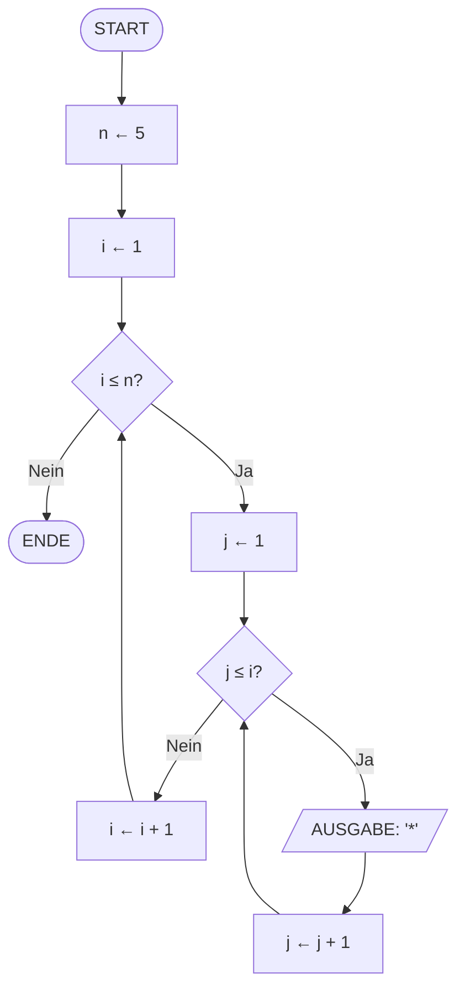

# V06: Übungsaufgaben - Programm-Ablauf-Pläne Teil 2 & Schleifen

> [!NOTE]
> Diese Übungsaufgaben vertiefen das Verständnis der Vorlesung V06.
> Bearbeite die Aufgaben in der angegebenen Reihenfolge.

---

## Teil A: Theorie-Aufgaben

### Aufgabe T1: Pseudocode zu PAP (Leicht)

**Schwierigkeit**: ⭐ Leicht  
**Zeitaufwand**: ca. 10-15 Minuten

Gegeben ist folgender Pseudocode für einen Algorithmus, der prüft, ob eine Zahl eine Primzahl ist:

```
BEGIN IstPrimzahl
    EINGABE(n)
    IF n < 2 THEN
        AUSGABE("Keine Primzahl")
    ELSE
        ist_prim ← WAHR
        i ← 2
        WHILE i * i ≤ n DO
            IF n MOD i = 0 THEN
                ist_prim ← FALSCH
            ENDIF
            i ← i + 1
        ENDWHILE
        IF ist_prim THEN
            AUSGABE("Primzahl")
        ELSE
            AUSGABE("Keine Primzahl")
        ENDIF
    ENDIF
END IstPrimzahl
```

**Aufgabe**:
1. Erstelle einen vollständigen PAP (Programmablaufplan) für diesen Algorithmus
2. Verwende die korrekten Symbole nach DIN 66001/ISO 5807
3. Beschrifte alle Pfeile und Bedingungen klar

**Hinweise**:
- Du kannst Mermaid-Syntax verwenden oder den PAP auf Papier zeichnen
- Achte auf die korrekte Darstellung der Schleife (Rückwärtspfeil)
- Jede Bedingung (Raute) muss zwei ausgehende Pfeile haben (Ja/Nein)

---

### Aufgabe T2: Analyse verschachtelter Schleifen (Mittel)

**Schwierigkeit**: ⭐⭐ Mittel  
**Zeitaufwand**: ca. 15-20 Minuten

Betrachte folgenden PAP für einen Algorithmus mit verschachtelten Schleifen:



**Aufgaben**:
1. Schreibe den zugehörigen Pseudocode zu diesem PAP
2. Führe den Algorithmus manuell für n = 3 aus und notiere alle Ausgaben
3. Was gibt der Algorithmus für beliebiges n aus? (Beschreibe das Muster)
4. Berechne die Gesamtzahl der Sternchen-Ausgaben für n = 5
5. Gib die Zeitkomplexität des Algorithmus in Big-O-Notation an

**Hinweise**:
- Achte auf die Verschachtelung der Schleifen
- Die innere Schleife läuft bis `j ≤ i`, nicht bis `j ≤ n`
- Zeichne eine Tabelle mit den Werten von i und j für jeden Durchlauf

---

### Aufgabe T3: Entwurf eines komplexen Algorithmus (Schwer)

**Schwierigkeit**: ⭐⭐⭐ Schwer  
**Zeitaufwand**: ca. 25-30 Minuten

Entwerfe einen Algorithmus für das **Euklidische Algorithmus** zur Berechnung des größten gemeinsamen Teilers (ggT) zweier Zahlen. Der Algorithmus funktioniert wie folgt:

**Beschreibung**:
- Gegeben: Zwei positive Ganzzahlen a und b (a ≥ b)
- Solange b ≠ 0:
  - Berechne den Rest r von a geteilt durch b
  - Setze a ← b
  - Setze b ← r
- Wenn b = 0, ist a der ggT

**Aufgaben**:
1. Erstelle einen vollständigen PAP für den Euklidischen Algorithmus
2. Schreibe den zugehörigen Pseudocode
3. Führe den Algorithmus manuell für a = 48 und b = 18 aus (Trace-Tabelle)
4. Identifiziere potenzielle Probleme: Was passiert, wenn a < b? Was wenn b = 0 zu Beginn?
5. Erweitere den Algorithmus um Eingabevalidierung (beide Zahlen müssen positiv sein, falls a < b → tauschen)

**Hinweise**:
- Der Modulo-Operator (MOD) berechnet den Rest
- Verwende eine Trace-Tabelle mit Spalten: Durchlauf, a, b, r
- Die Schleife ist kopfgesteuert (while-Typ)
- Achte auf die Initialisierung und alle Randfälle

---

## Teil B: Python-Aufgaben

### Aufgabe P1: Zahlenreihen mit `for` (Leicht)

**Schwierigkeit**: ⭐ Leicht  
**Zeitaufwand**: ca. 10-15 Minuten  
**Vorkenntnisse**: `for`-Schleifen, `range()`

Schreibe ein Python-Programm, das folgende Zahlenreihen ausgibt:

**Teilaufgaben**:
1. Alle Zahlen von 1 bis 20
2. Alle geraden Zahlen von 0 bis 30
3. Alle ungeraden Zahlen von 1 bis 25
4. Einen Countdown von 10 bis 0
5. Alle durch 5 teilbaren Zahlen von 5 bis 50

**Beispiel-Ausgabe für Teilaufgabe 2**:
```
0 2 4 6 8 10 12 14 16 18 20 22 24 26 28 30
```

**Hinweise**:
- Verwende `range()` mit verschiedenen Parametern
- Für gerade Zahlen: `range(0, 31, 2)` oder Prüfung mit `if i % 2 == 0`
- Verwende `end=' '` in `print()`, um Zahlen in einer Zeile auszugeben

---

### Aufgabe P2: Fakultät berechnen (Leicht-Mittel)

**Schwierigkeit**: ⭐⭐ Leicht-Mittel  
**Zeitaufwand**: ca. 15-20 Minuten  
**Vorkenntnisse**: `for`-Schleifen, `range()`, Akkumulation

Die **Fakultät** einer nicht-negativen Ganzzahl n (geschrieben als n!) ist das Produkt aller positiven Ganzzahlen von 1 bis n.

Beispiele:
- 0! = 1 (per Definition)
- 1! = 1
- 5! = 1 × 2 × 3 × 4 × 5 = 120
- 10! = 3628800

**Aufgabe**:
Schreibe ein Python-Programm, das:
1. Den Benutzer nach einer Zahl n fragt
2. Die Fakultät von n berechnet
3. Das Ergebnis ausgibt

**Beispiel Ein-/Ausgabe**:
```
Bitte eine Zahl eingeben: 5
Die Fakultät von 5 ist 120
```

**Erweiterung** (optional):
- Berechne und gib die Fakultäten aller Zahlen von 0 bis 10 in einer Tabelle aus
- Format: `0! = 1`, `1! = 1`, `2! = 2`, etc.

**Hinweise**:
- Initialisiere eine Variable `fakultaet = 1` (nicht 0!)
- Verwende eine `for`-Schleife mit `range(1, n+1)`
- Multipliziere in jedem Durchlauf: `fakultaet *= i`

---

### Aufgabe P3: Zeichenketten analysieren (Mittel)

**Schwierigkeit**: ⭐⭐ Mittel  
**Zeitaufwand**: ca. 20-25 Minuten  
**Vorkenntnisse**: `for`-Schleifen, String-Iteration, Zählen

Schreibe ein Python-Programm, das einen vom Benutzer eingegebenen Text analysiert und folgende Statistiken ausgibt:

**Zu zählende Elemente**:
1. Anzahl der Zeichen (Gesamtlänge)
2. Anzahl der Buchstaben (nur a-z, A-Z)
3. Anzahl der Ziffern (0-9)
4. Anzahl der Leerzeichen
5. Anzahl der Vokale (a, e, i, o, u – Groß- und Kleinschreibung)
6. Anzahl der Konsonanten (Buchstaben minus Vokale)

**Beispiel Ein-/Ausgabe**:
```
Bitte einen Text eingeben: Informatik 2024 macht Spaß!
Analyse-Ergebnis:
- Zeichen gesamt: 29
- Buchstaben: 21
- Ziffern: 4
- Leerzeichen: 3
- Vokale: 9
- Konsonanten: 12
```

**Hinweise**:
- Verwende String-Methoden: `.isalpha()`, `.isdigit()`, `.isspace()`
- Definiere eine String-Variable `vokale = "aeiouAEIOU"`
- Prüfe mit `if zeichen in vokale:`
- Verwende separate Zähler-Variablen für jede Kategorie

---

### Aufgabe P4: Eingabevalidierung mit `while` (Mittel-Schwer)

**Schwierigkeit**: ⭐⭐⭐ Mittel-Schwer  
**Zeitaufwand**: ca. 25-30 Minuten  
**Vorkenntnisse**: `while`-Schleifen, `input()`, Validierung, Verzweigungen

Schreibe ein Programm für ein einfaches **Zahlenrate-Spiel**:

**Spielregeln**:
1. Das Programm wählt eine Zufallszahl zwischen 1 und 100
2. Der Spieler hat maximal 7 Versuche, die Zahl zu erraten
3. Nach jedem Versuch gibt das Programm einen Hinweis: "Zu hoch", "Zu niedrig" oder "Richtig!"
4. Ungültige Eingaben (keine Zahl, außerhalb des Bereichs) zählen nicht als Versuch
5. Am Ende wird die Anzahl der benötigten Versuche angezeigt

**Beispiel-Ablauf**:
```
Willkommen beim Zahlenrate-Spiel!
Ich habe mir eine Zahl zwischen 1 und 100 ausgedacht.
Du hast 7 Versuche.

Versuch 1/7 - Deine Zahl: 50
Zu niedrig!

Versuch 2/7 - Deine Zahl: 75
Zu hoch!

Versuch 3/7 - Deine Zahl: abc
Ungültige Eingabe! Bitte eine Zahl eingeben.

Versuch 3/7 - Deine Zahl: 62
Richtig! Du hast die Zahl in 3 Versuchen erraten.
```

**Anforderungen**:
- Verwende `import random` und `random.randint(1, 100)` für die Zufallszahl
- Nutze eine `while`-Schleife für die Wiederholung
- Validiere die Eingabe (nur Zahlen von 1-100 akzeptieren)
- Zähle nur gültige Versuche
- Brich ab nach 7 Versuchen oder wenn die Zahl erraten wurde

**Hinweise**:
- Struktur: `while versuch <= 7 and not geraten:`
- Verwende `.isdigit()` zur Validierung
- Nach korrekter Eingabe: `versuch += 1`
- Bei ungültiger Eingabe: **kein** Versuchs-Inkrement

---

### Aufgabe P5: Muster zeichnen mit verschachtelten Schleifen (Schwer/Komplex)

**Schwierigkeit**: ⭐⭐⭐⭐ Schwer/Komplex  
**Zeitaufwand**: ca. 40-50 Minuten  
**Vorkenntnisse**: Verschachtelte Schleifen, String-Konkatenation, Logik

Schreibe ein Python-Programm, das verschiedene **ASCII-Muster** mit Sternen (`*`) zeichnet. Der Benutzer soll die Höhe des Musters eingeben können.

**Teilaufgabe 1: Rechtwinkliges Dreieck**
```
*
**
***
****
*****
```

**Teilaufgabe 2: Gleichschenkliges Dreieck (Pyramide)**
```
    *
   ***
  *****
 *******
*********
```

**Teilaufgabe 3: Umgekehrtes Dreieck**
```
*****
****
***
**
*
```

**Teilaufgabe 4: Raute (Diamond)**
```
    *
   ***
  *****
 *******
*********
 *******
  *****
   ***
    *
```

**Anforderungen**:
1. Der Benutzer gibt die Höhe n ein (z.B. n = 5)
2. Das Programm zeigt ein Menü mit den vier Mustern
3. Der Benutzer wählt ein Muster aus
4. Das Programm zeichnet das gewählte Muster mit der angegebenen Höhe

**Beispiel Ein-/Ausgabe**:
```
Willkommen beim Muster-Zeichner!
Bitte Höhe eingeben: 5

Wähle ein Muster:
1. Rechtwinkliges Dreieck
2. Pyramide
3. Umgekehrtes Dreieck
4. Raute
Deine Wahl: 2

    *
   ***
  *****
 *******
*********
```

**Hinweise**:
- Verwende verschachtelte `for`-Schleifen
- Für die Pyramide: Zeile i hat `(n - i)` Leerzeichen und `(2 * i - 1)` Sterne
- Für die Raute: Kombiniere Pyramide (obere Hälfte) und umgekehrte Pyramide (untere Hälfte)
- Tipp: Baue jede Zeile als String auf, bevor du sie ausgibst
- Nutze `print(leerzeichen + sterne)` für jede Zeile

**Bonus-Challenge** (optional):
Erweitere das Programm um:
- Ein Menü, das nach jedem Muster fragt, ob ein weiteres gezeichnet werden soll
- Eingabevalidierung für Höhe (nur positive Zahlen) und Menüwahl
- Ein fünftes Muster: Hohles Quadrat (nur Rahmen aus Sternen)
