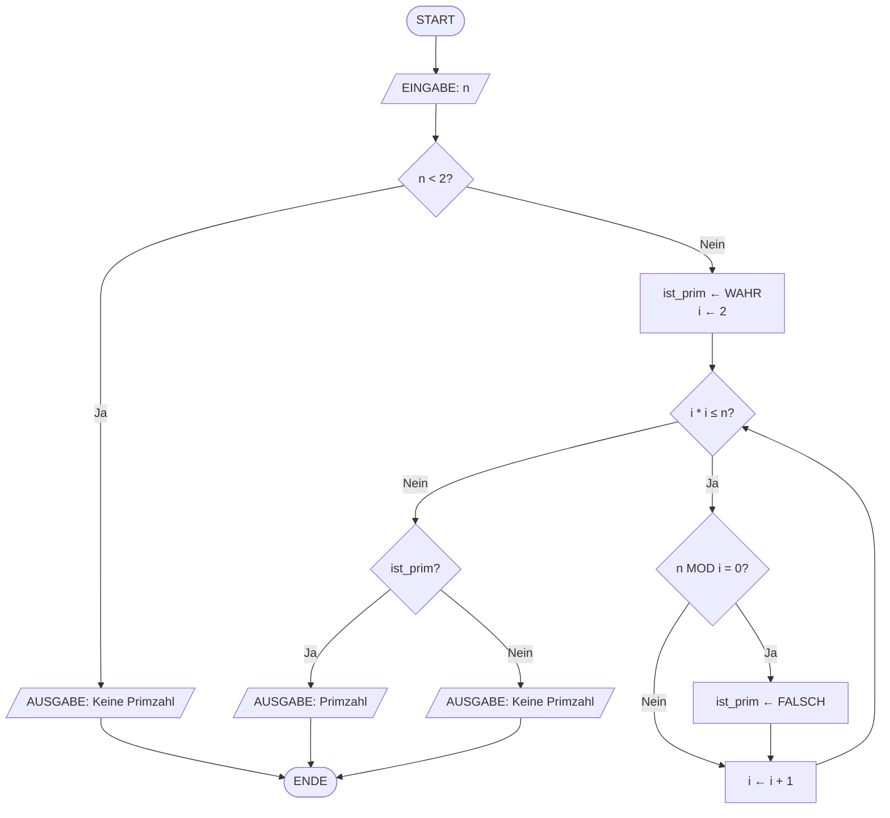
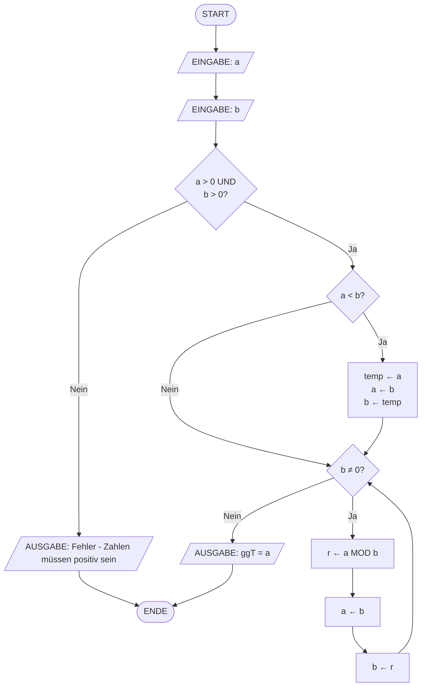

# V06: Lösungen - Programm-Ablauf-Pläne Teil 2 & Schleifen

> [!WARNING]
> Versuche die Aufgaben zuerst selbstständig zu lösen, bevor du die Lösungen ansiehst!

---

## Teil A: Theorie-Aufgaben - Lösungen

### Lösung T1: Pseudocode zu PAP

**Lösung**:

Der vollständige PAP für den Primzahl-Test lautet:



**Erklärung**:

Der PAP zeigt die vollständige Struktur des Primzahl-Tests. Die äußere Verzweigung prüft zunächst, ob n kleiner als 2 ist. Falls ja, kann es keine Primzahl sein. Andernfalls wird eine Schleife gestartet, die potenzielle Teiler durchprobiert. Die Schleifenbedingung `i * i ≤ n` ist eine Optimierung: Wenn eine Zahl n einen Teiler größer als √n hat, muss sie auch einen Teiler kleiner als √n haben, den wir bereits gefunden hätten.

Innerhalb der Schleife prüft die Raute `n MOD i = 0?`, ob i ein Teiler von n ist. Falls ja, wird `ist_prim` auf FALSCH gesetzt. Die Schleife läuft in jedem Fall bis zum Ende (kein frühzeitiger Abbruch in diesem Algorithmus, obwohl das möglich wäre). Nach der Schleife entscheidet eine weitere Verzweigung basierend auf `ist_prim`, welche Ausgabe erfolgt.

**Häufige Fehler**:
- **Fehler**: Vergessen der Initialisierung von `ist_prim` und `i` vor der Schleife
  - **Warum falsch**: Ohne Initialisierung haben die Variablen keine definierten Werte
  - **Richtig**: Alle verwendeten Variablen müssen vor dem ersten Zugriff initialisiert werden
  
- **Fehler**: Nur eine Ausgabe am Ende, nicht drei verschiedene Pfade
  - **Warum falsch**: Der Pseudocode hat mehrere `AUSGABE`-Befehle an verschiedenen Stellen
  - **Richtig**: Jeder `AUSGABE`-Befehl im Pseudocode benötigt ein eigenes Parallelogramm im PAP
  
- **Fehler**: Schleife ohne Rückwärtspfeil oder falsche Pfeilrichtung
  - **Warum falsch**: Eine Schleife erfordert einen Pfeil von unten zurück zur Bedingung
  - **Richtig**: Von `i ← i + 1` zurück zu `i * i ≤ n?`

---

### Lösung T2: Analyse verschachtelter Schleifen

**Lösung**:

**1. Pseudocode zum gegebenen PAP:**

```
BEGIN Sternenmuster
    n ← 5
    FOR i ← 1 TO n DO
        FOR j ← 1 TO i DO
            AUSGABE('*')
        ENDFOR
        AUSGABE(Zeilenumbruch)
    ENDFOR
END Sternenmuster
```

**2. Manueller Durchlauf für n = 3:**

| Durchlauf | i | j | Ausgabe |
|-----------|---|---|---------|
| Äußere Schleife 1 | 1 | 1 | `*` |
| (Zeilenumbruch) | - | - | `\n` |
| Äußere Schleife 2 | 2 | 1 | `*` |
| Äußere Schleife 2 | 2 | 2 | `*` |
| (Zeilenumbruch) | - | - | `\n` |
| Äußere Schleife 3 | 3 | 1 | `*` |
| Äußere Schleife 3 | 3 | 2 | `*` |
| Äußere Schleife 3 | 3 | 3 | `*` |
| (Zeilenumbruch) | - | - | `\n` |

**Ausgabe:**
```
*
**
***
```

**3. Muster-Beschreibung:**

Der Algorithmus erzeugt ein **rechtwinkliges Dreieck** aus Sternen. In der i-ten Zeile werden genau i Sterne ausgegeben. Dies ergibt ein rechtsbündiges (oder linksbündiges, je nach Darstellung) Dreieck, das nach unten wächst.

**4. Gesamtzahl der Sternchen für n = 5:**

Zeile 1: 1 Stern  
Zeile 2: 2 Sterne  
Zeile 3: 3 Sterne  
Zeile 4: 4 Sterne  
Zeile 5: 5 Sterne  

**Gesamt**: 1 + 2 + 3 + 4 + 5 = **15 Sterne**

Allgemeine Formel für n Zeilen: $\sum_{i=1}^{n} i = \frac{n(n+1)}{2}$

Für n = 5: $\frac{5 \cdot 6}{2} = 15$ ✓

**5. Zeitkomplexität:**

Die äußere Schleife läuft n Mal. Die innere Schleife läuft in Durchlauf i genau i Mal. Die Gesamtzahl der Operationen ist:

$$\sum_{i=1}^{n} i = \frac{n(n+1)}{2} = \frac{n^2 + n}{2}$$

In Big-O-Notation wird nur der höchste Term betrachtet und Konstanten werden ignoriert:

**Zeitkomplexität: O(n²)**

**Erklärung**:

Die verschachtelte Struktur führt dazu, dass die Anzahl der Durchläufe quadratisch mit n wächst. Bei n = 10 haben wir 55 Durchläufe, bei n = 100 bereits 5.050 Durchläufe, bei n = 1000 über 500.000 Durchläufe. Dies ist typisch für verschachtelte Schleifen mit linearer Abhängigkeit.

**Lösungsweg Schritt für Schritt**:

1. **PAP analysieren**: Identifiziere äußere und innere Schleife sowie deren Bedingungen
2. **Pseudocode schreiben**: Übersetze die Symbole in strukturierten Text
3. **Trace durchführen**: Führe jeden Schritt manuell aus und notiere alle Variablenwerte
4. **Muster erkennen**: Betrachte die Ausgabe und identifiziere die Struktur
5. **Formel herleiten**: Summiere die Durchläufe der inneren Schleife über alle Durchläufe der äußeren
6. **Komplexität bestimmen**: Identifiziere den dominanten Term und gib die Big-O-Notation an

**Häufige Fehler**:
- **Fehler**: Annahme, dass die innere Schleife immer n Mal läuft
  - **Warum falsch**: Die innere Schleife hängt von i ab, nicht von n
  - **Richtig**: Die innere Schleife läuft in Iteration i genau i Mal (Bedingung: `j ≤ i`)
  
- **Fehler**: Zeitkomplexität als O(n) angeben
  - **Warum falsch**: Verschachtelte Schleifen führen zu multiplikativer Zunahme
  - **Richtig**: O(n²) wegen der Summenformel $\frac{n(n+1)}{2}$

---

### Lösung T3: Entwurf eines komplexen Algorithmus

**Lösung**:

**1. PAP für den Euklidischen Algorithmus:**



**2. Pseudocode:**

```
BEGIN EuklidischerAlgorithmus
    EINGABE(a)
    EINGABE(b)
    
    # Eingabevalidierung
    IF a ≤ 0 OR b ≤ 0 THEN
        AUSGABE("Fehler: Beide Zahlen müssen positiv sein")
        STOP
    ENDIF
    
    # Falls a < b, tauschen
    IF a < b THEN
        temp ← a
        a ← b
        b ← temp
    ENDIF
    
    # Euklidischer Algorithmus
    WHILE b ≠ 0 DO
        r ← a MOD b
        a ← b
        b ← r
    ENDWHILE
    
    AUSGABE("Der ggT ist:", a)
END EuklidischerAlgorithmus
```

**3. Trace-Tabelle für a = 48, b = 18:**

| Durchlauf | a vor | b vor | r = a MOD b | a nach | b nach | Kommentar |
|-----------|-------|-------|-------------|--------|--------|-----------|
| 0 (Start) | 48 | 18 | - | - | - | Initialisierung |
| 1 | 48 | 18 | 12 | 18 | 12 | 48 = 2×18 + 12 |
| 2 | 18 | 12 | 6 | 12 | 6 | 18 = 1×12 + 6 |
| 3 | 12 | 6 | 0 | 6 | 0 | 12 = 2×6 + 0 |
| Ende | 6 | 0 | - | - | - | b = 0 → ggT = a = 6 |

**Ergebnis**: Der ggT von 48 und 18 ist **6**.

**Verifikation**: 48 = 6 × 8, 18 = 6 × 3 (8 und 3 sind teilerfremd) ✓

**4. Potenzielle Probleme und Lösungen:**

**Problem 1: a < b zu Beginn**
- **Was passiert?** Der Algorithmus funktioniert trotzdem, aber der erste Schritt tauscht effektiv a und b
- **Beispiel**: a = 18, b = 48 → r = 18 MOD 48 = 18, dann a = 48, b = 18 (Tausch in erster Iteration)
- **Lösung**: Explizite Prüfung und Tausch vor der Schleife (wie in Pseudocode oben)

**Problem 2: b = 0 zu Beginn**
- **Was passiert?** Division durch Null beim Modulo (a MOD 0 → undefiniert)
- **Lösung**: Eingabevalidierung: Falls b = 0, gib a als ggT zurück (da ggT(a, 0) = a per Definition)

**Problem 3: Negative Zahlen**
- **Was passiert?** Modulo mit negativen Zahlen ist in verschiedenen Sprachen unterschiedlich definiert
- **Lösung**: Eingabevalidierung: Beide Zahlen müssen positiv sein, sonst Fehler oder Betrag nehmen

**Problem 4: Sehr große Zahlen**
- **Was passiert?** Der Algorithmus kann bei sehr großen Zahlen lange dauern
- **Lösung**: Kein grundsätzliches Problem, aber bei extrem großen Zahlen (Kryptografie) werden effizientere Varianten verwendet

**5. Erweiterter Algorithmus mit vollständiger Validierung:**

```
BEGIN EuklidischerAlgorithmusErweitert
    EINGABE(a)
    EINGABE(b)
    
    # Eingabevalidierung: Positive Zahlen
    IF a ≤ 0 OR b ≤ 0 THEN
        AUSGABE("Fehler: Beide Zahlen müssen positiv sein")
        STOP
    ENDIF
    
    # Falls b = 0, Sonderfall
    IF b = 0 THEN
        AUSGABE("Der ggT ist:", a)
        STOP
    ENDIF
    
    # Falls a < b, tauschen für Effizienz
    IF a < b THEN
        temp ← a
        a ← b
        b ← temp
    ENDIF
    
    # Euklidischer Algorithmus
    WHILE b ≠ 0 DO
        r ← a MOD b
        a ← b
        b ← r
    ENDWHILE
    
    AUSGABE("Der ggT ist:", a)
END EuklidischerAlgorithmusErweitert
```

**Alternative Lösungsansätze**:

**Ansatz 1: Rekursive Variante**
```
FUNKTION ggT(a, b)
    IF b = 0 THEN
        RETURN a
    ELSE
        RETURN ggT(b, a MOD b)
    ENDIF
ENDFUNKTION
```
- ✅ Vorteile: Sehr elegant und kurz, mathematisch direkte Darstellung
- ❌ Nachteile: Rekursionstiefe bei großen Zahlen, schwieriger zu tracen für Anfänger

**Ansatz 2: Subtraktive Variante (langsamer)**
```
WHILE a ≠ b DO
    IF a > b THEN
        a ← a - b
    ELSE
        b ← b - a
    ENDIF
ENDWHILE
AUSGABE(a)  # oder b, beide sind gleich
```
- ✅ Vorteile: Keine Modulo-Operation nötig, konzeptionell einfach
- ❌ Nachteile: Sehr ineffizient bei großem Unterschied zwischen a und b (z.B. ggT(1000000, 1) benötigt 999999 Durchläufe!)

**Häufige Fehler**:
- **Fehler**: Vergessen der Eingabevalidierung für negative oder Null-Werte
  - **Typische Denkfehler**: "Der Algorithmus funktioniert doch auch so" – aber mathematisch ist ggT nur für positive Zahlen definiert, und technisch gibt es Division durch Null
  - **Richtig**: Immer Randfälle abfangen
  
- **Fehler**: Direkt `a ← r` setzen, ohne vorher `a ← b` zu machen
  - **Warum falsch**: Der Wert von b muss in a gespeichert werden, bevor b überschrieben wird
  - **Richtig**: Reihenfolge ist wichtig: erst `a ← b`, dann `b ← r`
  
- **Fehler**: Schleifenbedingung `WHILE b > 0` statt `b ≠ 0`
  - **Warum potentiell problematisch**: Funktioniert für positive Zahlen, aber `b ≠ 0` ist präziser und robuster
  - **Richtig**: `b ≠ 0` ist die korrekte Bedingung (auch wenn bei positiven Eingaben kein Unterschied besteht)

---

## Teil B: Python-Aufgaben - Lösungen

### Lösung P1: CNC-Drehzahl-Sequenz ausgeben

**Vollständiger Code**:

```python
# Teilaufgabe 1: Drehen-Sequenz (200 bis 2000 U/min, Schritte 200)
print("Drehen-Sequenz (U/min):", end=" ")
for drehzahl in range(200, 2001, 200):
    print(drehzahl, end=' ')
print()

# Teilaufgabe 2: Fräsen-Sequenz (3000 bis 10000 U/min, Schritte 1000)
print("Fräsen-Sequenz (U/min):", end=" ")
for drehzahl in range(3000, 10001, 1000):
    print(drehzahl, end=' ')
print()

# Teilaufgabe 3: Bohren-Sequenz (1000 bis 5000 U/min, Schritte 500)
print("Bohren-Sequenz (U/min):", end=" ")
for drehzahl in range(1000, 5001, 500):
    print(drehzahl, end=' ')
print()

# Teilaufgabe 4: Hochlauf-Test (0 bis 1000 U/min, Schritte 100)
print("Hochlauf-Test (U/min):", end=" ")
for drehzahl in range(0, 1001, 100):
    print(drehzahl, end=' ')
print()

# Teilaufgabe 5: Notfall-Abbremsen (3000 bis 0 U/min, Schritte -500)
print("Notfall-Abbremsen (U/min):", end=" ")
for drehzahl in range(3000, -1, -500):
    print(drehzahl, end=' ')
print()
```

**Erklärung**:

Die Lösung nutzt `range(start, stop, step)` mit verschiedenen Schrittweiten für CNC-Bearbeitungsszenarien. Die Endwerte müssen um 1 erhöht werden, da `stop` exklusiv ist. Für den Countdown wird eine negative Schrittweite verwendet.

**Häufige Fehler**:
- **Fehler**: `range(200, 2000, 200)` statt `range(200, 2001, 200)`
  - **Warum falsch**: `stop` ist exklusiv, 2000 fehlt in der Ausgabe
  - **Richtig**: `range(200, 2001, 200)` für 200 bis 2000 inklusive

---

### Lösung P2: Zahnrad-Übersetzung berechnen

**Vollständiger Code**:

```python
# Getriebe-Übersetzung Rechner
n_stufen = int(input("Anzahl der Getriebestufen: "))

# Gesamt-Übersetzung berechnen
i_gesamt = 1.0  # Wichtig: Mit 1 initialisieren für Multiplikation!
for stufe in range(1, n_stufen + 1):
    i_stufe = float(input(f"Übersetzung Stufe {stufe}: "))
    i_gesamt *= i_stufe

# Ausgangsdrehzahl berechnen
n_ein = 1500  # U/min
n_aus = n_ein / i_gesamt

# Ergebnisse ausgeben
print("─" * 31)
print(f"Gesamt-Übersetzung: {i_gesamt:.2f}")
print(f"Eingangsdrehzahl: {n_ein} U/min")
print(f"Ausgangsdrehzahl: {n_aus:.2f} U/min")
```

**Zusatzaufgabe mit Drehmoment**:

```python
# Drehmoment-Berechnung (mit Wirkungsgrad)
m_ein = 50  # Nm
eta = 0.95  # Wirkungsgrad pro Stufe
eta_gesamt = eta ** n_stufen  # Gesamt-Wirkungsgrad
m_aus = m_ein * i_gesamt * eta_gesamt

print(f"\nEingangsdrehmoment: {m_ein} Nm")
print(f"Ausgangsdrehmoment: {m_aus:.2f} Nm")
print(f"Gesamt-Wirkungsgrad: {eta_gesamt:.2%}")
```

**Erklärung**:

Die Gesamt-Übersetzung wird durch Multiplikation aller Einzelübersetzungen berechnet. Initialisierung mit `1.0` ist entscheidend (neutrales Element der Multiplikation). Die Ausgangsdrehzahl ergibt sich aus Division: $ n_{aus} = n_{ein} / i_{gesamt} $.

**Häufige Fehler**:
- **Fehler**: `i_gesamt = 0` als Initialisierung
  - **Warum falsch**: 0 × irgendetwas = 0, Ergebnis wäre immer 0
  - **Richtig**: `i_gesamt = 1.0` verwenden

---

### Lösung P3: G-Code Programm analysieren

**Vollständiger Code**:

```python
# G-Code Analyse-Programm
print("Geben Sie Ihr G-Code-Programm ein (leere Zeile zum Beenden):")
gcode_zeilen = []
while True:
    zeile = input("> ")
    if zeile == "":
        break
    gcode_zeilen.append(zeile)

# Zusammenfügen zu einem String
gcode = '\n'.join(gcode_zeilen)

# Zähler initialisieren
anzahl_zeilen = len(gcode_zeilen)
anzahl_g = 0
anzahl_m = 0
anzahl_x = 0
anzahl_y = 0
anzahl_z = 0
anzahl_kommentare = 0

# Zeilenweise analysieren
for zeile in gcode_zeilen:
    anzahl_g += zeile.count('G')
    anzahl_m += zeile.count('M')
    anzahl_x += zeile.count('X')
    anzahl_y += zeile.count('Y')
    anzahl_z += zeile.count('Z')
    if ';' in zeile:
        anzahl_kommentare += 1

# Ergebnisse ausgeben
print("\n" + "═" * 35)
print("G-Code Analyse-Ergebnis:")
print("═" * 35)
print(f"- Zeilen gesamt: {anzahl_zeilen}")
print(f"- G-Befehle: {anzahl_g}")
print(f"- M-Befehle: {anzahl_m}")
print(f"- X-Koordinaten: {anzahl_x}")
print(f"- Y-Koordinaten: {anzahl_y}")
print(f"- Z-Koordinaten: {anzahl_z}")
print(f"- Kommentare: {anzahl_kommentare}")
print("═" * 35)
```

**Erklärung**:

Das Programm liest G-Code zeilenweise ein und zählt Vorkommen von Befehlen und Koordinaten mit der String-Methode `.count()`. Die Eingabeschleife läuft bis eine leere Zeile eingegeben wird.

**Häufige Fehler**:
- **Fehler**: `text.count('G')` zählt auch 'G' in Wörtern wie "AUSGABE"
  - **Hinweis**: Für eine genauere Analyse wären reguläre Ausdrücke besser (`re.findall(r'G\d+')`)
  - **Für diese Aufgabe**: Einfaches `.count()` reicht aus

---

### Lösung P4: Material-Zugversuch mit Eingabevalidierung

**Vollständiger Code**:

```python
import random

# Werkstoff-Datenbank
werkstoffe = {
    "Baustahl S235": 360,
    "Aluminium 6061": 310,
    "Edelstahl 1.4301": 520,
    "Kunststoff POM": 65
}

# Zufälligen Werkstoff wählen
werkstoff = random.choice(list(werkstoffe.keys()))
zugfestigkeit = werkstoffe[werkstoff]

# Spielvariablen
versuch = 0
max_versuche = 5
erraten = False

# Begrüßung
print("═" * 35)
print("  Zugversuch-Simulator")
print("═" * 35)
print(f"Zu testender Werkstoff: {werkstoff}")
print("Schätze die Zugfestigkeit Rm (MPa)!")
print(f"Du hast {max_versuche} Versuche.\n")

# Spielschleife
while versuch < max_versuche and not erraten:
    eingabe = input(f"Versuch {versuch + 1}/{max_versuche} - Deine Schätzung (MPa): ")
    
    # Validierung
    try:
        schaetzung = float(eingabe)
        if schaetzung <= 0:
            print("⚠️  Ungültige Eingabe! Bitte eine positive Zahl eingeben.\n")
            continue
    except ValueError:
        print("⚠️  Ungültige Eingabe! Bitte eine positive Zahl eingeben.\n")
        continue
    
    # Gültige Eingabe: Versuch zählen
    versuch += 1
    
    # Vergleich
    if abs(schaetzung - zugfestigkeit) <= 5:  # Toleranz ±5 MPa
        erraten = True
        print(f"✅ Richtig! Du hast die Zugfestigkeit in {versuch} Versuchen erraten.\n")
    elif schaetzung < zugfestigkeit:
        print("❌ Zu niedrig!\n")
    else:
        print("❌ Zu hoch!\n")

# Ergebnis
if erraten:
    print("Ergebnis:")
    print(f"- Werkstoff: {werkstoff}")
    print(f"- Zugfestigkeit Rm: {zugfestigkeit} MPa")
    print(f"- Benötigte Versuche: {versuch}")
else:
    print(f"Leider verloren! Du hast die Zugfestigkeit nicht erraten.")
    print(f"Die korrekte Zugfestigkeit von {werkstoff} ist {zugfestigkeit} MPa.")
```

**Erklärung**:

Die Lösung verwendet `try-except` für robuste Eingabevalidierung. Die Toleranz von ±5 MPa macht das Spiel fairer. Der Versuchszähler wird nur bei gültiger Eingabe erhöht.

---

### Lösung P5: Fertigungslinie-Simulation mit verschachtelten Schleifen

**Vollständiger Code**:

```python
def linien_layout(n):
    """Zeigt n Maschinen in Reihe."""
    zeile = ""
    for i in range(1, n + 1):
        zeile += f"[M{i}]"
        if i < n:
            zeile += " → "
    print(zeile)

def u_layout(n):
    """Zeigt n Maschinen in U-Form."""
    # Obere Reihe
    obere = []
    for i in range(1, n//2 + 1):
        obere.append(f"[M{i}]")
    print(" → ".join(obere))
    
    # Verbindung
    print(" " * (len(" → ".join(obere)) - 1) + "↓")
    
    # Untere Reihe (rückwärts)
    untere = []
    for i in range(n, n//2, -1):
        untere.append(f"[M{i}]")
    print(" ← ".join(untere))

def matrix_layout(n):
    """Zeigt n Maschinen in Matrix."""
    zeilen = int(n**0.5) + 1
    spalten = (n + zeilen - 1) // zeilen
    nr = 1
    for z in range(zeilen):
        zeile = ""
        for s in range(spalten):
            if nr <= n:
                zeile += f"[M{nr:02d}] "
                nr += 1
        print(zeile)

def auslastungs_heatmap(n):
    """Zeigt Auslastungs-Heatmap."""
    import random
    print("Maschinen-Auslastung (Schicht 1):")
    zeilen = 3
    spalten = (n + zeilen - 1) // zeilen
    for z in range(zeilen):
        zeile = ""
        for s in range(spalten):
            auslastung = random.randint(0, 100)
            if auslastung >= 81:
                zeile += "█ "
            elif auslastung >= 61:
                zeile += "▓ "
            elif auslastung >= 41:
                zeile += "▒ "
            elif auslastung >= 21:
                zeile += "░ "
            else:
                zeile += "· "
        print(zeile)

# Hauptprogramm
print("═" * 35)
print("  Fertigungslinen-Visualisierung")
print("═" * 35)
n = int(input("Anzahl der Maschinen: "))

print("\nWähle ein Layout:")
print("1. Linien-Layout (Fließfertigung)")
print("2. U-förmiges Layout")
print("3. Matrix-Layout (Raster)")
print("4. Auslastungs-Heatmap")
wahl = int(input("Deine Wahl: "))

print()
if wahl == 1:
    print(f"Linien-Layout ({n} Maschinen):")
    linien_layout(n)
elif wahl == 2:
    print(f"U-förmiges Layout ({n} Maschinen):")
    u_layout(n)
elif wahl == 3:
    print(f"Matrix-Layout ({n} Maschinen):")
    matrix_layout(n)
elif wahl == 4:
    print(f"Auslastungs-Heatmap ({n} Maschinen):")
    auslastungs_heatmap(n)
else:
    print("Ungültige Wahl!")
```

**Erklärung**:

Die Lösung nutzt Funktionen für jedes Layout. Verschachtelte Schleifen erstellen die Matrix-Layouts. String-Konkatenation baut die Ausgabe auf. Die Heatmap verwendet Zufallswerte und Mapping zu Unicode-Blöcken.

**Häufige Fehler**:
- **Fehler**: U-Layout ohne korrekte Leerzeichen-Berechnung
  - **Hinweis**: Die Verbindungszeile muss genau unter dem letzten Element der oberen Reihe enden
            anzahl_vokale += 1
        else:
            anzahl_konsonanten += 1
    
    # Ziffern zählen
    elif zeichen.isdigit():
        anzahl_ziffern += 1
    
    # Leerzeichen zählen
    elif zeichen.isspace():
        anzahl_leerzeichen += 1

# Ergebnisse ausgeben
print("\nAnalyse-Ergebnis:")
print(f"- Zeichen gesamt: {anzahl_zeichen}")
print(f"- Buchstaben: {anzahl_buchstaben}")
print(f"- Ziffern: {anzahl_ziffern}")
print(f"- Leerzeichen: {anzahl_leerzeichen}")
print(f"- Vokale: {anzahl_vokale}")
print(f"- Konsonanten: {anzahl_konsonanten}")
```

**Beispiel-Ausgabe**:
```
Bitte einen Text eingeben: Informatik 2024 macht Spaß!
Analyse-Ergebnis:
- Zeichen gesamt: 29
- Buchstaben: 21
- Ziffern: 4
- Leerzeichen: 3
- Vokale: 9
- Konsonanten: 12
```

**Erklärung**:

Das Programm durchläuft den Text Zeichen für Zeichen mit einer `for`-Schleife. Für jedes Zeichen werden verschiedene Prüfungen durchgeführt:

1. **`.isalpha()`**: Prüft, ob das Zeichen ein Buchstabe ist (a-z, A-Z, auch Umlaute)
2. **`zeichen in vokale`**: Prüft, ob der Buchstabe ein Vokal ist
3. **`.isdigit()`**: Prüft, ob das Zeichen eine Ziffer ist (0-9)
4. **`.isspace()`**: Prüft, ob das Zeichen ein Whitespace-Zeichen ist (Leerzeichen, Tab, etc.)

Die Verwendung von `elif` stellt sicher, dass jedes Zeichen nur in eine Kategorie fällt. Wenn ein Zeichen als Buchstabe erkannt wird, wird es entweder als Vokal oder Konsonant gezählt, aber nicht mehr als Ziffer geprüft.

**Schritt-für-Schritt Durchlauf für "Hi5"**:

| Zeichen | `.isalpha()` | `in vokale` | `.isdigit()` | Aktion |
|---------|--------------|-------------|--------------|--------|
| 'H' | True | False | - | buchstaben++, konsonanten++ |
| 'i' | True | True | - | buchstaben++, vokale++ |
| '5' | False | - | True | ziffern++ |

**Konzepte in dieser Lösung**:
- **String-Iteration**: `for zeichen in text` durchläuft jeden Buchstaben einzeln
- **String-Methoden**: `.isalpha()`, `.isdigit()`, `.isspace()` für Typ-Prüfungen
- **Membership-Test**: `in vokale` prüft Zugehörigkeit zu einem String
- **Mehrfaches Zählen**: Verschiedene Zähler für unterschiedliche Kategorien
- **Verzweigte Logik**: `if-elif` stellt sicher, dass Kategorien sich gegenseitig ausschließen

**Häufige Fehler**:
- **Fehler**: `if` statt `elif` für die verschiedenen Prüfungen
  - **Warum problematisch**: Ein Zeichen könnte mehrfach gezählt werden (obwohl .isalpha() und .isdigit() sich ausschließen, ist es unidiomatisch)
  - **Richtig**: `elif` macht die Absicht klar: Jedes Zeichen gehört zu genau einer Kategorie

- **Fehler**: Konsonanten separat mit `zeichen.isalpha() and zeichen not in vokale` zählen
  - **Warum umständlich**: Man kann Konsonanten direkt im `else`-Zweig von `if zeichen in vokale` zählen
  - **Richtig**: Wie in der Musterlösung: Wenn Buchstabe und nicht Vokal, dann Konsonant

- **Fehler**: `vokale = ['a', 'e', 'i', 'o', 'u', ...]` als Liste statt String
  - **Warum ineffizient**: Funktioniert zwar, aber String ist speicher-effizienter für `in`-Operator
  - **Richtig**: `vokale = "aeiouAEIOU"` als String

---

### Lösung P4: Eingabevalidierung mit `while`

**Vollständiger Code**:

```python
import random

# Zufallszahl generieren
zielzahl = random.randint(1, 100)
versuch = 0
max_versuche = 7
geraten = False

# Begrüßung
print("Willkommen beim Zahlenrate-Spiel!")
print("Ich habe mir eine Zahl zwischen 1 und 100 ausgedacht.")
print(f"Du hast {max_versuche} Versuche.\n")

# Spielschleife
while versuch < max_versuche and not geraten:
    # Eingabe anfordern
    eingabe = input(f"Versuch {versuch + 1}/{max_versuche} - Deine Zahl: ")
    
    # Eingabe validieren
    if not eingabe.isdigit():
        print("Ungültige Eingabe! Bitte eine Zahl eingeben.\n")
        continue  # Zurück zum Schleifenanfang, versuch wird NICHT erhöht
    
    # In Integer konvertieren
    zahl = int(eingabe)
    
    # Bereichsprüfung
    if zahl < 1 or zahl > 100:
        print("Fehler: Zahl muss zwischen 1 und 100 liegen.\n")
        continue  # Zurück zum Schleifenanfang, versuch wird NICHT erhöht
    
    # Gültige Eingabe: Versuchszähler erhöhen
    versuch += 1
    
    # Vergleich mit Zielzahl
    if zahl < zielzahl:
        print("Zu niedrig!\n")
    elif zahl > zielzahl:
        print("Zu hoch!\n")
    else:
        geraten = True
        print(f"Richtig! Du hast die Zahl in {versuch} Versuch(en) erraten.")

# Wenn nicht geraten nach max_versuche
if not geraten:
    print(f"\nLeider verloren! Die gesuchte Zahl war {zielzahl}.")
```

**Erklärung**:

Das Programm verwendet eine `while`-Schleife mit zwei Bedingungen: Die Anzahl der Versuche muss kleiner als das Maximum sein, und die Zahl darf noch nicht erraten worden sein (`and not geraten`). Die Schleife läuft, solange beide Bedingungen erfüllt sind.

Die Eingabevalidierung erfolgt in zwei Stufen:
1. **Typ-Prüfung**: `.isdigit()` prüft, ob die Eingabe nur aus Ziffern besteht
2. **Bereichsprüfung**: Die konvertierte Zahl muss zwischen 1 und 100 liegen

Bei ungültiger Eingabe wird `continue` verwendet, um zurück zum Schleifenanfang zu springen, **ohne** den Versuchszähler zu erhöhen. Dies ist entscheidend: Nur gültige Versuche werden gezählt.

**Design-Entscheidungen**:
- **`continue` für Validierung**: Eleganter als verschachtelte `if-else`-Blöcke
- **Separate Flags**: `geraten` als Boolean-Variable macht die Abbruchbedingung klar
- **Klare Ausgaben**: Nach jedem Versuch wird der Status ausgegeben

**Komplexitätsanalyse**:
- **Zeitkomplexität**: O(1) pro Versuch (konstante Operationen), O(n) für n Versuche
- **Speicherkomplexität**: O(1) – nur eine handvoll Variablen

**Häufige Fehler**:
- **Fehler**: Versuchszähler vor der Validierung erhöhen
  - **Warum falsch**: Ungültige Eingaben würden als Versuch zählen, unfair für den Spieler
  - **Richtig**: Versuchszähler nur nach erfolgreicher Validierung erhöhen

- **Fehler**: Schleifenbedingung `while versuch <= max_versuche`
  - **Warum falsch**: Bei 7 erlaubten Versuchen würde die Schleife bis versuch = 7 laufen, also 8 Versuche ermöglichen (0-7)
  - **Richtig**: `versuch < max_versuche` für genau 7 Versuche (0-6)

- **Fehler**: Nach der Schleife keine Prüfung, ob geraten wurde
  - **Warum problematisch**: Spieler weiß nicht, ob er verloren hat oder gewonnen
  - **Richtig**: `if not geraten:` nach der Schleife für Verloren-Meldung

---

### Lösung P5: Muster zeichnen mit verschachtelten Schleifen

**Vollständiger Code**:

```python
def drucke_rechtwinkliges_dreieck(hoehe):
    """Zeichnet ein rechtwinkliges Dreieck."""
    for i in range(1, hoehe + 1):
        print('*' * i)

def drucke_pyramide(hoehe):
    """Zeichnet eine gleichschenklige Pyramide."""
    for i in range(1, hoehe + 1):
        leerzeichen = ' ' * (hoehe - i)
        sterne = '*' * (2 * i - 1)
        print(leerzeichen + sterne)

def drucke_umgekehrtes_dreieck(hoehe):
    """Zeichnet ein umgekehrtes Dreieck."""
    for i in range(hoehe, 0, -1):
        print('*' * i)

def drucke_raute(hoehe):
    """Zeichnet eine Raute (Diamond)."""
    # Obere Hälfte (inkl. Mitte)
    for i in range(1, hoehe + 1):
        leerzeichen = ' ' * (hoehe - i)
        sterne = '*' * (2 * i - 1)
        print(leerzeichen + sterne)
    
    # Untere Hälfte
    for i in range(hoehe - 1, 0, -1):
        leerzeichen = ' ' * (hoehe - i)
        sterne = '*' * (2 * i - 1)
        print(leerzeichen + sterne)

# Hauptprogramm
print("Willkommen beim Muster-Zeichner!")
hoehe = int(input("Bitte Höhe eingeben: "))

print("\nWähle ein Muster:")
print("1. Rechtwinkliges Dreieck")
print("2. Pyramide")
print("3. Umgekehrtes Dreieck")
print("4. Raute")
wahl = int(input("Deine Wahl: "))

print()  # Leerzeile vor Ausgabe

if wahl == 1:
    drucke_rechtwinkliges_dreieck(hoehe)
elif wahl == 2:
    drucke_pyramide(hoehe)
elif wahl == 3:
    drucke_umgekehrtes_dreieck(hoehe)
elif wahl == 4:
    drucke_raute(hoehe)
else:
    print("Ungültige Wahl!")
```

**Erweiterte Version mit Eingabevalidierung und Wiederholung**:

```python
import sys

def drucke_rechtwinkliges_dreieck(hoehe):
    """Zeichnet ein rechtwinkliges Dreieck."""
    for i in range(1, hoehe + 1):
        print('*' * i)

def drucke_pyramide(hoehe):
    """Zeichnet eine gleichschenklige Pyramide."""
    for i in range(1, hoehe + 1):
        leerzeichen = ' ' * (hoehe - i)
        sterne = '*' * (2 * i - 1)
        print(leerzeichen + sterne)

def drucke_umgekehrtes_dreieck(hoehe):
    """Zeichnet ein umgekehrtes Dreieck."""
    for i in range(hoehe, 0, -1):
        print('*' * i)

def drucke_raute(hoehe):
    """Zeichnet eine Raute (Diamond)."""
    # Obere Hälfte (inkl. Mitte)
    for i in range(1, hoehe + 1):
        leerzeichen = ' ' * (hoehe - i)
        sterne = '*' * (2 * i - 1)
        print(leerzeichen + sterne)
    
    # Untere Hälfte
    for i in range(hoehe - 1, 0, -1):
        leerzeichen = ' ' * (hoehe - i)
        sterne = '*' * (2 * i - 1)
        print(leerzeichen + sterne)

def drucke_hohles_quadrat(hoehe):
    """Zeichnet ein hohles Quadrat (Bonus)."""
    for i in range(hoehe):
        if i == 0 or i == hoehe - 1:
            # Erste und letzte Zeile: Vollständig mit Sternen
            print('*' * hoehe)
        else:
            # Mittlere Zeilen: Nur Rahmen
            print('*' + ' ' * (hoehe - 2) + '*')

def eingabe_hoehe():
    """Fordert Höhe vom Benutzer an und validiert."""
    while True:
        eingabe = input("Bitte Höhe eingeben (positive Zahl): ")
        if eingabe.isdigit() and int(eingabe) > 0:
            return int(eingabe)
        else:
            print("Fehler: Bitte eine positive Ganzzahl eingeben.")

def eingabe_muster():
    """Fordert Musterwahl vom Benutzer an und validiert."""
    print("\nWähle ein Muster:")
    print("1. Rechtwinkliges Dreieck")
    print("2. Pyramide")
    print("3. Umgekehrtes Dreieck")
    print("4. Raute")
    print("5. Hohles Quadrat (Bonus)")
    
    while True:
        eingabe = input("Deine Wahl (1-5): ")
        if eingabe.isdigit() and 1 <= int(eingabe) <= 5:
            return int(eingabe)
        else:
            print("Fehler: Bitte eine Zahl zwischen 1 und 5 eingeben.")

# Hauptprogramm mit Wiederholungsschleife
print("Willkommen beim Muster-Zeichner!")

weitermachen = True
while weitermachen:
    # Höhe abfragen
    hoehe = eingabe_hoehe()
    
    # Muster auswählen
    wahl = eingabe_muster()
    
    print()  # Leerzeile vor Ausgabe
    
    # Muster zeichnen
    if wahl == 1:
        drucke_rechtwinkliges_dreieck(hoehe)
    elif wahl == 2:
        drucke_pyramide(hoehe)
    elif wahl == 3:
        drucke_umgekehrtes_dreieck(hoehe)
    elif wahl == 4:
        drucke_raute(hoehe)
    elif wahl == 5:
        drucke_hohles_quadrat(hoehe)
    
    # Weiteres Muster?
    print()
    antwort = input("Möchtest du ein weiteres Muster zeichnen? (j/n): ").lower()
    if antwort != 'j':
        weitermachen = False

print("Vielen Dank fürs Benutzen des Muster-Zeichners!")
```

**Erklärung**:

Die Lösung verwendet separate Funktionen für jedes Muster. Dies folgt dem **DRY-Prinzip** (Don't Repeat Yourself) und dem **Single Responsibility Principle**: Jede Funktion hat genau eine Aufgabe.

**Pyramiden-Logik im Detail**:

Für eine Pyramide der Höhe 5:
- Zeile 1: 4 Leerzeichen + 1 Stern (= 2×1 - 1)
- Zeile 2: 3 Leerzeichen + 3 Sterne (= 2×2 - 1)
- Zeile 3: 2 Leerzeichen + 5 Sterne (= 2×3 - 1)
- Zeile 4: 1 Leerzeichen + 7 Sterne (= 2×4 - 1)
- Zeile 5: 0 Leerzeichen + 9 Sterne (= 2×5 - 1)

**Formeln**:
- Anzahl Leerzeichen in Zeile i: `hoehe - i`
- Anzahl Sterne in Zeile i: `2 * i - 1`

**Rauten-Logik**:

Eine Raute besteht aus zwei Teilen:
1. **Obere Hälfte**: Wie eine Pyramide (Zeilen 1 bis `hoehe`)
2. **Untere Hälfte**: Wie eine umgekehrte Pyramide ohne oberste Zeile (Zeilen `hoehe-1` bis 1)

**Architektur-Überblick**:

Das erweiterte Programm gliedert sich in:
1. **Zeichenfunktionen**: Separate Funktion pro Muster
2. **Eingabefunktionen**: `eingabe_hoehe()` und `eingabe_muster()` mit Validierung
3. **Hauptschleife**: Koordiniert den Ablauf und Wiederholungen

**Schritt-für-Schritt Erklärung (Pyramide, Höhe 3)**:

```python
for i in range(1, 4):  # i = 1, 2, 3
    leerzeichen = ' ' * (3 - i)
    sterne = '*' * (2 * i - 1)
    print(leerzeichen + sterne)
```

| i | `hoehe - i` | Leerzeichen | `2 * i - 1` | Sterne | Ausgabe |
|---|-------------|-------------|-------------|--------|---------|
| 1 | 2 | `"  "` | 1 | `"*"` | `"  *"` |
| 2 | 1 | `" "` | 3 | `"***"` | `" ***"` |
| 3 | 0 | `""` | 5 | `"*****"` | `"*****"` |

**Alternative Lösungsansätze**:

**Ansatz 1: Mit verschachtelten Schleifen statt String-Multiplikation**
```python
def drucke_pyramide_verschachtelt(hoehe):
    for i in range(1, hoehe + 1):
        # Leerzeichen ausgeben
        for j in range(hoehe - i):
            print(' ', end='')
        # Sterne ausgeben
        for k in range(2 * i - 1):
            print('*', end='')
        print()  # Zeilenumbruch
```
- ✅ Vorteile: Explizite Kontrolle über jedes Zeichen, didaktisch klarer für Anfänger
- ❌ Nachteile: Umständlicher, mehr Code, langsamer

**Ansatz 2: Mit Listen und join (fortgeschritten)**
```python
def drucke_pyramide_join(hoehe):
    for i in range(1, hoehe + 1):
        zeile = ' ' * (hoehe - i) + '*' * (2 * i - 1)
        print(zeile)
```
- ✅ Vorteile: Kompakt, effizient
- ❌ Nachteile: Für absolute Anfänger weniger durchschaubar

**Bonus-Challenge Lösung: Hohles Quadrat**

```python
def drucke_hohles_quadrat(hoehe):
    """Zeichnet ein hohles Quadrat."""
    for i in range(hoehe):
        if i == 0 or i == hoehe - 1:
            # Erste und letzte Zeile: Vollständig
            print('*' * hoehe)
        else:
            # Mittlere Zeilen: Nur Rahmen
            print('*' + ' ' * (hoehe - 2) + '*')
```

Beispiel für `hoehe = 5`:
```
*****
*   *
*   *
*   *
*****
```

**Erklärung der erweiterten Funktionalität**:

Die Bonus-Version zeigt professionelle Software-Entwicklung:
- **Eingabevalidierung**: Separate Funktionen prüfen die Eingaben
- **Wiederholungsschleife**: `while weitermachen` ermöglicht mehrere Muster
- **Klare Funktionsstruktur**: Jede Funktion hat eine spezifische Aufgabe
- **Benutzererfahrung**: Klare Ausgaben, Fehlerbehandlung, Wiederholungs-Option

**Häufige Fehler**:
- **Fehler**: Falsche Formel für Sterne in Pyramide (z.B. `i` statt `2*i-1`)
  - **Warum falsch**: Eine Pyramide benötigt ungerade Anzahl Sterne (1, 3, 5, 7, ...)
  - **Richtig**: Formel `2*i - 1` für Zeile i

- **Fehler**: Raute nur als Pyramide ohne untere Hälfte
  - **Warum falsch**: Eine Raute hat oben und unten Spitzen
  - **Richtig**: Zwei Schleifen – eine für obere, eine für untere Hälfte

- **Fehler**: String-Konkatenation ohne Variablen (`print(' ' * n + '*' * m)` direkt)
  - **Warum nicht ideal**: Funktioniert, aber weniger lesbar
  - **Richtig**: Zwischenvariablen `leerzeichen` und `sterne` machen die Logik klarer
