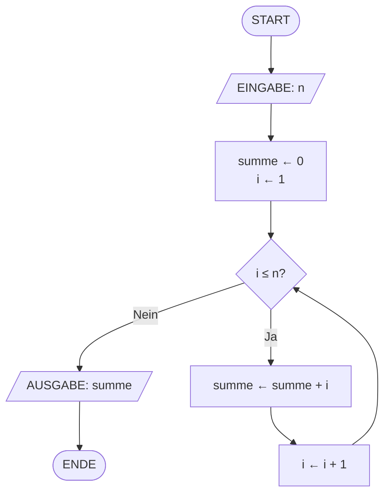
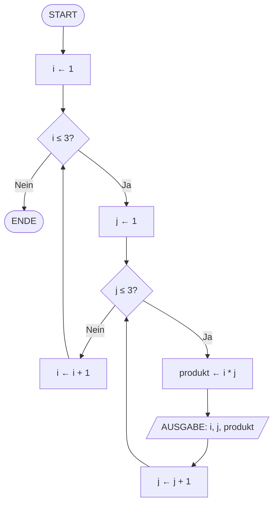
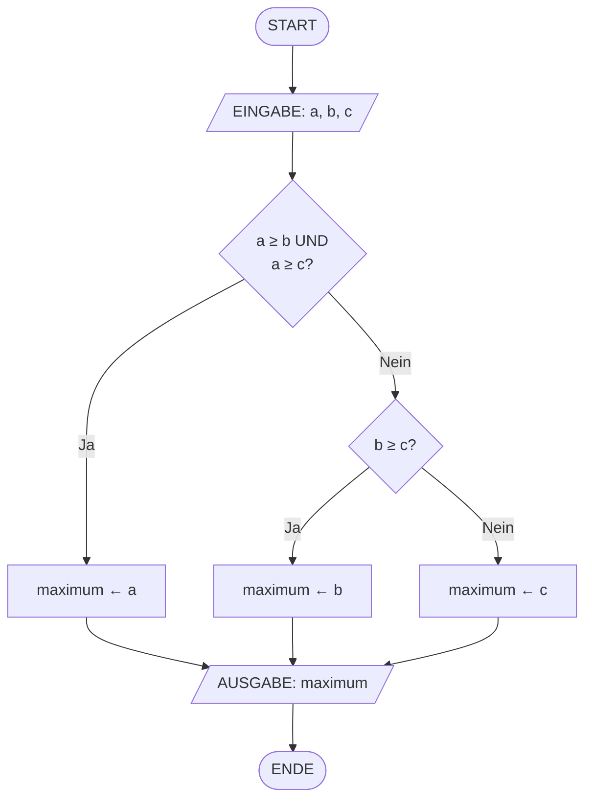

# V06: Programm-Ablauf-Pläne – Teil 2 & Schleifen (for, while) – Teil 1

> [!NOTE]
> **Lernziele dieser Vorlesung**:
> - PAPs in Pseudocode übersetzen und umgekehrt
> - Komplexe Algorithmen mit Schleifen in PAPs visualisieren
> - Verschiedene Darstellungsformen von Algorithmen vergleichen
> - `for`-Schleifen mit `range()` verstehen und anwenden
> - `while`-Schleifen mit Abbruchbedingungen implementieren
> - Endlos-Schleifen erkennen und vermeiden
> - Iterieren über Strings und andere Iterables

---

## Teil 1: Theorie - Programm-Ablauf-Pläne – Teil 2

### Überblick

In der vorherigen Vorlesung (V05) haben Sie die Grundlagen der **Programm-Ablauf-Pläne** (PAPs) kennengelernt: Symbole, Notation nach DIN 66001/ISO 5807, und die drei Grundstrukturen der strukturierten Programmierung (Sequenz, Verzweigung, Schleife). In dieser zweiten Teil vertiefen wir die praktische Anwendung von PAPs und lernen, wie wir zwischen verschiedenen Darstellungsformen wechseln können. Der Fokus liegt dabei auf der Transformation zwischen PAPs, Pseudocode und realem Programmcode sowie auf der Dokumentation komplexer Algorithmen.

Die Fähigkeit, zwischen verschiedenen Abstraktionsebenen zu wechseln, ist eine Kernkompetenz in der Softwareentwicklung. PAPs bieten eine visuelle, sprachunabhängige Darstellung, während Pseudocode eine semi-formale Beschreibung liefert, die näher am tatsächlichen Code liegt. Beide Darstellungsformen haben ihre Berechtigung je nach Zielgruppe und Dokumentationszweck.

### Von PAP zu Pseudocode

**Pseudocode** ist eine informelle Beschreibung eines Algorithmus, die Elemente natürlicher Sprache mit programmiersprachenähnlicher Syntax kombiniert. Der große Vorteil von Pseudocode liegt in seiner Flexibilität: Er ist präziser als natürliche Sprache, aber weniger streng als echter Programmcode. Dadurch eignet er sich hervorragend für die Kommunikation zwischen Entwicklern, für Entwurfsdokumente und zur Vorbereitung der tatsächlichen Implementierung.

> [!NOTE]
> **Pseudocode** ist eine strukturierte, aber nicht formal definierte Notation zur Beschreibung von Algorithmen. Im Gegensatz zu echtem Programmcode muss Pseudocode nicht syntaktisch korrekt sein oder von einem Compiler interpretiert werden können. Er dient primär der menschlichen Kommunikation und Planung.

Die Transformation von einem PAP zu Pseudocode folgt klaren Regeln. Jedes Symbol im PAP entspricht einer bestimmten Pseudocode-Struktur. Diese Zuordnung ist nicht eindeutig standardisiert, sondern orientiert sich an gängigen Konventionen aus der Informatik und Algorithmen-Lehrbüchern.

**Mapping von PAP-Symbolen zu Pseudocode-Konstrukten:**

| PAP-Symbol | Pseudocode-Entsprechung | Beispiel |
|------------|-------------------------|----------|
| Terminator (Start/Ende) | `BEGIN` / `END` oder `START` / `STOP` | `BEGIN Algorithmus` |
| Prozess (Rechteck) | Zuweisung oder Anweisung | `x ← x + 1` oder `AUSGABE(x)` |
| Verzweigung (Raute) | `IF-THEN-ELSE` | `IF x > 0 THEN ... ELSE ... ENDIF` |
| Schleife (verschiedene Symbole) | `WHILE`, `FOR`, `REPEAT-UNTIL` | `WHILE x < 10 DO ... ENDWHILE` |
| Ein-/Ausgabe (Parallelogramm) | `EINGABE()`, `AUSGABE()` | `AUSGABE("Ergebnis: ", summe)` |

> [!TIP]
> **Beispiel: Einfacher Algorithmus zur Berechnung der Summe zweier Zahlen**
> 
> **PAP** (verbal beschrieben):
> 1. START
> 2. EINGABE: a, b
> 3. PROZESS: summe ← a + b
> 4. AUSGABE: summe
> 5. ENDE
> 
> **Pseudocode-Darstellung:**
> ```
> BEGIN SummeBerechnen
>     EINGABE(a)
>     EINGABE(b)
>     summe ← a + b
>     AUSGABE("Summe:", summe)
> END SummeBerechnen
> ```

Beachten Sie, dass Pseudocode verschiedene Stile erlaubt. Manche bevorzugen mathematische Notation wie `←` für Zuweisungen, andere verwenden `:=` oder `=`. Wichtig ist die Konsistenz innerhalb eines Dokuments und die Verständlichkeit für die Zielgruppe.

### Komplexe Algorithmen mit Schleifen in PAPs

Schleifen sind die dritte Grundstruktur der strukturierten Programmierung und ermöglichen die wiederholte Ausführung von Codeblöcken. In PAPs werden Schleifen durch spezielle Symbole und Pfeile dargestellt, die den Kontrollfluss zurück zu einem früheren Punkt lenken. Es gibt verschiedene Schleifentypen, die sich in der Position der Bedingungsprüfung unterscheiden.

> [!NOTE]
> **Schleife** ist eine Kontrollstruktur, die einen Codeblock wiederholt ausführt, solange eine Bedingung erfüllt ist (oder bis sie erfüllt wird). Man unterscheidet zwischen **kopfgesteuerten Schleifen** (Bedingung wird vor dem Schleifenkörper geprüft) und **fußgesteuerten Schleifen** (Bedingung wird nach dem Schleifenkörper geprüft).

**Typen von Schleifen in PAPs:**

1. **Kopfgesteuerte Schleife (while-Schleife)**
   - Die Bedingung wird **vor** jedem Durchlauf geprüft
   - Der Schleifenkörper wird möglicherweise **null Mal** ausgeführt
   - Darstellung: Raute (Bedingung) → bei "Ja" zum Schleifenkörper → Rücksprung zur Raute

2. **Fußgesteuerte Schleife (do-while/repeat-until)**
   - Die Bedingung wird **nach** jedem Durchlauf geprüft
   - Der Schleifenkörper wird **mindestens einmal** ausgeführt
   - Darstellung: Schleifenkörper → Raute (Bedingung) → bei "Ja" zurück zum Schleifenkörper

3. **Zählschleife (for-Schleife)**
   - Spezialfall: Wiederholung mit festgelegter Anzahl oder über Elemente einer Sequenz
   - Darstellung: Oft als spezielle Symbol-Kombination oder mit Schleifenzähler im Prozess-Symbol

> [!WARNING]
> **Endlos-Schleifen** entstehen, wenn die Abbruchbedingung niemals erfüllt wird. Dies ist ein häufiger Programmierfehler, der dazu führt, dass das Programm "hängen bleibt" und nie terminiert. In PAPs erkennt man potenzielle Endlos-Schleifen daran, dass kein Pfad zur Bedingungsänderung innerhalb der Schleife führt.

**Beispiel: PAP für Summation von 1 bis n (Zählschleife)**



**Zugehöriger Pseudocode:**

```
BEGIN SummeBisN
    EINGABE(n)
    summe ← 0
    i ← 1
    WHILE i ≤ n DO
        summe ← summe + i
        i ← i + 1
    ENDWHILE
    AUSGABE("Summe:", summe)
END SummeBisN
```

Die Schleife wird durch die Bedingung `i ≤ n` gesteuert. Solange `i` kleiner oder gleich `n` ist, wird der Schleifenkörper ausgeführt. Nach jedem Durchlauf wird `i` erhöht. Sobald `i` größer als `n` wird, verlässt der Algorithmus die Schleife und gibt das Ergebnis aus.

### Verschachtelte Schleifen in PAPs

**Verschachtelte Schleifen** (Nested Loops) treten auf, wenn eine Schleife innerhalb einer anderen Schleife platziert wird. Dies ist notwendig für Algorithmen, die über mehrdimensionale Datenstrukturen iterieren oder bei denen für jeden Durchlauf der äußeren Schleife mehrere Wiederholungen erforderlich sind.

> [!NOTE]
> **Verschachtelte Schleifen** sind Schleifen innerhalb von Schleifen. Die **äußere Schleife** führt die **innere Schleife** vollständig für jeden ihrer Durchläufe aus. Die Gesamtzahl der Durchläufe ist das Produkt der Durchläufe beider Schleifen.

**Beispiel: Multiplikationstabelle (1 bis 3)**

Wir möchten eine kleine Multiplikationstabelle erstellen, die für jede Zahl von 1 bis 3 die Produkte mit 1 bis 3 ausgibt.



**Zugehöriger Pseudocode:**

```
BEGIN Multiplikationstabelle
    FOR i ← 1 TO 3 DO
        FOR j ← 1 TO 3 DO
            produkt ← i * j
            AUSGABE(i, "×", j, "=", produkt)
        ENDFOR
    ENDFOR
END Multiplikationstabelle
```

Die äußere Schleife iteriert über `i` von 1 bis 3. Für jeden Wert von `i` wird die innere Schleife vollständig durchlaufen, die über `j` von 1 bis 3 iteriert. Das bedeutet, dass die innere Schleife 3 Mal (für jeden Durchlauf der äußeren Schleife) mit jeweils 3 Durchläufen ausgeführt wird, insgesamt also 3 × 3 = 9 Ausgaben.

> [!WARNING]
> **Komplexität verschachtelter Schleifen**: Die Laufzeit steigt multiplikativ an. Zwei ineinander verschachtelte Schleifen mit n Durchläufen haben eine Zeitkomplexität von O(n²). Bei drei verschachtelten Schleifen erreicht man O(n³). Dies kann bei großen Datenmengen zu erheblichen Performance-Problemen führen.

### Von Pseudocode zu PAP

Die Rücktransformation von Pseudocode zu PAP ist ebenso wichtig wie die Hinrichtung. Sie ist besonders nützlich, wenn ein Algorithmus bereits in textueller Form vorliegt und visuell kommuniziert werden soll, etwa in Präsentationen oder Dokumentationen für nicht-technisches Personal.

**Schritte zur Transformation:**

1. **Identifiziere die Kontrollstrukturen**: Markiere alle `IF-THEN-ELSE`, `WHILE`, `FOR`, etc.
2. **Ordne jedem Element das passende PAP-Symbol zu**: Zuweisungen → Rechteck, Bedingungen → Raute, Ein-/Ausgabe → Parallelogramm
3. **Zeichne den Kontrollfluss**: Verbinde die Symbole mit Pfeilen gemäß der Ausführungsreihenfolge
4. **Prüfe auf Vollständigkeit**: Jeder Pfad muss zu einem Ende-Symbol führen

> [!TIP]
> **Beispiel: Maximum von drei Zahlen finden**
> 
> **Pseudocode:**
> ```
> BEGIN MaximumDreiZahlen
>     EINGABE(a, b, c)
>     IF a ≥ b AND a ≥ c THEN
>         maximum ← a
>     ELSE IF b ≥ c THEN
>         maximum ← b
>     ELSE
>         maximum ← c
>     ENDIF
>     AUSGABE("Maximum:", maximum)
> END MaximumDreiZahlen
> ```
> 
> **PAP:**



### Dokumentation von Programmabläufen

Die Wahl der Darstellungsform hängt vom Kontext und der Zielgruppe ab. PAPs sind visuell ansprechend und sprachunabhängig, erfordern aber mehr Platz und sind bei sehr komplexen Algorithmen schwer lesbar. Pseudocode ist kompakter und lässt sich leichter in Textdokumente integrieren, setzt aber ein gewisses technisches Verständnis voraus.

**Vergleich der Darstellungsformen:**

| Kriterium | PAP (Flussdiagramm) | Pseudocode | Programmcode |
|-----------|---------------------|------------|--------------|
| **Abstraktionsebene** | Hoch (visuell) | Mittel (semi-formal) | Niedrig (formal) |
| **Sprachunabhängigkeit** | Ja | Weitgehend | Nein |
| **Präzision** | Mittel | Mittel | Hoch |
| **Lesbarkeit für Nicht-Programmierer** | Sehr gut | Gut | Schlecht |
| **Eignung für komplexe Algorithmen** | Begrenzt (wird unübersichtlich) | Gut | Sehr gut |
| **Werkzeugunterstützung** | Zeichentools (Visio, Mermaid) | Texteditor | IDE |
| **Wartbarkeit** | Aufwändig (manuelles Neuzeichnen) | Einfach (Text bearbeiten) | Automatisiert (Refactoring) |

> [!NOTE]
> **Best Practice**: Verwende PAPs für die initiale Planung und Kommunikation mit Nicht-Technikern. Nutze Pseudocode für detaillierte Algorithmen-Entwürfe und Code-Reviews. Schreibe echten Programmcode erst, wenn die Logik vollständig durchdacht ist.

In modernen Software-Projekten werden PAPs oft nur noch für didaktische Zwecke oder bei der Dokumentation von Schnittstellen verwendet. Für die eigentliche Entwicklung haben sich Pseudocode und direkte Code-Kommentare durchgesetzt, da sie sich besser in die Entwicklungsumgebung integrieren lassen.

### Vergleich verschiedener Darstellungsformen

Neben PAPs und Pseudocode gibt es weitere Darstellungsformen für Algorithmen, die je nach Kontext ihre Berechtigung haben.

**Weitere Darstellungsformen:**

1. **Struktogramme (Nassi-Shneiderman-Diagramme)**
   - Rechteckige Blöcke statt Symbole und Pfeile
   - Verschachtelung durch Unterteilung der Blöcke
   - Zwingen zu strukturierter Programmierung (keine Sprünge möglich)
   - Vorteile: Kompakter als PAPs, erzwingen klare Struktur
   - Nachteile: Weniger intuitiv für Nicht-Informatiker

2. **Aktivitätsdiagramme (UML)**
   - Teil der Unified Modeling Language
   - Ähnlich wie PAPs, aber mit zusätzlichen Konzepten (Swimlanes, Synchronisation)
   - Vorteile: Standard in der Software-Engineering-Industrie, Werkzeugunterstützung
   - Nachteile: Höhere Komplexität, Lernkurve

3. **Zustandsautomaten (State Machines)**
   - Für ereignisgesteuerte Systeme
   - Zustände und Übergänge zwischen Zuständen
   - Vorteile: Ideal für reaktive Systeme, Hardware-Design
   - Nachteile: Nicht geeignet für sequenzielle Algorithmen

4. **Entscheidungstabellen**
   - Tabellarische Darstellung von Bedingungen und Aktionen
   - Vorteile: Übersichtlich bei vielen Verzweigungen
   - Nachteile: Nicht für Schleifen geeignet

> [!TIP]
> **Wahl der Darstellungsform:**
> - **PAPs**: Initiale Planung, Lehre, Kommunikation mit Nicht-Technikern
> - **Pseudocode**: Detaillierte Algorithmen-Entwürfe, Code-Reviews
> - **Struktogramme**: Wenn strukturierte Programmierung erzwungen werden soll
> - **UML-Aktivitätsdiagramme**: Große Software-Projekte, Teamarbeit
> - **Zustandsautomaten**: Ereignisgesteuerte Systeme, Hardware-nahe Programmierung
> - **Entscheidungstabellen**: Komplexe Verzweigungslogik (z.B. Business Rules)

In der Praxis werden häufig mehrere Darstellungsformen kombiniert. Ein Projektbericht könnte beispielsweise einen übergeordneten PAP für den Gesamtablauf enthalten, detaillierte Algorithmen in Pseudocode beschreiben und kritische Abschnitte durch Entscheidungstabellen oder Zustandsautomaten verdeutlichen.

### Zusammenfassung Theorie

- **Pseudocode** ist eine semi-formale Notation zur Beschreibung von Algorithmen, die flexibler als Programmcode, aber präziser als natürliche Sprache ist
- Die **Transformation zwischen PAP und Pseudocode** folgt klaren Regeln: Jedes PAP-Symbol entspricht einer Pseudocode-Struktur
- **Schleifen** in PAPs ermöglichen wiederholte Ausführung und werden durch Rückwärtspfeile dargestellt. Man unterscheidet kopfgesteuerte, fußgesteuerte und Zählschleifen
- **Verschachtelte Schleifen** führen zu multiplikativer Zunahme der Durchläufe und erfordern besondere Aufmerksamkeit bei der Komplexitätsanalyse
- Die **Wahl der Darstellungsform** (PAP, Pseudocode, Programmcode, UML, etc.) hängt von Zielgruppe, Komplexität und Projektstadium ab
- **Best Practice**: Verwende PAPs für visuelle Kommunikation, Pseudocode für Algorithmen-Entwürfe und echten Code für die Implementierung

---

## Teil 2: Python-Praxis - Schleifen (for, while) – Teil 1

> [!WARNING]
> **Python-Konsistenz beachten**: Prüfe [../../python_topics.md](../../python_topics.md) für bereits eingeführte Konzepte!

### Überblick

Nachdem Sie in V05 Verzweigungen kennengelernt haben, erweitern wir nun Ihr Repertoire um **Schleifen** – die dritte Grundstruktur der strukturierten Programmierung. Schleifen ermöglichen es, Codeblöcke mehrfach auszuführen, ohne ihn wiederholt hinschreiben zu müssen. Dies ist unverzichtbar für die Verarbeitung von Listen, die Implementierung von Algorithmen und die Automatisierung repetitiver Aufgaben.

Python bietet zwei Haupttypen von Schleifen: Die **`for`-Schleife** für Iterationen über Sequenzen und die **`while`-Schleife** für Wiederholungen mit Bedingung. In diesem ersten Teil konzentrieren wir uns auf die Grundlagen beider Schleifentypen, während fortgeschrittene Konzepte wie `break`, `continue` und List Comprehensions in V07 behandelt werden.

Die Verbindung zur Theorie ist offensichtlich: Die Schleifen-Konstrukte in Python entsprechen direkt den Schleifensymbolen in PAPs. Eine `while`-Schleife in Python ist eine kopfgesteuerte Schleife, während die `for`-Schleife in vielen Fällen einer Zählschleife entspricht.

### Die `for`-Schleife mit `range()`

Die **`for`-Schleife** in Python iteriert über Sequenzen (Listen, Strings, Ranges, etc.). Im einfachsten Fall verwenden wir die `range()`-Funktion, um eine Zahlenfolge zu erzeugen, über die wir iterieren.

> [!NOTE]
> **`for`-Schleife** ist eine Kontrollstruktur, die über alle Elemente einer Sequenz (Iterable) iteriert. In jedem Durchlauf wird das aktuelle Element einer Variablen zugewiesen, und der Schleifenkörper wird ausgeführt. Nach dem letzten Element endet die Schleife automatisch.

**Syntax der `for`-Schleife:**

```python
for variable in sequenz:
    # Schleifenkörper
    # wird für jedes Element ausgeführt
```

- `variable`: Die Schleifenvariable, die in jedem Durchlauf den Wert des aktuellen Elements erhält
- `sequenz`: Ein Iterable (z.B. `range()`, Liste, String)
- Der Schleifenkörper muss eingerückt sein (4 Leerzeichen)

#### Die `range()`-Funktion

> [!NOTE]
> **`range(start=0, stop, step=1)`** (Built-in, Python 3.0+) erzeugt eine Sequenz von Ganzzahlen. In Python 3 ist `range()` ein Typ (kein Generator), der Speicher-effizient arbeitet und Zahlen nur bei Bedarf generiert. Die erzeugte Sequenz beginnt bei `start` (inklusive) und endet bei `stop` (exklusive) mit Schrittweite `step`.

**Drei Verwendungsformen von `range()`:**

1. **`range(stop)`**: Erzeugt Zahlen von 0 bis `stop - 1`
   ```python
   for i in range(5):
       print(i)  # Gibt 0, 1, 2, 3, 4 aus
   ```

2. **`range(start, stop)`**: Erzeugt Zahlen von `start` bis `stop - 1`
   ```python
   for i in range(2, 6):
       print(i)  # Gibt 2, 3, 4, 5 aus
   ```

3. **`range(start, stop, step)`**: Erzeugt Zahlen von `start` bis `stop - 1` mit Schrittweite `step`
   ```python
   for i in range(0, 10, 2):
       print(i)  # Gibt 0, 2, 4, 6, 8 aus
   ```

> [!WARNING]
> **Häufiger Fehler**: Die Obergrenze (`stop`) ist **exklusive**. `range(10)` erzeugt Zahlen von 0 bis 9, nicht bis 10. Um bis 10 (inklusive) zu zählen, verwende `range(11)`.

> [!TIP]
> **Beispiel: Summe der Zahlen von 1 bis 100 berechnen**
> 
> ```python
> summe = 0
> for i in range(1, 101):  # Von 1 bis 100 (101 ist exklusive)
>     summe += i
> print(f"Summe: {summe}")  # Ausgabe: Summe: 5050
> ```
> 
> Dieser Code entspricht dem PAP aus dem Theorie-Teil, angepasst für n=100.

**Negative Schrittweiten**: Mit negativem `step` kann rückwärts gezählt werden.

```python
for i in range(10, 0, -1):
    print(i)  # Gibt 10, 9, 8, ..., 1 aus (Countdown)
```

> [!WARNING]
> **Achtung bei negativem Step**: Wenn `step` negativ ist, muss `start > stop` sein, sonst wird die Schleife nicht ausgeführt. `range(0, 10, -1)` erzeugt eine leere Sequenz.

### Iterieren über Strings

Die `for`-Schleife kann über jedes Iterable iterieren, nicht nur über Zahlenfolgen. Strings sind in Python Sequenzen von Zeichen, über die wir direkt iterieren können.

```python
text = "Python"
for buchstabe in text:
    print(buchstabe)
# Ausgabe:
# P
# y
# t
# h
# o
# n
```

Jedes Zeichen des Strings wird nacheinander der Variable `buchstabe` zugewiesen. Diese Fähigkeit macht die `for`-Schleife extrem vielseitig.

> [!TIP]
> **Beispiel: Vokale in einem String zählen**
> 
> ```python
> text = "Informatik Grundlagen"
> vokale = "aeiouAEIOU"
> anzahl = 0
> 
> for zeichen in text:
>     if zeichen in vokale:
>         anzahl += 1
> 
> print(f"Anzahl Vokale: {anzahl}")  # Ausgabe: Anzahl Vokale: 8
> ```

### Die `while`-Schleife

Die **`while`-Schleife** wiederholt einen Codeblock, solange eine Bedingung wahr ist. Im Gegensatz zur `for`-Schleife, die über eine vorgegebene Sequenz iteriert, läuft die `while`-Schleife, bis die Bedingung `False` wird.

> [!NOTE]
> **`while`-Schleife** ist eine kopfgesteuerte Schleife, die einen Codeblock wiederholt ausführt, solange eine Bedingung `True` ist. Die Bedingung wird vor jedem Durchlauf geprüft. Wenn sie beim ersten Check bereits `False` ist, wird der Schleifenkörper niemals ausgeführt.

**Syntax der `while`-Schleife:**

```python
while bedingung:
    # Schleifenkörper
    # wird ausgeführt, solange bedingung True ist
```

- `bedingung`: Ein boolescher Ausdruck, der in jedem Durchlauf ausgewertet wird
- Der Schleifenkörper muss eingerückt sein

> [!TIP]
> **Beispiel: Countdown mit `while`**
> 
> ```python
> countdown = 5
> while countdown > 0:
>     print(countdown)
>     countdown -= 1  # Zähler dekrementieren
> print("Start!")
> # Ausgabe:
> # 5
> # 4
> # 3
> # 2
> # 1
> # Start!
> ```

### Abbruchbedingungen richtig setzen

Die Abbruchbedingung einer `while`-Schleife muss irgendwann `False` werden, sonst entsteht eine **Endlos-Schleife** (Infinite Loop). Dies ist einer der häufigsten Programmierfehler bei Schleifen.

> [!WARNING]
> **Endlos-Schleife**: Eine Schleife, deren Abbruchbedingung niemals `False` wird, läuft unendlich weiter. Das Programm "hängt" und muss manuell abgebrochen werden (z.B. mit Strg+C in der Konsole oder durch Schließen des Terminals).

**Beispiel für eine Endlos-Schleife (FEHLER!):**

```python
# ❌ FEHLER: Endlos-Schleife
x = 0
while x < 10:
    print(x)
    # x wird nie verändert → Bedingung bleibt immer True
```

**Korrigierte Version:**

```python
# ✅ KORREKT
x = 0
while x < 10:
    print(x)
    x += 1  # x wird erhöht, Bedingung wird irgendwann False
```

> [!TIP]
> **Checkliste zur Vermeidung von Endlos-Schleifen:**
> 1. Wird die Schleifenvariable im Schleifenkörper modifiziert?
> 2. Führt die Modifikation dazu, dass die Bedingung irgendwann `False` wird?
> 3. Gibt es einen garantierten Abbruch (z.B. durch Benutzereingabe)?
> 4. Ist die Abbruchbedingung korrekt formuliert (nicht `x < 10` wenn `x++` gemeint war)?

### `while` vs. `for`: Wann welche Schleife?

Beide Schleifentypen können oft für dieselbe Aufgabe verwendet werden, aber es gibt typische Anwendungsfälle für jede.

**Verwendung von `for`:**
- Wenn die Anzahl der Durchläufe bekannt oder vorhersehbar ist
- Beim Iterieren über Sequenzen (Listen, Strings, Ranges)
- Wenn ein Schleifenzähler benötigt wird

**Verwendung von `while`:**
- Wenn die Anzahl der Durchläufe nicht im Voraus bekannt ist
- Wenn die Schleife durch eine Bedingung beendet wird, die sich dynamisch ändert
- Bei Benutzereingaben, die validiert werden müssen
- Bei Algorithmen, die bis zur Konvergenz laufen

> [!TIP]
> **Beispiel: Dieselbe Aufgabe mit `for` und `while`**
> 
> **Aufgabe**: Zahlen von 1 bis 5 ausgeben
> 
> **Mit `for`:**
> ```python
> for i in range(1, 6):
>     print(i)
> ```
> 
> **Mit `while`:**
> ```python
> i = 1
> while i <= 5:
>     print(i)
>     i += 1
> ```
> 
> Die `for`-Version ist hier idiomatischer und kompakter. Verwende `for`, wenn du über eine bekannte Sequenz iterierst.

### Eingabevalidierung mit `while`

Ein klassischer Anwendungsfall für `while`-Schleifen ist die Validierung von Benutzereingaben. Die Schleife läuft so lange, bis eine gültige Eingabe erfolgt.

> [!TIP]
> **Beispiel: Eingabe einer Zahl zwischen 1 und 10**
> 
> ```python
> zahl = 0
> while zahl < 1 or zahl > 10:
>     eingabe = input("Bitte eine Zahl zwischen 1 und 10 eingeben: ")
>     if eingabe.isdigit():
>         zahl = int(eingabe)
>         if zahl < 1 or zahl > 10:
>             print("Fehler: Zahl muss zwischen 1 und 10 liegen.")
>     else:
>         print("Fehler: Keine gültige Zahl.")
> 
> print(f"Danke! Sie haben {zahl} eingegeben.")
> ```
> 
> Die Schleife läuft, bis `zahl` im Bereich [1, 10] liegt. Ungültige Eingaben führen zu Fehlermeldungen und erneutem Prompt.

### Akkumulation in Schleifen

Ein häufiges Muster in Schleifen ist die **Akkumulation** (Accumulation), bei der über mehrere Durchläufe ein Wert aufgebaut wird (z.B. Summe, Produkt, String-Konkatenation).

> [!NOTE]
> **Akkumulation** bezeichnet das schrittweise Aufbauen eines Ergebnisses über mehrere Schleifendurchläufe. Typischerweise wird eine Variable vor der Schleife initialisiert (z.B. `summe = 0`) und in jedem Durchlauf aktualisiert (z.B. `summe += wert`).

**Akkumulations-Muster:**

1. **Summation**:
   ```python
   summe = 0
   for zahl in range(1, 11):
       summe += zahl
   print(summe)  # 55
   ```

2. **Produkt**:
   ```python
   produkt = 1
   for zahl in range(1, 6):
       produkt *= zahl
   print(produkt)  # 120 (Fakultät von 5)
   ```

3. **String-Konkatenation**:
   ```python
   ergebnis = ""
   for i in range(5):
       ergebnis += str(i) + " "
   print(ergebnis)  # "0 1 2 3 4 "
   ```

> [!WARNING]
> **String-Konkatenation in Schleifen ist ineffizient**: Strings sind in Python immutable. Jede Konkatenation erzeugt ein neues String-Objekt. Bei vielen Durchläufen ist es effizienter, eine Liste zu verwenden und am Ende mit `.join()` zu verbinden (wird in V08 behandelt).

### Zählen in Schleifen

Ein weiteres häufiges Muster ist das **Zählen**, bei dem die Häufigkeit eines Ereignisses gezählt wird.

> [!TIP]
> **Beispiel: Gerade Zahlen von 1 bis 100 zählen**
> 
> ```python
> anzahl_gerade = 0
> for zahl in range(1, 101):
>     if zahl % 2 == 0:
>         anzahl_gerade += 1
> print(f"Anzahl gerader Zahlen: {anzahl_gerade}")  # 50
> ```
> 
> Der Modulo-Operator `%` gibt den Rest der Division zurück. Eine Zahl ist gerade, wenn `zahl % 2 == 0`.

### Iterieren über Listen (Vorschau)

Obwohl Listen erst in V08 ausführlich behandelt werden, können wir bereits jetzt über einfache Listen iterieren, da Listen ebenfalls Iterables sind.

```python
fruechte = ["Apfel", "Banane", "Kirsche"]
for frucht in fruechte:
    print(f"Ich mag {frucht}")
# Ausgabe:
# Ich mag Apfel
# Ich mag Banane
# Ich mag Kirsche
```

Die `for`-Schleife greift automatisch auf jedes Element der Liste zu und weist es der Variable `frucht` zu.

### `enumerate()` für Index und Wert

Manchmal benötigt man sowohl den Index als auch den Wert eines Elements. Die `enumerate()`-Funktion liefert beide.

> [!NOTE]
> **`enumerate(iterable, start=0)`** (Built-in) gibt ein Iterable zurück, das Tupel aus Index und Wert erzeugt. Der Parameter `start` legt fest, bei welchem Index die Zählung beginnt (Standard: 0).

```python
fruechte = ["Apfel", "Banane", "Kirsche"]
for index, frucht in enumerate(fruechte):
    print(f"{index}: {frucht}")
# Ausgabe:
# 0: Apfel
# 1: Banane
# 2: Kirsche
```

Mit `start=1` kann die Zählung bei 1 beginnen:

```python
for nummer, frucht in enumerate(fruechte, start=1):
    print(f"{nummer}. {frucht}")
# Ausgabe:
# 1. Apfel
# 2. Banane
# 3. Kirsche
```

### Häufige Fehler und Lösungen

> [!WARNING]
> **Fehler 1: Modifikation der Schleifenvariable in `for` wirkt sich nicht auf die Iteration aus**
> 
> ```python
> # ❌ FEHLER: i wird nur lokal geändert
> for i in range(5):
>     i = 10  # Hat keinen Einfluss auf die nächste Iteration
>     print(i)  # Gibt immer 10 aus
> ```
> 
> **Lösung**: Die Schleifenvariable in `for` sollte nicht im Schleifenkörper geändert werden. Sie wird in jedem Durchlauf neu zugewiesen. Verwende eine separate Variable, falls nötig.

> [!WARNING]
> **Fehler 2: `range()` erzeugt keine Liste, sondern ein Range-Objekt**
> 
> ```python
> zahlen = range(5)
> print(zahlen)  # Ausgabe: range(0, 5), nicht [0, 1, 2, 3, 4]
> ```
> 
> **Lösung**: Verwende `list(range(5))`, wenn du eine Liste benötigst. Für Schleifen ist das Range-Objekt aber effizienter und sollte bevorzugt werden.

> [!WARNING]
> **Fehler 3: Vergessen, die Schleifenvariable in `while` zu aktualisieren**
> 
> ```python
> # ❌ FEHLER: Endlos-Schleife
> i = 0
> while i < 5:
>     print(i)
>     # i wird nicht erhöht → Endlos-Schleife!
> ```
> 
> **Lösung**: Stelle sicher, dass die Bedingung irgendwann `False` wird, indem du die relevanten Variablen im Schleifenkörper aktualisierst.

### Zusammenfassung Python

- Die **`for`-Schleife** iteriert über Sequenzen (Iterables) und eignet sich für bekannte Anzahl von Durchläufen oder Iterationen über Sammlungen
- **`range(start, stop, step)`** erzeugt Zahlenfolgen, wobei `stop` exklusive ist. Häufigste Form: `range(n)` für 0 bis n-1
- Die **`while`-Schleife** wiederholt Code, solange eine Bedingung `True` ist. Wichtig: Abbruchbedingung muss irgendwann `False` werden, sonst entsteht Endlos-Schleife
- **Akkumulation** (Aufbauen von Summen, Produkten, Strings) und **Zählen** sind typische Muster in Schleifen
- **`enumerate(iterable)`** liefert Index und Wert gleichzeitig, nützlich für nummerierte Ausgaben
- **Wann `for`, wann `while`?** Verwende `for` für Iterationen über Sequenzen und bekannte Durchläufe, `while` für dynamische Bedingungen und unbekannte Durchläufe

### Neue Python-Funktionen/Methoden

> [!NOTE]
> Diese Funktionen/Methoden wurden in V06 **neu eingeführt**:

#### Kontrollstrukturen

- **`for variable in iterable:`** (Python Keyword)
  - Iteriert über alle Elemente eines Iterables
  - Signatur: `for variable in iterable:`
  - Beispiel: `for i in range(5): print(i)`

- **`while bedingung:`** (Python Keyword)
  - Wiederholt Codeblock, solange Bedingung `True` ist
  - Signatur: `while condition:`
  - Beispiel: `while x < 10: x += 1`

#### Built-in Funktionen

- **`range(start=0, stop, step=1)`** (Built-in, Python 3.0+)
  - Erzeugt Sequenz von Ganzzahlen
  - Parameter:
    - `start`: Startwert (inklusive, Standard: 0)
    - `stop`: Endwert (exklusive, erforderlich)
    - `step`: Schrittweite (Standard: 1)
  - Signatur: `range(stop)` oder `range(start, stop, step=1)` → `range`
  - Beispiel: `range(5)` → 0, 1, 2, 3, 4
  - Beispiel: `range(2, 10, 2)` → 2, 4, 6, 8

- **`enumerate(iterable, start=0)`** (Built-in)
  - Gibt Iterator zurück, der Tupel aus Index und Wert erzeugt
  - Parameter:
    - `iterable`: Die Sequenz, über die iteriert wird
    - `start`: Startwert für den Index (Standard: 0)
  - Signatur: `enumerate(iterable, start=0)` → `enumerate`
  - Beispiel: `for i, wert in enumerate(['a', 'b', 'c']): print(i, wert)`

---

## Weiterführende Ressourcen

### Theorie
- DIN 66001 / ISO 5807: Offizielle Standards für Programm-Ablauf-Pläne
- Cormen et al.: "Introduction to Algorithms" (4. Auflage) – Kapitel zu Algorithmen-Notation
- Robert Sedgewick: "Algorithms" – Enthält viele PAPs und Pseudocode-Beispiele
- UML 2.5 Specification – Für Aktivitätsdiagramme und Verhaltensmodellierung

### Python
- Python Documentation: Control Flow - https://docs.python.org/3/tutorial/controlflow.html
- Real Python: Python "for" Loops - https://realpython.com/python-for-loop/
- Real Python: Python "while" Loops - https://realpython.com/python-while-loop/
- Python Documentation: Built-in Functions (range, enumerate) - https://docs.python.org/3/library/functions.html
- PEP 3136 – Labeled break and continue (rejected, aber interessant für Verständnis von Schleifen-Kontrolle)
