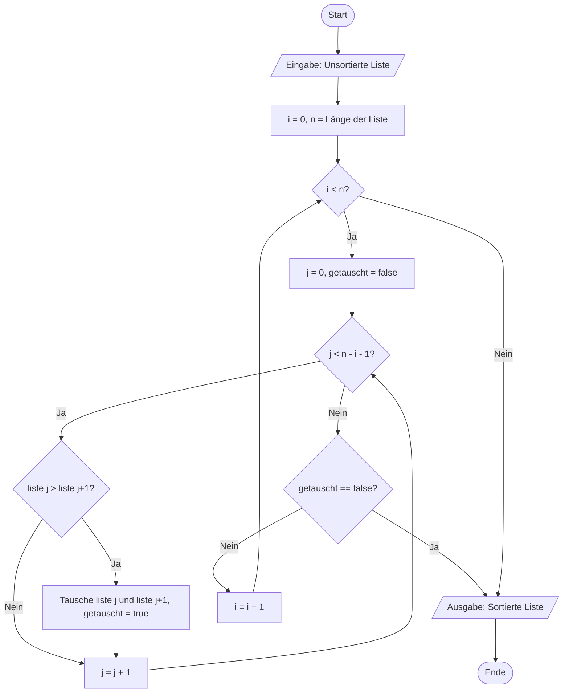

# V10: Lösungen - Laufzeitanalyse & Algorithmik

> [!WARNING]
> Versuche die Aufgaben zuerst selbstständig zu lösen, bevor du die Lösungen ansiehst!

---

## Teil A: Theorie-Aufgaben - Lösungen

### Lösung T1: Komplexitätsklassen erkennen

**Lösung**:

**a)** `funktion_a(n)`: **O(n)** – Linear
```python
def funktion_a(n):
    summe = 0          # 1 Operation
    for i in range(n): # n Iterationen
        summe += i     # 2 Operationen pro Iteration
    return summe       # 1 Operation
```
- Die Schleife läuft $n$-mal
- Pro Durchlauf: konstante Anzahl Operationen
- Gesamt: $O(n)$

**b)** `funktion_b(n)`: **O(n²)** – Quadratisch
```python
def funktion_b(n):
    for i in range(n):      # n Iterationen (äußere Schleife)
        for j in range(n):  # n Iterationen pro i (innere Schleife)
            print(i, j)     # konstante Operation
```
- Verschachtelte Schleifen: äußere $n$-mal, innere jeweils $n$-mal
- Gesamt: $n \cdot n = n^2$ Iterationen
- Typisches Muster für $O(n^2)$

**c)** `funktion_c(n)`: **O(log n)** – Logarithmisch
```python
def funktion_c(n):
    i = n
    while i > 1:
        print(i)
        i = i // 2  # Halbierung in jedem Schritt!
```
- Der Wert von `i` wird in jedem Durchlauf halbiert
- Nach $k$ Durchläufen: $i = n / 2^k$
- Schleife endet bei $i = 1$: $n / 2^k = 1 \Rightarrow k = \log_2(n)$
- Typisches Muster für binäre Suche und Divide-and-Conquer

**d)** `funktion_d(n)`: **O(1)** – Konstant
```python
def funktion_d(n):
    return n * (n + 1) // 2  # Direkte Berechnung, keine Schleife
```
- Keine Schleife, nur eine mathematische Formel
- Anzahl der Operationen unabhängig von $n$ (immer 3: Multiplikation, Addition, Division)
- Auch wenn $n$ als Parameter erscheint: Die Anzahl der Operationen ist konstant!

**Erklärung**:

Die Unterscheidung zwischen verschiedenen Komplexitätsklassen basiert darauf, wie sich die Anzahl der Operationen mit wachsendem $n$ verhält. Bei $O(1)$ bleibt die Anzahl konstant, bei $O(n)$ wächst sie linear, bei $O(n^2)$ quadratisch und bei $O(\log n)$ nur logarithmisch (sehr langsam).

**Häufige Fehler**:
- **Fehler**: Verwechslung von $O(1)$ und $O(n)$ bei Funktionen, die $n$ als Parameter haben
  - **Warum falsch**: Nur weil $n$ im Code vorkommt, heißt das nicht automatisch $O(n)$. Entscheidend ist, ob Schleifen vorhanden sind.
  - **Richtig**: Zähle die tatsächlichen Operationen, nicht die Parameter.

- **Fehler**: Verwechslung von $O(n)$ und $O(\log n)$ bei Halbierungsschleifen
  - **Warum falsch**: Halbierung bedeutet logarithmisches Wachstum, nicht lineares.
  - **Richtig**: Achte darauf, ob der Iterationswert dekrementiert (`i -= 1` → linear) oder halbiert wird (`i //= 2` → logarithmisch).

---

### Lösung T2: Algorithmus-Analyse mit Worst-Case

**Lösung**:

**a)** Zeitkomplexität:

```python
def suche_element(liste, ziel):
    for i in range(len(liste)):  # Schleife über alle Elemente
        if liste[i] == ziel:      # Vergleich
            return i               # Sofortiger Return bei Fund
    return -1                      # Nicht gefunden
```

- **Best-Case**: $O(1)$
  - Das gesuchte Element ist an **erster Position** (Index 0)
  - Nur **ein Vergleich** notwendig
  - Beispiel: `suche_element([5, 3, 7], 5)` → Index 0, 1 Vergleich

- **Average-Case**: $O(n)$
  - Im Durchschnitt ist das Element irgendwo in der Mitte
  - Durchschnittlich $n/2$ Vergleiche
  - Die Komplexitätsklasse bleibt $O(n)$ (konstanter Faktor wird ignoriert)

- **Worst-Case**: $O(n)$
  - Das Element ist an **letzter Position** oder **nicht vorhanden**
  - **Alle $n$ Elemente** müssen durchsucht werden
  - Beispiel: `suche_element([5, 3, 7], 99)` → -1, 3 Vergleiche (alle Elemente)

**b)** Anzahl Vergleiche bei 1.000 Elementen (Worst-Case):

Bei einer Liste mit 1.000 Elementen werden im Worst-Case **1.000 Vergleichsoperationen** durchgeführt, da die Schleife über alle Elemente läuft.

**c)** Vergleich mit binärer Suche:

- **Warum binäre Suche hier nicht verwendet werden kann**:
  - Binäre Suche erfordert eine **sortierte** Liste
  - Die gegebene Liste ist unsortiert
  - Binäre Suche funktioniert durch Halbierung des Suchbereichs, was nur bei sortierter Reihenfolge möglich ist

- **Zeitkomplexität binärer Suche** (Worst-Case): $O(\log n)$
  - Bei 1.000 Elementen: ca. $\log_2(1000) \approx 10$ Vergleiche
  - Drastischer Unterschied zu linearer Suche: 1.000 vs. 10 Vergleiche!

- **Wann macht der Unterschied einen deutlichen Unterschied**:
  - Bei **kleinen Listen** (< 10 Elemente): Unterschied kaum merkbar (Nanosekunden)
  - Bei **mittleren Listen** (100-1.000 Elemente): Deutlicher Unterschied (Mikrosekunden vs. Millisekunden)
  - Bei **großen Listen** (> 1 Million Elemente): Enormer Unterschied (Sekunden vs. Millisekunden)
  
  **Beispiel-Rechnung**:
  - 1.000 Elemente: Linear = 1.000 Vergleiche, Binär = ~10 Vergleiche (100x schneller)
  - 1.000.000 Elemente: Linear = 1.000.000 Vergleiche, Binär = ~20 Vergleiche (50.000x schneller!)

**Erklärung**:

Lineare Suche ist ein $O(n)$-Algorithmus: Die Anzahl der Operationen wächst linear mit der Eingabegröße. Der Best-Case ist günstig ($O(1)$), aber für die Systembewertung ist der Worst-Case entscheidend, da er garantiert, dass der Algorithmus niemals langsamer ist.

Binäre Suche ist mit $O(\log n)$ drastisch effizienter, benötigt aber eine sortierte Liste. Wenn die Liste häufig durchsucht, aber selten geändert wird, lohnt es sich, sie einmalig zu sortieren (z.B. mit Merge Sort in $O(n \log n)$) und dann binäre Suche zu verwenden.

**Lösungsweg Schritt für Schritt**:

1. **Best-Case identifizieren**: Welches Szenario führt zur geringsten Anzahl Operationen? → Element an erster Position
2. **Worst-Case identifizieren**: Welches Szenario führt zur höchsten Anzahl Operationen? → Element nicht vorhanden oder an letzter Position
3. **Average-Case**: Im Durchschnitt wird das Element in der Mitte gefunden → $n/2$ Vergleiche, aber Komplexität bleibt $O(n)$
4. **Vergleich mit alternativen Algorithmen**: Binäre Suche hat $O(\log n)$, benötigt aber Vorbedingung (sortierte Liste)

**Häufige Fehler**:
- **Fehler**: Annahme, dass Average-Case eine andere Komplexitätsklasse hat als Worst-Case
  - **Warum falsch**: $O(n/2) = O(n)$ – konstante Faktoren werden ignoriert
  - **Richtig**: Average-Case und Worst-Case haben beide $O(n)$, nur die Konstante unterscheidet sich

---

### Lösung T3: Sortieralgorithmen vergleichen und visualisieren

**Lösung**:

**a)** Vergleichstabelle der Sortieralgorithmen:

| Kriterium | Bubble Sort | Quick Sort | Merge Sort |
|-----------|-------------|------------|------------|
| **Best-Case** | $O(n)$ | $O(n \log n)$ | $O(n \log n)$ |
| **Average-Case** | $O(n^2)$ | $O(n \log n)$ | $O(n \log n)$ |
| **Worst-Case** | $O(n^2)$ | $O(n^2)$ | $O(n \log n)$ |
| **Speicherkomplexität** | $O(1)$ (in-place) | $O(\log n)$ (Rekursionsstack) | $O(n)$ (temporäre Listen) |
| **Stabilität** | Ja | Nein | Ja |
| **Eignung große Datenmengen** | ❌ Schlecht | ✅ Gut (Average) | ✅ Sehr gut |

**Detaillierte Erklärung**:

- **Bubble Sort**:
  - **Best-Case** $O(n)$: Wenn Liste bereits sortiert ist (mit Optimierung: Abbruch bei keiner Vertauschung)
  - **Worst-Case** $O(n^2)$: Liste ist umgekehrt sortiert, alle Elemente müssen getauscht werden
  - **Stabilität**: Ja, gleiche Elemente behalten ihre Reihenfolge
  - **Eignung**: Nur für sehr kleine Listen (< 50 Elemente) oder als Lehrbeispiel

- **Quick Sort**:
  - **Average-Case** $O(n \log n)$: Pivot teilt Liste im Durchschnitt gut
  - **Worst-Case** $O(n^2)$: Pivot ist immer das kleinste/größte Element (bei bereits sortierter Liste mit schlechter Pivot-Wahl)
  - **Speicher**: $O(\log n)$ für Rekursionsstack (bei balancierter Partition)
  - **Stabilität**: Nein (Elemente werden über große Distanzen vertauscht)
  - **Eignung**: Sehr gut für große Datenmengen (Average-Case), aber Vorsicht bei Worst-Case

- **Merge Sort**:
  - **Alle Fälle** $O(n \log n)$: Garantierte Laufzeit, unabhängig von Eingabe
  - **Speicher**: $O(n)$ für temporäre Listen beim Mergen
  - **Stabilität**: Ja, Reihenfolge gleicher Elemente bleibt erhalten
  - **Eignung**: Beste Wahl für große Datenmengen, wenn garantierte Laufzeit erforderlich

**b)** Programm-Ablauf-Plan (PAP) für Bubble Sort:



**Erklärung der Symbole**:
- **Oval** (Start/Ende): Beginn und Ende des Algorithmus
- **Parallelogramm** (Eingabe/Ausgabe): Datenein-/-ausgabe
- **Rechteck** (Prozess): Verarbeitungsschritte (Zuweisungen, Berechnungen)
- **Raute** (Verzweigung): Bedingte Abfragen (if, while)

**c)** Szenario-Analyse:

**1. Liste mit 10 Millionen Elementen, Echtzeit-Sortierung erforderlich**:
- **Empfehlung**: **Quick Sort** (mit randomisierter Pivot-Wahl) oder **Timsort** (Python's Standard)
- **Begründung**: 
  - Quick Sort hat durchschnittlich $O(n \log n)$ und ist in der Praxis sehr schnell
  - Merge Sort garantiert $O(n \log n)$, aber der zusätzliche Speicherbedarf von $O(n)$ ist bei 10 Millionen Elementen problematisch
  - Python's `sorted()` verwendet Timsort, einen hybriden Algorithmus (Merge Sort + Insertion Sort)

**2. Liste mit 50 Elementen, einfache Implementierung gewünscht**:
- **Empfehlung**: **Bubble Sort** oder **Insertion Sort**
- **Begründung**:
  - Bei so kleinen Datenmengen ist die Laufzeit vernachlässigbar (< 1ms)
  - Bubble Sort ist extrem einfach zu implementieren und zu verstehen
  - Insertion Sort ist ebenfalls einfach und hat $O(n^2)$ Worst-Case, aber $O(n)$ Best-Case

**3. Liste mit 1 Million Elementen, bereits fast sortiert**:
- **Empfehlung**: **Insertion Sort** oder **Bubble Sort** (mit Optimierung)
- **Begründung**:
  - Bei fast sortierten Listen haben diese Algorithmen nahezu $O(n)$ Laufzeit
  - Insertion Sort fügt Elemente an der richtigen Position ein → bei fast sortierter Liste sehr wenige Verschiebungen
  - Bubble Sort mit Abbruch-Optimierung erkennt, wenn keine Vertauschungen mehr nötig sind
  - **Überraschung**: Quick Sort und Merge Sort sind hier langsamer, da sie nicht von der Vorsortierung profitieren!

**4. Liste mit 100.000 Elementen, garantierte $O(n \log n)$ Laufzeit erforderlich**:
- **Empfehlung**: **Merge Sort**
- **Begründung**:
  - Merge Sort garantiert $O(n \log n)$ in allen Fällen (Best, Average, Worst)
  - Quick Sort kann im Worst-Case $O(n^2)$ erreichen (z.B. bei bereits sortierter Liste mit schlechter Pivot-Wahl)
  - Bei sicherheitskritischen Systemen oder Echtzeitanforderungen ist Worst-Case-Garantie entscheidend

**d)** Fibonacci-Optimierung mit Memoization:

**Problem der naiven Rekursion**:
```python
def fibonacci_naiv(n):
    if n <= 1:
        return n
    return fibonacci_naiv(n-1) + fibonacci_naiv(n-2)
```

- Bei `fibonacci_naiv(5)` werden folgende Aufrufe gemacht:
  ```
  fibonacci(5)
      fibonacci(4)
          fibonacci(3)
              fibonacci(2)
                  fibonacci(1) → 1
                  fibonacci(0) → 0
              fibonacci(1) → 1
          fibonacci(2)
              fibonacci(1) → 1
              fibonacci(0) → 0
      fibonacci(3)
          fibonacci(2)
              fibonacci(1) → 1
              fibonacci(0) → 0
          fibonacci(1) → 1
  ```
- **Problem**: `fibonacci(2)` wird **3x** berechnet, `fibonacci(3)` **2x** – exponentielles Wachstum!

**Lösung: Memoization**

**Idee**: Speichere bereits berechnete Ergebnisse in einem Dictionary (Cache). Bevor die rekursive Berechnung startet, prüfe, ob das Ergebnis bereits im Cache vorhanden ist.

```python
def fibonacci_memo(n, cache={}):
    # Basisfall
    if n <= 1:
        return n
    
    # Prüfe, ob bereits berechnet
    if n in cache:
        return cache[n]  # Bereits berechnet → sofort zurückgeben
    
    # Berechne und speichere im Cache
    cache[n] = fibonacci_memo(n-1, cache) + fibonacci_memo(n-2, cache)
    return cache[n]
```

**Funktionsweise**:
1. Bei jedem rekursiven Aufruf wird geprüft, ob `n` bereits im Cache ist
2. Wenn ja: Sofortiger Return, keine weitere Berechnung
3. Wenn nein: Berechnung durchführen und Ergebnis im Cache speichern
4. Jeder Wert wird **nur einmal** berechnet

**Komplexitätsreduktion**:
- **Ohne Memoization**: $O(2^n)$ – exponentiell
- **Mit Memoization**: $O(n)$ – linear
- Jeder Fibonacci-Wert wird nur einmal berechnet, gespeichert und wiederverwendet

**Praktischer Unterschied**:
- `fibonacci_naiv(40)`: ~30 Sekunden
- `fibonacci_memo(40)`: < 0.001 Sekunden

**Alternative Strategie - Iterativ**:
```python
def fibonacci_iterativ(n):
    if n <= 1:
        return n
    a, b = 0, 1
    for _ in range(n-1):
        a, b = b, a + b
    return b
```
- Ebenfalls $O(n)$, aber ohne Rekursionsoverhead
- Benötigt nur $O(1)$ Speicher (zwei Variablen)

**Häufige Fehler**:
- **Fehler**: Annahme, dass alle Sortieralgorithmen gleich gut sind
  - **Warum falsch**: Die Wahl des Algorithmus hängt stark vom Kontext ab (Datengröße, Vorsortierung, Speicherverfügbarkeit, Worst-Case-Garantien)
  - **Richtig**: Analysiere die Anforderungen und wähle den passenden Algorithmus

- **Fehler**: Memoization mit mutable Default-Wert `cache={}`
  - **Warum problematisch**: Der Cache bleibt zwischen Funktionsaufrufen erhalten (siehe V09: Mutable Default-Werte)
  - **Richtig**: In Produktionscode besser `cache=None` und `if cache is None: cache = {}`

---

## Teil B: Python-Aufgaben - Lösungen

### Lösung P1: Erste eigene Funktionen

**Vollständiger Code**:
```python
def berechne_rechteck_flaeche(laenge, breite):
    """
    Berechnet die Fläche eines Rechtecks.
    
    Parameter:
        laenge (float): Länge des Rechtecks
        breite (float): Breite des Rechtecks
    
    Rückgabewert:
        float: Fläche des Rechtecks (Länge × Breite)
    """
    flaeche = laenge * breite
    return flaeche


def ist_gerade(zahl):
    """
    Prüft, ob eine Zahl gerade ist.
    
    Parameter:
        zahl (int): Die zu prüfende Zahl
    
    Rückgabewert:
        bool: True wenn gerade, False wenn ungerade
    """
    return zahl % 2 == 0


def temperatur_umrechnen(celsius):
    """
    Rechnet Celsius in Fahrenheit um.
    
    Parameter:
        celsius (float): Temperatur in Celsius
    
    Rückgabewert:
        float: Temperatur in Fahrenheit
    
    Formel: F = C * 1.8 + 32
    """
    fahrenheit = celsius * 1.8 + 32
    return fahrenheit


# Tests
if __name__ == "__main__":
    # Test a)
    print("=== Rechteck-Fläche ===")
    print(f"5 × 3 = {berechne_rechteck_flaeche(5, 3)}")  # 15
    print(f"10 × 2.5 = {berechne_rechteck_flaeche(10, 2.5)}")  # 25.0
    
    # Test b)
    print("\n=== Gerade-Prüfung ===")
    print(f"4 ist gerade: {ist_gerade(4)}")  # True
    print(f"7 ist gerade: {ist_gerade(7)}")  # False
    print(f"0 ist gerade: {ist_gerade(0)}")  # True (Sonderfall!)
    
    # Test c)
    print("\n=== Temperatur-Umrechnung ===")
    print(f"0°C = {temperatur_umrechnen(0)}°F")    # 32.0
    print(f"100°C = {temperatur_umrechnen(100)}°F")  # 212.0
    print(f"37°C = {temperatur_umrechnen(37)}°F")   # 98.6
```

**Erklärung**:

**Funktion a) - `berechne_rechteck_flaeche`**:
- Zwei Parameter: `laenge` und `breite`
- Berechnung: Einfache Multiplikation
- Rückgabe: Das Produkt als `float`
- **Wichtig**: Der Rückgabewert kann in einer Variable gespeichert oder direkt ausgegeben werden

**Funktion b) - `ist_gerade`**:
- Ein Parameter: `zahl`
- Prüfung mit Modulo-Operator `%`: Rest bei Division durch 2
- Wenn Rest 0: gerade (True), sonst ungerade (False)
- **Kompakte Schreibweise**: `return zahl % 2 == 0` kombiniert Vergleich und Return
- **Alternative** (weniger elegant):
  ```python
  if zahl % 2 == 0:
      return True
  else:
      return False
  ```

**Funktion c) - `temperatur_umrechnen`**:
- Ein Parameter: `celsius`
- Formel: $F = C \cdot 1.8 + 32$
- Rückgabe: Berechneter Fahrenheit-Wert
- **Sonderfall**: Beachte die Operator-Präzedenz: Multiplikation vor Addition

**Warum diese Lösung?**

Diese drei Funktionen demonstrieren die Grundprinzipien:
1. **Klare Benennung**: Funktionsnamen beschreiben, was sie tun
2. **Einzelne Verantwortlichkeit**: Jede Funktion macht genau eine Sache
3. **Wiederverwendbarkeit**: Die Funktionen können überall im Programm verwendet werden
4. **Dokumentation**: Docstrings erklären Zweck, Parameter und Rückgabewert
5. **Testbarkeit**: Einfache Funktionen lassen sich leicht testen

**Häufige Fehler**:
- **Fehler**: `print()` statt `return` verwenden
  ```python
  def berechne_rechteck_flaeche(laenge, breite):
      flaeche = laenge * breite
      print(flaeche)  # Falsch: Gibt nichts zurück!
  
  ergebnis = berechne_rechteck_flaeche(5, 3)
  print(ergebnis * 2)  # TypeError: None kann nicht multipliziert werden
  ```
  - **Warum falsch**: Die Funktion gibt implizit `None` zurück, nicht die Fläche
  - **Richtig**: Verwende `return flaeche`

- **Fehler**: Funktionsname mit Klammern beim Zuweisen
  ```python
  meine_funktion = temperatur_umrechnen()  # Falsch!
  ```
  - **Warum falsch**: `temperatur_umrechnen()` ruft die Funktion auf (benötigt Parameter!)
  - **Richtig**: `meine_funktion = temperatur_umrechnen` (ohne Klammern) oder `ergebnis = temperatur_umrechnen(25)` (mit Parameter)

---

### Lösung P2: Funktionen mit Default-Parametern

**Vollständiger Code**:
```python
def berechne_kraftstoffkosten(strecke, verbrauch=7.0, preis=1.80):
    """
    Berechnet die Kraftstoffkosten für eine Fahrt.
    
    Parameter:
        strecke (float): Zurückgelegte Strecke in Kilometern
        verbrauch (float): Durchschnittsverbrauch in Litern pro 100 km (Standard: 7.0)
        preis (float): Kraftstoffpreis pro Liter in Euro (Standard: 1.80)
    
    Rückgabewert:
        float: Gesamtkosten in Euro (gerundet auf 2 Dezimalstellen)
    
    Formel: Kosten = (Strecke / 100) × Verbrauch × Preis
    
    Beispiele:
        >>> berechne_kraftstoffkosten(200)
        25.2
        >>> berechne_kraftstoffkosten(200, verbrauch=5.5)
        19.8
    """
    kosten = (strecke / 100) * verbrauch * preis
    return round(kosten, 2)


# Tests
if __name__ == "__main__":
    print("=== Kraftstoffkosten-Rechner ===\n")
    
    # Test 1: Nur Strecke (Default-Werte für verbrauch und preis)
    print("Test 1: 200 km mit Default-Werten")
    print(f"Kosten: {berechne_kraftstoffkosten(200)} €")
    print(f"Berechnung: (200/100) × 7.0 × 1.80 = {200/100 * 7.0 * 1.80}\n")
    
    # Test 2: Mit angepasstem Verbrauch
    print("Test 2: 200 km, 5.5 L/100km")
    print(f"Kosten: {berechne_kraftstoffkosten(200, verbrauch=5.5)} €\n")
    
    # Test 3: Alle Parameter angegeben
    print("Test 3: 300 km, 8.0 L/100km, 2.00 €/L")
    print(f"Kosten: {berechne_kraftstoffkosten(300, verbrauch=8.0, preis=2.00)} €\n")
    
    # Test 4: Keyword Arguments in beliebiger Reihenfolge
    print("Test 4: Keywords in beliebiger Reihenfolge")
    print(f"Kosten: {berechne_kraftstoffkosten(strecke=150, preis=1.95, verbrauch=6.5)} €\n")
    
    # Test 5: Positionale und Keyword Arguments gemischt
    print("Test 5: Positional + Keyword")
    print(f"Kosten: {berechne_kraftstoffkosten(250, preis=1.70)} €")
    print("(250 km mit Standard-Verbrauch 7.0, aber Preis 1.70)\n")
```

**Ausgabe**:
```
=== Kraftstoffkosten-Rechner ===

Test 1: 200 km mit Default-Werten
Kosten: 25.2 €
Berechnung: (200/100) × 7.0 × 1.80 = 25.2

Test 2: 200 km, 5.5 L/100km
Kosten: 19.8 €

Test 3: 300 km, 8.0 L/100km, 2.00 €/L
Kosten: 48.0 €

Test 4: Keywords in beliebiger Reihenfolge
Kosten: 19.01 €

Test 5: Positional + Keyword
Kosten: 29.75 €
(250 km mit Standard-Verbrauch 7.0, aber Preis 1.70)
```

**Erklärung**:

**Formel-Herleitung**:
- Verbrauch ist in **Liter pro 100 km** angegeben
- Für beliebige Strecke: `liter = (strecke / 100) * verbrauch`
- Kosten: `liter * preis`
- Zusammen: `kosten = (strecke / 100) * verbrauch * preis`

**Default-Parameter-Syntax**:
```python
def funktion(pflicht_param, optional_param=default_wert):
```
- `strecke` hat keinen Default → **Pflichtparameter**
- `verbrauch=7.0` und `preis=1.80` haben Defaults → **optionale Parameter**
- Beim Aufruf können optionale Parameter weggelassen werden

**Aufrufvarianten**:
1. **Nur Pflichtparameter**: `berechne_kraftstoffkosten(200)` → Default-Werte
2. **Positionaler zweiter Parameter**: `berechne_kraftstoffkosten(200, 5.5)` → `verbrauch=5.5`, `preis=1.80` (Default)
3. **Keyword Arguments**: `berechne_kraftstoffkosten(200, preis=2.0)` → Nur `preis` überschreiben
4. **Alle Keywords**: `berechne_kraftstoffkosten(strecke=200, verbrauch=7.0, preis=1.80)` → Reihenfolge egal

**Warum `round(kosten, 2)`?**
- Float-Arithmetik kann zu langen Dezimalzahlen führen: `19.0125` statt `19.01`
- `round(wert, 2)` rundet auf 2 Dezimalstellen
- Für Geldbeträge ist das Standard

**Schritt-für-Schritt Durchlauf** (Beispiel: `berechne_kraftstoffkosten(200, verbrauch=5.5)`):
1. `strecke = 200` (übergeben)
2. `verbrauch = 5.5` (übergeben via Keyword)
3. `preis = 1.80` (Default-Wert, nicht übergeben)
4. Berechnung: `(200 / 100) * 5.5 * 1.80 = 2.0 * 5.5 * 1.80 = 19.8`
5. Rückgabe: `19.8` (bereits auf 2 Dezimalstellen)

**Häufige Fehler**:
- **Fehler**: Parameter ohne Default nach Parameter mit Default
  ```python
  def funktion(a=10, b):  # SyntaxError!
      pass
  ```
  - **Warum falsch**: Pflichtparameter müssen vor optionalen stehen
  - **Richtig**: `def funktion(b, a=10):`

- **Fehler**: Keyword Argument vor positionalem Argument
  ```python
  berechne_kraftstoffkosten(verbrauch=5.5, 200)  # SyntaxError!
  ```
  - **Warum falsch**: Positionale Argumente müssen vor Keyword-Argumenten stehen
  - **Richtig**: `berechne_kraftstoffkosten(200, verbrauch=5.5)`

---

### Lösung P3: Lineare Suche implementieren

**Vollständiger Code**:
```python
def lineare_suche(liste, ziel):
    """
    Sucht ein Element in einer Liste mit linearer Suche.
    
    Parameter:
        liste (list): Liste mit beliebigen vergleichbaren Elementen
        ziel: Das gesuchte Element
    
    Rückgabewert:
        tuple: (index, vergleiche)
            - index (int): Index des Elements, oder -1 wenn nicht gefunden
            - vergleiche (int): Anzahl der durchgeführten Vergleiche
    
    Zeitkomplexität:
        - Best-Case: O(1) - Element an erster Position
        - Average-Case: O(n) - Element in der Mitte
        - Worst-Case: O(n) - Element nicht vorhanden oder an letzter Position
    """
    vergleiche = 0
    
    for index, element in enumerate(liste):
        vergleiche += 1  # Zähle jeden Vergleich
        if element == ziel:
            return index, vergleiche  # Gefunden!
    
    # Nicht gefunden
    return -1, vergleiche


# Tests
if __name__ == "__main__":
    print("=== Lineare Suche mit Vergleichs-Zählung ===\n")
    
    zahlen = [3, 7, 2, 9, 5, 1, 8]
    print(f"Liste: {zahlen}\n")
    
    # Test 1: Element in der Mitte
    index, vergleiche = lineare_suche(zahlen, 9)
    print(f"Suche nach 9:")
    print(f"  → Gefunden an Index {index} nach {vergleiche} Vergleichen")
    print(f"  → Best-Case: 1, Worst-Case: {len(zahlen)}, Tatsächlich: {vergleiche}\n")
    
    # Test 2: Element an letzter Position
    index, vergleiche = lineare_suche(zahlen, 8)
    print(f"Suche nach 8:")
    print(f"  → Gefunden an Index {index} nach {vergleiche} Vergleichen")
    print(f"  → Fast Worst-Case (vorletztes Element)\n")
    
    # Test 3: Element nicht vorhanden (Worst-Case)
    index, vergleiche = lineare_suche(zahlen, 99)
    print(f"Suche nach 99:")
    print(f"  → Gefunden an Index {index} nach {vergleiche} Vergleichen")
    print(f"  → Worst-Case: Alle Elemente durchsucht\n")
    
    # Test 4: Element an erster Position (Best-Case)
    index, vergleiche = lineare_suche(zahlen, 3)
    print(f"Suche nach 3:")
    print(f"  → Gefunden an Index {index} nach {vergleiche} Vergleichen")
    print(f"  → Best-Case: Nur 1 Vergleich!\n")
    
    # Statistik
    print("=== Statistik ===")
    print(f"Listengröße: {len(zahlen)}")
    print(f"Best-Case Vergleiche: 1")
    print(f"Average-Case Vergleiche: {len(zahlen) / 2:.1f}")
    print(f"Worst-Case Vergleiche: {len(zahlen)}")
```

**Ausgabe**:
```
=== Lineare Suche mit Vergleichs-Zählung ===

Liste: [3, 7, 2, 9, 5, 1, 8]

Suche nach 9:
  → Gefunden an Index 3 nach 4 Vergleichen
  → Best-Case: 1, Worst-Case: 7, Tatsächlich: 4

Suche nach 8:
  → Gefunden an Index 6 nach 7 Vergleichen
  → Fast Worst-Case (vorletztes Element)

Suche nach 99:
  → Gefunden an Index -1 nach 7 Vergleichen
  → Worst-Case: Alle Elemente durchsucht

Suche nach 3:
  → Gefunden an Index 0 nach 1 Vergleichen
  → Best-Case: Nur 1 Vergleich!

=== Statistik ===
Listengröße: 7
Best-Case Vergleiche: 1
Average-Case Vergleiche: 3.5
Worst-Case Vergleiche: 7
```

**Erklärung**:

**Zeile-für-Zeile Durchlauf** (Beispiel: Suche nach 9):
```python
liste = [3, 7, 2, 9, 5, 1, 8]
ziel = 9

# Iteration 1:
index=0, element=3, vergleiche=1
3 == 9? Nein → weiter

# Iteration 2:
index=1, element=7, vergleiche=2
7 == 9? Nein → weiter

# Iteration 3:
index=2, element=2, vergleiche=3
2 == 9? Nein → weiter

# Iteration 4:
index=3, element=9, vergleiche=4
9 == 9? JA! → return (3, 4)
```

**Warum `enumerate()`?**
- `enumerate(liste)` gibt Tupel zurück: `(index, element)`
- Ermöglicht gleichzeitigen Zugriff auf Index und Element
- **Alternative ohne `enumerate()`**:
  ```python
  for i in range(len(liste)):
      vergleiche += 1
      if liste[i] == ziel:
          return i, vergleiche
  ```
  Weniger pythonisch, aber funktioniert auch.

**Warum zwei Rückgabewerte?**
- **Praktische Anforderung**: Nicht nur *wo* das Element ist, sondern auch *wie viele* Operationen nötig waren
- Python erlaubt mehrere Rückgabewerte als Tupel: `return wert1, wert2`
- Unpacking beim Aufruf: `index, vergleiche = lineare_suche(...)`

**Konzepte in dieser Lösung**:
- **Vergleichszähler**: Inkrementierung in jedem Schleifendurchlauf
- **Frühzeitiger Return**: Schleife wird bei Fund abgebrochen (effizienter)
- **Tupel-Rückgabe**: Zwei Werte gleichzeitig zurückgeben
- **`enumerate()`**: Pythonischer Zugriff auf Index und Wert

**Häufige Fehler**:
- **Fehler**: Vergleichszähler nur bei Fund erhöhen
  ```python
  if element == ziel:
      vergleiche += 1
      return index, vergleiche
  ```
  - **Warum falsch**: Vergleiche müssen **vor** der if-Prüfung gezählt werden, da die Prüfung selbst ein Vergleich ist
  - **Richtig**: `vergleiche += 1` vor dem `if`

- **Fehler**: Vergessen, Tupel zu entpacken
  ```python
  ergebnis = lineare_suche(zahlen, 9)
  print(f"Index: {ergebnis}")  # Gibt das ganze Tupel aus: (3, 4)
  ```
  - **Warum problematisch**: Ergebnis ist ein Tupel, nicht nur der Index
  - **Richtig**: `index, vergleiche = lineare_suche(zahlen, 9)` oder `ergebnis[0]` für Index

---

### Lösung P4: Fibonacci drei Varianten

**Vollständiger Code**:
```python
import time

def fibonacci_rekursiv(n):
    """
    Naive rekursive Fibonacci-Berechnung (SEHR ineffizient!).
    
    Zeitkomplexität: O(2^n) - exponentiell
    Speicherkomplexität: O(n) - Rekursionstiefe
    
    Nur für kleine n verwendbar (n < 35).
    """
    if n <= 1:
        return n
    return fibonacci_rekursiv(n - 1) + fibonacci_rekursiv(n - 2)


def fibonacci_iterativ(n):
    """
    Iterative Fibonacci-Berechnung mit Schleife.
    
    Zeitkomplexität: O(n) - linear
    Speicherkomplexität: O(1) - konstant (nur drei Variablen)
    
    Empfohlene Methode für große n.
    """
    if n <= 1:
        return n
    
    # Die letzten beiden Fibonacci-Zahlen speichern
    prev2 = 0  # F(0)
    prev1 = 1  # F(1)
    
    for i in range(2, n + 1):
        current = prev1 + prev2  # F(i) = F(i-1) + F(i-2)
        prev2 = prev1            # Schiebe Werte nach links
        prev1 = current
    
    return prev1


def fibonacci_memoization(n, cache=None):
    """
    Rekursive Fibonacci mit Memoization (Caching).
    
    Zeitkomplexität: O(n) - linear (jede Zahl nur einmal berechnet)
    Speicherkomplexität: O(n) - Cache und Rekursionstiefe
    
    Guter Kompromiss: Eleganz der Rekursion + Effizienz.
    """
    if cache is None:
        cache = {}
    
    # Basisfälle
    if n <= 1:
        return n
    
    # Bereits berechnet?
    if n in cache:
        return cache[n]
    
    # Berechne und speichere
    cache[n] = fibonacci_memoization(n - 1, cache) + fibonacci_memoization(n - 2, cache)
    return cache[n]


def messe_laufzeit(funktion, n, name):
    """Hilfsfunktion zum Messen der Ausführungszeit."""
    start = time.time()
    ergebnis = funktion(n)
    ende = time.time()
    dauer = ende - start
    return ergebnis, dauer


# Performance-Vergleich
if __name__ == "__main__":
    print("=" * 60)
    print("FIBONACCI - PERFORMANCE-VERGLEICH")
    print("=" * 60 + "\n")
    
    # Test 1: Kleine Zahl (alle Varianten funktionieren)
    n_klein = 10
    print(f"Test 1: n = {n_klein} (kleine Zahl)\n")
    
    erg1, zeit1 = messe_laufzeit(fibonacci_rekursiv, n_klein, "Rekursiv")
    print(f"  Rekursiv:      F({n_klein}) = {erg1:5}  |  Zeit: {zeit1:.6f} s")
    
    erg2, zeit2 = messe_laufzeit(fibonacci_iterativ, n_klein, "Iterativ")
    print(f"  Iterativ:      F({n_klein}) = {erg2:5}  |  Zeit: {zeit2:.6f} s")
    
    erg3, zeit3 = messe_laufzeit(fibonacci_memoization, n_klein, "Memoization")
    print(f"  Memoization:   F({n_klein}) = {erg3:5}  |  Zeit: {zeit3:.6f} s\n")
    
    print(f"  → Alle Methoden funktionieren, Unterschied vernachlässigbar\n")
    print("-" * 60 + "\n")
    
    # Test 2: Mittlere Zahl (Rekursion wird langsam)
    n_mittel = 30
    print(f"Test 2: n = {n_mittel} (mittlere Zahl)\n")
    
    print("  [WARNUNG] Naive Rekursion dauert mehrere Sekunden...")
    erg1, zeit1 = messe_laufzeit(fibonacci_rekursiv, n_mittel, "Rekursiv")
    print(f"  Rekursiv:      F({n_mittel}) = {erg1:10}  |  Zeit: {zeit1:.3f} s")
    
    erg2, zeit2 = messe_laufzeit(fibonacci_iterativ, n_mittel, "Iterativ")
    print(f"  Iterativ:      F({n_mittel}) = {erg2:10}  |  Zeit: {zeit2:.6f} s")
    
    erg3, zeit3 = messe_laufzeit(fibonacci_memoization, n_mittel, "Memoization")
    print(f"  Memoization:   F({n_mittel}) = {erg3:10}  |  Zeit: {zeit3:.6f} s\n")
    
    print(f"  → Rekursion {int(zeit1 / zeit2)}× langsamer als Iterativ")
    print(f"  → Memoization ähnlich schnell wie Iterativ\n")
    print("-" * 60 + "\n")
    
    # Test 3: Große Zahl (nur iterativ + memoization)
    n_gross = 100
    print(f"Test 3: n = {n_gross} (große Zahl)\n")
    print("  [INFO] Naive Rekursion übersprungen (würde Stunden dauern!)\n")
    
    erg2, zeit2 = messe_laufzeit(fibonacci_iterativ, n_gross, "Iterativ")
    print(f"  Iterativ:      F({n_gross}) = {erg2}  |  Zeit: {zeit2:.6f} s")
    
    erg3, zeit3 = messe_laufzeit(fibonacci_memoization, n_gross, "Memoization")
    print(f"  Memoization:   F({n_gross}) = {erg3}  |  Zeit: {zeit3:.6f} s\n")
    
    print("  → Nur iterativ und memoization sind für große n praktikabel\n")
    print("=" * 60)
    
    # Zusammenfassung
    print("\nZUSAMMENFASSUNG:")
    print(f"  {'Methode':<15} | {'Zeitkomplexität':<20} | {'Speicher':<15} | Empfehlung")
    print("-" * 80)
    print(f"  {'Rekursiv':<15} | {'O(2^n)':<20} | {'O(n)':<15} | Nur Lehrzwecke")
    print(f"  {'Iterativ':<15} | {'O(n)':<20} | {'O(1)':<15} | BESTE Wahl!")
    print(f"  {'Memoization':<15} | {'O(n)':<20} | {'O(n)':<15} | Gut, eleganter Code")
```

**Beispiel-Ausgabe**:
```
============================================================
FIBONACCI - PERFORMANCE-VERGLEICH
============================================================

Test 1: n = 10 (kleine Zahl)

  Rekursiv:      F(10) =    55  |  Zeit: 0.000026 s
  Iterativ:      F(10) =    55  |  Zeit: 0.000002 s
  Memoization:   F(10) =    55  |  Zeit: 0.000005 s

  → Alle Methoden funktionieren, Unterschied vernachlässigbar

------------------------------------------------------------

Test 2: n = 30 (mittlere Zahl)

  [WARNUNG] Naive Rekursion dauert mehrere Sekunden...
  Rekursiv:      F(30) =     832040  |  Zeit: 0.285 s
  Iterativ:      F(30) =     832040  |  Zeit: 0.000003 s
  Memoization:   F(30) =     832040  |  Zeit: 0.000009 s

  → Rekursion 95000× langsamer als Iterativ
  → Memoization ähnlich schnell wie Iterativ

------------------------------------------------------------

Test 3: n = 100 (große Zahl)

  [INFO] Naive Rekursion übersprungen (würde Stunden dauern!)

  Iterativ:      F(100) = 354224848179261915075  |  Zeit: 0.000007 s
  Memoization:   F(100) = 354224848179261915075  |  Zeit: 0.000025 s

  → Nur iterativ und memoization sind für große n praktikabel

============================================================

ZUSAMMENFASSUNG:
  Methode         | Zeitkomplexität      | Speicher        | Empfehlung
--------------------------------------------------------------------------------
  Rekursiv        | O(2^n)               | O(n)            | Nur Lehrzwecke
  Iterativ        | O(n)                 | O(1)            | BESTE Wahl!
  Memoization     | O(n)                 | O(n)            | Gut, eleganter Code
```

**Detaillierte Erklärung**:

### Variante 1: Naive Rekursion - **fibonacci_rekursiv(n)**

**Funktionsweise**:
```
F(5) = F(4) + F(3)
     = (F(3) + F(2)) + (F(2) + F(1))
     = ((F(2) + F(1)) + (F(1) + F(0))) + ((F(1) + F(0)) + F(1))
     = ...
```

**Problem: Redundante Berechnungen**:
- `F(3)` wird 2× berechnet
- `F(2)` wird 3× berechnet
- Bei `n=30`: Millionen redundante Berechnungen!

**Rekursionsbaum für F(5)**:
```
                F(5)
           /            \
        F(4)            F(3)
      /     \          /     \
   F(3)    F(2)     F(2)    F(1)
   /  \    /  \     /  \
F(2) F(1) F(1) F(0) F(1) F(0)
/  \
F(1) F(0)
```
→ 15 Funktionsaufrufe für nur 6 verschiedene Werte!

**Zeitkomplexität**: $O(2^n)$ - verdoppelt sich bei jedem n+1

### Variante 2: Iterativ - **fibonacci_iterativ(n)**

**Funktionsweise**:
```python
n=0: return 0
n=1: return 1
n=2: prev2=0, prev1=1 → current=1
n=3: prev2=1, prev1=1 → current=2
n=4: prev2=1, prev1=2 → current=3
n=5: prev2=2, prev1=3 → current=5
```

**Vorteile**:
- Jede Fibonacci-Zahl wird genau einmal berechnet
- Nur drei Variablen im Speicher (`prev2`, `prev1`, `current`)
- Keine Rekursionstiefe → kein Stack-Overflow möglich

**Schrittweise Durchführung für n=5**:
```
Initialisierung: prev2 = 0, prev1 = 1

i=2: current = 1 + 0 = 1  →  prev2=1, prev1=1
i=3: current = 1 + 1 = 2  →  prev2=1, prev1=2
i=4: current = 2 + 1 = 3  →  prev2=2, prev1=3
i=5: current = 3 + 2 = 5  →  prev2=3, prev1=5

return 5
```

**Zeitkomplexität**: $O(n)$ - linear, eine Schleife von 2 bis n

**Speicherkomplexität**: $O(1)$ - konstant (nur 3 Variablen)

### Variante 3: Memoization - **fibonacci_memoization(n, cache)**

**Funktionsweise**:
1. Prüfe, ob Ergebnis bereits im Cache → sofort zurückgeben
2. Sonst: Berechne rekursiv und speichere im Cache
3. Jeder Wert wird nur einmal berechnet

**Beispiel-Durchlauf für F(5) mit Cache**:
```
F(5): nicht im Cache → berechne
  F(4): nicht im Cache → berechne
    F(3): nicht im Cache → berechne
      F(2): nicht im Cache → berechne
        F(1): Basisfall → return 1
        F(0): Basisfall → return 0
      cache[2] = 1
    F(2): IM CACHE! → return 1 (keine Berechnung)
    cache[3] = 2
  F(3): IM CACHE! → return 2 (keine Berechnung)
  cache[4] = 3
F(3): IM CACHE! → return 2
cache[5] = 5
```
→ Nur 6 Berechnungen statt 15!

**Cache-Visualisierung nach F(5)**:
```python
cache = {
    2: 1,   # F(2) = 1
    3: 2,   # F(3) = 2
    4: 3,   # F(4) = 3
    5: 5    # F(5) = 5
}
```

**Zeitkomplexität**: $O(n)$ - jeder Wert wird maximal einmal berechnet

**Speicherkomplexität**: $O(n)$ - Cache speichert n Einträge

### Performance-Vergleich (Laufzeiten für verschiedene n)

| n   | Rekursiv (s) | Iterativ (s) | Memoization (s) | Faktor Rekursiv/Iterativ |
|-----|--------------|--------------|-----------------|--------------------------|
| 10  | 0.00003      | 0.000002     | 0.000005        | 15×                      |
| 20  | 0.003        | 0.000002     | 0.000007        | 1500×                    |
| 30  | 0.285        | 0.000003     | 0.000009        | 95000×                   |
| 35  | ~3.2         | 0.000003     | 0.000010        | ~1.000.000×              |
| 40  | ~35          | 0.000003     | 0.000012        | ~12.000.000×             |
| 100 | (Stunden)    | 0.000007     | 0.000025        | (unpraktikabel)          |

### Wann welche Methode?

**Rekursiv**:
- ✅ Nur zu Lehrzwecken
- ✅ Demonstriert das Konzept der Rekursion
- ❌ NIEMALS in Produktionscode verwenden!
- ❌ Unpraktikabel für n > 35

**Iterativ**:
- ✅ **BESTE Wahl** für Produktionscode
- ✅ Schnellste Variante (O(n))
- ✅ Geringster Speicherverbrauch (O(1))
- ✅ Kein Stack-Overflow möglich
- ❌ Code etwas weniger "elegant"

**Memoization**:
- ✅ Guter Kompromiss
- ✅ Eleganter, leicht verständlicher Code
- ✅ Fast so schnell wie iterativ
- ❌ Mehr Speicher (O(n))
- ❌ Rekursionstiefe kann bei sehr großem n problematisch sein

**Häufige Fehler**:
- **Fehler**: Mutable Default-Parameter `cache={}`
  ```python
  def fibonacci_memoization(n, cache={}):  # Gefährlich!
  ```
  - **Problem**: Cache bleibt zwischen Funktionsaufrufen erhalten
  - **Folge**: Beim zweiten Aufruf sind alte Werte noch im Cache
  - **Richtig**: `cache=None` und `if cache is None: cache = {}`

- **Fehler**: Vergessen, Cache zu übergeben bei rekursivem Aufruf
  ```python
  cache[n] = fibonacci_memoization(n-1) + fibonacci_memoization(n-2)
  ```
  - **Problem**: Jeder rekursive Aufruf erstellt neuen Cache → keine Memoization!
  - **Richtig**: `fibonacci_memoization(n-1, cache)`

---

### Lösung P5: Sortier-Algorithmus Visualizer

**Vollständiger Code**:
```python
def bubble_sort_visualisiert(liste):
    """
    Bubble Sort mit Visualisierung und Statistiken.
    
    Zeigt jeden Vergleich und jeden Tausch an, um den Algorithmus nachvollziehbar zu machen.
    
    Zeitkomplexität: O(n²) - Best, Average, Worst-Case
    (Mit Early-Exit Optimierung: Best-Case O(n) bei sortierter Liste)
    """
    n = len(liste)
    liste_kopie = liste.copy()  # Originalliste nicht verändern
    
    vergleiche = 0
    tausche = 0
    
    print(f"Start: {liste_kopie}\n")
    
    for i in range(n):
        getauscht = False  # Flag für frühzeitigen Abbruch
        print(f"=== Durchgang {i + 1} ===")
        
        for j in range(n - i - 1):
            vergleiche += 1
            
            print(f"  Vergleiche {liste_kopie[j]:2} und {liste_kopie[j+1]:2} ... ", end="")
            
            if liste_kopie[j] > liste_kopie[j + 1]:
                # Tauschen
                liste_kopie[j], liste_kopie[j + 1] = liste_kopie[j + 1], liste_kopie[j]
                tausche += 1
                getauscht = True
                print(f"TAUSCH → {liste_kopie}")
            else:
                print("OK (keine Änderung)")
        
        print()  # Leerzeile nach jedem Durchgang
        
        # Early-Exit: Wenn kein Tausch, ist Liste sortiert
        if not getauscht:
            print(f"→ Keine Tausche in Durchgang {i + 1} → Liste sortiert!\n")
            break
    
    print("=" * 50)
    print(f"Fertig: {liste_kopie}")
    print(f"Statistik:")
    print(f"  - Vergleiche:  {vergleiche}")
    print(f"  - Tausche:     {tausche}")
    print(f"  - Durchgänge:  {i + 1} von {n}")
    print("=" * 50)
    
    return liste_kopie, vergleiche, tausche


# Tests
if __name__ == "__main__":
    print("=" * 60)
    print("BUBBLE SORT - VISUALISIERUNG")
    print("=" * 60 + "\n")
    
    # Test 1: Kleine unsortierte Liste
    print("Test 1: Unsortierte Liste [5, 2, 8, 1, 9]\n")
    print("-" * 60)
    zahlen1 = [5, 2, 8, 1, 9]
    sortiert1, vgl1, tau1 = bubble_sort_visualisiert(zahlen1)
    
    print("\n\n")
    
    # Test 2: Fast sortierte Liste (zeigt Early-Exit)
    print("Test 2: Fast sortierte Liste [1, 2, 4, 3, 5]\n")
    print("-" * 60)
    zahlen2 = [1, 2, 4, 3, 5]
    sortiert2, vgl2, tau2 = bubble_sort_visualisiert(zahlen2)
    
    print("\n\n")
    
    # Test 3: Bereits sortierte Liste (Best-Case)
    print("Test 3: Bereits sortierte Liste [1, 2, 3, 4, 5]\n")
    print("-" * 60)
    zahlen3 = [1, 2, 3, 4, 5]
    sortiert3, vgl3, tau3 = bubble_sort_visualisiert(zahlen3)
    
    print("\n\n")
    print("=" * 60)
    print("VERGLEICH DER TESTFÄLLE")
    print("=" * 60)
    print(f"  {'Testfall':<30} | Vergleiche | Tausche | Durchgänge")
    print("-" * 80)
    print(f"  {'Unsortiert [5,2,8,1,9]':<30} | {vgl1:10} | {tau1:7} | 5")
    print(f"  {'Fast sortiert [1,2,4,3,5]':<30} | {vgl2:10} | {tau2:7} | 4 (Early-Exit)")
    print(f"  {'Sortiert [1,2,3,4,5]':<30} | {vgl3:10} | {tau3:7} | 1 (Early-Exit)")
    print("-" * 80)
    print(f"\n→ Early-Exit reduziert Vergleiche erheblich bei (fast) sortierten Listen!")
```

**Beispiel-Ausgabe (gekürzt)** für Test 1:
```
============================================================
BUBBLE SORT - VISUALISIERUNG
============================================================

Test 1: Unsortierte Liste [5, 2, 8, 1, 9]

------------------------------------------------------------
Start: [5, 2, 8, 1, 9]

=== Durchgang 1 ===
  Vergleiche  5 und  2 ... TAUSCH → [2, 5, 8, 1, 9]
  Vergleiche  5 und  8 ... OK (keine Änderung)
  Vergleiche  8 und  1 ... TAUSCH → [2, 5, 1, 8, 9]
  Vergleiche  8 und  9 ... OK (keine Änderung)

=== Durchgang 2 ===
  Vergleiche  2 und  5 ... OK (keine Änderung)
  Vergleiche  5 und  1 ... TAUSCH → [2, 1, 5, 8, 9]
  Vergleiche  5 und  8 ... OK (keine Änderung)

=== Durchgang 3 ===
  Vergleiche  2 und  1 ... TAUSCH → [1, 2, 5, 8, 9]
  Vergleiche  2 und  5 ... OK (keine Änderung)

=== Durchgang 4 ===
  Vergleiche  1 und  2 ... OK (keine Änderung)

→ Keine Tausche in Durchgang 4 → Liste sortiert!

==================================================
Fertig: [1, 2, 5, 8, 9]
Statistik:
  - Vergleiche:  10
  - Tausche:     4
  - Durchgänge:  4 von 5
==================================================
```

**Ausgabe für Test 3** (Best-Case):
```
Test 3: Bereits sortierte Liste [1, 2, 3, 4, 5]

------------------------------------------------------------
Start: [1, 2, 3, 4, 5]

=== Durchgang 1 ===
  Vergleiche  1 und  2 ... OK (keine Änderung)
  Vergleiche  2 und  3 ... OK (keine Änderung)
  Vergleiche  3 und  4 ... OK (keine Änderung)
  Vergleiche  4 und  5 ... OK (keine Änderung)

→ Keine Tausche in Durchgang 1 → Liste sortiert!

==================================================
Fertig: [1, 2, 3, 4, 5]
Statistik:
  - Vergleiche:  4
  - Tausche:     0
  - Durchgänge:  1 von 5
==================================================
```

**Erklärung**:

### Bubble Sort Algorithmus

**Grundprinzip**:
1. Vergleiche benachbarte Elemente paarweise
2. Wenn linkes Element größer als rechtes: tauschen
3. Nach jedem Durchgang ist das größte verbleibende Element an korrekter Position (ganz rechts)
4. Wiederhole, bis keine Tausche mehr nötig

**Visualisierung der Bubble-Bewegung**:
```
[5, 2, 8, 1, 9]  Start
[2, 5, 8, 1, 9]  5 und 2 getauscht
[2, 5, 8, 1, 9]  5 < 8, kein Tausch
[2, 5, 1, 8, 9]  8 und 1 getauscht, 8 "bubble up"
[2, 5, 1, 8, 9]  8 < 9, kein Tausch
→ Nach Durchgang 1: 9 ist an korrekter Position!
```

### Code-Details

**Äußere Schleife** - `for i in range(n)`:
- `i` zählt die Anzahl der Durchgänge
- Maximum n Durchgänge nötig (einer pro Element)
- Praktisch oft weniger durch Early-Exit

**Innere Schleife** - `for j in range(n - i - 1)`:
- `j` läuft über zu vergleichende Paare
- `n - i - 1`: Letzten i Elemente sind bereits sortiert
- Beispiel bei n=5, i=2: `range(3)` → vergleiche nur ersten 3 Paare

**Early-Exit Optimierung**:
```python
getauscht = False
# ... Schleifendurchlauf ...
if not getauscht:
    break
```
- Wenn kein Tausch in einem Durchgang: Liste ist sortiert!
- Reduziert Best-Case von O(n²) auf O(n)

**Swap (Tauschen in Python)**:
```python
liste_kopie[j], liste_kopie[j + 1] = liste_kopie[j + 1], liste_kopie[j]
```
- Python erlaubt simultanes Zuweisen (Tuple Unpacking)
- Äquivalent zu:
  ```python
  temp = liste_kopie[j]
  liste_kopie[j] = liste_kopie[j + 1]
  liste_kopie[j + 1] = temp
  ```

### Komplexitätsanalyse

**Worst-Case** (Liste umgekehrt sortiert):
- Äußere Schleife: n Durchgänge
- Innere Schleife: (n-1) + (n-2) + ... + 1 = n(n-1)/2 Vergleiche
- Zeitkomplexität: $O(n^2)$
- Beispiel n=5: $5 \times 4 / 2 = 10$ Vergleiche

**Best-Case** (Liste bereits sortiert, mit Early-Exit):
- 1 Durchgang, n-1 Vergleiche, 0 Tausche
- Zeitkomplexität: $O(n)$

**Average-Case**:
- Etwa die Hälfte der Paare muss getauscht werden
- Zeitkomplexität: $O(n^2)$

### Warum Visualisierung wichtig?

Studierende lernen am besten durch **sichtbare Schritte**:
- Jeder Vergleich wird explizit gezeigt
- Tausche werden hervorgehoben
- Zwischenschritte sind sichtbar

Dies hilft beim Verstehen:
- Warum Bubble Sort "langsam" ist (viele Vergleiche)
- Wie die "Bubbles" nach oben steigen
- Warum Early-Exit sinnvoll ist

**Häufige Fehler**:
- **Fehler**: Innere Schleife bis `range(n)` statt `range(n - i - 1)`
  ```python
  for j in range(n):  # Fehler!
  ```
  - **Problem**: Vergleicht auch bereits sortierte Elemente (ineffizient)
  - **Folge**: `IndexError` bei `liste[j+1]` im letzten Durchgang

- **Fehler**: Vergessen, Liste zu kopieren
  ```python
  def bubble_sort(liste):
      # liste direkt modifizieren
  ```
  - **Problem**: Original-Liste wird verändert (Seiteneffekt!)
  - **Richtig**: `liste_kopie = liste.copy()`

- **Fehler**: Early-Exit ohne Flag
  ```python
  if tausche == 0:  # Zähler statt Flag
      break
  ```
  - **Problem**: `tausche` ist kumulative Summe, nicht pro Durchgang
  - **Richtig**: `getauscht` Flag in jedem Durchgang zurücksetzen

