# V11: GPTs, LLMs & Künstliche Intelligenz + Funktionen Teil 2 – Lösungen

**Vorlesung**: V11 – GPTs, LLMs & Künstliche Intelligenz + Methoden/Funktionen Teil 2  
**Datum**: 02.01.2026  
**Dozent**: [Name]

---

## Teil A: Theorie-Lösungen

### Lösung T1: KI-Geschichte und Paradigmen-Wechsel

**Teilaufgabe a) Zeitstrahl der KI-Paradigmen**

Die Entwicklung der Künstlichen Intelligenz lässt sich in drei große Paradigmen-Wechsel einteilen, die jeweils durch unterschiedliche technologische Ansätze und philosophische Grundannahmen geprägt waren.

**Symbolische KI (1950er–1980er Jahre)**

Die symbolische KI, auch als Good Old-Fashioned Artificial Intelligence (GOFAI) bezeichnet, dominierte die ersten Jahrzehnte der KI-Forschung. Dieser Ansatz basierte auf der Annahme, dass Intelligenz durch Manipulation von Symbolen und logischen Regeln modelliert werden kann. Wissenschaftler entwickelten **Expertensysteme**, die menschliches Fachwissen in Form von Wenn-Dann-Regeln codierten. Ein bekanntes Beispiel ist MYCIN (1970er), ein System zur Diagnose bakterieller Infektionen. Die Systeme nutzten **Inferenzmaschinen**, um aus vordefinierten Regeln logische Schlussfolgerungen zu ziehen.

> [!NOTE]
> **Expertensysteme** sind wissensbasierte Systeme, die menschliches Fachwissen in einer Wissensbasis (Regeln) und einer Inferenzmaschine (Schlussfolgerungs-Engine) kombinieren.

**Maschinelles Lernen (1990er–2010er Jahre)**

Der Übergang zum maschinellen Lernen markierte einen fundamentalen Paradigmenwechsel: Statt Wissen explizit zu programmieren, sollten Systeme aus Daten **lernen**. Dieser Ansatz wurde durch die zunehmende Verfügbarkeit großer Datenmengen und verbesserter Rechenleistung ermöglicht. Wichtige Meilensteine waren:
- **Support Vector Machines (SVMs)** für Klassifikationsaufgaben
- **Random Forests** für Entscheidungsprobleme
- **Naive Bayes** für probabilistische Vorhersagen

Diese Methoden basierten auf **Feature Engineering**, bei dem Domänenexperten manuell relevante Merkmale aus Rohdaten extrahieren mussten. Beispielsweise mussten für Bilderkennung handgefertigte Filter wie SIFT oder HOG entwickelt werden.

**Deep Learning (ab 2012)**

Das Deep-Learning-Paradigma revolutionierte die KI durch die Fähigkeit, **hierarchische Repräsentationen** automatisch aus Rohdaten zu lernen. Der Durchbruch kam 2012, als AlexNet den ImageNet-Wettbewerb gewann und die Fehlerrate drastisch reduzierte. Seitdem dominieren tiefe neuronale Netze zahlreiche Bereiche:
- **Convolutional Neural Networks (CNNs)** für Computer Vision
- **Recurrent Neural Networks (RNNs)** und später **Transformer** für Sprachverarbeitung
- **Generative Adversarial Networks (GANs)** für Bilderzeugung

Der entscheidende Unterschied: Deep Learning benötigt kein manuelles Feature Engineering – das Netzwerk lernt relevante Features selbstständig über mehrere Schichten.

---

**Teilaufgabe b) Paradigmen-Vergleich**

Die drei Paradigmen unterscheiden sich fundamental in ihrer Herangehensweise an das Problem der Intelligenz:

| Aspekt | Symbolische KI | Maschinelles Lernen | Deep Learning |
|--------|----------------|---------------------|---------------|
| **Wissensquelle** | Menschliche Experten | Daten + Feature Engineering | Rohdaten (End-to-End) |
| **Repräsentation** | Explizite Symbole/Regeln | Handgefertigte Features | Gelernte Repräsentationen |
| **Skalierung** | Schlecht (jede Regel manuell) | Mittel (Feature Engineering aufwändig) | Gut (automatisches Lernen) |
| **Erklärbarkeit** | Sehr hoch (Regeln nachvollziehbar) | Mittel (Features verstehbar) | Gering (Black Box) |
| **Dateneffizienz** | Hoch (wenige Beispiele nötig) | Mittel | Niedrig (sehr viele Daten benötigt) |
| **Robustheit** | Schwach (neue Situationen problematisch) | Mittel | Hoch (generalisiert gut) |

**Detaillierte Unterschiede**:

**Symbolische KI vs. Maschinelles Lernen**:
- Symbolische Systeme sind **deterministisch** – bei gleichen Eingaben liefern sie immer dieselbe Ausgabe. ML-Modelle können **probabilistisch** sein.
- Expertensysteme scheitern oft an der **Wissensakquisition** (Knowledge Acquisition Bottleneck) – es ist schwierig, implizites Expertenwissen explizit zu formalisieren.
- ML-Systeme können aus Beispielen lernen, ohne dass jede Regel manuell codiert werden muss.

**Maschinelles Lernen vs. Deep Learning**:
- ML benötigt **Feature Engineering** – Domänenexperten müssen entscheiden, welche Merkmale relevant sind. Deep Learning lernt Features **automatisch**.
- Deep Learning benötigt deutlich mehr Daten (oft Millionen Beispiele) und Rechenleistung (GPUs).
- ML-Modelle wie Decision Trees sind **interpretierbarer** als tiefe neuronale Netze.

---

**Teilaufgabe c) Limitierungen von Expertensystemen**

Expertensysteme der symbolischen KI-Ära stießen an mehrere fundamentale Grenzen:

**1. Knowledge Acquisition Bottleneck**

Das größte Problem war die Wissensakquisition: Experten verfügen über **implizites Wissen** (tacit knowledge), das schwer zu verbalisieren ist. Ein Radiologe kann beispielsweise Tumore auf Röntgenbildern erkennen, kann aber oft nicht präzise artikulieren, welche visuellen Merkmale seine Entscheidung leiten. Das Extrahieren und Formalisieren dieses Wissens ist extrem zeitaufwändig und fehleranfällig.

**2. Mangelnde Skalierbarkeit**

Jede neue Regel musste manuell hinzugefügt werden. Bei komplexen Domänen (z.B. Medizin mit tausenden Krankheiten) führte dies zu riesigen Regelbasen, die schwer zu warten waren. Regelkonflikte traten auf, wenn neue Regeln alte widersprachen.

**3. Brittleness (Sprödigkeit)**

Expertensysteme versagten bei Situationen, die nicht explizit in den Regeln codiert waren. Ein System für medizinische Diagnosen könnte bei einer seltenen Kombination von Symptomen komplett versagen, während ein Arzt zumindest analoge Fälle heranziehen könnte.

**4. Fehlendes Common-Sense-Reasoning**

Expertensysteme verfügten über kein Alltagswissen. Ein System zur Kreditvergabe könnte beispielsweise absurde Entscheidungen treffen, weil es nicht versteht, dass "ein Einkommen von -50.000€" unrealistisch ist.

**5. Unfähigkeit zu lernen**

Expertensysteme konnten sich nicht aus Erfahrung verbessern. Selbst wenn hunderte Fehldiagnosen dokumentiert wurden, musste ein menschlicher Experte manuell neue Regeln hinzufügen.

**Beispiel aus der Praxis**:

Das Expertensystem **DENDRAL** (1965) zur Bestimmung chemischer Strukturen war in seinem engen Anwendungsbereich sehr erfolgreich. Als man jedoch versuchte, es auf neue chemische Verbindungen zu erweitern, stellte sich heraus, dass die Regelbasis exponentiell wachsen würde. Zudem konnten die Regeln nicht das intuitive Verständnis erfahrener Chemiker abbilden, die oft auf "Bauchgefühl" und Erfahrung zurückgreifen.

**Warum Deep Learning diese Probleme löst**:

Deep Learning umgeht viele dieser Limitierungen:
- **Kein explizites Wissen nötig**: Das Modell lernt aus Beispielen (z.B. Millionen Röntgenbilder mit Labels)
- **Automatische Generalisierung**: Das Netzwerk lernt hierarchische Muster, die auf neue Situationen übertragbar sind
- **Kontinuierliches Lernen**: Modelle können mit neuen Daten nachtrainiert werden
- **Common Sense durch große Datenmengen**: Bei ausreichend Trainingsdaten lernen Modelle implizit Plausibilitätsprüfungen

> [!WARNING]
> Deep Learning hat jedoch eigene Nachteile: mangelnde Interpretierbarkeit, hoher Datenbedarf, Anfälligkeit für adversarielle Beispiele und das Risiko, Bias aus Trainingsdaten zu übernehmen.

---

### Lösung T2: Transformer-Architektur und Attention-Mechanismus

**Teilaufgabe a) Self-Attention-Mechanismus erklären**

Der **Self-Attention-Mechanismus** ist das Herzstück der Transformer-Architektur und ermöglicht es, Beziehungen zwischen allen Wörtern einer Sequenz gleichzeitig zu modellieren.

**Grundidee**:

Bei der Verarbeitung eines Wortes in einem Satz möchten wir wissen: Welche anderen Wörter sind für das Verständnis dieses Wortes relevant? Der Attention-Mechanismus berechnet diese Relevanz automatisch.

**Die drei Vektoren: Query, Key, Value**

Jedes Wort wird in drei verschiedene Repräsentationen transformiert:

1. **Query (Q)**: "Wonach suche ich?" – Repräsentiert die Frage des aktuellen Wortes
2. **Key (K)**: "Was biete ich an?" – Repräsentiert die Information, die ein Wort bereitstellt
3. **Value (V)**: "Meine eigentliche Information" – Der Inhalt, der weitergegeben wird

Diese Vektoren entstehen durch lineare Transformationen der ursprünglichen Wort-Embeddings:

$$Q = X \cdot W_Q, \quad K = X \cdot W_K, \quad V = X \cdot W_V$$

wobei $X$ die Eingabe-Embeddings und $W_Q, W_K, W_V$ gelernte Gewichtsmatrizen sind.

**Berechnung der Attention-Scores**:

Für jedes Wort $i$ berechnen wir die Relevanz aller anderen Wörter $j$:

$$\text{score}(i, j) = Q_i \cdot K_j^T$$

Das Skalarprodukt misst die Ähnlichkeit zwischen Query und Key. Ein hoher Wert bedeutet: "Wort $j$ ist relevant für Wort $i$".

**Normalisierung mit Softmax**:

Die Scores werden skaliert und mit Softmax normalisiert, um Wahrscheinlichkeiten zu erhalten:

$$\text{attention\_weights}(i, j) = \text{softmax}\left(\frac{Q_i \cdot K_j^T}{\sqrt{d_k}}\right)$$

wobei $d_k$ die Dimension der Key-Vektoren ist (Skalierung verhindert zu große Werte).

**Gewichtete Summe der Values**:

Die finale Ausgabe für Wort $i$ ist eine gewichtete Summe aller Value-Vektoren:

$$\text{output}_i = \sum_j \text{attention\_weights}(i, j) \cdot V_j$$

**Konkretes Beispiel**:

Satz: *"Die Katze jagte die Maus, weil sie hungrig war."*

Wenn wir das Pronomen *"sie"* verarbeiten:
- **Query**: "Worauf bezieht sich 'sie'?"
- Der Attention-Mechanismus berechnet Scores:
  - *"Katze"*: 0.85 (hohe Relevanz)
  - *"Maus"*: 0.10 (niedrige Relevanz)
  - *"hungrig"*: 0.05
- **Output**: Eine gewichtete Kombination, die hauptsächlich Information von *"Katze"* enthält

> [!NOTE]
> Der Mechanismus lernt automatisch, welche Wörter zusammengehören – ohne explizite syntaktische Regeln!

---

**Teilaufgabe b) Multi-Head Attention**

**Multi-Head Attention** erweitert den Self-Attention-Mechanismus, indem mehrere Attention-"Köpfe" parallel arbeiten.

**Warum mehrere Köpfe?**

Ein einzelner Attention-Mechanismus kann nur einen Aspekt der Beziehungen erfassen. Multi-Head Attention ermöglicht:
- **Verschiedene Beziehungsarten**: Ein Kopf erkennt syntaktische Beziehungen (Subjekt-Verb), ein anderer semantische (Synonyme)
- **Unterschiedliche Distanzen**: Ein Kopf fokussiert auf lokale Kontext (Nachbarwörter), ein anderer auf langreichweitige Abhängigkeiten
- **Redundanz und Robustheit**: Falls ein Kopf versagt, können andere kompensieren

**Mathematische Formulierung**:

Für $h$ Attention-Köpfe:

$$\text{head}_i = \text{Attention}(Q W_i^Q, K W_i^K, V W_i^V)$$

Jeder Kopf hat eigene Gewichtsmatrizen $W_i^Q, W_i^K, W_i^V$.

Die Outputs werden konkateniert und durch eine finale lineare Schicht transformiert:

$$\text{MultiHead}(Q, K, V) = \text{Concat}(\text{head}_1, \ldots, \text{head}_h) \cdot W^O$$

**Beispiel mit 8 Köpfen** (typisch bei GPT-3):

- **Kopf 1**: Erkennt Subjekt-Verb-Beziehungen
- **Kopf 2**: Fokussiert auf Adjektive und ihre Nomen
- **Kopf 3**: Identifiziert Pronomen-Referenzen
- **Kopf 4**: Erkennt semantische Ähnlichkeiten
- **Kopf 5-8**: Weitere spezialisierte Muster

Jeder Kopf lernt während des Trainings automatisch eine nützliche Spezialisierung.

**Vorteil gegenüber einfacher Attention**:

Multi-Head Attention kann **mehrere Informationstypen gleichzeitig** verarbeiten. Im Satz *"Der große Hund bellte laut"*:
- Ein Kopf verbindet *"große"* mit *"Hund"* (Adjektiv-Nomen)
- Ein anderer Kopf verbindet *"Hund"* mit *"bellte"* (Subjekt-Verb)
- Ein weiterer Kopf verbindet *"bellte"* mit *"laut"* (Verb-Adverb)

---

**Teilaufgabe c) Vergleich: Transformer vs. RNN/LSTM**

**Recurrent Neural Networks (RNNs) und Long Short-Term Memory (LSTMs)**

RNNs und LSTMs verarbeiten Sequenzen **sequenziell** – Wort für Wort, von links nach rechts:

```
Input: "Die Katze jagte die Maus"

Schritt 1: Verarbeite "Die" → Hidden State h₁
Schritt 2: Verarbeite "Katze" + h₁ → Hidden State h₂
Schritt 3: Verarbeite "jagte" + h₂ → Hidden State h₃
...
```

Jeder Hidden State kodiert Information über die bisherige Sequenz. LSTMs verbessern RNNs durch **Cell States** und **Gates** (Forget, Input, Output), die selektiv Information über längere Zeiträume speichern können.

**Hauptprobleme von RNNs/LSTMs**:

1. **Sequenzielle Verarbeitung**: Wörter müssen nacheinander verarbeitet werden → keine Parallelisierung möglich → langsames Training
2. **Vanishing/Exploding Gradients**: Bei langen Sequenzen werden Gradienten zu klein (vanishing) oder zu groß (exploding) → Lernen langreichweitiger Abhängigkeiten schwierig
3. **Information Bottleneck**: Alle Information muss durch den Hidden State fließen → bei sehr langen Sequenzen geht Information verloren
4. **Langreichweitige Abhängigkeiten**: Trotz LSTMs Schwierigkeiten bei Abhängigkeiten über >100 Wörter

**Transformer-Architektur**

Transformer verarbeiten **alle Wörter gleichzeitig** mit Self-Attention:

```
Input: "Die Katze jagte die Maus"

Parallel:
- "Die" achtet auf alle anderen Wörter
- "Katze" achtet auf alle anderen Wörter
- "jagte" achtet auf alle anderen Wörter
- ...
```

**Vorteile der Transformer**:

1. **Parallelisierung**: Alle Positionen werden gleichzeitig verarbeitet → massiv schnelleres Training auf GPUs
2. **Direkte Verbindungen**: Jedes Wort kann direkt auf jedes andere zugreifen → keine Degradierung bei langreichweitigen Abhängigkeiten
3. **Flexible Kontextfenster**: Attention kann beliebig weit "zurückblicken" (nur durch max. Sequenzlänge limitiert)
4. **Interpretierbarkeit**: Attention-Weights visualisieren, welche Wörter zusammenhängen

**Nachteil der Transformer**:

- **Quadratische Komplexität**: Attention berechnet Beziehungen zwischen allen Wortpaaren → $O(n^2)$ Komplexität bezüglich Sequenzlänge
- RNNs haben $O(n)$ Komplexität

**Praktische Auswirkungen**:

| Aspekt | RNN/LSTM | Transformer |
|--------|----------|-------------|
| **Training** | Sehr langsam (sequenziell) | Sehr schnell (parallel) |
| **Langreichweitige Abhängigkeiten** | Schwierig (>50-100 Tokens) | Exzellent (tausende Tokens) |
| **Rechenaufwand** | Linear $O(n)$ | Quadratisch $O(n^2)$ |
| **Max. Sequenzlänge** | Praktisch unbegrenzt | Limitiert (z.B. 2048, 4096 Tokens) |
| **Speicherbedarf** | Gering | Hoch |

**Warum Transformer dominierten**:

Obwohl RNNs theoretisch effizienter sind, ermöglichte die Parallelisierbarkeit der Transformer das Training auf riesigen Datenmengen. GPT-3 mit 175 Milliarden Parametern wäre mit RNNs praktisch untrainierbar gewesen.

> [!TIP]
> Neuere Architekturen wie **Lineare Attention** oder **State Space Models (SSMs)** versuchen, Vorteile beider Ansätze zu kombinieren: Effizienz von RNNs + Parallelisierung von Transformern.

---

**Teilaufgabe d) Mermaid-Diagramm: Encoder-Decoder-Struktur**

```mermaid
flowchart TB
    subgraph Input["Eingabe-Verarbeitung"]
        TokenInput["Token-Sequenz<br/>'Das Wetter ist schön'"]
        TokenEmbed["Token Embeddings<br/>(Wort → Vektor)"]
        PosEncode["+ Positional Encoding<br/>(Position → Vektor)"]
        TokenInput --> TokenEmbed --> PosEncode
    end

    subgraph Encoder["Encoder (6 Schichten)"]
        direction TB
        EncLayer1["Encoder Layer 1"]
        EncLayer2["Encoder Layer 2"]
        EncDots["..."]
        EncLayer6["Encoder Layer 6"]
        
        subgraph EncBlock["Encoder Layer Struktur"]
            direction LR
            MHA1["Multi-Head<br/>Self-Attention"]
            AddNorm1["Add & Normalize"]
            FFN1["Feed-Forward<br/>Network"]
            AddNorm2["Add & Normalize"]
            MHA1 --> AddNorm1 --> FFN1 --> AddNorm2
        end
        
        EncLayer1 --> EncLayer2 --> EncDots --> EncLayer6
    end

    subgraph Decoder["Decoder (6 Schichten)"]
        direction TB
        DecLayer1["Decoder Layer 1"]
        DecLayer2["Decoder Layer 2"]
        DecDots["..."]
        DecLayer6["Decoder Layer 6"]
        
        subgraph DecBlock["Decoder Layer Struktur"]
            direction LR
            MaskedMHA["Masked Multi-Head<br/>Self-Attention"]
            AddNorm3["Add & Normalize"]
            CrossAttn["Cross-Attention<br/>(auf Encoder Output)"]
            AddNorm4["Add & Normalize"]
            FFN2["Feed-Forward<br/>Network"]
            AddNorm5["Add & Normalize"]
            MaskedMHA --> AddNorm3 --> CrossAttn --> AddNorm4 --> FFN2 --> AddNorm5
        end
        
        DecLayer1 --> DecLayer2 --> DecDots --> DecLayer6
    end

    subgraph Output["Ausgabe-Verarbeitung"]
        Linear["Lineare Projektion<br/>(Vektor → Vocab-Size)"]
        Softmax["Softmax<br/>(Wahrscheinlichkeiten)"]
        OutputToken["Output Token<br/>'The weather is nice'"]
        Linear --> Softmax --> OutputToken
    end

    PosEncode --> EncLayer1
    EncLayer6 -->|"Context<br/>Vektoren"| CrossAttn
    
    TargetInput["Target-Sequenz<br/>(shifted right)"] --> DecLayer1
    DecLayer6 --> Linear

    style Input fill:#e1f5ff
    style Encoder fill:#fff4e1
    style Decoder fill:#ffe1f5
    style Output fill:#e1ffe1
    style EncBlock fill:#fffacd
    style DecBlock fill:#ffdacd
```



**Erklärung des Diagramms**:

1. **Eingabe-Verarbeitung**:
   - Tokenisierung wandelt Text in Token-IDs um
   - Embeddings konvertieren IDs in Vektoren
   - Positional Encoding fügt Positionsinformation hinzu (da Attention keine Reihenfolge kennt)

2. **Encoder**:
   - Verarbeitet die Eingabe-Sequenz
   - Jede Schicht hat zwei Komponenten:
     - **Multi-Head Self-Attention**: Modelliert Beziehungen zwischen Eingabe-Wörtern
     - **Feed-Forward Network**: Verarbeitet jede Position unabhängig
   - **Add & Normalize**: Residual Connections + Layer Normalization für stabiles Training

3. **Decoder**:
   - Generiert die Ausgabe-Sequenz autoregessiv (ein Token nach dem anderen)
   - Drei Komponenten pro Schicht:
     - **Masked Self-Attention**: Achtet nur auf bereits generierte Tokens (verhindert "in die Zukunft schauen")
     - **Cross-Attention**: Nutzt Encoder-Output als Kontext (Key/Value vom Encoder, Query vom Decoder)
     - **Feed-Forward Network**: Wie im Encoder

4. **Ausgabe**:
   - Lineare Projektion auf Vokabular-Größe
   - Softmax für Wahrscheinlichkeitsverteilung über alle möglichen nächsten Tokens
   - Auswahl des wahrscheinlichsten Tokens (oder Sampling)

**Key-Unterschied Encoder-Decoder**:
- **Encoder**: Bidirektional – jedes Token kann auf alle anderen achten
- **Decoder**: Unidirektional (masked) – kann nur auf frühere Tokens achten + Cross-Attention auf Encoder

> [!NOTE]
> Moderne LLMs wie GPT verwenden nur den **Decoder** (decoder-only), während BERT nur den **Encoder** (encoder-only) nutzt. Die ursprüngliche Transformer-Architektur (wie im Paper "Attention is All You Need") nutzt beide.

---

### Lösung T3: Halluzinationen und Bias bei LLMs

**Teilaufgabe a) Ursachen von Halluzinationen**

**Halluzinationen** bezeichnen Situationen, in denen ein LLM plausibel klingende, aber faktisch falsche oder erfundene Informationen generiert.

**Hauptursachen**:

**1. Natur der Autoregressive Generierung**

LLMs generieren Text Token für Token basierend auf Wahrscheinlichkeiten:

$$P(\text{Token}_t \mid \text{Token}_1, \ldots, \text{Token}_{t-1})$$

Das Modell wählt das nächste Token, das statistisch am wahrscheinlichsten erscheint – nicht das faktisch korrekte. Es gibt keine interne "Faktenprüfung", nur Musterwiederholung aus Trainingsdaten.

**2. Training auf statischen, unverifizierten Daten**

LLMs werden auf riesigen Textkorpora trainiert (z.B. Common Crawl, Wikipedia, Bücher), die:
- **Veraltete Informationen** enthalten (Training-Cutoff)
- **Fehlinformationen** beinhalten (nicht alle Quellen sind akkurat)
- **Inkonsistenzen** aufweisen (verschiedene Quellen widersprechen sich)

Das Modell kann nicht unterscheiden zwischen vertrauenswürdigen und unzuverlässigen Quellen.

**3. Überanpassung an linguistische Muster statt Fakten**

LLMs lernen, was "plausibel klingt", nicht was wahr ist. Ein Modell könnte lernen:
- "Einstein entwickelte die ..." → wahrscheinlich folgt "Relativitätstheorie"
- Aber auch: "Einstein entwickelte die ..." → könnte "Quantenmechanik" generieren (klingt plausibel, ist aber falsch – Einstein trug bei, entwickelte sie aber nicht)

**4. Lücken im Wissen werden "gefüllt"**

Wenn das Modell zu einem Thema keine klaren Informationen hat, generiert es trotzdem eine Antwort, die dem gelernten Sprachmuster entspricht. Es gibt kein "Ich weiß es nicht".

**5. Context Window Limitierungen**

Bei langen Konversationen kann das Modell frühere Aussagen "vergessen" (außerhalb des Context Window) und dann widersprüchliche Informationen generieren.

**Beispiele für Halluzinationen**:

```
Nutzer: "Wer gewann die Fußball-WM 2026?"
LLM: "Brasilien gewann die WM 2026 gegen Spanien im Finale."
```
(Erfunden – die WM 2026 hat noch nicht stattgefunden)

```
Nutzer: "Nenne drei Bücher von [unbekanntem Autor]."
LLM: "1. 'Das verlorene Erbe', 2. 'Schatten der Vergangenheit', 3. 'Der letzte Zeuge'"
```
(Erfundene Buchtitel, die plausibel klingen)

---

**Teilaufgabe b) Gegenmaßnahmen gegen Halluzinationen**

**1. Retrieval-Augmented Generation (RAG)**

RAG kombiniert LLMs mit einer Wissensdatenbank:

```
[Nutzer-Frage] → [Datenbank-Suche] → [Relevante Dokumente]
                                      ↓
[LLM mit Kontext: Frage + Dokumente] → [Antwort basierend auf Dokumenten]
```

**Vorteile**:
- LLM hat Zugriff auf aktuelle, verifizierte Informationen
- Quellenangaben möglich ("Laut Dokument X...")
- Reduziert Erfindungen, da konkrete Fakten bereitgestellt werden

**Beispiel**:
```
Ohne RAG: "Die Bevölkerung von Berlin beträgt ca. 3.8 Millionen." (möglicherweise veraltet)
Mit RAG: *[Sucht in aktueller Datenbank]* "Laut Statistischem Bundesamt (2025) beträgt die Bevölkerung Berlins 3.755.251."
```

**2. Fact-Checking und Verification Chains**

Mehrstufige Ansätze:
- **Erste LLM-Instanz**: Generiert Antwort
- **Zweite Instanz**: Extrahiert faktische Behauptungen
- **Verification System**: Prüft Behauptungen gegen Datenbanken
- **Dritte Instanz**: Korrigiert oder markiert unsichere Aussagen

**3. Confidence Scoring und Uncertainty Estimation**

Das LLM gibt zusätzlich zur Antwort einen **Konfidenz-Score** aus:
```
Antwort: "Paris ist die Hauptstadt von Frankreich." [Konfidenz: 99%]
Antwort: "Die Einwohnerzahl von Paris beträgt 2.2 Millionen." [Konfidenz: 65%]
```

Bei niedriger Konfidenz: Warnung oder "Ich bin mir nicht sicher".

**4. Instruction Tuning für Unsicherheit**

Training des Modells, explizit Unsicherheit auszudrücken:
```
Gutes Verhalten:
Nutzer: "Wer gewann die WM 2026?"
LLM: "Die FIFA WM 2026 hat noch nicht stattgefunden. Mein Trainingsdaten-Cutoff ist Oktober 2023."

Schlechtes Verhalten:
LLM: "Brasilien gewann die WM 2026." (Halluzination)
```

**5. Structured Output und Tool Use**

Statt Freiform-Text zu generieren, nutzt das LLM strukturierte Tools:
```python
# LLM entscheidet, Tool zu nutzen
call_function(
    name="get_population",
    arguments={"city": "Berlin", "year": 2025}
)
# → Abrufen aus Datenbank statt Generierung
```

**6. Human-in-the-Loop bei kritischen Anwendungen**

Bei hochkritischen Aufgaben (Medizin, Recht):
- LLM generiert Entwurf
- Menschlicher Experte verifiziert
- Erst dann Ausgabe an Endnutzer

**7. Fine-Tuning auf verifizierte Daten**

Statt allgemeinem Web-Korpus: Training auf kuratierten, faktengeprüften Daten.

---

**Teilaufgabe c) Bias-Analyse im Recruiting-Szenario**

**Szenario-Analyse**:

Ein Unternehmen nutzt ein LLM, um aus 500 Bewerbungen die Top 50 für Vorstellungsgespräche auszuwählen. Das LLM wurde auf historischen Einstellungsdaten des Unternehmens trainiert.

**Problematische Bias-Quellen**:

**1. Historische Unterrepräsentation**

Angenommen, das Unternehmen stellte in der Vergangenheit 80% Männer ein (aufgrund gesellschaftlicher Faktoren). Das Modell lernt:
```
Muster: "Männlicher Name" + "Informatik-Abschluss" → hohe Einstellungswahrscheinlichkeit
Muster: "Weiblicher Name" + "Informatik-Abschluss" → niedrigere Wahrscheinlichkeit
```

Das Modell perpetuiert bestehende Ungleichheit.

**2. Proxy-Diskriminierung**

Das Modell nutzt scheinbar neutrale Merkmale, die korrelieren mit geschützten Kategorien:
- "Lücke im Lebenslauf" → könnte Elternzeit sein (Gender-Proxy)
- "Freiwilligentätigkeit in [spezifischer Organisation]" → könnte ethnische/religiöse Gruppen indizieren
- "Wohnort in [bestimmtem Stadtteil]" → sozioökonomischer Status / ethnische Zusammensetzung

**3. Sprache und Formulierungen**

Das LLM könnte Bias in Formulierungen zeigen:
```
Männliche Bewerber: "durchsetzungsfähig", "führungsstark"
Weibliche Bewerberinnen: "teamorientiert", "kommunikativ"
```
Wenn das Unternehmen "Führungskraft" sucht, werden Begriffe wie "durchsetzungsfähig" höher gewichtet.

**4. Fehlende Normalisierung von Bildungswegen**

Das Modell könnte prestigeträchtige Universitäten bevorzugen, die historisch bestimmte sozioökonomische Gruppen überrepräsentieren.

**Beispiel für problematischen Output**:

```
Eingabe: 500 Bewerbungen (50% weiblich, 50% männlich, ähnliche Qualifikationen)
Output: Top 50 (40 männlich, 10 weiblich)

Grund: Das Modell gewichtet subtile Muster aus historischen Daten:
- "5+ Jahre Berufserfahrung ohne Lücken" → bevorzugt Männer (Frauen haben öfter Lücken durch Care-Arbeit)
- "Auslandserfahrung" → bevorzugt sozioökonomisch besser gestellte
- Bestimmte Formulierungen im Anschreiben ("aggressiv", "dominant") → durch Training assoziiert mit erfolgreichen männlichen Kandidaten
```

**Gegenmaßnahmen**:

**1. Fairness Constraints**

Implementiere Constraints im Auswahlprozess:
```python
# Sicherstellen: proportionale Repräsentation
if frauen_anteil_input == 0.5:
    frauen_anteil_output >= 0.4 and frauen_anteil_output <= 0.6
```

**2. Blind Recruitment**

Entferne identifizierende Merkmale:
- Name (könnte Geschlecht/Ethnie indizieren)
- Geburtsdatum (Alter)
- Foto
- Spezifische Adressen

**3. Adversarial Debiasing**

Trainiere das Modell explizit, um sensible Attribute **nicht** vorherzusagen:
```
Haupt-Aufgabe: Qualifikation vorhersagen
Adversarielle Aufgabe: Geschlecht aus Modell-Repräsentationen vorhersagen
→ Training minimiert Haupt-Loss, maximiert Adversarial-Loss
→ Modell lernt, keine Gender-Information zu kodieren
```

**4. Diverse Training-Daten**

Trainiere auf synthetisch ausgewogenen oder extern validierten Daten statt nur auf Unternehmens-Historie.

**5. Erklärbarkeit und Auditing**

Nutze Explainability-Tools (SHAP, LIME), um zu verstehen:
- Welche Features beeinflussen Entscheidungen?
- Werden geschützte Attribute als Proxies genutzt?

Regelmäßige Audits:
```python
# Analysiere Auswahl-Rate pro Gruppe
selection_rate_men = 40/250 = 16%
selection_rate_women = 10/250 = 4%
# → 4:1 Disparität → Problematisch!
```

**6. Human Oversight**

Finale Entscheidungen durch diverse Hiring-Panels treffen, nicht vollautomatisiert.

> [!WARNING]
> Selbst "objektive" KI-Systeme können Diskriminierung verstärken, wenn sie auf verzerrten Daten trainiert wurden. Regelmäßige Fairness-Audits sind essentiell!

---

**Teilaufgabe d) Risikobewertung für fünf Anwendungsfälle**

| Anwendungsfall | Risiko-Level | Begründung | Gegenmaßnahmen |
|----------------|--------------|------------|----------------|
| **1. Medizinische Diagnoseunterstützung** | 🔴 **Sehr hoch** | **Halluzinationen** können zu Fehldiagnosen führen (Leben gefährdet). **Bias** könnte bestimmte Patientengruppen benachteiligen (z.B. unterdiagnostizierte Erkrankungen bei Frauen/Minderheiten). Verantwortlichkeit unklar bei Fehlern. | - Nur als Assistenzsystem, finale Entscheidung durch Arzt<br>- RAG mit medizinischen Datenbanken<br>- Extensive klinische Validierung<br>- Fairness-Testing über demografische Gruppen<br>- Strikte Regulierung (Medical Device Regulation) |
| **2. Generierung von Code für Webentwicklung** | 🟡 **Mittel** | **Halluzinationen**: Erfundene APIs oder veraltete Syntax. **Sicherheitsrisiken**: Generierter Code könnte Vulnerabilities enthalten (SQL-Injection, XSS). Weniger kritisch für menschliches Leben, aber finanzielle/reputative Schäden möglich. | - Code-Review durch Entwickler<br>- Automatische Security-Scans (SAST/DAST)<br>- Testing-Frameworks für generierten Code<br>- Warnings bei kritischen Operationen (DB-Zugriff)<br>- Dokumentation von Limitierungen |
| **3. Kreatives Schreiben (Marketing-Texte)** | 🟢 **Gering** | Geringe direkte Schäden bei Halluzinationen (kreative Freiheit). **Bias** könnte problematisch sein (Stereotypen in Marketing). **Rechtliche Risiken**: Copyright-Verletzungen durch Training auf geschützten Werken. | - Menschliche Redaktion/Freigabe<br>- Diversity-Check für Marketing-Inhalte<br>- Plagiarismus-Prüfung<br>- Brand-Guidelines als Constraints<br>- Copyright-Hinweise |
| **4. Automatisierte Kreditvergabe** | 🔴 **Sehr hoch** | **Bias** führt zu systematischer Diskriminierung (Verweigerung von Krediten für bestimmte Gruppen). **Regulatorische Anforderungen**: GDPR "Right to Explanation", Equal Credit Opportunity Act. **Soziale Auswirkungen**: Perpetuierung von Ungleichheit. | - Explizite Fairness-Constraints<br>- Adversarial Debiasing<br>- Regelmäßige Disparate Impact-Analysen<br>- Interpretierbare Modelle (nicht Black-Box)<br>- Human Review bei Ablehnungen<br>- Audits durch unabhängige Dritte |
| **5. Chatbot für Kundenservice** | 🟡 **Mittel** | **Halluzinationen**: Falsche Produktinformationen, erfundene Rückgabebedingungen (rechtliche Konsequenzen). **Bias**: Unterschiedliche Servicequalität für verschiedene Kundengruppen. **Eskalation**: LLM könnte in kritischen Situationen unangemessen reagieren. | - RAG mit Unternehmensdokumentation<br>- Confidence-Thresholds (niedrige Konfidenz → menschlicher Agent)<br>- Eskalations-Mechanismen<br>- Logging & Auditing aller Interaktionen<br>- A/B-Testing über Kundengruppen<br>- Feedback-Loop zur Verbesserung |

**Detaillierte Risiko-Analyse**:

**Höchstes Risiko (Medizin, Kreditvergabe)**:
- **Irreversible Schäden**: Falsche Diagnose kann zum Tod führen
- **Systematische Diskriminierung**: Bias verstärkt gesellschaftliche Ungleichheit
- **Regulatorische Anforderungen**: Strenge Gesetze (GDPR, MDR, Fair Lending)
- **Verantwortlichkeit**: Wer haftet bei Fehlern?

**Mittleres Risiko (Code-Generierung, Kundenservice)**:
- **Finanzielle Schäden**: Sicherheitslücken können kostspielig sein
- **Reputationsschäden**: Schlechter Kundenservice schadet Marke
- **Korrigierbar**: Fehler können relativ schnell behoben werden
- **Human-in-Loop möglich**: Entwickler prüfen Code, Agents eskalieren

**Geringes Risiko (Marketing-Texte)**:
- **Keine unmittelbaren Schäden**: Kreative Inhalte haben niedrige Fehlerkosten
- **Einfache Validierung**: Menschen können Texte schnell prüfen
- **Flexibilität**: Kreative Freiheit erlaubt Variationen

**Allgemeine Empfehlung**:

$$\text{Deployment-Readiness} = f(\text{Accuracy}, \text{Fairness}, \text{Interpretability}, \text{Human-Oversight})$$

Hochrisiko-Anwendungen benötigen **alle vier Faktoren** auf hohem Niveau. Niedrigrisiko-Anwendungen können mit weniger strikten Anforderungen deployed werden.

> [!WARNING]
> Die größte Gefahr ist **Overreliance** – blinde Vertrauensstellung in LLM-Ausgaben ohne kritische Prüfung, besonders in risikoreichen Domänen.

---

## Teil B: Python-Lösungen

### Lösung P1: Keyword-Only Arguments und flexible Parameter

**Vollständige Lösung**:

```python
from datetime import datetime

def log_nachricht(nachricht, *, level="INFO", timestamp=True, prefix=""):
    """
    Formatiert eine Log-Nachricht mit Level, Zeitstempel und Präfix.
    
    Args:
        nachricht (str): Die Log-Nachricht
        level (str): Log-Level (DEBUG, INFO, WARNING, ERROR)
        timestamp (bool): Ob Zeitstempel hinzugefügt werden soll
        prefix (str): Optionaler Präfix für die Nachricht
    
    Returns:
        str: Formatierte Log-Nachricht
    
    Examples:
        >>> log_nachricht("Server gestartet")
        '[INFO] [2026-01-02 15:30:45] Server gestartet'
        
        >>> log_nachricht("Debug-Info", level="DEBUG", timestamp=False, prefix="[Modul-X]")
        '[DEBUG] [Modul-X]: Debug-Info'
    """
    # Level-Teil
    log_parts = [f"[{level}]"]
    
    # Zeitstempel-Teil (optional)
    if timestamp:
        current_time = datetime.now().strftime("%Y-%m-%d %H:%M:%S")
        log_parts.append(f"[{current_time}]")
    
    # Präfix-Teil (optional)
    if prefix:
        log_parts.append(f"{prefix}:")
    
    # Nachricht
    log_parts.append(nachricht)
    
    return " ".join(log_parts)


# Tests
if __name__ == "__main__":
    print("Test 1: Standard (mit Zeitstempel)")
    print(log_nachricht("Server gestartet"))
    # Erwartete Ausgabe: [INFO] [2026-01-02 15:30:45] Server gestartet
    
    print("\nTest 2: Debug ohne Zeitstempel, mit Präfix")
    print(log_nachricht("Debug-Info", level="DEBUG", timestamp=False, prefix="[Modul-X]"))
    # Erwartete Ausgabe: [DEBUG] [Modul-X]: Debug-Info
    
    print("\nTest 3: Error mit Zeitstempel und Präfix")
    print(log_nachricht("Kritischer Fehler", level="ERROR", prefix="[Database]"))
    # Erwartete Ausgabe: [ERROR] [2026-01-02 15:31:10] [Database]: Kritischer Fehler
    
    print("\nTest 4: Warning ohne alles")
    print(log_nachricht("Speicher fast voll", level="WARNING", timestamp=False))
    # Erwartete Ausgabe: [WARNING] Speicher fast voll
```

**Erklärung der Lösung**:

**1. Keyword-Only Parameter mit `*`**

Die Funktion nutzt `*` als Separator zwischen positionalen und Keyword-Only Parametern:

```python
def log_nachricht(nachricht, *, level="INFO", timestamp=True, prefix=""):
```

Das bedeutet:
- `nachricht` **muss** positionsbasiert übergeben werden
- `level`, `timestamp`, `prefix` **müssen** als Keywords übergeben werden

Dies verhindert Verwechslungen:

```python
# Korrekt:
log_nachricht("Test", level="DEBUG")

# Fehler! (level kann nicht positionsbasiert übergeben werden)
log_nachricht("Test", "DEBUG")  # TypeError!
```

**Warum ist das sinnvoll?**

Bei Funktionen mit vielen optionalen Parametern erhöht dies die Lesbarkeit:

```python
# Schwer lesbar (was bedeutet False? Was ist "[DB]"?)
log_nachricht("Fehler", "ERROR", False, "[DB]")

# Klar lesbar:
log_nachricht("Fehler", level="ERROR", timestamp=False, prefix="[DB]")
```

**2. Schrittweiser Aufbau der Log-Nachricht**

Die Lösung verwendet eine Liste `log_parts`, die schrittweise befüllt wird:

```python
log_parts = [f"[{level}]"]  # Start mit Level

if timestamp:
    log_parts.append(f"[{current_time}]")  # Optional Zeitstempel

if prefix:
    log_parts.append(f"{prefix}:")  # Optional Präfix

log_parts.append(nachricht)  # Nachricht am Ende

return " ".join(log_parts)  # Alles mit Leerzeichen verbinden
```

**Vorteile dieser Methode**:
- Flexibel: Teile können dynamisch hinzugefügt/weggelassen werden
- Lesbar: Jeder Schritt ist klar
- Effizient: `join()` ist performanter als wiederholte String-Konkatenation

**3. Zeitstempel-Formatierung**

```python
current_time = datetime.now().strftime("%Y-%m-%d %H:%M:%S")
```

`strftime()` konvertiert ein `datetime`-Objekt in einen formatierten String:
- `%Y`: Jahr (vierstellig, z.B. 2026)
- `%m`: Monat (zweistellig, 01-12)
- `%d`: Tag (zweistellig, 01-31)
- `%H`: Stunde (24-Stunden-Format, 00-23)
- `%M`: Minute (00-59)
- `%S`: Sekunde (00-59)

> [!NOTE]
> Für produktive Logging-Systeme sollte man etablierte Bibliotheken wie `logging` nutzen, die zusätzliche Features bieten (Log-Rotation, verschiedene Handler, etc.).

**Häufige Fehler bei dieser Aufgabe**:

**Fehler 1**: Vergessen, `*` zu verwenden:

```python
# Falsch:
def log_nachricht(nachricht, level="INFO", timestamp=True, prefix=""):
    # level kann jetzt positionsbasiert übergeben werden!
    pass

# Dies funktioniert dann (sollte aber nicht):
log_nachricht("Test", "DEBUG")  # Unklar, was "DEBUG" ist
```

**Fehler 2**: String-Konkatenation statt Liste:

```python
# Weniger elegant:
result = f"[{level}]"
if timestamp:
    result += f" [{current_time}]"
if prefix:
    result += f" {prefix}:"
result += f" {nachricht}"
```

Funktioniert, ist aber weniger wartbar und potenziell langsamer bei vielen Teilen.

**Fehler 3**: Falsche Reihenfolge der Komponenten:

```python
# Falsch: Nachricht vor Präfix
if prefix:
    log_parts.append(nachricht)
    log_parts.append(f"{prefix}:")  # Sollte umgekehrt sein!
```

**Erweiterungen**:

```python
# Erweiterte Version mit Validierung:
def log_nachricht_extended(nachricht, *, level="INFO", timestamp=True, prefix=""):
    # Validiere Log-Level
    valid_levels = ["DEBUG", "INFO", "WARNING", "ERROR", "CRITICAL"]
    if level not in valid_levels:
        raise ValueError(f"Ungültiges Level: {level}. Erlaubt: {valid_levels}")
    
    # Validiere Nachricht
    if not nachricht or not nachricht.strip():
        raise ValueError("Nachricht darf nicht leer sein")
    
    # Rest wie vorher...
```

---

## Teil B: Python-Lösungen

### Lösung P1: CNC-Maschinen-Log-Formatter mit Keyword-Only Arguments

**Vollständige Lösung**:
```python
from datetime import datetime

def cnc_log_eintrag(ereignis, *, prioritaet="OPERATING", zeitstempel=True, maschine_id="", achse=""):
    """Formatiert einen CNC-Maschinen-Log-Eintrag."""
    parts = [f"[{prioritaet}]"]
    
    if zeitstempel:
        parts.append(f"[{datetime.now().strftime('%Y-%m-%d %H:%M:%S')}]")
    
    if maschine_id:
        parts.append(f"[{maschine_id}]")
    
    if achse:
        parts.append(f"[{achse}-Achse]")
    
    parts.append(ereignis if not (maschine_id or achse) else f": {ereignis}")
    
    return " ".join(parts)

# Tests
print(cnc_log_eintrag("Spindeldrehzahl 3000 U/min erreicht"))
print(cnc_log_eintrag("Vibration erhöht", prioritaet="WARNING", zeitstempel=False, maschine_id="CNC-01", achse="Z"))
print(cnc_log_eintrag("Werkzeugbruch erkannt", prioritaet="ALARM", maschine_id="CNC-03"))
```

**Erklärung**: Keyword-Only Arguments nach `*` erzwingen explizite Parameternamen. String-Liste mit `join()` für effiziente Konkatenation.

---

### Lösung P2: Messwert-Statistik für Sensor-Arrays mit `*args` und `**kwargs`

**Vollständige Lösung**:
```python
def sensor_statistik(*messwerte, mittelwert=True, median=False, minimum=False, maximum=False, runden=2, einheit=""):
    """Berechnet statistische Kennzahlen für Sensor-Messwerte."""
    if not messwerte:
        raise ValueError("Mindestens ein Messwert erforderlich")
    
    ergebnis = {}
    
    if mittelwert:
        ergebnis['mittelwert'] = f"{round(sum(messwerte) / len(messwerte), runden)}{einheit}"
    
    if median:
        sortiert = sorted(messwerte)
        n = len(sortiert)
        med = sortiert[n // 2] if n % 2 == 1 else (sortiert[n // 2 - 1] + sortiert[n // 2]) / 2
        ergebnis['median'] = f"{round(med, runden)}{einheit}"
    
    if minimum:
        ergebnis['minimum'] = f"{round(min(messwerte), runden)}{einheit}"
    
    if maximum:
        ergebnis['maximum'] = f"{round(max(messwerte), runden)}{einheit}"
    
    return ergebnis

# Tests
print(sensor_statistik(45.2, 46.8, 44.9, 47.1, 45.5, einheit="°C"))
print(sensor_statistik(2.1, 3.5, 2.8, 4.2, 3.1, median=True, maximum=True, runden=1, einheit="mm/s"))
print(sensor_statistik(12.5, 15.3, 11.8, 14.9, 13.2, mittelwert=False, minimum=True, maximum=True, runden=0, einheit="kN"))
```

**Erklärung**: `*messwerte` sammelt variable Argumente. Median-Berechnung: sortieren, mittleres Element (ungerade) oder Durchschnitt zweier mittlerer (gerade).

---

### Lösung P3: Lambda-Funktionen für Werkstoff-Datenbankfilterung

**Vollständige Lösung**:
```python
werkstoffe = ["S235JR", "c45e", "AlMgSi1_T6", "X5CRNI18-10", "AlCu4Mg1", "s355j2", "CuZn37_2.0321"]

# a) Normalisierung
normalisiert = list(map(lambda x: x.upper(), werkstoffe))
print(f"Normalisiert: {normalisiert}")

# b) Filtern nach Stahl
stahl = list(filter(lambda x: x[0] in ['S', 'C', 'X'], normalisiert))
print(f"Nur Stahl: {stahl}")

# c) Bereinigung
def bereinige(bezeichnung):
    return bezeichnung.replace('-', '').replace('_', ' ')

bereinigt = list(map(bereinige, stahl))
print(f"Bereinigt: {bereinigt}")

# d) Validierung
validiert = list(filter(lambda x: len(x) >= 4, bereinigt))
print(f"Validiert: {validiert}")

# e) Sortierung
sortiert = sorted(validiert, key=lambda x: x)
print(f"Sortiert: {sortiert}")

# f) Bonus: List Comprehension
ergebnis = sorted([w.replace('-', '').replace('_', ' ') for w in [x.upper() for x in werkstoffe] 
                   if x.upper()[0] in ['S', 'C', 'X'] and len(x.replace('-', '').replace('_', ' ')) >= 4])
print(f"List Comprehension: {ergebnis}")
```

**Erklärung**: Lambda-Funktionen sind anonyme Einzeiler. `map()` wendet Funktion auf alle Elemente an, `filter()` selektiert nach Bedingung.

---

### Lösung P4: CAD-Dokumentations-Generator mit Template-System

**Vollständige Lösung**:
```python
from typing import Optional

def validiere_bauteil_daten(bauteil_daten: dict, pflichtfelder: list[str]) -> None:
    """Validiert Bauteil-Daten auf Vollständigkeit."""
    for feld in pflichtfelder:
        if feld not in bauteil_daten:
            raise ValueError(f"Pflichtfeld fehlt: {feld}")
        if not str(bauteil_daten[feld]).strip():
            raise ValueError(f"Pflichtfeld ist leer: {feld}")

def lade_template(template_datei: str) -> str:
    """Lädt Template-Datei."""
    try:
        with open(template_datei, 'r', encoding='utf-8') as f:
            return f.read()
    except FileNotFoundError:
        raise FileNotFoundError(f"Template-Datei nicht gefunden: {template_datei}")

def generiere_dokumentation(template_datei: str, bauteil_daten: dict, dokumentations_typ: str = "technisch") -> str:
    """Generiert CAD-Dokumentation aus Template."""
    if dokumentations_typ not in ["technisch", "wartung", "fertigung"]:
        raise ValueError(f"Ungültiger dokumentations_typ: {dokumentations_typ}")
    
    pflichtfelder = ["BEZEICHNUNG", "NUMMER", "MATERIAL", "BEARBEITER"]
    validiere_bauteil_daten(bauteil_daten, pflichtfelder)
    
    template = lade_template(template_datei)
    return template.format(**bauteil_daten)

def batch_dokumentation(template_datei: str, bauteile_liste: list[dict], dokumentations_typ: str = "technisch") -> list[dict]:
    """Verarbeitet mehrere Bauteile als Batch."""
    ergebnisse = []
    for bauteil in bauteile_liste:
        try:
            doku = generiere_dokumentation(template_datei, bauteil, dokumentations_typ)
            ergebnisse.append({"status": "success", "dokumentation": doku})
        except (ValueError, FileNotFoundError, KeyError) as e:
            ergebnisse.append({"status": "error", "fehler": str(e)})
    return ergebnisse

# Tests
template_inhalt = """=== TECHNISCHE BAUTEIL-DOKUMENTATION ===
Bezeichnung: {BEZEICHNUNG}
Nummer: {NUMMER}
Material: {MATERIAL}
Bearbeiter: {BEARBEITER}
==================================="""

with open("cad_template_technisch.txt", "w", encoding="utf-8") as f:
    f.write(template_inhalt)

bauteil = {"BEZEICHNUNG": "Welle", "NUMMER": "WE-001", "MATERIAL": "C45E", "BEARBEITER": "MM"}
doku = generiere_dokumentation("cad_template_technisch.txt", bauteil)
print(doku)

bauteile = [
    {"BEZEICHNUNG": "Welle", "NUMMER": "WE-001", "MATERIAL": "C45E", "BEARBEITER": "MM"},
    {"BEZEICHNUNG": "Gehäuse"},
    {"BEZEICHNUNG": "Zahnrad", "NUMMER": "ZR-015", "MATERIAL": "16MnCr5", "BEARBEITER": "JS"}
]
ergebnisse = batch_dokumentation("cad_template_technisch.txt", bauteile)
for idx, erg in enumerate(ergebnisse):
    print(f"Ergebnis {idx + 1}: {erg.get('status')}")
```

**Erklärung**: Template-System nutzt `str.format()` für Platzhalter-Ersetzung. File I/O mit `open()` und encoding. Validierung prüft Pflichtfelder, Batch-Funktion nutzt try-except für Robustheit.

---

### Lösung P5: Wartungsprotokoll-Manager für Maschinenwartung

**Vollständige Lösung**:
```python
from datetime import datetime
from typing import Optional
import json

def erstelle_wartungsprotokoll(maschine_id: str, standort: str, **optionen) -> dict:
    """Initialisiert neues Wartungsprotokoll."""
    return {
        "maschine_id": maschine_id,
        "standort": standort,
        "erstellt_am": datetime.now().isoformat(),
        "optionen": optionen,
        "eintraege": [],
        "statistiken": {"anzahl_eintraege": 0, "anzahl_inspektion": 0, "anzahl_reparatur": 0, "anzahl_diagnose": 0}
    }

def fuege_eintrag_hinzu(protokoll: dict, typ: str, beschreibung: str, techniker: str) -> None:
    """Fügt Wartungseintrag hinzu."""
    if typ not in ["inspektion", "reparatur", "diagnose"]:
        raise ValueError(f"Ungültiger Typ: {typ}")
    
    protokoll["eintraege"].append({
        "typ": typ,
        "beschreibung": beschreibung,
        "techniker": techniker,
        "zeitstempel": datetime.now().isoformat()
    })
    protokoll["statistiken"]["anzahl_eintraege"] += 1
    protokoll["statistiken"][f"anzahl_{typ}"] += 1

def erstelle_diagnose(protokoll: dict, symptombeschreibung: str, techniker: str, massnahmen: list[str]) -> str:
    """Erstellt strukturierten Diagnose-Eintrag."""
    massnahmen_text = " | ".join([f"{i+1}. {m}" for i, m in enumerate(massnahmen)])
    diagnose = f"SYMPTOM: {symptombeschreibung} | MASSNAHMEN: {massnahmen_text}"
    fuege_eintrag_hinzu(protokoll, "diagnose", diagnose, techniker)
    return diagnose

def speichere_protokoll(protokoll: dict, dateiname: str) -> None:
    """Speichert Protokoll als JSON."""
    with open(dateiname, 'w', encoding='utf-8') as f:
        json.dump(protokoll, f, indent=4, ensure_ascii=False)

def lade_protokoll(dateiname: str) -> dict:
    """Lädt Protokoll aus JSON."""
    try:
        with open(dateiname, 'r', encoding='utf-8') as f:
            return json.load(f)
    except FileNotFoundError:
        raise FileNotFoundError(f"Datei nicht gefunden: {dateiname}")

def protokoll_statistik(protokoll: dict) -> dict:
    """Berechnet erweiterte Protokoll-Statistiken."""
    stats = protokoll["statistiken"].copy()
    if protokoll["eintraege"]:
        avg_length = sum(len(e["beschreibung"]) for e in protokoll["eintraege"]) / len(protokoll["eintraege"])
        stats["durchschn_beschreibung_laenge"] = round(avg_length, 1)
        stats["techniker"] = list(set(e["techniker"] for e in protokoll["eintraege"]))
    return stats

# Tests
protokoll = erstelle_wartungsprotokoll("CNC-DMU-85", "Halle A, Station 3", hersteller="DMG Mori", baujahr=2020)
fuege_eintrag_hinzu(protokoll, "inspektion", "Spindellager OK", "Max Mustermann")
fuege_eintrag_hinzu(protokoll, "reparatur", "Kühlmittelpumpe ersetzt", "Anna Schmidt")

diagnose = erstelle_diagnose(
    protokoll,
    "Erhöhte Vibration bei 3000 U/min",
    "Max Mustermann",
    ["Spindellager geprüft", "Führungen geprüft", "Empfehlung: Spindel-Überholung"]
)
print(f"Diagnose:\n{diagnose}\n")

stats = protokoll_statistik(protokoll)
print(f"Statistiken: {stats}")

speichere_protokoll(protokoll, "test_wartung.json")
print("\nProtokoll gespeichert")
```

**Erklärung**: Dictionary-Struktur für flexible Datenhaltung. `set()` für einzigartige Techniker-Liste. JSON-Persistenz mit `indent=4` für Lesbarkeit. Diagnose als strukturierter Text mit Symptom und nummerierten Maßnahmen.

---
    if not werte:
        raise ValueError("Mindestens ein Wert muss übergeben werden")
    
    # Ergebnis-Dictionary
    ergebnis = {}
    
    # Mittelwert berechnen
    if mittelwert:
        mittel = sum(werte) / len(werte)
        ergebnis['mittelwert'] = round(mittel, runden)
    
    # Median berechnen
    if median:
        sortierte_werte = sorted(werte)
        n = len(sortierte_werte)
        
        if n % 2 == 1:
            # Ungerade Anzahl: mittleres Element
            median_wert = sortierte_werte[n // 2]
        else:
            # Gerade Anzahl: Durchschnitt der beiden mittleren
            mitte1 = sortierte_werte[n // 2 - 1]
            mitte2 = sortierte_werte[n // 2]
            median_wert = (mitte1 + mitte2) / 2
        
        ergebnis['median'] = round(median_wert, runden)
    
    # Minimum finden
    if minimum:
        ergebnis['minimum'] = round(min(werte), runden)
    
    # Maximum finden
    if maximum:
        ergebnis['maximum'] = round(max(werte), runden)
    
    return ergebnis


# Tests
if __name__ == "__main__":
    print("Test 1: Nur Mittelwert (Standard)")
    print(statistik(10, 20, 30, 40, 50))
    # Erwartete Ausgabe: {'mittelwert': 30.0}
    
    print("\nTest 2: Mittelwert, Median, Maximum")
    print(statistik(10, 20, 30, 40, 50, median=True, maximum=True, runden=1))
    # Erwartete Ausgabe: {'mittelwert': 30.0, 'median': 30.0, 'maximum': 50.0}
    
    print("\nTest 3: Nur Minimum und Maximum (kein Mittelwert)")
    print(statistik(15, 23, 8, 42, 19, mittelwert=False, minimum=True, maximum=True, runden=0))
    # Erwartete Ausgabe: {'minimum': 8.0, 'maximum': 42.0}
    
    print("\nTest 4: Ungerade Anzahl Werte (Median)")
    print(statistik(5, 2, 8, median=True))
    # Erwartete Ausgabe: {'mittelwert': 5.0, 'median': 5.0}
    
    print("\nTest 5: Gerade Anzahl Werte (Median)")
    print(statistik(10, 20, 30, 40, median=True))
    # Erwartete Ausgabe: {'mittelwert': 25.0, 'median': 25.0}
    
    print("\nTest 6: Fehlerbehandlung - keine Werte")
    try:
        print(statistik())
    except ValueError as e:
        print(f"Erwarteter Fehler: {e}")
    # Erwartete Ausgabe: Erwarteter Fehler: Mindestens ein Wert muss übergeben werden
```

**Erklärung der Lösung**:

**1. `*args` für variable Anzahl von Werten**

```python
def statistik(*werte, ...):
```

Der `*`-Operator sammelt alle positionalen Argumente in ein Tuple:

```python
statistik(10, 20, 30)
# werte = (10, 20, 30)

statistik(5, 15, 25, 35, 45, 55)
# werte = (5, 15, 25, 35, 45, 55)
```

**Warum Tuple und nicht Liste?**

`*args` erzeugt immer ein **Tuple** (immutable), weil Funktionsparameter nicht verändert werden sollten. Man kann aber problemlos darüber iterieren, darauf zugreifen (`werte[0]`) oder es in eine Liste konvertieren (`list(werte)`).

**2. Median-Berechnung im Detail**

Der Median ist der "mittlere" Wert einer sortierten Liste:

```python
sortierte_werte = sorted(werte)
n = len(sortierte_werte)
```

**Fall 1: Ungerade Anzahl** (z.B. 5 Werte: [5, 10, **15**, 20, 25])

```python
if n % 2 == 1:  # n=5, 5 % 2 = 1 (ungerade)
    median_wert = sortierte_werte[n // 2]  # Index 2 (das mittlere Element)
```

Bei 5 Elementen (Indizes 0-4) ist `n // 2 = 2` der mittlere Index.

**Fall 2: Gerade Anzahl** (z.B. 4 Werte: [10, **20, 30**, 40])

```python
else:  # n=4, 4 % 2 = 0 (gerade)
    mitte1 = sortierte_werte[n // 2 - 1]  # Index 1 (20)
    mitte2 = sortierte_werte[n // 2]       # Index 2 (30)
    median_wert = (mitte1 + mitte2) / 2    # (20 + 30) / 2 = 25
```

Bei 4 Elementen (Indizes 0-3) sind `n // 2 - 1 = 1` und `n // 2 = 2` die beiden mittleren Indizes.

**Visualisierung**:

```
Ungerade (5 Werte):
Index:  0   1   2   3   4
Werte:  5  10  15  20  25
              ↑
           Median

Gerade (4 Werte):
Index:  0   1   2   3
Werte: 10  20  30  40
           ↑   ↑
        Durchschnitt = Median
```

**3. Bedingte Berechnung mit boolschen Flags**

Die Funktion berechnet nur die angeforderten Statistiken:

```python
if mittelwert:
    # Nur wenn True, wird Mittelwert berechnet
    ergebnis['mittelwert'] = ...

if median:
    # Nur wenn True, wird Median berechnet
    ergebnis['median'] = ...
```

**Vorteil**: Effizienz – keine unnötigen Berechnungen. Wichtig bei rechenintensiven Operationen (z.B. bei Millionen Datenpunkten).

**4. Dynamisches Dictionary**

Das Ergebnis-Dictionary wächst dynamisch:

```python
# Scenario 1:
statistik(10, 20, 30)
# ergebnis = {'mittelwert': 20.0}

# Scenario 2:
statistik(10, 20, 30, median=True, maximum=True)
# ergebnis = {'mittelwert': 20.0, 'median': 20.0, 'maximum': 30.0}
```

**5. Runden mit `round()`**

```python
round(25.6789, 2)  # 25.68
round(25.6789, 1)  # 25.7
round(25.6789, 0)  # 26.0 (beachte: gibt float zurück, nicht int)
```

> [!WARNING]
> `round()` verwendet "Banker's Rounding" (Round Half to Even) bei exakten Halbwerten:
> ```python
> round(2.5)  # 2 (auf gerade Zahl abgerundet)
> round(3.5)  # 4 (auf gerade Zahl aufgerundet)
> ```
> In den meisten Anwendungen ist das kein Problem, aber bei präzisen Finanzberechnungen sollte man sich dessen bewusst sein.

**Häufige Fehler**:

**Fehler 1**: Vergessen, `*werte` vor Keyword-Only Parametern zu platzieren:

```python
# Falsch:
def statistik(mittelwert=True, *werte):  # SyntaxError!
```

Korrekt: `*args` muss **vor** Keyword-Only Parametern kommen.

**Fehler 2**: Median-Berechnung ohne Sortierung:

```python
# Falsch:
median_wert = werte[len(werte) // 2]  # Funktioniert nur, wenn bereits sortiert!
```

**Fehler 3**: Keine Validierung leerer Eingabe:

```python
statistik()  # Ohne Validierung: ZeroDivisionError bei sum(werte) / len(werte)
```

**Erweiterungen**:

```python
# Erweiterte Version mit zusätzlichen Statistiken:
def statistik_extended(*werte, mittelwert=True, median=False, minimum=False, 
                       maximum=False, varianz=False, standardabweichung=False, runden=2):
    """Erweiterte Statistik-Funktion."""
    if not werte:
        raise ValueError("Mindestens ein Wert erforderlich")
    
    ergebnis = {}
    
    # ... (bisherige Berechnungen) ...
    
    # Varianz
    if varianz and mittelwert:
        mittel = sum(werte) / len(werte)
        var = sum((x - mittel) ** 2 for x in werte) / len(werte)
        ergebnis['varianz'] = round(var, runden)
    
    # Standardabweichung
    if standardabweichung:
        if 'varianz' not in ergebnis:
            mittel = sum(werte) / len(werte)
            var = sum((x - mittel) ** 2 for x in werte) / len(werte)
        else:
            var = ergebnis['varianz']
        ergebnis['standardabweichung'] = round(var ** 0.5, runden)
    
    return ergebnis
```

---

### Lösung P3: Lambda-Funktionen und `map`/`filter`

**Vollständige Lösung**:

```python
benutzernamen = ["alice_123", "Bob", "charlie_admin", "DIANA_99", "eve", "Frank_USER"]

# a) Normalisierung: Alle in Kleinbuchstaben
normalisiert = list(map(lambda x: x.lower(), benutzernamen))
print(f"a) Normalisiert: {normalisiert}")
# Ausgabe: ['alice_123', 'bob', 'charlie_admin', 'diana_99', 'eve', 'frank_user']

# b) Filtern: Nur mit Unterstrichen
mit_underscore = list(filter(lambda x: '_' in x, normalisiert))
print(f"b) Mit Unterstrich: {mit_underscore}")
# Ausgabe: ['alice_123', 'charlie_admin', 'diana_99', 'frank_user']

# c) Bereinigung: Unterstriche und Zahlen entfernen
def bereinige(name):
    """Entfernt Unterstriche und Zahlen."""
    # Methode 1: Mit list comprehension
    return ''.join(char for char in name if char.isalpha())
    
    # Alternativ mit filter:
    # return ''.join(filter(str.isalpha, name))

bereinigt = list(map(bereinige, mit_underscore))
print(f"c) Bereinigt: {bereinigt}")
# Ausgabe: ['alice', 'charlie', 'diana', 'frank']

# d) Validierung: Mindestens 4 Buchstaben
validiert = list(filter(lambda x: len(x) >= 4, bereinigt))
print(f"d) Validiert (>= 4 Zeichen): {validiert}")
# Ausgabe: ['alice', 'charlie', 'diana', 'frank']

# e) Sortierung nach Länge
sortiert = sorted(validiert, key=lambda x: len(x))
print(f"e) Sortiert nach Länge: {sortiert}")
# Ausgabe: ['alice', 'diana', 'frank', 'charlie']

# f) Bonus: Als eine List Comprehension
ergebnis = sorted(
    [
        ''.join(char for char in name.lower() if char.isalpha())
        for name in benutzernamen
        if '_' in name
    ],
    key=lambda x: len(x)
)
# Filter für mindestens 4 Buchstaben hinzufügen:
ergebnis = [name for name in ergebnis if len(name) >= 4]

print(f"f) List Comprehension: {ergebnis}")
# Ausgabe: ['alice', 'diana', 'frank', 'charlie']
```

**Erklärung der Lösung**:

**1. Lambda-Funktionen – Die Basics**

Eine **Lambda-Funktion** ist eine anonyme (unbenannte) Funktion, definiert mit dem Keyword `lambda`:

```python
# Normale Funktion:
def zu_kleinbuchstaben(text):
    return text.lower()

# Äquivalente Lambda-Funktion:
zu_kleinbuchstaben = lambda text: text.lower()
```

**Syntax**:
```python
lambda parameter: ausdruck
```

**Wichtig**: Lambda-Funktionen können nur **einen einzigen Ausdruck** enthalten (keine Statements wie `if`-Blöcke oder `for`-Schleifen).

**2. `map()` – Transformation anwenden**

`map()` wendet eine Funktion auf jedes Element einer Sequenz an:

```python
map(funktion, sequenz)
```

**Beispiel**:

```python
normalisiert = list(map(lambda x: x.lower(), benutzernamen))
```

Was passiert intern:

```python
# Äquivalent zu:
normalisiert = []
for name in benutzernamen:
    normalisiert.append(name.lower())
```

**Visualisierung**:

```
Eingabe:     ["alice_123", "Bob", "charlie_admin", ...]
                   ↓          ↓           ↓
Lambda:         .lower()   .lower()    .lower()
                   ↓          ↓           ↓
Ausgabe:     ["alice_123", "bob", "charlie_admin", ...]
```

> [!NOTE]
> `map()` gibt ein **Iterator-Objekt** zurück, kein Liste. Deshalb `list()` verwenden, um es in eine Liste zu konvertieren.

**3. `filter()` – Elemente filtern**

`filter()` behält nur Elemente, für die die Funktion `True` zurückgibt:

```python
filter(funktion, sequenz)
```

**Beispiel**:

```python
mit_underscore = list(filter(lambda x: '_' in x, normalisiert))
```

Was passiert:

```python
# Äquivalent zu:
mit_underscore = []
for name in normalisiert:
    if '_' in name:  # Wenn Lambda True zurückgibt
        mit_underscore.append(name)
```

**Visualisierung**:

```
Eingabe:     ["alice_123", "bob", "charlie_admin", "eve", ...]
                   ↓          ↓           ↓          ↓
Lambda:         True       False       True       False
                   ↓                      ↓
Ausgabe:     ["alice_123",       "charlie_admin",       ...]
```

**4. Benutzerdefinierte Funktion mit `map()`**

Für komplexere Logik ist eine benannte Funktion oft besser als Lambda:

```python
def bereinige(name):
    """Entfernt Unterstriche und Zahlen."""
    return ''.join(char for char in name if char.isalpha())
```

Diese Funktion nutzt eine **Generator Expression** (ähnlich List Comprehension, aber ohne `[]`):

```python
''.join(char for char in name if char.isalpha())
```

Schritt für Schritt:

```python
name = "alice_123"

# Generator erzeugt: 'a', 'l', 'i', 'c', 'e' (ignoriert '_', '1', '2', '3')
# join() verbindet: "alice"
```

**Alternative mit `filter()`**:

```python
return ''.join(filter(str.isalpha, name))
```

`str.isalpha` ist eine Methode, die prüft, ob ein Zeichen ein Buchstabe ist. `filter(str.isalpha, name)` wendet sie auf jedes Zeichen an.

**5. `sorted()` mit Lambda als Key**

```python
sortiert = sorted(validiert, key=lambda x: len(x))
```

Der `key`-Parameter definiert, **wonach** sortiert wird:

```python
validiert = ['alice', 'charlie', 'diana', 'frank']

# Längen:      5        7         5       5

# Sortiert nach Länge:
sortiert = ['alice', 'diana', 'frank', 'charlie']
#            5        5        5         7
```

Bei gleicher Länge behält `sorted()` die ursprüngliche Reihenfolge (stable sort).

**Weitere Beispiele für `key`**:

```python
# Nach letztem Buchstaben sortieren:
sorted(namen, key=lambda x: x[-1])

# Nach Anzahl Vokale sortieren:
sorted(namen, key=lambda x: sum(1 for c in x if c in 'aeiou'))

# Reverse (absteigend):
sorted(namen, key=lambda x: len(x), reverse=True)
```

**6. Bonus: List Comprehension als Alternative**

List Comprehensions sind oft **lesbarer** als `map`/`filter`:

```python
# Mit map/filter:
ergebnis = list(filter(lambda x: len(x) >= 4, 
                map(bereinige, 
                    filter(lambda x: '_' in x, 
                        map(lambda x: x.lower(), benutzernamen)))))

# Mit List Comprehension:
ergebnis = [
    ''.join(c for c in name.lower() if c.isalpha())
    for name in benutzernamen
    if '_' in name and len(''.join(c for c in name.lower() if c.isalpha())) >= 4
]
```

**Noch besser strukturiert**:

```python
ergebnis = sorted(
    [
        bereinige(name.lower())  # Bereinigung
        for name in benutzernamen  # Alle Namen
        if '_' in name  # Nur mit Unterstrich
    ],
    key=len  # Sortiert nach Länge
)
ergebnis = [name for name in ergebnis if len(name) >= 4]  # Final validieren
```

**Vergleich: Lambda vs. List Comprehension**

| Aspekt | Lambda + map/filter | List Comprehension |
|--------|--------------------|--------------------|
| **Lesbarkeit** | Weniger lesbar bei mehreren Operationen | Oft lesbarer |
| **Performance** | Minimal schneller (lazy evaluation) | Ähnlich |
| **Flexibilität** | Gut für einfache Operationen | Besser für komplexe Logik |
| **Funktionaler Stil** | Ja | Pythonischer |

> [!TIP]
> **Wann Lambda verwenden?**
> - Einfache, einzeilige Transformationen
> - Als Argument für `sorted()`, `max()`, `min()` (key-Funktion)
> - Callbacks in GUI-Programmierung
> 
> **Wann List Comprehension?**
> - Mehrere Bedingungen oder komplexere Logik
> - Wenn Lesbarkeit wichtig ist
> - Bei verschachtelten Strukturen

**Häufige Fehler**:

**Fehler 1**: Lambda mit mehreren Statements:

```python
# Falsch – Lambda erlaubt nur Ausdrücke, keine Statements!
lambda x: 
    result = x.lower()
    return result  # SyntaxError!
```

**Fehler 2**: Vergessen, `map`/`filter` in Liste zu konvertieren:

```python
ergebnis = map(lambda x: x.lower(), namen)
print(ergebnis)  # <map object at 0x...> (kein lesbarer Output!)

# Korrekt:
ergebnis = list(map(lambda x: x.lower(), namen))
```

**Fehler 3**: Variable Auswertung in Lambda:

```python
# Problem:
funktionen = []
for i in range(3):
    funktionen.append(lambda x: x + i)

# Erwartet: [lambda x: x+0, lambda x: x+1, lambda x: x+2]
# Tatsächlich: Alle verwenden i=2 (Wert von i nach der Schleife)!

print([f(10) for f in funktionen])  # [12, 12, 12] statt [10, 11, 12]

# Lösung: Default-Argument
funktionen = []
for i in range(3):
    funktionen.append(lambda x, i=i: x + i)  # i als Default-Arg
```

---

### Lösung P4: API-Wrapper mit Docstrings und Type Hints

**Vollständige Lösung**:

```python
from typing import Optional

def validiere_prompt(prompt: str, *, min_laenge: int = 10, max_laenge: int = 5000) -> None:
    """
    Validiert einen LLM-Prompt auf Länge und Inhalt.
    
    Diese Funktion prüft, ob ein Prompt den Anforderungen entspricht:
    - Nicht leer nach Entfernen von Whitespace
    - Mindestlänge eingehalten
    - Maximallänge nicht überschritten
    
    Args:
        prompt: Zu validierender Prompt-Text
        min_laenge: Minimale Anzahl Zeichen (Default: 10)
        max_laenge: Maximale Anzahl Zeichen (Default: 5000)
    
    Raises:
        ValueError: Bei leerem Prompt, zu kurz oder zu lang
    
    Examples:
        >>> validiere_prompt("Erkläre mir neuronale Netze")  # OK
        >>> validiere_prompt("")  # ValueError: Prompt ist leer
        >>> validiere_prompt("Kurz")  # ValueError: Prompt zu kurz (4 < 10)
        >>> validiere_prompt("A" * 6000)  # ValueError: Prompt zu lang
    """
    # Whitespace entfernen und prüfen
    prompt_bereinigt = prompt.strip()
    
    if not prompt_bereinigt:
        raise ValueError("Prompt ist leer oder enthält nur Whitespace")
    
    laenge = len(prompt_bereinigt)
    
    if laenge < min_laenge:
        raise ValueError(
            f"Prompt zu kurz: {laenge} Zeichen (Minimum: {min_laenge})"
        )
    
    if laenge > max_laenge:
        raise ValueError(
            f"Prompt zu lang: {laenge} Zeichen (Maximum: {max_laenge})"
        )


def llm_textgenerierung(prompt: str, **einstellungen) -> dict:
    """
    Sendet eine Textgenerierungs-Anfrage an ein LLM (simuliert).
    
    Diese Funktion simuliert einen API-Call zu einem Large Language Model.
    In einer realen Anwendung würde hier ein tatsächlicher HTTP-Request
    an z.B. OpenAI, Anthropic oder ein selbstgehostetes Modell erfolgen.
    
    Args:
        prompt: Eingabe-Text für das LLM
        **einstellungen: Optionale Konfigurationsparameter
            - modell (str): Modellname (Default: "gpt-3.5-turbo")
            - temperatur (float): Zufälligkeit 0.0-2.0 (Default: 0.7)
            - max_tokens (int): Maximale Antwortlänge (Default: 500)
            - top_p (float): Nucleus Sampling (Default: 1.0)
    
    Returns:
        Dictionary mit folgenden Keys:
            - prompt (str): Der verwendete Prompt
            - einstellungen (dict): Finale Einstellungen
            - antwort (str): Generierter Text (simuliert)
            - status (str): "success" oder "error"
    
    Raises:
        ValueError: Bei ungültigen Parametern (Prompt, Temperatur, max_tokens)
    
    Examples:
        >>> ergebnis = llm_textgenerierung("Erkläre KI", temperatur=0.5)
        >>> print(ergebnis["status"])
        success
        >>> ergebnis["einstellungen"]["temperatur"]
        0.5
    """
    # Validiere Prompt
    validiere_prompt(prompt)
    
    # Standard-Einstellungen
    standard = {
        "modell": "gpt-3.5-turbo",
        "temperatur": 0.7,
        "max_tokens": 500,
        "top_p": 1.0
    }
    
    # Merge mit übergebenen Einstellungen
    finale_einstellungen = {**standard, **einstellungen}
    
    # Validiere Temperatur
    temp = finale_einstellungen["temperatur"]
    if not isinstance(temp, (int, float)) or not (0.0 <= temp <= 2.0):
        raise ValueError(
            f"Temperatur muss zwischen 0.0 und 2.0 liegen (erhalten: {temp})"
        )
    
    # Validiere max_tokens
    max_tok = finale_einstellungen["max_tokens"]
    if not isinstance(max_tok, int) or max_tok <= 0:
        raise ValueError(
            f"max_tokens muss positiv sein (erhalten: {max_tok})"
        )
    
    # Simuliere LLM-Antwort
    simulierte_antwort = (
        f"[Simulierte Antwort auf '{prompt[:30]}...']\n"
        f"Dies ist eine Platzhalter-Antwort. In einer echten Implementierung "
        f"würde hier ein API-Call an {finale_einstellungen['modell']} erfolgen."
    )
    
    return {
        "prompt": prompt,
        "einstellungen": finale_einstellungen,
        "antwort": simulierte_antwort,
        "status": "success"
    }


def llm_batch_anfragen(prompts: list[str], **gemeinsame_einstellungen) -> list[dict]:
    """
    Verarbeitet mehrere Prompts als Batch mit Fehlertoleranz.
    
    Diese Funktion ruft llm_textgenerierung() für jeden Prompt auf.
    Fehlerhafte Prompts werden übersprungen (mit Fehler-Dictionary),
    statt die gesamte Batch-Verarbeitung abzubrechen.
    
    Args:
        prompts: Liste von Prompt-Strings
        **gemeinsame_einstellungen: Einstellungen für alle Anfragen
    
    Returns:
        Liste von Ergebnis-Dictionaries. Bei Fehler:
        {"prompt": <prompt>, "status": "error", "fehler": <fehlermeldung>}
    
    Examples:
        >>> prompts = ["Erkläre ML", "", "Erkläre DL"]
        >>> ergebnisse = llm_batch_anfragen(prompts, temperatur=0.3)
        >>> len(ergebnisse)
        3
        >>> ergebnisse[1]["status"]
        'error'
    """
    ergebnisse = []
    
    for idx, prompt in enumerate(prompts):
        try:
            # Versuche, Anfrage zu verarbeiten
            ergebnis = llm_textgenerierung(prompt, **gemeinsame_einstellungen)
            ergebnisse.append(ergebnis)
        
        except ValueError as e:
            # Bei Fehler: Erstelle Fehler-Dictionary
            ergebnis_fehler = {
                "prompt": prompt,
                "status": "error",
                "fehler": str(e),
                "index": idx
            }
            ergebnisse.append(ergebnis_fehler)
            
            # Optional: Warnung ausgeben
            print(f"⚠️  Warnung bei Prompt {idx + 1}: {e}")
    
    return ergebnisse


# Tests
if __name__ == "__main__":
    print("=" * 60)
    print("Test 1: Einzelne Anfrage mit Custom-Einstellungen")
    print("=" * 60)
    ergebnis = llm_textgenerierung(
        "Erkläre neuronale Netze in einfachen Worten",
        temperatur=0.5,
        max_tokens=200
    )
    print(f"Status: {ergebnis['status']}")
    print(f"Modell: {ergebnis['einstellungen']['modell']}")
    print(f"Temperatur: {ergebnis['einstellungen']['temperatur']}")
    print(f"Antwort: {ergebnis['antwort'][:80]}...")
    
    print("\n" + "=" * 60)
    print("Test 2: Ungültige Temperatur (sollte Fehler werfen)")
    print("=" * 60)
    try:
        llm_textgenerierung("Test", temperatur=3.0)
    except ValueError as e:
        print(f"✓ Erwarteter Fehler gefangen: {e}")
    
    print("\n" + "=" * 60)
    print("Test 3: Ungültige max_tokens (sollte Fehler werfen)")
    print("=" * 60)
    try:
        llm_textgenerierung("Test", max_tokens=-100)
    except ValueError as e:
        print(f"✓ Erwarteter Fehler gefangen: {e}")
    
    print("\n" + "=" * 60)
    print("Test 4: Batch-Anfragen mit gemischten Prompts")
    print("=" * 60)
    prompts = [
        "Was sind Transformer-Modelle?",
        "",  # Ungültig: leer
        "Erkläre den Attention-Mechanismus",
        "A" * 6000,  # Ungültig: zu lang
        "Wie funktioniert GPT-3?"
    ]
    ergebnisse = llm_batch_anfragen(prompts, temperatur=0.3, max_tokens=300)
    
    print(f"\nVerarbeitet: {len(ergebnisse)} Prompts")
    print("\nZusammenfassung:")
    for idx, erg in enumerate(ergebnisse):
        status = erg["status"]
        if status == "success":
            print(f"  {idx + 1}. ✓ Erfolg")
        else:
            print(f"  {idx + 1}. ✗ Fehler: {erg['fehler'][:50]}...")
    
    print("\n" + "=" * 60)
    print("Test 5: Validierung - zu kurzer Prompt")
    print("=" * 60)
    try:
        validiere_prompt("Kurz")
    except ValueError as e:
        print(f"✓ Erwarteter Fehler: {e}")
    
    print("\n" + "=" * 60)
    print("Test 6: Validierung - nur Whitespace")
    print("=" * 60)
    try:
        validiere_prompt("   \n\t   ")
    except ValueError as e:
        print(f"✓ Erwarteter Fehler: {e}")
```

**Erklärung der Lösung**:

**1. Type Hints – Warum und wie?**

Type Hints machen Code **verständlicher** und ermöglichen **statische Typ-Prüfung** mit Tools wie `mypy`:

```python
def validiere_prompt(prompt: str, *, min_laenge: int = 10, max_laenge: int = 5000) -> None:
```

Bedeutung:
- `prompt: str` – Parameter muss ein String sein
- `min_laenge: int = 10` – Integer mit Default-Wert 10
- `-> None` – Funktion gibt nichts zurück (nur Side-Effect: ValueError werfen)

**Vorteile**:
- **IDE-Support**: Autocomplete und Fehlerprüfung
- **Dokumentation**: Code ist selbsterklärend
- **Refactoring**: Leichter, Typ-Änderungen zu tracken
- **mypy**: Statische Typ-Prüfung vor Laufzeit

**Beispiel für mypy-Prüfung**:

```python
validiere_prompt(123)  # mypy-Fehler: Argument 1 hat type "int", erwartet "str"
```

> [!NOTE]
> Type Hints sind **optional** in Python und werden zur Laufzeit nicht erzwungen (außer mit Tools wie `pydantic`). Sie sind reine Annotations für Entwickler und Tools.

**2. Google-Style Docstrings**

Die Funktion nutzt **Google-Style Docstrings**, einen der verbreiteten Standards (neben NumPy-Style und Sphinx-Style):

```python
"""
Kurze Beschreibung (eine Zeile).
    
Längere Beschreibung über mehrere Zeilen...
    
Args:
    parameter_name (typ): Beschreibung
    anderer_parameter (typ): Beschreibung
    
Returns:
    typ: Beschreibung des Rückgabewerts
    
Raises:
    ExceptionType: Wann diese Exception geworfen wird
    
Examples:
    >>> funktion(argument)
    erwartete_ausgabe
"""
```

**Strukturierung**:
- **Erste Zeile**: Kurze Zusammenfassung (< 80 Zeichen)
- **Längere Beschreibung**: Details, Use Cases, Kontext
- **Args**: Jeder Parameter mit Typ und Beschreibung
- **Returns**: Was wird zurückgegeben?
- **Raises**: Welche Exceptions können auftreten?
- **Examples**: Doctests (mit `>>>` Prompt)

**Warum wichtig?**

Gute Docstrings ermöglichen:
- Automatische Dokumentationsgenerierung (Sphinx, MkDocs)
- IDE-Tooltips beim Hovern über Funktionen
- `help(funktion)` in der Python-Shell
- Bessere Wartbarkeit für andere Entwickler

**3. Validierung mit aussagekräftigen Fehlermeldungen**

```python
if laenge < min_laenge:
    raise ValueError(
        f"Prompt zu kurz: {laenge} Zeichen (Minimum: {min_laenge})"
    )
```

**Best Practices für Fehlermeldungen**:
- **Spezifisch**: Was genau ist das Problem?
- **Informativ**: Gib den tatsächlichen und erwarteten Wert an
- **Actionable**: Was kann der Nutzer tun?

**Schlechte Fehlermeldungen**:
```python
raise ValueError("Ungültig")  # Was ist ungültig?
raise ValueError("Fehler")  # Welcher Fehler?
```

**Gute Fehlermeldungen**:
```python
raise ValueError(f"Prompt zu kurz: {laenge} Zeichen (Minimum: {min_laenge})")
```

**4. Dictionary Merging mit Unpacking**

```python
standard = {"modell": "gpt-3.5-turbo", "temperatur": 0.7, ...}
finale_einstellungen = {**standard, **einstellungen}
```

Der `**`-Operator "entpackt" Dictionaries. Reihenfolge ist wichtig:

```python
standard = {"a": 1, "b": 2}
custom = {"b": 99, "c": 3}

result = {**standard, **custom}
# {'a': 1, 'b': 99, 'c': 3}
#         ↑ custom überschreibt standard!
```

**Schritt-für-Schritt**:
1. `{**standard}` expandiert zu `{"modell": "gpt-3.5-turbo", "temperatur": 0.7, ...}`
2. `{..., **einstellungen}` fügt Keys aus `einstellungen` hinzu/überschreibt

**Alternative (vor Python 3.9)**:
```python
# Mit update():
finale_einstellungen = standard.copy()
finale_einstellungen.update(einstellungen)

# Mit dict():
finale_einstellungen = dict(standard, **einstellungen)
```

**5. Type Checking zur Laufzeit**

```python
if not isinstance(temp, (int, float)) or not (0.0 <= temp <= 2.0):
    raise ValueError(...)
```

**Warum `isinstance(temp, (int, float))`?**

Type Hints werden **nicht** zur Laufzeit geprüft:

```python
def foo(x: int) -> int:
    return x + 1

foo("string")  # Kein Fehler! Wird erst beim x + 1 crashen
```

Für kritische Parameter: Explizite Laufzeit-Validierung mit `isinstance()`.

**6. Fehlertolerante Batch-Verarbeitung**

```python
for idx, prompt in enumerate(prompts):
    try:
        ergebnis = llm_textgenerierung(prompt, **gemeinsame_einstellungen)
        ergebnisse.append(ergebnis)
    except ValueError as e:
        ergebnis_fehler = {"prompt": prompt, "status": "error", "fehler": str(e), "index": idx}
        ergebnisse.append(ergebnis_fehler)
        print(f"⚠️  Warnung bei Prompt {idx + 1}: {e}")
```

**Design-Entscheidung**: Fehler bei einem Prompt sollen nicht die gesamte Batch abbrechen.

**Alternativen**:

**Variante A: Fail-Fast (strikte Variante)**
```python
def llm_batch_anfragen_strict(prompts, **settings):
    return [llm_textgenerierung(p, **settings) for p in prompts]
    # Bricht beim ersten Fehler ab
```

**Variante B: Nur erfolgreiche zurückgeben**
```python
def llm_batch_anfragen_filtered(prompts, **settings):
    ergebnisse = []
    for p in prompts:
        try:
            ergebnisse.append(llm_textgenerierung(p, **settings))
        except ValueError:
            pass  # Überspringe fehlerhafte
    return ergebnisse  # Nur erfolgreiche
```

**Unsere Variante C: Alle zurückgeben mit Fehler-Markierung**
- Vorteil: Client sieht **alle** Ergebnisse inkl. Fehler
- Client kann entscheiden, wie mit Fehlern umgegangen wird
- Traceability: `index` zeigt, welcher Prompt fehlschlug

**7. Vollständige Type Hints für Container**

```python
def llm_batch_anfragen(prompts: list[str], **gemeinsame_einstellungen) -> list[dict]:
```

**Modern (Python 3.9+)**:
```python
list[str]  # Liste von Strings
dict[str, int]  # Dictionary mit String-Keys und Int-Values
```

**Ältere Python-Versionen (3.5-3.8)**:
```python
from typing import List, Dict

List[str]
Dict[str, int]
```

**Noch präzisere Type Hints**:
```python
from typing import List, Dict, Any, Optional

def llm_batch_anfragen(
    prompts: List[str],
    **gemeinsame_einstellungen: Any
) -> List[Dict[str, Any]]:
    ...
```

Hier: `Dict[str, Any]` bedeutet Dictionary mit String-Keys und beliebigen Values.

**Häufige Fehler**:

**Fehler 1**: Type Hints mit Runtime-Validation verwechseln:

```python
def foo(x: int):
    # x ist NICHT garantiert ein int!
    return x + 1

foo("string")  # Kein Fehler zur Laufzeit (crashes erst bei x + 1)
```

**Fehler 2**: Falsche Reihenfolge beim Dictionary-Merging:

```python
# Falsch: einstellungen werden von standard überschrieben!
finale = {**einstellungen, **standard}

# Korrekt: standard wird von einstellungen überschrieben
finale = {**standard, **einstellungen}
```

**Fehler 3**: Zu breite Exception-Catches:

```python
# Schlecht: Fängt auch unerwartete Fehler (KeyboardInterrupt, SystemExit, ...)
try:
    ...
except:  # Bare except
    pass

# Besser: Nur spezifische Exceptions
try:
    ...
except ValueError:
    pass
```

---

### Lösung P5: LLM Conversation Manager

**Vollständige Lösung**:

```python
from datetime import datetime
from typing import Optional
import json
import os

def erstelle_konversation(system_prompt: Optional[str] = None, **optionen) -> dict:
    """
    Initialisiert eine neue Konversation mit Metadaten.
    
    Eine Konversation enthält:
    - Eindeutige ID (Zeitstempel-basiert)
    - Liste aller Nachrichten
    - Optionale Einstellungen (Modell, max_laenge, etc.)
    - Statistiken (werden dynamisch aktualisiert)
    
    Args:
        system_prompt: Optionaler System-Prompt für Kontext/Verhalten
        **optionen: Zusätzliche Konfiguration (modell, max_laenge, temperatur, etc.)
    
    Returns:
        Dictionary mit Konversationsstruktur
    
    Examples:
        >>> conv = erstelle_konversation(
        ...     system_prompt="Du bist ein Python-Experte",
        ...     modell="gpt-4"
        ... )
        >>> len(conv["nachrichten"])
        1
    """
    konversation = {
        "id": datetime.now().strftime("%Y%m%d_%H%M%S"),
        "erstellt_am": datetime.now().isoformat(),
        "optionen": optionen,
        "nachrichten": [],
        "statistiken": {
            "anzahl_nachrichten": 0,
            "anzahl_user": 0,
            "anzahl_assistant": 0,
            "anzahl_system": 0,
            "durchschnittliche_laenge": 0.0,
            "gesamt_zeichen": 0
        }
    }
    
    # System-Prompt als erste Nachricht hinzufügen
    if system_prompt:
        fuege_nachricht_hinzu(konversation, "system", system_prompt)
    
    return konversation


def fuege_nachricht_hinzu(konversation: dict, rolle: str, inhalt: str) -> None:
    """
    Fügt eine Nachricht zur Konversation hinzu und aktualisiert Statistiken.
    
    Args:
        konversation: Konversations-Dictionary
        rolle: Rolle der Nachricht ("user", "assistant", "system")
        inhalt: Textinhalt der Nachricht
    
    Raises:
        ValueError: Bei ungültiger Rolle
    
    Examples:
        >>> conv = erstelle_konversation()
        >>> fuege_nachricht_hinzu(conv, "user", "Hallo!")
        >>> len(conv["nachrichten"])
        1
    """
    # Validiere Rolle
    gueltige_rollen = ["user", "assistant", "system"]
    if rolle not in gueltige_rollen:
        raise ValueError(
            f"Ungültige Rolle '{rolle}'. Erlaubt: {gueltige_rollen}"
        )
    
    # Erstelle Nachricht
    nachricht = {
        "rolle": rolle,
        "inhalt": inhalt,
        "zeitstempel": datetime.now().isoformat(),
        "laenge": len(inhalt)
    }
    
    # Füge zur Konversation hinzu
    konversation["nachrichten"].append(nachricht)
    
    # Aktualisiere Statistiken
    stats = konversation["statistiken"]
    stats["anzahl_nachrichten"] += 1
    stats[f"anzahl_{rolle}"] += 1
    stats["gesamt_zeichen"] += len(inhalt)
    
    # Berechne durchschnittliche Länge
    if stats["anzahl_nachrichten"] > 0:
        stats["durchschnittliche_laenge"] = (
            stats["gesamt_zeichen"] / stats["anzahl_nachrichten"]
        )


def generiere_antwort(konversation: dict, user_nachricht: str, **llm_einstellungen) -> str:
    """
    Generiert eine LLM-Antwort (simuliert) auf eine User-Nachricht.
    
    Diese Funktion:
    1. Fügt die User-Nachricht zur Konversation hinzu
    2. Simuliert einen LLM-API-Call (in realer Anwendung: echte API)
    3. Fügt die Assistant-Antwort zur Konversation hinzu
    4. Gibt die Antwort zurück
    
    Args:
        konversation: Konversations-Dictionary
        user_nachricht: Die Frage/Nachricht des Users
        **llm_einstellungen: Optionale LLM-Parameter (temperatur, max_tokens, etc.)
    
    Returns:
        Die generierte Assistant-Antwort als String
    
    Examples:
        >>> conv = erstelle_konversation()
        >>> antwort = generiere_antwort(conv, "Was ist Python?")
        >>> len(conv["nachrichten"])
        2
    """
    # Füge User-Nachricht hinzu
    fuege_nachricht_hinzu(konversation, "user", user_nachricht)
    
    # Simuliere LLM-Antwort (in Realität: API-Call)
    # Berücksichtige Kontext (letzte Nachrichten)
    kontext_laenge = len(konversation["nachrichten"])
    
    # Simulierte Antwort basierend auf Prompt-Typ
    if "was ist" in user_nachricht.lower():
        antwort = f"Basierend auf Ihrem Kontext ({kontext_laenge} Nachrichten): " \
                  f"Dies ist eine simulierte Erklärung zu '{user_nachricht[:40]}...'. " \
                  f"In einer echten Implementierung würde hier die LLM-Antwort stehen."
    elif "wie" in user_nachricht.lower():
        antwort = f"Hier ist eine simulierte Anleitung (Kontext: {kontext_laenge} Nachrichten): " \
                  f"Schritt 1, Schritt 2, Schritt 3..."
    elif "beispiel" in user_nachricht.lower():
        antwort = f"```python\n# Simuliertes Code-Beispiel\ndef beispiel():\n    pass\n```"
    else:
        antwort = f"Simulierte Antwort auf: '{user_nachricht[:50]}...' " \
                  f"(Temperatur: {llm_einstellungen.get('temperatur', 0.7)})"
    
    # Füge Assistant-Antwort hinzu
    fuege_nachricht_hinzu(konversation, "assistant", antwort)
    
    return antwort


def speichere_konversation(konversation: dict, dateiname: str) -> None:
    """
    Speichert eine Konversation als JSON-Datei.
    
    Args:
        konversation: Zu speichernde Konversation
        dateiname: Ziel-Dateiname (z.B. "konversation_001.json")
    
    Examples:
        >>> conv = erstelle_konversation()
        >>> speichere_konversation(conv, "test.json")
        >>> os.path.exists("test.json")
        True
    """
    with open(dateiname, 'w', encoding='utf-8') as f:
        json.dump(konversation, f, indent=4, ensure_ascii=False)
    
    print(f"✓ Konversation gespeichert: {dateiname}")


def lade_konversation(dateiname: str) -> dict:
    """
    Lädt eine Konversation aus einer JSON-Datei.
    
    Args:
        dateiname: Quelldatei zum Laden
    
    Returns:
        Geladene Konversation als Dictionary
    
    Raises:
        FileNotFoundError: Wenn Datei nicht existiert
        json.JSONDecodeError: Wenn JSON ungültig ist
    
    Examples:
        >>> conv = lade_konversation("test.json")
        >>> "nachrichten" in conv
        True
    """
    if not os.path.exists(dateiname):
        raise FileNotFoundError(f"Datei nicht gefunden: {dateiname}")
    
    with open(dateiname, 'r', encoding='utf-8') as f:
        konversation = json.load(f)
    
    print(f"✓ Konversation geladen: {dateiname}")
    return konversation


def konversations_statistik(konversation: dict) -> dict:
    """
    Berechnet detaillierte Statistiken zur Konversation.
    
    Args:
        konversation: Konversations-Dictionary
    
    Returns:
        Dictionary mit Statistiken:
            - anzahl_nachrichten: Gesamtzahl
            - anzahl_user/assistant/system: Pro Rolle
            - durchschnittliche_laenge: Durchschnittliche Nachrichtenlänge
            - geschaetzte_tokens: Token-Schätzung (ca. 1 Token pro 4 Zeichen)
            - kuerzeste/laengste_nachricht: Min/Max Länge
    
    Examples:
        >>> conv = erstelle_konversation()
        >>> fuege_nachricht_hinzu(conv, "user", "Hallo")
        >>> stats = konversations_statistik(conv)
        >>> stats["anzahl_nachrichten"]
        1
    """
    # Basis-Statistiken aus Konversation
    stats = konversation["statistiken"].copy()
    
    # Token-Schätzung (Heuristik: ~1 Token pro 4 Zeichen)
    stats["geschaetzte_tokens"] = stats["gesamt_zeichen"] // 4
    
    # Finde kürzeste und längste Nachricht
    if konversation["nachrichten"]:
        laengen = [n["laenge"] for n in konversation["nachrichten"]]
        stats["kuerzeste_nachricht"] = min(laengen)
        stats["laengste_nachricht"] = max(laengen)
    else:
        stats["kuerzeste_nachricht"] = 0
        stats["laengste_nachricht"] = 0
    
    return stats


def bereinige_konversation(
    konversation: dict,
    *,
    max_nachrichten: Optional[int] = None,
    nur_rolle: Optional[str] = None
) -> dict:
    """
    Bereinigt Konversation nach Kriterien (Bonus-Aufgabe).
    
    Erstellt eine neue Konversation, die gefiltert/begrenzt ist:
    - max_nachrichten: Behält nur die letzten N Nachrichten
    - nur_rolle: Behält nur Nachrichten einer bestimmten Rolle
    
    Args:
        konversation: Original-Konversation
        max_nachrichten: Maximale Anzahl Nachrichten (älteste werden entfernt)
        nur_rolle: Optional, nur diese Rolle behalten ("user", "assistant", "system")
    
    Returns:
        Neue, bereinigte Konversation
    
    Examples:
        >>> conv = erstelle_konversation()
        >>> for i in range(10):
        ...     fuege_nachricht_hinzu(conv, "user", f"Nachricht {i}")
        >>> bereinigte = bereinige_konversation(conv, max_nachrichten=3)
        >>> len(bereinigte["nachrichten"])
        3
    """
    # Erstelle Kopie der Konversation
    bereinigte = {
        "id": konversation["id"] + "_bereinigt",
        "erstellt_am": konversation["erstellt_am"],
        "optionen": konversation["optionen"].copy(),
        "nachrichten": [],
        "statistiken": {
            "anzahl_nachrichten": 0,
            "anzahl_user": 0,
            "anzahl_assistant": 0,
            "anzahl_system": 0,
            "durchschnittliche_laenge": 0.0,
            "gesamt_zeichen": 0
        }
    }
    
    # Filtere Nachrichten
    nachrichten = konversation["nachrichten"]
    
    # Filter 1: Nur bestimmte Rolle
    if nur_rolle:
        nachrichten = [n for n in nachrichten if n["rolle"] == nur_rolle]
    
    # Filter 2: Limitiere auf max_nachrichten (behalte neueste)
    if max_nachrichten and len(nachrichten) > max_nachrichten:
        nachrichten = nachrichten[-max_nachrichten:]
    
    # Füge gefilterte Nachrichten hinzu
    for nachricht in nachrichten:
        fuege_nachricht_hinzu(
            bereinigte,
            nachricht["rolle"],
            nachricht["inhalt"]
        )
    
    return bereinigte


# Tests
if __name__ == "__main__":
    print("=" * 70)
    print("Test 1: Neue Konversation erstellen")
    print("=" * 70)
    
    conv = erstelle_konversation(
        system_prompt="Du bist ein hilfreicher KI-Assistent für Python-Programmierung",
        modell="gpt-4",
        max_laenge=500
    )
    
    print(f"Konversations-ID: {conv['id']}")
    print(f"Erstellt am: {conv['erstellt_am']}")
    print(f"Optionen: {conv['optionen']}")
    print(f"Anzahl Nachrichten: {len(conv['nachrichten'])}")
    
    print("\n" + "=" * 70)
    print("Test 2: Konversation führen")
    print("=" * 70)
    
    antwort1 = generiere_antwort(conv, "Was sind Lambda-Funktionen in Python?", temperatur=0.5)
    print(f"\nUser: Was sind Lambda-Funktionen in Python?")
    print(f"Assistant: {antwort1[:100]}...")
    
    antwort2 = generiere_antwort(conv, "Zeige mir ein Beispiel mit map()")
    print(f"\nUser: Zeige mir ein Beispiel mit map()")
    print(f"Assistant: {antwort2[:100]}...")
    
    antwort3 = generiere_antwort(conv, "Wie unterscheiden sich Lambda und def?")
    print(f"\nUser: Wie unterscheiden sich Lambda und def?")
    print(f"Assistant: {antwort3[:100]}...")
    
    print("\n" + "=" * 70)
    print("Test 3: Statistiken")
    print("=" * 70)
    
    stats = konversations_statistik(conv)
    print(f"Anzahl Nachrichten: {stats['anzahl_nachrichten']}")
    print(f"  - User: {stats['anzahl_user']}")
    print(f"  - Assistant: {stats['anzahl_assistant']}")
    print(f"  - System: {stats['anzahl_system']}")
    print(f"Durchschnittliche Länge: {stats['durchschnittliche_laenge']:.1f} Zeichen")
    print(f"Geschätzte Tokens: ~{stats['geschaetzte_tokens']}")
    print(f"Kürzeste Nachricht: {stats['kuerzeste_nachricht']} Zeichen")
    print(f"Längste Nachricht: {stats['laengste_nachricht']} Zeichen")
    
    print("\n" + "=" * 70)
    print("Test 4: Speichern und Laden")
    print("=" * 70)
    
    dateiname = "test_konversation.json"
    speichere_konversation(conv, dateiname)
    
    geladene_conv = lade_konversation(dateiname)
    print(f"Geladene Konversation hat {len(geladene_conv['nachrichten'])} Nachrichten")
    print(f"ID stimmt überein: {geladene_conv['id'] == conv['id']}")
    
    # Cleanup
    if os.path.exists(dateiname):
        os.remove(dateiname)
        print(f"✓ Testdatei bereinigt")
    
    print("\n" + "=" * 70)
    print("Test 5: Fehlerbehandlung - ungültige Rolle")
    print("=" * 70)
    
    try:
        fuege_nachricht_hinzu(conv, "invalid_role", "Test")
    except ValueError as e:
        print(f"✓ Erwarteter Fehler: {e}")
    
    print("\n" + "=" * 70)
    print("Test 6: Bonus - Konversation bereinigen")
    print("=" * 70)
    
    # Erstelle längere Konversation
    test_conv = erstelle_konversation()
    for i in range(10):
        fuege_nachricht_hinzu(test_conv, "user", f"User-Nachricht {i}")
        fuege_nachricht_hinzu(test_conv, "assistant", f"Assistant-Antwort {i}")
    
    print(f"Original: {len(test_conv['nachrichten'])} Nachrichten")
    
    # Bereinige: Nur letzte 5 Nachrichten
    bereinigte1 = bereinige_konversation(test_conv, max_nachrichten=5)
    print(f"Nach max_nachrichten=5: {len(bereinigte1['nachrichten'])} Nachrichten")
    
    # Bereinige: Nur User-Nachrichten
    bereinigte2 = bereinige_konversation(test_conv, nur_rolle="user")
    print(f"Nach nur_rolle='user': {len(bereinigte2['nachrichten'])} Nachrichten")
    
    # Bereinige: Kombination
    bereinigte3 = bereinige_konversation(test_conv, max_nachrichten=3, nur_rolle="assistant")
    print(f"Nach max_nachrichten=3 + nur_rolle='assistant': {len(bereinigte3['nachrichten'])} Nachrichten")
    
    print("\n" + "=" * 70)
    print("Alle Tests abgeschlossen! ✓")
    print("=" * 70)
```

**Erklärung der Lösung**:

**1. Konversations-Datenstruktur**

Die Konversation ist ein verschachteltes Dictionary:

```python
{
    "id": "20260102_153045",  # Eindeutige ID
    "erstellt_am": "2026-01-02T15:30:45.123456",  # ISO-Format
    "optionen": {"modell": "gpt-4", ...},  # Custom-Einstellungen
    "nachrichten": [  # Liste von Nachrichten
        {
            "rolle": "system",
            "inhalt": "Du bist...",
            "zeitstempel": "2026-01-02T15:30:45.123456",
            "laenge": 42
        },
        ...
    ],
    "statistiken": {  # Dynamisch aktualisiert
        "anzahl_nachrichten": 5,
        ...
    }
}
```

**Warum diese Struktur?**

- **Selbstdokumentierend**: Alle Metadaten sind enthalten
- **Serialisierbar**: Kann direkt als JSON gespeichert werden
- **Erweiterbar**: Neue Felder können hinzugefügt werden ohne Breaking Changes

**2. JSON-Persistenz mit `json.dump()` und `json.load()`**

```python
# Speichern:
with open(dateiname, 'w', encoding='utf-8') as f:
    json.dump(konversation, f, indent=4, ensure_ascii=False)
```

**Parameter erklärt**:
- `indent=4`: Formatiert JSON mit 4-Leerzeichen-Einrückung (lesbar)
- `ensure_ascii=False`: Erlaubt Unicode-Zeichen (Umlaute, Emojis) statt Escape-Sequenzen

**Ohne `ensure_ascii=False`**:
```json
{"text": "Gr\u00fc\u00dfe"}  // "Grüße" escaped
```

**Mit `ensure_ascii=False`**:
```json
{"text": "Grüße"}  // Direkt lesbar
```

**Laden**:
```python
with open(dateiname, 'r', encoding='utf-8') as f:
    konversation = json.load(f)
```

> [!WARNING]
> JSON kann nicht alle Python-Typen speichern (z.B. `datetime`-Objekte). Deshalb nutzen wir `.isoformat()` für Zeitstempel (String-Repräsentation).

**3. Statistik-Tracking**

Die Statistiken werden bei jeder neuen Nachricht aktualisiert:

```python
stats = konversation["statistiken"]
stats["anzahl_nachrichten"] += 1
stats[f"anzahl_{rolle}"] += 1  # Dynamic key!
stats["gesamt_zeichen"] += len(inhalt)

# Durchschnitt neu berechnen:
stats["durchschnittliche_laenge"] = stats["gesamt_zeichen"] / stats["anzahl_nachrichten"]
```

**Dynamic Dictionary Key**:
```python
rolle = "user"
stats[f"anzahl_{rolle}"] += 1  # Equivalent zu stats["anzahl_user"] += 1
```

**Warum Durchschnitt neu berechnen statt inkrementell?**

Inkrementeller Durchschnitt ist möglich, aber komplexer:

```python
# Inkrementelle Formel:
n = stats["anzahl_nachrichten"]
alter_durchschnitt = stats["durchschnittliche_laenge"]
neue_laenge = len(inhalt)

neuer_durchschnitt = (alter_durchschnitt * (n - 1) + neue_laenge) / n
```

Bei unserer Datenmenge (Konversationen haben selten >1000 Nachrichten) ist Neuberechnung einfacher und ausreichend performant.

**4. Token-Schätzung**

```python
stats["geschaetzte_tokens"] = stats["gesamt_zeichen"] // 4
```

**Heuristik**: Englischer Text hat ca. 1 Token pro 4 Zeichen.

**Beispiele**:
```
"Hello world!" → 12 Zeichen → ~3 Tokens
"The quick brown fox" → 19 Zeichen → ~5 Tokens
```

Für präzise Zählung: Nutze Tokenizer-Bibliotheken wie `tiktoken` (OpenAI) oder `transformers` (Hugging Face):

```python
import tiktoken

encoder = tiktoken.encoding_for_model("gpt-3.5-turbo")
tokens = encoder.encode("Hello world!")
print(len(tokens))  # Exakte Anzahl
```

**5. Bereinigungsfunktion (Bonus)**

```python
# Filter 1: Nur bestimmte Rolle
if nur_rolle:
    nachrichten = [n for n in nachrichten if n["rolle"] == nur_rolle]

# Filter 2: Limitiere auf max_nachrichten (behalte neueste)
if max_nachrichten and len(nachrichten) > max_nachrichten:
    nachrichten = nachrichten[-max_nachrichten:]  # Negative Slicing!
```

**Negative Slicing**:
```python
liste = [1, 2, 3, 4, 5, 6, 7, 8, 9, 10]
liste[-3:]  # Letzten 3 Elemente: [8, 9, 10]
liste[-5:]  # Letzten 5 Elemente: [6, 7, 8, 9, 10]
```

**Wichtig**: Die Funktion erstellt eine **neue** Konversation, ändert das Original nicht (immutable pattern).

**6. Context Window Management (Praxisrelevanz)**

In echten LLM-Anwendungen ist Context Window Management kritisch:

```python
# GPT-3.5-turbo: Max. 4096 Tokens
# GPT-4: Max. 8192 oder 32768 Tokens (je nach Variante)

def vorbereite_kontext_fuer_api(konversation, max_tokens=4000):
    """Bereitet Konversation für API vor (limitiert Kontext)."""
    nachrichten = konversation["nachrichten"]
    
    # Berechne Token-Count (simplifiziert)
    total_tokens = sum(len(n["inhalt"]) // 4 for n in nachrichten)
    
    if total_tokens > max_tokens:
        # Strategie: Behalte System-Prompt + letzte N Nachrichten
        system_msgs = [n for n in nachrichten if n["rolle"] == "system"]
        other_msgs = [n for n in nachrichten if n["rolle"] != "system"]
        
        # Behalte letzte Nachrichten bis max_tokens erreicht
        relevante_msgs = system_msgs[:]
        budget = max_tokens - sum(len(m["inhalt"]) // 4 for m in system_msgs)
        
        for msg in reversed(other_msgs):
            msg_tokens = len(msg["inhalt"]) // 4
            if budget - msg_tokens > 0:
                relevante_msgs.insert(1, msg)  # Nach System-Prompt einfügen
                budget -= msg_tokens
            else:
                break
        
        return relevante_msgs
    
    return nachrichten
```

**7. Error Handling Best Practices**

Die Lösung implementiert mehrere Fehlerbehandlungen:

**a) Validierung bei Eingabe**:
```python
if rolle not in gueltige_rollen:
    raise ValueError(f"Ungültige Rolle '{rolle}'. Erlaubt: {gueltige_rollen}")
```

**b) Datei-Existenz prüfen**:
```python
if not os.path.exists(dateiname):
    raise FileNotFoundError(f"Datei nicht gefunden: {dateiname}")
```

**c) JSON-Fehler propagieren**:
```python
with open(dateiname, 'r', encoding='utf-8') as f:
    konversation = json.load(f)  # Wirft json.JSONDecodeError bei ungültigem JSON
```

> [!TIP]
> **Production-Ready Erweiterungen**:
> - **Logging**: Nutze `logging`-Modul statt `print()`
> - **Validierung**: Nutze `pydantic` für Schema-Validierung
> - **Async**: Nutze `asyncio` für parallele API-Calls
> - **Rate Limiting**: Implementiere Throttling für API-Calls
> - **Retry Logic**: Exponential Backoff bei API-Fehlern
> - **Caching**: Speichere häufige Anfragen zwischen

**Häufige Fehler**:

**Fehler 1**: Mutieren des Original-Dictionaries in Bereinigungsfunktion:

```python
# Falsch: Ändert Original!
def bereinige_konversation(konversation, ...):
    konversation["nachrichten"] = konversation["nachrichten"][-5:]
    return konversation  # Original wurde verändert!

# Korrekt: Erstelle Kopie
def bereinige_konversation(konversation, ...):
    bereinigte = erstelle_konversation()  # Neues Objekt
    # ... fülle mit gefilterten Nachrichten ...
    return bereinigte
```

**Fehler 2**: JSON-Encoding von `datetime`-Objekten:

```python
# Fehler: datetime ist nicht JSON-serialisierbar
nachricht = {
    "zeitstempel": datetime.now()  # TypeError beim json.dump()!
}

# Korrekt: Als String speichern
nachricht = {
    "zeitstempel": datetime.now().isoformat()  # "2026-01-02T15:30:45.123456"
}
```

**Fehler 3**: Keine Encoding-Angabe bei Datei-Operationen:

```python
# Problematisch auf Windows (verwendet cp1252 statt UTF-8)
with open("datei.json", 'w') as f:
    json.dump(data, f)  # Umlaute könnten fehlschlagen

# Korrekt: Explizit UTF-8
with open("datei.json", 'w', encoding='utf-8') as f:
    json.dump(data, f)
```

---

## Zusammenfassung

Diese Vorlesung V11 kombiniert theoretisches Verständnis von GPTs und LLMs mit fortgeschrittenen Python-Konzepten. Die Lösungen demonstrieren:

**Theorie**:
- Historische Entwicklung der KI-Paradigmen
- Transformer-Architektur und Attention-Mechanismus im Detail
- Praktische Herausforderungen (Halluzinationen, Bias)

**Python**:
- Keyword-Only Arguments für API-Design
- `*args` und `**kwargs` für flexible Funktionen
- Lambda-Funktionen und funktionale Programmierung
- Type Hints und Docstrings für Wartbarkeit
- Komplexe Systeme mit Persistenz und Fehlerbehandlung

**Best Practices**:
- Ausführliche Dokumentation mit Google-Style Docstrings
- Aussagekräftige Fehlermeldungen
- Fehlertolerante Batch-Verarbeitung
- Immutable Patterns (Original nicht verändern)
- JSON-Persistenz für Datenstrukturen
- Statistische Tracking und Monitoring

> [!NOTE]
> Diese Konzepte sind fundamental für moderne Python-Entwicklung und insbesondere für KI/ML-Anwendungen, wo flexible APIs, Fehlertoleranz und gute Dokumentation essentiell sind.
