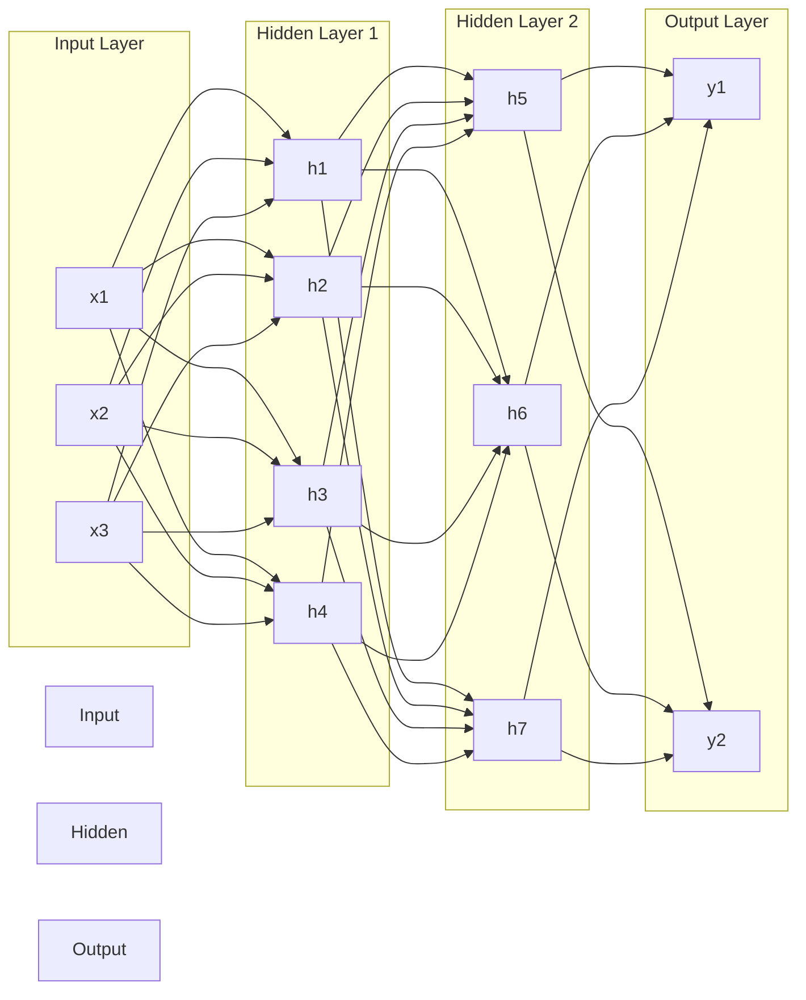
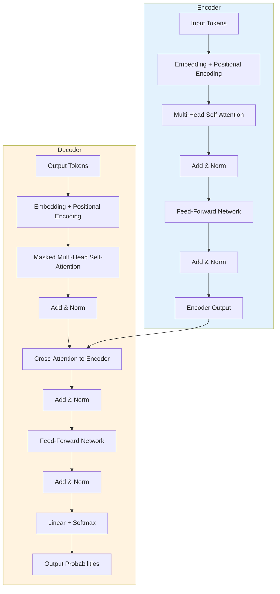

# V11: GPTs, LLMs & Künstliche Intelligenz

> [!NOTE]
> **Lernziele dieser Vorlesung**:
> - Die Geschichte der KI von regelbasierten Systemen bis zu modernen neuronalen Netzen verstehen
> - Den Unterschied zwischen Machine Learning und Deep Learning erklären können
> - Die Architektur und Funktionsweise von Transformer-Modellen nachvollziehen
> - Large Language Models (LLMs) wie GPT, BERT und LLaMA einordnen können
> - Anwendungsbereiche und Grenzen von LLMs kritisch bewerten
> - Fortgeschrittene Python-Funktionskonzepte (`*args`, `**kwargs`, Lambda-Funktionen) beherrschen
> - Keyword Arguments effektiv einsetzen und Type Hints verwenden
> - Docstrings zur Funktionsdokumentation schreiben

---

## Teil 1: Theorie - GPTs, LLMs & Künstliche Intelligenz

### Überblick

Künstliche Intelligenz (KI) ist heute allgegenwärtig. Von Sprachassistenten über Bilderkennungssysteme bis hin zu Code-Generatoren – KI-Systeme durchdringen immer mehr Bereiche unseres Alltags. Diese Vorlesung beleuchtet die technischen Grundlagen moderner KI-Systeme, mit besonderem Fokus auf **Large Language Models** (LLMs) wie GPT, die durch ihre Fähigkeit zur natürlichen Sprachverarbeitung beeindrucken. Wir betrachten dabei nicht nur die Technik, sondern auch die Herausforderungen wie **Halluzinationen** und **Bias**, die mit diesen Systemen einhergehen.

> [!NOTE]
> **Künstliche Intelligenz (KI)** bezeichnet Systeme, die in der Lage sind, Aufgaben auszuführen, für die typischerweise menschliche Intelligenz erforderlich ist. Dazu gehören Lernen, Problemlösung, Spracherkennung, Mustererkennung und Entscheidungsfindung.

### Geschichte der Künstlichen Intelligenz

Die Entwicklung der KI lässt sich in mehrere Phasen einteilen, die jeweils von unterschiedlichen Paradigmen geprägt wurden.

#### Symbolische KI und regelbasierte Systeme (1950er–1980er)

Die frühe KI-Forschung basierte auf dem **symbolischen Ansatz**. Forscher glaubten, dass Intelligenz durch die Manipulation von Symbolen und logischen Regeln dargestellt werden könne. **Expertensysteme** wie MYCIN (medizinische Diagnose) oder DENDRAL (chemische Strukturanalyse) verkörperten diesen Ansatz. Diese Systeme basierten auf explizit programmierten Regeln der Form „Wenn Bedingung X, dann Aktion Y".

> [!NOTE]
> **Expertensysteme** sind regelbasierte KI-Programme, die menschliches Expertenwissen in Form von If-Then-Regeln kodieren. Sie waren in den 1970er und 1980er Jahren der Stand der Technik, scheiterten jedoch an der Komplexität realer Probleme und der Schwierigkeit, implizites Wissen zu formalisieren.

**Grenzen der symbolischen KI**: Regelbasierte Systeme stoßen schnell an ihre Grenzen, wenn Probleme zu komplex werden oder implizites Wissen erforderlich ist. Sprache, visuelle Wahrnehmung und Mustererkennung lassen sich kaum durch explizite Regeln beschreiben. Zudem war die manuelle Wissensakquise extrem aufwendig.

#### Der Aufstieg des Machine Learning (1990er–2010er)

Mit wachsender Rechenleistung und zunehmender Datenverfügbarkeit gewannen **datengetriebene Ansätze** an Bedeutung. Anstatt Regeln manuell zu programmieren, sollten Systeme aus Daten lernen. **Machine Learning (ML)** wurde zum dominierenden Paradigma.

> [!NOTE]
> **Machine Learning** bezeichnet Algorithmen, die aus Daten lernen und sich durch Erfahrung verbessern, ohne explizit für jede Aufgabe programmiert zu werden. Zentrale Verfahren sind überwachtes Lernen (Supervised Learning), unüberwachtes Lernen (Unsupervised Learning) und verstärkendes Lernen (Reinforcement Learning).

Klassische ML-Algorithmen wie **Entscheidungsbäume**, **Support Vector Machines (SVMs)** und **Random Forests** wurden erfolgreich für Klassifikations- und Regressionsaufgaben eingesetzt. Diese Verfahren erforderten jedoch **Feature Engineering** – die manuelle Extraktion relevanter Merkmale aus Rohdaten, was domänenspezifisches Wissen und viel Aufwand benötigte.

#### Die Deep-Learning-Revolution (2010er–heute)

Die Verfügbarkeit massiver Datensätze (z.B. ImageNet mit Millionen gelabelter Bilder), spezialisierter Hardware (GPUs, TPUs) und verbesserter Algorithmen führten zum Durchbruch des **Deep Learning**. Tiefe neuronale Netze lernten, relevante Merkmale automatisch aus Rohdaten zu extrahieren, was manuelles Feature Engineering überflüssig machte.

> [!NOTE]
> **Deep Learning** bezeichnet eine Unterklasse des Machine Learning, die auf künstlichen neuronalen Netzen mit vielen Schichten (Layern) basiert. Diese Netze können hierarchische Repräsentationen von Daten lernen – von einfachen Merkmalen in frühen Schichten bis zu komplexen Abstraktionen in tiefen Schichten.

Meilensteine:
- **2012**: AlexNet gewinnt ImageNet-Wettbewerb und zeigt die Überlegenheit tiefer CNNs (Convolutional Neural Networks) für Bildklassifikation
- **2014**: Generative Adversarial Networks (GANs) ermöglichen realistische Bild- und Videoerzeugung
- **2017**: Das Transformer-Modell revolutioniert Sprachverarbeitung
- **2018**: BERT setzt neue Maßstäbe im Natural Language Understanding
- **2020**: GPT-3 demonstriert beeindruckende Fähigkeiten zur Textgenerierung mit 175 Milliarden Parametern
- **2022/2023**: ChatGPT und GPT-4 bringen LLMs ins Bewusstsein der breiten Öffentlichkeit

### Machine Learning vs. Deep Learning

Obwohl Deep Learning eine Teilmenge von Machine Learning ist, unterscheiden sich beide Ansätze in mehreren Aspekten.

| Aspekt | Machine Learning (klassisch) | Deep Learning |
|--------|------------------------------|---------------|
| **Feature Engineering** | Manuelle Extraktion relevanter Merkmale erforderlich | Automatisches Lernen von Features aus Rohdaten |
| **Datenmenge** | Funktioniert mit kleineren Datensätzen (Tausende Beispiele) | Benötigt große Datensätze (Millionen bis Milliarden Beispiele) |
| **Rechenleistung** | Läuft auf Standard-CPUs | Erfordert spezialisierte Hardware (GPUs, TPUs) |
| **Interpretierbarkeit** | Oft besser interpretierbar (z.B. Entscheidungsbäume) | Meist "Black Box" – schwer zu interpretieren |
| **Trainingszeit** | Schnelleres Training | Langes Training (Stunden bis Wochen) |
| **Performanz bei komplexen Daten** | Begrenzt bei hochdimensionalen Daten (Bilder, Text, Audio) | Übertrifft klassische Methoden bei komplexen Daten |

> [!TIP]
> **Wann welcher Ansatz?**
> - Klassisches ML: Strukturierte Tabellendaten, kleine Datensätze, Interpretierbarkeit wichtig, schnelle Iteration erforderlich
> - Deep Learning: Unstrukturierte Daten (Bilder, Text, Audio), sehr große Datensätze, höchste Performanz erforderlich

### Neuronale Netze: Grundkonzepte und Architektur

Neuronale Netze sind vom menschlichen Gehirn inspirierte Rechenmodelle. Sie bestehen aus miteinander verbundenen **Neuronen**, die in **Schichten** (Layers) organisiert sind.

#### Aufbau eines künstlichen Neurons

Ein künstliches Neuron verarbeitet mehrere Eingaben (inputs) und erzeugt eine Ausgabe (output):

1. **Gewichtete Summe**: Jede Eingabe $x_i$ wird mit einem Gewicht $w_i$ multipliziert und aufsummiert: $z = \sum_{i=1}^{n} w_i \cdot x_i + b$ (wobei $b$ der Bias-Term ist)
2. **Aktivierungsfunktion**: Die gewichtete Summe wird durch eine nicht-lineare Funktion $f$ transformiert: $a = f(z)$
3. **Ausgabe**: Das Ergebnis $a$ wird an nachfolgende Neuronen weitergegeben

> [!NOTE]
> **Aktivierungsfunktionen** führen Nicht-Linearität in neuronale Netze ein und ermöglichen es ihnen, komplexe Zusammenhänge zu lernen. Häufig verwendete Funktionen sind:
> - **ReLU** (Rectified Linear Unit): $f(x) = \max(0, x)$ – Standard in modernen Netzen
> - **Sigmoid**: $f(x) = \frac{1}{1 + e^{-x}}$ – Ausgabe zwischen 0 und 1
> - **Tanh**: $f(x) = \tanh(x)$ – Ausgabe zwischen -1 und 1

#### Netzwerk-Architektur

Ein vollständiges neuronales Netz besteht aus mehreren Schichten:



- **Input Layer (Eingabeschicht)**: Nimmt Rohdaten auf (z.B. Pixelwerte eines Bildes)
- **Hidden Layers (versteckte Schichten)**: Extrahieren hierarchische Features – je tiefer, desto abstrakter
- **Output Layer (Ausgabeschicht)**: Erzeugt finale Vorhersage (z.B. Klassenprobabilitäten)

#### Training neuronaler Netze: Backpropagation

Das Training erfolgt durch **Backpropagation** in Kombination mit **Gradientenabstieg**:

1. **Forward Pass**: Eingabe durch Netz propagieren und Vorhersage berechnen
2. **Loss berechnen**: Abweichung zwischen Vorhersage und tatsächlichem Wert messen (z.B. Mean Squared Error, Cross-Entropy)
3. **Backward Pass**: Gradienten des Loss bzgl. aller Gewichte berechnen (Kettenregel der Differentialrechnung)
4. **Gewichte aktualisieren**: Gewichte in Richtung des steilsten Abstiegs anpassen: $w_{neu} = w_{alt} - \eta \cdot \frac{\partial L}{\partial w}$ (wobei $\eta$ die Lernrate ist)

Dieser Prozess wird für viele **Epochen** (vollständige Durchläufe durch den Trainingsdatensatz) wiederholt, bis das Netz konvergiert.

> [!WARNING]
> **Overfitting**: Neuronale Netze können Trainingsdaten "auswendig lernen", anstatt zu generalisieren. Gegenmaßnahmen: Dropout, Regularisierung, Early Stopping, Datenaugmentation.

### Transformer-Modelle und Attention-Mechanismus

Bis 2017 dominierten **Recurrent Neural Networks (RNNs)** und **LSTMs** die Sprachverarbeitung. Diese Architekturen verarbeiten Sequenzen schrittweise, was zu Problemen führte:
- **Langfristige Abhängigkeiten**: Informationen aus weit zurückliegenden Tokens gehen verloren
- **Sequenzielle Verarbeitung**: Kein Parallelisierung möglich – Training sehr langsam

Das **Transformer-Modell** (Vaswani et al., 2017, "Attention is All You Need") löste diese Probleme durch den **Self-Attention-Mechanismus**.

#### Self-Attention: Die Kernidee

Self-Attention ermöglicht es jedem Token (Wort/Sub-Wort) in einer Sequenz, Informationen von allen anderen Tokens gleichzeitig zu beziehen. Dadurch kann das Modell relevante Kontextinformationen unabhängig von der Position extrahieren.

**Intuitive Erklärung**: Bei der Verarbeitung des Satzes "Die Bank war voll" muss das Modell entscheiden, ob "Bank" ein Geldinstitut oder eine Sitzgelegenheit ist. Self-Attention erlaubt dem Modell, das Wort "voll" stärker zu gewichten, wenn es "Bank" interpretiert – "voll" deutet auf Sitzgelegenheit hin.

**Mathematischer Mechanismus**:

Für jedes Token werden drei Vektoren berechnet:
- **Query (Q)**: "Was suche ich?"
- **Key (K)**: "Was biete ich an?"
- **Value (V)**: "Was ist meine Information?"

Die Attention-Gewichte werden durch Vergleich von Query und Key ermittelt:

$$
\text{Attention}(Q, K, V) = \text{softmax}\left(\frac{QK^T}{\sqrt{d_k}}\right)V
$$

Dabei ist $d_k$ die Dimension des Key-Vektors (Skalierung für Stabilität).

> [!NOTE]
> **Multi-Head Attention**: Transformer verwenden nicht nur eine, sondern mehrere Attention-"Köpfe" parallel. Jeder Kopf kann sich auf verschiedene Aspekte konzentrieren (z.B. Syntax, Semantik, Koreferenzen). Die Ausgaben werden konkateniert und linear transformiert.

#### Transformer-Architektur im Überblick



**Encoder**: Verarbeitet Eingabesequenz und erzeugt kontextualisierte Repräsentationen
**Decoder**: Generiert Ausgabesequenz Token für Token, mit Zugriff auf Encoder-Repräsentationen
**Residual Connections & Layer Normalization**: Verbessern Trainierbarkeit tiefer Netze

**Vorteile von Transformern**:
- Parallele Verarbeitung aller Tokens → schnelles Training
- Langreichweitige Abhängigkeiten werden gut erfasst
- Skalierbar: Leistung steigt mit Modellgröße und Datenmengen

### Large Language Models (LLMs): GPT, BERT, LLaMA

Transformer-Modelle bilden die Grundlage moderner LLMs. Durch Training auf riesigen Textkorpora lernen diese Modelle umfangreiches Weltwissen und Sprachverständnis.

#### GPT (Generative Pre-trained Transformer)

**GPT-Familie** (OpenAI):
- **GPT-1** (2018): 117 Millionen Parameter
- **GPT-2** (2019): 1,5 Milliarden Parameter – beeindruckende Textgenerierung
- **GPT-3** (2020): 175 Milliarden Parameter – Few-Shot Learning ohne Finetuning
- **GPT-4** (2023): Multimodal (Text + Bilder), verbesserte Reasoning-Fähigkeiten

**Architektur**: GPT ist ein **Decoder-only Transformer**, trainiert mit **Causal Language Modeling** – das Modell lernt, das nächste Token vorherzusagen, basierend auf allen vorherigen Tokens. Dies ermöglicht natürliche Textgenerierung.

**Training**: Zweistufig:
1. **Pre-Training**: Auf Milliarden von Tokens aus dem Internet (Web-Crawls, Bücher, Wikipedia) – unüberwacht
2. **Fine-Tuning** (optional): Auf aufgabenspezifischen Datensätzen für bestimmte Anwendungen

**Besonderheit**: GPT-3/4 zeigen **Emergent Abilities** – Fähigkeiten, die bei kleineren Modellen nicht vorhanden sind, aber bei sehr großen Modellen spontan auftreten (z.B. arithmetische Reasoning, Code-Generierung).

> [!NOTE]
> **Autoregressive Generierung**: GPT generiert Text Token für Token. Jedes generierte Token wird zur Eingabe hinzugefügt, und das Modell generiert das nächste Token. Dieser Prozess läuft, bis ein Stop-Token erreicht wird oder eine maximale Länge überschritten ist.

#### BERT (Bidirectional Encoder Representations from Transformers)

**BERT** (Google, 2018) verfolgt einen anderen Ansatz als GPT:

**Architektur**: **Encoder-only Transformer**, trainiert mit **Masked Language Modeling (MLM)** – 15% der Tokens werden maskiert, und das Modell lernt, sie aus dem beidirektigen Kontext vorherzusagen.

**Vorteil**: BERT verarbeitet Text bidirektional und eignet sich daher besser für Aufgaben, bei denen das Verständnis des gesamten Kontexts wichtig ist:
- Sentiment-Analyse
- Named Entity Recognition (NER)
- Question Answering
- Text-Klassifikation

**Nachteile**: BERT ist nicht für Textgenerierung optimiert (da es nicht autoregressiv trainiert wurde).

#### LLaMA (Large Language Model Meta AI)

**LLaMA** (Meta, 2023) ist eine Familie Open-Source-LLMs, entwickelt mit Fokus auf Effizienz:
- Modellgrößen: 7B, 13B, 30B, 65B Parameter
- Trainiert auf öffentlich verfügbaren Daten (keine proprietären Datensätze)
- Deutlich effizienter als GPT-3 bei ähnlicher Leistung

**Bedeutung**: LLaMA ermöglicht akademischer Forschung und Open-Source-Community Zugang zu State-of-the-Art-Modellen. Abgeleitete Modelle wie **Alpaca**, **Vicuna** und **Llama 2** treiben Innovation voran.

### Training und Fine-Tuning von KI-Modellen

#### Pre-Training: Lernen aus Rohdaten

Moderne LLMs werden zunächst auf riesigen, unlabeled Textkorpora trainiert. Dieses **unsupervised Learning** ermöglicht dem Modell, Sprachmuster, Grammatik, Weltwissen und Reasoning-Fähigkeiten zu erlernen.

**Datensätze**:
- **Common Crawl**: Milliarden von Webseiten
- **Wikipedia**: Enzyklopädisches Wissen
- **Bücher-Korpora**: BooksCorpus, Project Gutenberg
- **Code-Repositories**: GitHub für Code-Verständnis

**Rechenaufwand**: Das Training von GPT-3 kostete schätzungsweise 4-12 Millionen USD an Rechenzeit. Moderne LLMs benötigen Tausende von GPUs/TPUs und trainieren über Wochen bis Monate.

#### Fine-Tuning: Spezialisierung für Aufgaben

Nach dem Pre-Training kann ein LLM für spezifische Aufgaben fein-justiert werden:

1. **Supervised Fine-Tuning**: Training auf gelabelten Daten (z.B. Frage-Antwort-Paare)
2. **Reinforcement Learning from Human Feedback (RLHF)**: Menschliche Bewerter ranken Modell-Ausgaben; das Modell lernt, bevorzugte Antworten zu generieren
3. **Instruction Tuning**: Training auf Anweisungen in natürlicher Sprache (z.B. "Übersetze X ins Deutsche")

> [!NOTE]
> **RLHF** ist entscheidend für die Erstellung hilfreicher, harmloser und ehrlicher KI-Assistenten. GPT-4 und ChatGPT nutzen intensiv RLHF, um menschliche Präferenzen zu erfüllen und schädliche Ausgaben zu minimieren.

#### Parameter-Effizientes Fine-Tuning

Vollständiges Fine-Tuning großer Modelle ist ressourcenintensiv. Moderne Techniken wie **LoRA** (Low-Rank Adaptation) und **Adapter Layers** ermöglichen das Anpassen von LLMs durch Training nur weniger zusätzlicher Parameter (< 1% der Gesamtparameter), was Fine-Tuning auf Consumer-Hardware ermöglicht.

### Anwendungsbereiche von LLMs

LLMs haben vielfältige praktische Anwendungen, die kontinuierlich wachsen:

#### Textgenerierung und Creative Writing

- **Content Creation**: Blog-Artikel, Marketing-Texte, Social-Media-Posts
- **Storytelling**: Kreative Kurzgeschichten, Drehbücher, Gedichte
- **Email-Drafting**: Automatische Formulierung professioneller E-Mails

#### Übersetzung und Sprachverarbeitung

- **Maschinelle Übersetzung**: Zwischen hunderten Sprachen, oft auf Near-Human-Level
- **Zusammenfassung**: Lange Dokumente auf Kernaussagen reduzieren
- **Paraphrasierung**: Umformulierung für verschiedene Zielgruppen

#### Code-Generierung und Programmier-Assistenz

- **GitHub Copilot**: Autovervollständigung und Code-Vorschläge in IDEs
- **Code-Erklärung**: Dokumentation und Debugging-Hilfe
- **Test-Generierung**: Automatische Unit-Tests für Funktionen
- **Code-Migration**: Übersetzung zwischen Programmiersprachen

#### Wissensmanagement und Recherche

- **Question Answering**: Beantwortung faktischer Fragen aus großen Dokumenten
- **Informationsextraktion**: Strukturierte Daten aus unstrukturiertem Text
- **Dokumenten-Analyse**: Verträge, Berichte, wissenschaftliche Paper

#### Konversations-KI und Virtuelle Assistenten

- **Chatbots**: Kundenservice, technischer Support, persönliche Assistenz
- **Tutoring-Systeme**: Personalisiertes Lernen und Erklärungen
- **Therapie-Unterstützung**: Mentale Gesundheits-Chatbots (experimentell)

> [!TIP]
> **Prompt Engineering** ist entscheidend für effektive LLM-Nutzung. Klare, präzise Anweisungen führen zu besseren Ergebnissen. Die nächste Vorlesung (V12) behandelt Prompt-Engineering-Techniken im Detail.

### Halluzinationen und Bias in LLMs

Trotz beeindruckender Fähigkeiten haben LLMs signifikante Schwächen, die bei ihrer Nutzung berücksichtigt werden müssen.

#### Halluzinationen: Wenn KI "lügt"

LLMs können plausibel klingende, aber faktisch falsche Informationen generieren. Dieses Phänomen wird als **Halluzination** bezeichnet.

> [!NOTE]
> **Halluzinationen** entstehen, weil LLMs auf statistischen Mustern basieren, nicht auf faktischem Wissen. Sie generieren das wahrscheinlichste nächste Token basierend auf ihrem Training, ohne zu "wissen", ob die Aussage wahr ist.

**Beispiele**:
- Erfundene wissenschaftliche Studien mit realistisch klingenden Autorennamen und Journal-Referenzen
- Falsche historische Daten oder Ereignisse
- Nicht-existierende Funktionen in Programmiersprachen oder Bibliotheken
- Falsche mathematische Berechnungen, die logisch klingen

**Ursachen**:
1. **Training auf fehlerhaften Daten**: Das Internet enthält Falschinformationen, die ins Modell einfließen
2. **Fehlende Verifikations-Mechanismen**: LLMs haben keinen Zugang zu externen Wissensdatenbanken (ohne Plugins/Tools)
3. **Overgeneralization**: Das Modell extrapoliert über seinen Trainingsbereich hinaus

**Gegenmaßnahmen**:
- **Retrieval-Augmented Generation (RAG)**: LLMs werden mit Zugang zu externen Datenbanken ausgestattet, um Fakten zu verifizieren
- **Fact-Checking-Tools**: Integration mit Suchmaschinen oder Knowledge Graphs
- **Confidence Scoring**: Modelle geben Unsicherheit explizit an (noch in Forschung)
- **Menschliche Verifikation**: Kritische Aussagen sollten immer geprüft werden

> [!WARNING]
> **Vertraue LLMs nicht blind!** Insbesondere bei faktischen Aussagen, medizinischen Ratschlägen oder rechtlichen Informationen ist Verifikation unerlässlich. LLMs sind kein Ersatz für Fachwissen.

#### Bias: Vorurteile in KI-Systemen

LLMs reflektieren die Vorurteile (Biases) ihrer Trainingsdaten. Da sie auf Texten aus dem Internet trainiert werden, übernehmen sie gesellschaftliche Stereotype und Diskriminierungsmuster.

> [!NOTE]
> **Bias** bezeichnet systematische Verzerrungen in KI-Modellen, die zu unfairen oder diskriminierenden Ausgaben führen. Bias kann entlang vieler Dimensionen auftreten: Geschlecht, Ethnie, Alter, sexuelle Orientierung, sozioökonomischer Status, Nationalität.

**Beispiele dokumentierter Biases**:
- **Geschlechter-Stereotype**: "Der Arzt" wird standardmäßig als männlich dargestellt, "die Krankenschwester" als weiblich
- **Ethnische Vorurteile**: Bestimmte Namen werden mit negativen Attributen assoziiert
- **Berufliche Stereotypen**: CEO wird eher mit männlichen Pronomen verknüpft, Sekretär/in mit weiblichen
- **Kulturelle Zentrierung**: Westliche Perspektiven dominieren, nicht-westliche Kulturen werden unterrepräsentiert

**Ursprünge von Bias**:
1. **Trainingsda

**Trainingsdaten**: Texte aus dem Internet spiegeln historische und aktuelle gesellschaftliche Vorurteile wider
2. **Label-Bias**: Wenn Menschen Daten labeln, fließen ihre eigenen Vorurteile ein
3. **Repräsentations-Ungleichgewicht**: Bestimmte Gruppen sind in Daten überrepräsentiert, andere unterrepräsentiert

**Auswirkungen**:
- **Diskriminierung bei Bewerbungen**: KI-gestützte Recruiting-Tools können bestimmte Gruppen systematisch benachteiligen
- **Unfaire Kreditvergabe**: Bias in Scoring-Modellen kann zu ungerechten Ablehnungen führen
- **Verstärkung von Stereotypen**: LLMs können schädliche Narrative perpetuieren und verstärken

**Gegenmaßnahmen**:
- **Diverse Trainingsdaten**: Bewusste Inklusion unterrepräsentierter Perspektiven
- **Bias Detection Tools**: Automatisierte Tests auf stereotype Assoziationen
- **Debiasing-Techniken**: Nachträgliche Anpassung von Modellen zur Reduzierung spezifischer Biases
- **Red Teaming**: Systematisches Testen auf schädliche Ausgaben durch spezialisierte Teams
- **Transparenz und Dokumentation**: Model Cards und Datasheets offenlegen bekannte Limitationen
- **RLHF mit diversen Annotatoren**: Sicherstellung, dass menschliches Feedback aus vielfältigen Perspektiven stammt

> [!WARNING]
> **Bias ist nie vollständig eliminierbar.** Selbst nach Debiasing-Maßnahmen können subtile Vorurteile bestehen. Kritisches Bewusstsein und kontinuierliche Überwachung sind erforderlich, insbesondere bei hochriskanten Anwendungen (Justiz, Medizin, Finanzen).

### Zukunftsperspektiven der KI-Entwicklung

Die Entwicklung von KI, insbesondere LLMs, schreitet rasant voran. Mehrere Trends zeichnen sich ab:

#### Multimodalität: Über Text hinaus

Künftige Modelle integrieren Text, Bilder, Audio und Video nahtlos. **GPT-4V**, **Google Gemini** und **Meta's ImageBind** demonstrieren bereits multimodale Fähigkeiten. Anwendungen:
- **Visual Question Answering**: Fragen zu Bildern beantworten
- **Video-Zusammenfassung**: Automatische Transkription und Analyse von Videos
- **Cross-Modal Reasoning**: Verbindung von Informationen über Modalitäten hinweg

#### Agentic AI: Von passiven Tools zu aktiven Agenten

LLMs werden zu **autonomen Agenten**, die komplexe Aufgaben selbstständig planen und ausführen können:
- **Tool Use**: Modelle nutzen externe APIs, Datenbanken, Rechner
- **Multi-Step Reasoning**: Zerlegung komplexer Probleme in Teilaufgaben
- **Selbstverbesserung**: Agenten reflektieren über eigene Fehler und passen Strategien an

Beispiele: **AutoGPT**, **BabyAGI**, **LangChain Agents**

#### Effizienz und Zugänglichkeit

Forschung konzentriert sich auf effizientere Modelle:
- **Model Compression**: Quantisierung, Pruning, Knowledge Distillation
- **Sparse Models**: Nur Teile des Netzes werden für spezifische Inputs aktiviert
- **On-Device LLMs**: Modelle klein genug für Smartphones und Edge-Geräte

Ziel: LLMs demokratisieren und Abhängigkeit von Großunternehmen reduzieren.

#### Alignment und Sicherheit

Mit wachsender Leistungsfähigkeit steigen auch Risiken. Forschung adressiert:
- **Value Alignment**: Sicherstellen, dass KI menschliche Werte respektiert
- **Robustheit gegen Adversarial Attacks**: Schutz vor gezielten Manipulationsversuchen
- **Interpretability**: Verstehen, warum Modelle bestimmte Entscheidungen treffen
- **Regulation und Governance**: Politische Rahmenbedingungen für sichere KI-Entwicklung

> [!NOTE]
> **Artificial General Intelligence (AGI)** bezeichnet hypothetische KI-Systeme, die jede intellektuelle Aufgabe auf menschlichem Niveau bewältigen können. Ob und wann AGI erreicht wird, ist umstritten. Schätzungen reichen von "in wenigen Jahren" bis "möglicherweise nie". Die gesellschaftlichen Auswirkungen wären tiefgreifend.

### Zusammenfassung Theorie

Die Entwicklung Künstlicher Intelligenz hat einen weiten Weg von regelbasierten Expertensystemen zu modernen, lernfähigen neuronalen Netzen zurückgelegt. **Deep Learning** und insbesondere **Transformer-Modelle** haben die Sprachverarbeitung revolutioniert und zu beeindruckenden **Large Language Models** wie GPT, BERT und LLaMA geführt. Diese Modelle beherrschen vielfältige Aufgaben von Textgenerierung über Übersetzung bis hin zu Code-Generierung.

Trotz ihrer Fähigkeiten weisen LLMs signifikante Schwächen auf. **Halluzinationen** – das Generieren plausibler, aber falscher Informationen – und **Bias** – die Übernahme gesellschaftlicher Vorurteile – erfordern kritischen Umgang und bewusste Gegenmaßnahmen. Die Zukunft der KI wird multimodaler, agentischer und hoffentlich sicherer, während gleichzeitig Fragen der Ethik, Regulierung und gesellschaftlichen Auswirkungen intensiv diskutiert werden müssen.

Das Verständnis dieser technischen Grundlagen ist essenziell für Ingenieure und Informatiker, die in einer zunehmend KI-durchdrungenen Welt arbeiten. Die nächste Vorlesung (V12: Prompt Engineering) wird praktische Techniken vermitteln, um LLMs effektiv zu nutzen.

---

## Teil 2: Python-Praxis - Methoden/Funktionen – Teil 2

> [!WARNING]
> **Python-Konsistenz beachten**: Prüfe [../../python_topics.md](../../python_topics.md) für bereits eingeführte Konzepte!

### Überblick

In V10 haben wir die Grundlagen von Funktionen kennengelernt: Definition mit `def`, Rückgabewerte mit `return`, positionelle Parameter und Default-Parameter. Diese Vorlesung erweitert unser Funktions-Repertoire um fortgeschrittene Konzepte, die professionellen Python-Code ausmachen: **Keyword Arguments**, **variable Argumentanzahl** mit `*args` und `**kwargs`, **Lambda-Funktionen** für kompakte Ausdrücke und **Type Hints** für bessere Code-Dokumentation. Am Ende werden wir diese Konzepte nutzen, um API-Wrapper-Funktionen für LLM-Aufrufe zu implementieren – eine direkte Verbindung zum Theorie-Teil dieser Vorlesung.

### Keyword Arguments: Explizit und lesbar

Aus V10 wissen wir bereits, dass Funktionen mit Keyword Arguments aufgerufen werden können, um die Reihenfolge der Parameter flexibel zu gestalten. In dieser Vorlesung vertiefen wir dieses Konzept und lernen, wie wir Funktionen designen können, die **ausschließlich** Keyword Arguments akzeptieren.

#### Keyword-Only Arguments

Python erlaubt es, Parameter als **Keyword-Only** zu deklarieren, indem ein `*` in der Parameterliste verwendet wird. Alle Parameter nach dem `*` müssen als Keyword Arguments übergeben werden.

```python
def konfiguriere_server(host, port, *, debug=False, timeout=30, ssl=True):
    """
    Konfiguriert einen Server mit verschiedenen Optionen.
    
    Positionelle Parameter:
        host (str): Server-Adresse
        port (int): Port-Nummer
    
    Keyword-Only Parameter:
        debug (bool): Debug-Modus aktivieren
        timeout (int): Timeout in Sekunden
        ssl (bool): SSL-Verschlüsselung verwenden
    """
    print(f"Server {host}:{port}")
    print(f"Debug: {debug}, Timeout: {timeout}s, SSL: {ssl}")
```

> [!TIP]
> ```python
> # Korrekt: Keyword Arguments verwenden
> konfiguriere_server("localhost", 8080, debug=True, timeout=60)
> 
> # Fehler: Positionelle Argumente nach * nicht erlaubt
> # konfiguriere_server("localhost", 8080, True, 60)
> # TypeError: konfiguriere_server() takes 2 positional arguments but 4 were given
> ```

**Vorteile von Keyword-Only Arguments**:
- **Lesbarkeit**: Beim Aufruf ist sofort klar, welcher Wert zu welchem Parameter gehört
- **API-Stabilität**: Hinzufügen neuer Parameter bricht bestehenden Code nicht
- **Fehlerprävention**: Vermeidung versehentlicher positioneller Übergabe bei vielen Parametern

> [!NOTE]
> **Keyword-Only Arguments** (Python 3.0+) erzwingen explizite Benennung von Parametern beim Funktionsaufruf. Sie werden durch ein `*` in der Parameterliste eingeleitet. Alle Parameter nach dem `*` sind Keyword-Only.

#### Forced Keyword Arguments ohne Positionelle

Wenn eine Funktion **ausschließlich** Keyword Arguments akzeptieren soll, verwenden wir `*` ohne vorherige Parameter:

```python
def erstelle_benutzer(*, benutzername, email, alter=None, rolle="Benutzer"):
    """
    Erstellt einen neuen Benutzer mit rein keyword-basierten Parametern.
    """
    benutzer = {
        "benutzername": benutzername,
        "email": email,
        "alter": alter,
        "rolle": rolle
    }
    return benutzer

# Korrekt
user = erstelle_benutzer(benutzername="alice", email="alice@example.com", alter=30)

# Fehler: Keine positionellen Argumente erlaubt
# user = erstelle_benutzer("alice", "alice@example.com")
# TypeError: erstelle_benutzer() takes 0 positional arguments but 2 were given
```

> [!WARNING]
> **Best Practice**: Verwende Keyword-Only Arguments bei Funktionen mit vielen Parametern oder wenn die Parameterreihenfolge nicht intuitiv ist. Dies verhindert Verwechslungen und macht den Code selbstdokumentierend.

### `*args`: Variable Anzahl positioneller Argumente

Manchmal wissen wir nicht im Voraus, wie viele Argumente eine Funktion erhalten wird. **`*args`** erlaubt es, eine beliebige Anzahl positioneller Argumente zu akzeptieren.

> [!NOTE]
> **`*args`** (Python 1.6+) ermöglicht es einer Funktion, eine variable Anzahl positioneller Argumente zu akzeptieren. Die Argumente werden als **Tupel** in der Variable `args` gesammelt. Der Name `args` ist Konvention; technisch kann jeder Variablenname nach `*` verwendet werden, aber `*args` ist Standard.

```python
def summiere(*zahlen):
    """
    Summiert eine beliebige Anzahl von Zahlen.
    
    Args:
        *zahlen: Variable Anzahl numerischer Werte
    
    Returns:
        float: Summe aller übergebenen Zahlen
    """
    total = 0
    for zahl in zahlen:
        total += zahl
    return total
```

> [!TIP]
> ```python
> # Verschiedene Anzahlen von Argumenten
> print(summiere(1, 2, 3))           # 6
> print(summiere(10, 20))            # 30
> print(summiere(5))                 # 5
> print(summiere())                  # 0
> print(summiere(1, 2, 3, 4, 5, 6))  # 21
> 
> # Mit sum() built-in kompakter:
> def summiere_kompakt(*zahlen):
>     return sum(zahlen)
> ```

#### Kombination von `*args` mit normalen Parametern

`*args` kann mit regulären positionellen Parametern kombiniert werden. Die regulären Parameter müssen vor `*args` stehen.

```python
def formatiere_nachricht(präfix, *nachrichten, suffix="!"):
    """
    Formatiert mehrere Nachrichten mit Präfix und Suffix.
    
    Args:
        präfix (str): Vorangestellter Text
        *nachrichten: Variable Anzahl von Nachrichtentexten
        suffix (str): Angehängter Text (Keyword-Only)
    """
    volle_nachricht = präfix + " "
    volle_nachricht += " ".join(nachrichten)
    volle_nachricht += suffix
    return volle_nachricht
```

> [!TIP]
> ```python
> print(formatiere_nachricht("INFO:", "Server gestartet"))
> # INFO: Server gestartet!
> 
> print(formatiere_nachricht("ERROR:", "Verbindung", "fehlgeschlagen", suffix="!!!"))
> # ERROR: Verbindung fehlgeschlagen!!!
> 
> print(formatiere_nachricht("DEBUG:", "Wert1", "Wert2", "Wert3"))
> # DEBUG: Wert1 Wert2 Wert3!
> ```

#### Unpacking mit `*` beim Funktionsaufruf

Der `*`-Operator kann auch beim **Funktionsaufruf** verwendet werden, um eine Liste/Tupel in einzelne Argumente zu "entpacken":

```python
zahlen_liste = [10, 20, 30, 40]

# Ohne Unpacking: Liste wird als ein Argument übergeben
# print(summiere(zahlen_liste))  # Fehler: kann Liste nicht zu int addieren

# Mit Unpacking: Liste wird in einzelne Argumente entpackt
print(summiere(*zahlen_liste))  # 100
# Entspricht: summiere(10, 20, 30, 40)
```

> [!NOTE]
> **Unpacking-Operator `*`** entpackt Sequenzen (Listen, Tupel, Sets) in einzelne positionelle Argumente beim Funktionsaufruf. Dies ist das Gegenstück zu `*args` in der Funktionsdefinition.

### `**kwargs`: Variable Anzahl benannter Argumente

Während `*args` positionelle Argumente sammelt, erfasst **`**kwargs`** (keyword arguments) eine beliebige Anzahl **benannter** Argumente.

> [!NOTE]
> **`**kwargs`** (Python 1.6+) ermöglicht es einer Funktion, eine variable Anzahl benannter (Keyword) Argumente zu akzeptieren. Die Argumente werden als **Dictionary** in der Variable `kwargs` gesammelt. Der Name `kwargs` ist Konvention; technisch kann jeder Variablenname nach `**` verwendet werden.

```python
def erstelle_profil(name, **eigenschaften):
    """
    Erstellt ein Benutzerprofil mit flexiblen Eigenschaften.
    
    Args:
        name (str): Name des Benutzers (erforderlich)
        **eigenschaften: Beliebige zusätzliche Eigenschaften als Key-Value-Paare
    
    Returns:
        dict: Vollständiges Benutzerprofil
    """
    profil = {"name": name}
    profil.update(eigenschaften)
    return profil
```

> [!TIP]
> ```python
> # Verschiedene Eigenschaften pro Aufruf
> user1 = erstelle_profil("Alice", alter=30, stadt="Berlin", beruf="Ingenieur")
> print(user1)
> # {'name': 'Alice', 'alter': 30, 'stadt': 'Berlin', 'beruf': 'Ingenieur'}
> 
> user2 = erstelle_profil("Bob", email="bob@example.com", hobbies=["Lesen", "Sport"])
> print(user2)
> # {'name': 'Bob', 'email': 'bob@example.com', 'hobbies': ['Lesen', 'Sport']}
> 
> user3 = erstelle_profil("Charlie")
> print(user3)
> # {'name': 'Charlie'}
> ```

#### Kombination von `*args` und `**kwargs`

Eine Funktion kann sowohl `*args` als auch `**kwargs` verwenden. Die Reihenfolge der Parameter ist wichtig:

1. Reguläre positionelle Parameter
2. `*args`
3. Keyword-Only Parameter (optional)
4. `**kwargs`

```python
def flexible_funktion(erforderlich, *args, standard=10, **kwargs):
    """
    Demonstriert Kombination aller Parametertypen.
    
    Args:
        erforderlich: Erforderlicher positioneller Parameter
        *args: Variable positionelle Argumente
        standard: Keyword-Only Parameter mit Default
        **kwargs: Variable Keyword Arguments
    """
    print(f"Erforderlich: {erforderlich}")
    print(f"Args: {args}")
    print(f"Standard: {standard}")
    print(f"Kwargs: {kwargs}")
```

> [!TIP]
> ```python
> flexible_funktion(1, 2, 3, 4, standard=20, extra="test", weitere=True)
> # Erforderlich: 1
> # Args: (2, 3, 4)
> # Standard: 20
> # Kwargs: {'extra': 'test', 'weitere': True}
> ```

#### Unpacking mit `**` beim Funktionsaufruf

Analog zu `*` kann `**` verwendet werden, um ein Dictionary in Keyword Arguments zu entpacken:

```python
def drucke_adresse(strasse, hausnummer, plz, stadt):
    print(f"{strasse} {hausnummer}, {plz} {stadt}")

adresse_dict = {
    "strasse": "Hauptstraße",
    "hausnummer": 42,
    "plz": 10115,
    "stadt": "Berlin"
}

# Dictionary-Keys müssen mit Parameternamen übereinstimmen
drucke_adresse(**adresse_dict)
# Hauptstraße 42, 10115 Berlin
```

> [!NOTE]
> **Unpacking-Operator `**`** entpackt Dictionaries in Keyword Arguments beim Funktionsaufruf. Die Dictionary-Keys müssen exakt den Parameternamen entsprechen.

### Lambda-Funktionen: Anonyme Einzeiler

**Lambda-Funktionen** sind kleine, anonyme Funktionen, die in einer einzigen Zeile definiert werden. Sie eignen sich für einfache Operationen, die als Argument an andere Funktionen übergeben werden.

> [!NOTE]
> **Lambda-Funktionen** (Python 1.0+) sind anonyme Funktionen mit eingeschränkter Syntax. Sie können nur einen einzigen Ausdruck enthalten (keine Statements wie `if`, Schleifen oder `return`). Die Syntax lautet: `lambda parameter1, parameter2, ...: ausdruck`

```python
# Normale Funktion
def quadrat(x):
    return x ** 2

# Äquivalente Lambda-Funktion
quadrat_lambda = lambda x: x ** 2

print(quadrat(5))         # 25
print(quadrat_lambda(5))  # 25
```

#### Verwendung von Lambdas mit `sorted()`, `map()`, `filter()`

Lambdas sind besonders nützlich als `key`-Funktion für Sortierung oder bei funktionaler Programmierung:

```python
# Sortierung nach String-Länge
woerter = ["Apfel", "Banane", "Kirsche", "Dattel"]
sortiert = sorted(woerter, key=lambda wort: len(wort))
print(sortiert)
# ['Apfel', 'Dattel', Banane', 'Kirsche']

# Sortierung von Tupeln nach zweitem Element
punkte = [(1, 5), (3, 2), (2, 8), (4, 1)]
sortiert = sorted(punkte, key=lambda punkt: punkt[1])
print(sortiert)
# [(4, 1), (3, 2), (1, 5), (2, 8)]

# Dictionaries nach Wert sortieren
scores = {"Alice": 85, "Bob": 92, "Charlie": 78, "Diana": 95}
sortiert = sorted(scores.items(), key=lambda item: item[1], reverse=True)
print(sortiert)
# [('Diana', 95), ('Bob', 92), ('Alice', 85), ('Charlie', 78)]
```

> [!NOTE]
> **`map(funktion, iterable)`** (Built-in, Python 1.0+) wendet eine Funktion auf jedes Element eines Iterables an und gibt einen Iterator zurück. Rückgabewert: `map`-Objekt (lazy evaluation).

> [!NOTE]
> **`filter(funktion, iterable)`** (Built-in, Python 1.0+) filtert Elemente eines Iterables basierend auf einer Bedingungsfunktion (muss `True`/`False` zurückgeben). Rückgabewert: `filter`-Objekt (lazy evaluation).

```python
# map(): Jeden Wert verdoppeln
zahlen = [1, 2, 3, 4, 5]
verdoppelt = list(map(lambda x: x * 2, zahlen))
print(verdoppelt)
# [2, 4, 6, 8, 10]

# filter(): Nur gerade Zahlen behalten
gerade = list(filter(lambda x: x % 2 == 0, zahlen))
print(gerade)
# [2, 4]

# Kombination: Gerade Zahlen verdoppeln
ergebnis = list(map(lambda x: x * 2, filter(lambda x: x % 2 == 0, zahlen)))
print(ergebnis)
# [4, 8]
```

> [!WARNING]
> **Lesbarkeit vor Kürze**: Lambda-Funktionen sollten einfach bleiben. Bei komplexer Logik ist eine benannte Funktion mit `def` lesbarer und wartbarer. List Comprehensions sind oft klarer als `map()`/`filter()`.
> ```python
> # Weniger lesbar (verschachtelte Lambdas)
> result = list(map(lambda x: x * 2, filter(lambda x: x % 2 == 0, zahlen)))
> 
> # Besser lesbar (List Comprehension)
> result = [x * 2 for x in zahlen if x % 2 == 0]
> ```

### Docstrings: Funktionen dokumentieren

**Docstrings** (Documentation Strings) sind Triple-Quote-Strings direkt nach der Funktionsdefinition, die die Funktion dokumentieren. Sie sind für professionellen, wartbaren Code unerlässlich.

> [!NOTE]
> **Docstrings** (Python 1.0+) dokumentieren Funktionen, Klassen und Module. Sie werden in Triple Quotes (`"""..."""` oder `'''...'''`) geschrieben und sind über das `__doc__`-Attribut oder die `help()`-Funktion abrufbar. PEP 257 definiert Konventionen für Docstrings.

#### Docstring-Formate

Es gibt verschiedene Konventionen für Docstrings. Gängige Formate sind:

**Google Style** (empfohlen für Einfachheit):

```python
def berechne_flaeche(laenge, breite):
    """
    Berechnet die Fläche eines Rechtecks.
    
    Args:
        laenge (float): Länge des Rechtecks in Metern
        breite (float): Breite des Rechtecks in Metern
    
    Returns:
        float: Fläche des Rechtecks in Quadratmetern
    
    Raises:
        ValueError: Wenn laenge oder breite negativ sind
    
    Examples:
        >>> berechne_flaeche(5.0, 3.0)
        15.0
        >>> berechne_flaeche(10.5, 2.5)
        26.25
    """
    if laenge < 0 or breite < 0:
        raise ValueError("Länge und Breite müssen positiv sein")
    return laenge * breite
```

**NumPy/SciPy Style** (detaillierter, für wissenschaftliche Bibliotheken):

```python
def berechne_flaeche(laenge, breite):
    """
    Berechnet die Fläche eines Rechtecks.
    
    Parameters
    ----------
    laenge : float
        Länge des Rechtecks in Metern
    breite : float
        Breite des Rechtecks in Metern
    
    Returns
    -------
    float
        Fläche des Rechtecks in Quadratmetern
    
    Raises
    ------
    ValueError
        Wenn laenge oder breite negativ sind
    
    See Also
    --------
    berechne_umfang : Berechnet den Umfang eines Rechtecks
    
    Examples
    --------
    >>> berechne_flaeche(5.0, 3.0)
    15.0
    """
    if laenge < 0 or breite < 0:
        raise ValueError("Länge und Breite müssen positiv sein")
    return laenge * breite
```

#### Docstrings nutzen

Docstrings sind über `help()` oder `.__doc__` zugänglich:

```python
help(berechne_flaeche)
# Zeigt formatierten Docstring an

print(berechne_flaeche.__doc__)
# Gibt Raw-Docstring aus
```

> [!TIP]
> **Best Practices für Docstrings**:
> - Erste Zeile: Knappe Zusammenfassung (< 80 Zeichen)
> - Leerzeile nach erster Zeile
> - Ausführliche Beschreibung folgt
> - Dokumentiere alle Parameter, Rückgabewerte und Exceptions
> - Füge Beispiele hinzu (`Examples`-Sektion)
> - Verwende einen konsistenten Stil im gesamten Projekt

### Type Hints: Optionale Typ-Annotationen

**Type Hints** (auch Type Annotations genannt) ermöglichen es, Typen von Parametern und Rückgabewerten zu deklarieren. Sie sind **optional** und werden zur Laufzeit nicht durchgesetzt, verbessern aber Code-Dokumentation und ermöglichen statische Typ-Checks mit Tools wie `mypy`.

> [!NOTE]
> **Type Hints** (Python 3.5+, PEP 484) sind Typ-Annotationen für Funktionsparameter und Rückgabewerte. Sie haben keine Auswirkung auf die Laufzeit, sondern dienen der Dokumentation und statischen Analyse. Syntax: `parameter: typ` und `-> rückgabetyp`.

```python
def addiere(a: int, b: int) -> int:
    """
    Addiert zwei Ganzzahlen.
    
    Args:
        a: Erste Zahl
        b: Zweite Zahl
    
    Returns:
        Summe von a und b
    """
    return a + b

def begruesse(name: str, formell: bool = False) -> str:
    """
    Erzeugt eine Begrüßung.
    
    Args:
        name: Name der Person
        formell: Ob formelle Anrede verwendet werden soll
    
    Returns:
        Begrüßungs-String
    """
    if formell:
        return f"Guten Tag, {name}."
    return f"Hallo, {name}!"
```

#### Fortgeschrittene Type Hints

Das `typing`-Modul bietet erweiterte Type Hints für komplexe Typen:

> [!NOTE]
> **`typing`-Modul** (Python 3.5+) stellt erweiterte Type-Hint-Typen bereit: `List`, `Dict`, `Tuple`, `Optional`, `Union`, `Callable`, `Any` und viele mehr. Ab Python 3.9 können built-in-Typen (`list`, `dict`) direkt für Type Hints verwendet werden.

```python
from typing import List, Dict, Tuple, Optional, Union, Callable

def verarbeite_zahlen(zahlen: List[int]) -> int:
    """Berechnet Summe einer Liste von Integers."""
    return sum(zahlen)

def erstelle_mapping(schluessel: List[str], werte: List[int]) -> Dict[str, int]:
    """Erstellt Dictionary aus zwei Listen."""
    return dict(zip(schluessel, werte))

def finde_element(liste: List[int], wert: int) -> Optional[int]:
    """
    Findet Index eines Elements.
    
    Returns:
        Index oder None wenn nicht gefunden
    """
    try:
        return liste.index(wert)
    except ValueError:
        return None

def konvertiere(wert: Union[int, float, str]) -> float:
    """Konvertiert verschiedene Typen zu float."""
    return float(wert)

def wende_an(funktion: Callable[[int], int], wert: int) -> int:
    """Wendet eine Funktion auf einen Wert an."""
    return funktion(wert)
```

**Moderne Syntax (Python 3.9+)**:

Ab Python 3.9 können built-in-Typen direkt verwendet werden:

```python
# Python 3.9+
def verarbeite_zahlen(zahlen: list[int]) -> int:
    return sum(zahlen)

def erstelle_mapping(schluessel: list[str], werte: list[int]) -> dict[str, int]:
    return dict(zip(schluessel, werte))

# Optional mit | statt Union (Python 3.10+)
def finde_element(liste: list[int], wert: int) -> int | None:
    try:
        return liste.index(wert)
    except ValueError:
        return None
```

> [!WARNING]
> **Type Hints sind optional**: Python erzwingt Type Hints nicht. Sie dienen nur der Dokumentation und können mit Tools wie `mypy` für statische Typ-Checks genutzt werden. Falsche Type Hints führen zu keinem Laufzeitfehler, können aber irreführend sein.

### Praktische Anwendung: API-Wrapper für LLM-Aufrufe

Nun kombinieren wir die gelernten Konzepte, um eine flexible Wrapper-Funktion für LLM-API-Aufrufe zu implementieren. Dies demonstriert die praktische Relevanz von `**kwargs`, Docstrings und Type Hints in einem realen Anwendungsfall.

```python
from typing import Optional

def llm_anfrage(
    prompt: str,
    *,  # Alle folgenden Parameter sind Keyword-Only
    modell: str = "gpt-3.5-turbo",
    temperatur: float = 0.7,
    max_tokens: Optional[int] = None,
    **weitere_parameter
) -> dict:
    """
    Sendet eine Anfrage an ein Large Language Model (API-Wrapper).
    
    Diese Funktion abstrahiert API-Aufrufe an verschiedene LLM-Provider
    und bietet eine einheitliche Schnittstelle mit flexiblen Parametern.
    
    Args:
        prompt: Der Eingabetext/Prompt für das LLM
        modell: Name des zu verwendenden Modells (z.B. "gpt-4", "claude-2")
        temperatur: Kreativität der Antwort (0.0 = deterministisch, 2.0 = sehr kreativ)
        max_tokens: Maximale Länge der Antwort in Tokens (None = Modell-Default)
        **weitere_parameter: Zusätzliche API-spezifische Parameter
            (z.B. top_p, frequency_penalty, presence_penalty, stop, etc.)
    
    Returns:
        Dictionary mit Response-Daten:
            - "text": Generierter Text
            - "model": Verwendetes Modell
            - "tokens": Anzahl verwendeter Tokens
            - "finish_reason": Grund für Abbruch
    
    Raises:
        ValueError: Bei ungültigen Parameterwerten
        ConnectionError: Bei API-Verbindungsproblemen
    
    Examples:
        >>> # Einfache Anfrage
        >>> response = llm_anfrage("Erkläre neuronale Netze in einem Satz")
        
        >>> # Mit spezifischen Parametern
        >>> response = llm_anfrage(
        ...     "Schreibe ein Gedicht",
        ...     modell="gpt-4",
        ...     temperatur=1.2,
        ...     max_tokens=100
        ... )
        
        >>> # Mit API-spezifischen Parametern
        >>> response = llm_anfrage(
        ...     prompt="Code-Beispiel für Quicksort",
        ...     modell="gpt-3.5-turbo",
        ...     temperatur=0.2,
        ...     top_p=0.9,
        ...     frequency_penalty=0.5
        ... )
    """
    # Validierung
    if not prompt.strip():
        raise ValueError("Prompt darf nicht leer sein")
    
    if not (0.0 <= temperatur <= 2.0):
        raise ValueError("Temperatur muss zwischen 0.0 und 2.0 liegen")
    
    if max_tokens is not None and max_tokens <= 0:
        raise ValueError("max_tokens muss positiv sein")
    
    # API-Request-Parameter zusammenstellen
    request_params = {
        "model": modell,
        "prompt": prompt,
        "temperature": temperatur,
    }
    
    if max_tokens is not None:
        request_params["max_tokens"] = max_tokens
    
    # Zusätzliche Parameter hinzufügen
    request_params.update(weitere_parameter)
    
    # Hier würde der eigentliche API-Call erfolgen
    # Für Demo-Zwecke simulieren wir eine Response
    print(f"[DEMO] API-Aufruf mit Parametern:")
    for key, value in request_params.items():
        print(f"  {key}: {value}")
    
    # Simulierte Response
    return {
        "text": f"[Simulierte Antwort auf: {prompt[:50]}...]",
        "model": modell,
        "tokens": len(prompt.split()) * 2,  # Grobe Schätzung
        "finish_reason": "stop"
    }


def llm_chat_konversation(
    nachrichten: list[dict[str, str]],
    *,
    modell: str = "gpt-3.5-turbo",
    system_prompt: Optional[str] = None,
    **api_params
) -> dict:
    """
    Sendet eine Chat-Konversation an ein LLM.
    
    Args:
        nachrichten: Liste von Nachrichten im Format [{"role": "user/assistant", "content": "text"}]
        modell: Zu verwendendes Modell
        system_prompt: Optionaler System-Prompt für Kontext/Anweisungen
        **api_params: Weitere API-Parameter (temperatur, max_tokens, etc.)
    
    Returns:
        Dictionary mit Response und Metadaten
    
    Examples:
        >>> konversation = [
        ...     {"role": "user", "content": "Was sind LLMs?"},
        ...     {"role": "assistant", "content": "LLMs sind Large Language Models..."},
        ...     {"role": "user", "content": "Erkläre Transformer"}
        ... ]
        >>> response = llm_chat_konversation(
        ...     nachrichten=konversation,
        ...     system_prompt="Du bist ein hilfreicher KI-Assistent",
        ...     temperatur=0.7
        ... )
    """
    if not nachrichten:
        raise ValueError("Nachrichten-Liste darf nicht leer sein")
    
    # System-Prompt als erste Nachricht einfügen
    if system_prompt:
        nachrichten = [{"role": "system", "content": system_prompt}] + nachrichten
    
    print(f"[DEMO] Chat-Konversation mit {len(nachrichten)} Nachrichten")
    print(f"Modell: {modell}")
    for msg in nachrichten:
        print(f"  [{msg['role']}]: {msg['content'][:60]}...")
    
    return {
        "text": "[Simulierte Chat-Antwort]",
        "model": modell,
        "conversation_length": len(nachrichten)
    }
```

> [!TIP]
> **Verwendung der LLM-Wrapper**:
> ```python
> # Einfacher Use-Case
> antwort = llm_anfrage("Was ist ein Transformer-Modell?")
> print(antwort["text"])
> 
> # Fortgeschritten: Kreative Story-Generierung
> story = llm_anfrage(
>     prompt="Schreibe eine kurze Science-Fiction-Geschichte über KI",
>     modell="gpt-4",
>     temperatur=1.3,  # Hohe Kreativität
>     max_tokens=300,
>     top_p=0.95,  # API-spezifischer Parameter
>     frequency_penalty=0.3  # Wiederholungen vermeiden
> )
> 
> # Chat-Konversation
> chat_verlauf = [
>     {"role": "user", "content": "Erkläre neuronale Netze"},
>     {"role": "assistant", "content": "Neuronale Netze sind..."},
>     {"role": "user", "content": "Was sind Aktivierungsfunktionen?"}
> ]
> antwort = llm_chat_konversation(
>     nachrichten=chat_verlauf,
>     system_prompt="Du bist ein Informatik-Professor",
>     temperatur=0.5,
>     max_tokens=200
> )
> ```

### Häufige Fehler und Lösungen

> [!WARNING]
> **Fehler 1: Mutable Default Arguments**
> 
> Vermeide mutable Objekte (Listen, Dictionaries) als Default-Parameter – sie werden nur einmal beim Funktionsdefinieren erzeugt und über alle Aufrufe hinweg wiederverwendet.
> 
> ```python
> # FALSCH: Mutable Default
> def fuege_hinzu(element, liste=[]):
>     liste.append(element)
>     return liste
> 
> print(fuege_hinzu(1))  # [1]
> print(fuege_hinzu(2))  # [1, 2] – ÜBERRASCHUNG!
> 
> # RICHTIG: None als Default, dann neue Liste erstellen
> def fuege_hinzu(element, liste=None):
>     if liste is None:
>         liste = []
>     liste.append(element)
>     return liste
> 
> print(fuege_hinzu(1))  # [1]
> print(fuege_hinzu(2))  # [2] – Wie erwartet
> ```

> [!WARNING]
> **Fehler 2: Verwechslung von `*args` und `args`**
> 
> `*args` in der Funktionsdefinition sammelt Argumente in ein Tupel. Beim Zugriff verwendet man `args` (ohne Stern).
> 
> ```python
> def summiere(*zahlen):
>     # FALSCH: *zahlen verwenden
>     # return sum(*zahlen)  # TypeError
>     
>     # RICHTIG: zahlen ohne Stern
>     return sum(zahlen)
> ```

> [!WARNING]
> **Fehler 3: Reihenfolge der Parameter**
> 
> Die Reihenfolge bei Funktionsdefinitionen ist strikt:
> 1. Positionelle Parameter
> 2. `*args`
> 3. Keyword-Only Parameter
> 4. `**kwargs`
> 
> ```python
> # FALSCH: Reihenfolge nicht eingehalten
> # def funktion(**kwargs, *args):  # SyntaxError
> #     pass
> 
> # RICHTIG
> def funktion(*args, **kwargs):
>     pass
> ```

> [!WARNING]
> **Fehler 4: Lambda-Funktionen zu komplex**
> 
> Lambdas sollten einfach bleiben. Bei komplexer Logik ist eine normale Funktion lesbarer.
> 
> ```python
> # Schwer lesbar
> result = list(map(lambda x: x * 2 if x % 2 == 0 else x * 3 if x % 3 == 0 else x, zahlen))
> 
> # Besser: Normale Funktion
> def transformiere(x):
>     if x % 2 == 0:
>         return x * 2
>     elif x % 3 == 0:
>         return x * 3
>     return x
> 
> result = list(map(transformiere, zahlen))
> 
> # Oder List Comprehension
> result = [transformiere(x) for x in zahlen]
> ```

### Zusammenfassung Python

Fortgeschrittene Funktionskonzepte erweitern die Ausdruckskraft und Flexibilität von Python-Code erheblich. **Keyword-Only Arguments** erzwingen explizite Benennung und verbessern Lesbarkeit. **`*args`** und **`**kwargs`** ermöglichen Funktionen mit variabler Argumentanzahl – essentiell für Wrapper-Funktionen, Decorators und APIs. **Lambda-Funktionen** bieten kompakte Syntax für einfache Operationen, sollten aber nicht überstrapaziert werden.

**Docstrings** sind keine optionale Ergänzung, sondern professioneller Standard für wartbaren Code. Sie dokumentieren nicht nur für andere Entwickler, sondern auch für das zukünftige Selbst. **Type Hints** verbessern Code-Dokumentation und ermöglichen statische Analyse, ohne Pythons Flexibilität zu opfern.

Die praktische Anwendung dieser Konzepte zeigt sich in der Implementierung von API-Wrappern für LLM-Aufrufe – eine direkte Verbindung zum Theorie-Teil dieser Vorlesung. Flexible, gut dokumentierte Funktionen bilden das Fundament robuster Software-Systeme.

### Neue Python-Funktionen/Methoden in V11

**Neu eingeführt in dieser Vorlesung**:

- **Keyword-Only Arguments** (Python 3.0+)
  - Syntax: `def funktion(pos_param, *, kw_only_param):`
  - Erzwingt Keyword-Übergabe für Parameter nach `*`
  - Beispiel: `def konfiguriere(host, port, *, debug=False, timeout=30):`

- **`*args`** (Python 1.6+)
  - Sammelt variable Anzahl positioneller Argumente in Tupel
  - Syntax: `def funktion(*args):`
  - Signatur: `*variable_name` → Tupel mit allen positionellen Argumenten
  - Beispiel: `def summiere(*zahlen): return sum(zahlen)`

- **`**kwargs`** (Python 1.6+)
  - Sammelt variable Anzahl benannter Argumente in Dictionary
  - Syntax: `def funktion(**kwargs):`
  - Signatur: `**variable_name` → Dictionary mit allen Keyword Arguments
  - Beispiel: `def erstelle_profil(name, **eigenschaften): ...`

- **Unpacking-Operator `*` (beim Funktionsaufruf)** (Python 2.0+)
  - Entpackt Sequenzen in positionelle Argumente
  - Beispiel: `summiere(*[1, 2, 3, 4])` → `summiere(1, 2, 3, 4)`

- **Unpacking-Operator `**` (beim Funktionsaufruf)** (Python 2.0+)
  - Entpackt Dictionaries in Keyword Arguments
  - Beispiel: `funktion(**{"key": "value"})` → `funktion(key="value")`

- **Lambda-Funktionen** (Python 1.0+)
  - Anonyme Einzeiler-Funktionen
  - Syntax: `lambda parameter: ausdruck`
  - Signatur: `lambda x: x ** 2` → Funktion, die Quadrat berechnet
  - Beispiel: `sorted(liste, key=lambda x: len(x))`

- **`map(funktion, iterable)`** (Built-in, Python 1.0+)
  - Wendet Funktion auf jedes Element an
  - Signatur: `map(func, iter)` → `map`-Objekt (Iterator)
  - Beispiel: `list(map(lambda x: x * 2, [1, 2, 3]))` → `[2, 4, 6]`

- **`filter(funktion, iterable)`** (Built-in, Python 1.0+)
  - Filtert Elemente basierend auf Bedingung
  - Signatur: `filter(func, iter)` → `filter`-Objekt (Iterator)
  - Beispiel: `list(filter(lambda x: x % 2 == 0, [1, 2, 3, 4]))` → `[2, 4]`

- **Type Hints** (Python 3.5+, PEP 484)
  - Optionale Typ-Annotationen für Parameter und Rückgabewerte
  - Syntax: `def funktion(param: typ) -> rückgabetyp:`
  - Beispiel: `def addiere(a: int, b: int) -> int:`

- **`typing`-Modul** (Python 3.5+)
  - Erweiterte Type Hints: `List`, `Dict`, `Tuple`, `Optional`, `Union`, `Callable`
  - Import: `from typing import List, Optional`
  - Ab Python 3.9: built-ins direkt verwendbar (`list[int]` statt `List[int]`)
  - Ab Python 3.10: `|` statt `Union` (`int | None` statt `Optional[int]`)

**Wichtige Konzepte**:
- **Docstrings**: PEP 257, Google Style vs. NumPy Style
- **Mutable Default Arguments**: Vermeide `def funktion(liste=[]):`
- **Parameterreihenfolge**: Positional → `*args` → Keyword-Only → `**kwargs`

---

## Weiterführende Ressourcen

### Theorie
- **"Attention is All You Need"** (Vaswani et al., 2017) – Originalpaper zum Transformer-Modell: https://arxiv.org/abs/1706.03762
- **"Language Models are Few-Shot Learners"** (Brown et al., 2020) – GPT-3-Paper: https://arxiv.org/abs/2005.14165
- **OpenAI Blog**: Aktuelle Entwicklungen zu GPT-Modellen: https://openai.com/blog
- **Hugging Face Transformers Documentation**: Umfassende Dokumentation zu NLP-Modellen: https://huggingface.co/docs/transformers
- **"The Illustrated Transformer"** (Jay Alammar): Visuelle Erklärung der Transformer-Architektur: https://jalammar.github.io/illustrated-transformer/
- **Stanford CS224N: Natural Language Processing with Deep Learning**: Kostenloser Online-Kurs: https://web.stanford.edu/class/cs224n/
- **"Artificial Intelligence: A Modern Approach"** (Russell & Norvig) – Standardwerk zur KI

### Python
- **PEP 3102**: Keyword-Only Arguments: https://www.python.org/dev/peps/pep-3102/
- **PEP 484**: Type Hints: https://www.python.org/dev/peps/pep-0484/
- **PEP 257**: Docstring Conventions: https://www.python.org/dev/peps/pep-0257/
- **Python Documentation - Built-in Functions**: https://docs.python.org/3/library/functions.html
- **Python Documentation - `typing` Module**: https://docs.python.org/3/library/typing.html
- **Real Python - Python Type Checking**: https://realpython.com/python-type-checking/
- **Real Python - Python `*args` and `**kwargs`**: https://realpython.com/python-kwargs-and-args/
- **Google Python Style Guide**: Best Practices für Docstrings und Code-Stil: https://google.github.io/styleguide/pyguide.html
