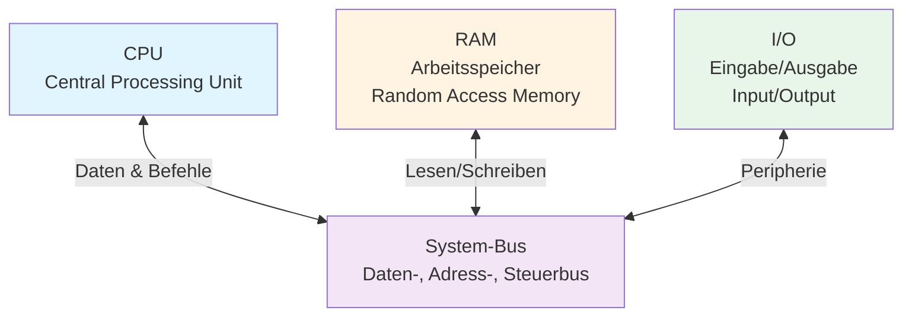
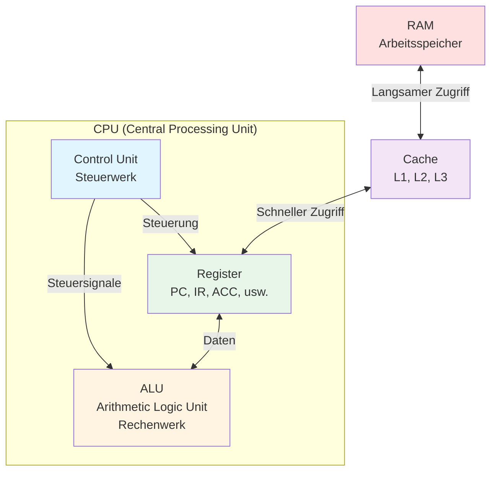
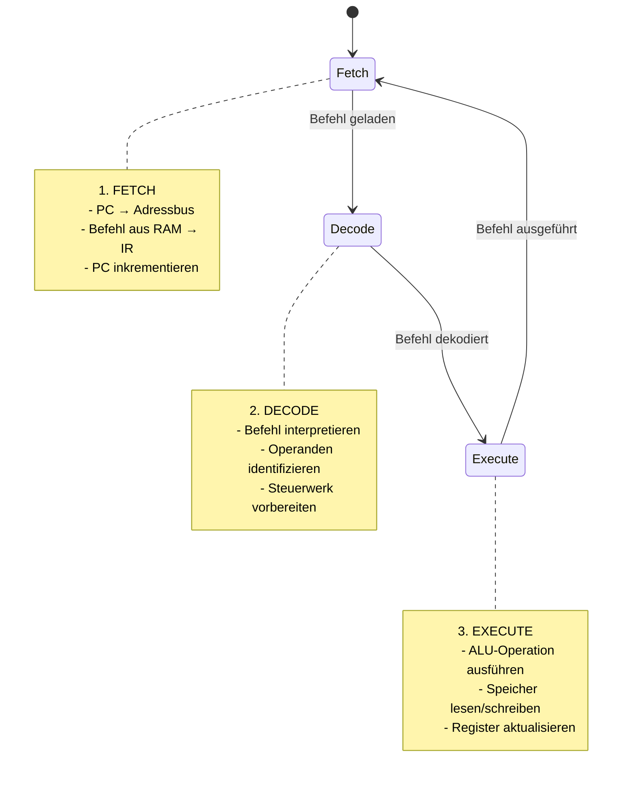
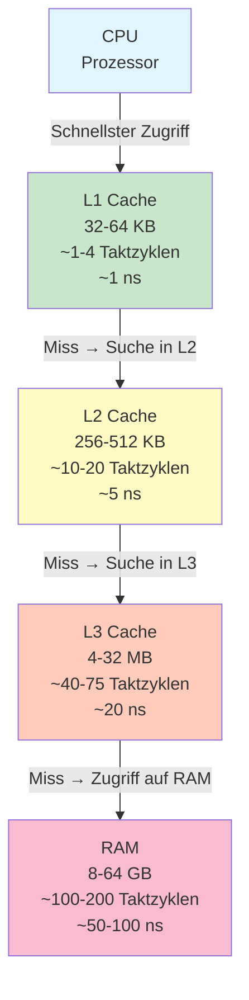
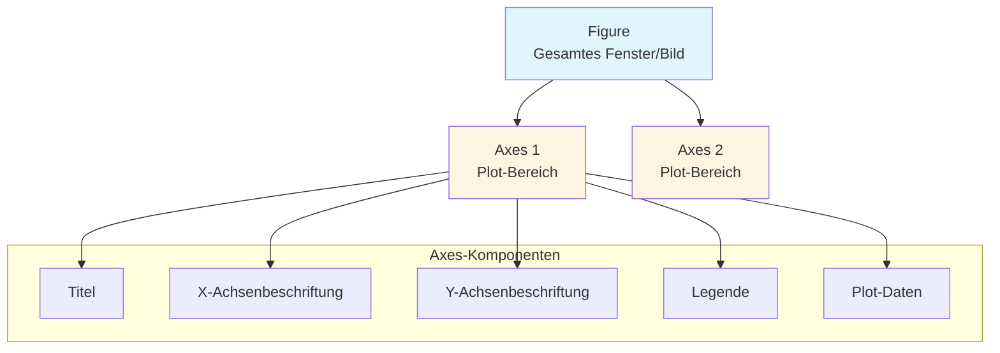

# V13: Betriebssysteme & Rechnerarchitektur – Teil 1

> [!NOTE]
> **Lernziele dieser Vorlesung**:
> - Die **Von-Neumann-Architektur** verstehen und deren Komponenten benennen können
> - Den **Fetch-Decode-Execute-Zyklus** eines Prozessors erklären können
> - Den Aufbau einer **CPU** (ALU, Steuerwerk, Register) beschreiben können
> - Das Konzept der **Cache-Hierarchie** (L1, L2, L3) verstehen und deren Bedeutung für die Performance einschätzen können
> - Matplotlib installieren und erste Plots mit Python erstellen können
> - Liniendiagramme mit Achsenbeschriftungen, Titeln und Legenden erstellen können
> - Scatter Plots für Datenpunkte visualisieren können
> - Farben, Marker und Linienstile anpassen können

---

## Teil 1: Theorie - Betriebssysteme & Rechnerarchitektur – Teil 1

### Überblick

Moderne Computer basieren auf fundamental Prinzipien, die bereits in den 1940er Jahren entwickelt wurden. Die **Rechnerarchitektur** beschreibt den logischen Aufbau und die Funktionsweise eines Computersystems, während **Betriebssysteme** die Software-Schicht bilden, die Hardware-Ressourcen verwaltet und Anwendungsprogrammen zur Verfügung stellt. Diese Vorlesung legt den Grundstein für das Verständnis, wie Programme ausgeführt werden und wie Hardware und Software zusammenarbeiten.

Für Maschinenbau-Ingenieure ist dieses Wissen besonders relevant: Ob beim Programmieren von Embedded Systems in Fertigungsanlagen, bei der Optimierung von Simulations-Software oder beim Verständnis von Echtzeit-Anforderungen in Steuerungssystemen – ein solides Fundament in Rechnerarchitektur ist unverzichtbar.

### Die Von-Neumann-Architektur

Die **Von-Neumann-Architektur** (benannt nach dem Mathematiker John von Neumann) ist das fundamentale Konzept, auf dem nahezu alle modernen Computer basieren. Dieses Architekturmodell wurde 1945 entwickelt und definiert die grundlegende Struktur eines programmierbaren Computers.

> [!NOTE]
> **Von-Neumann-Architektur**: Ein Computermodell, bei dem Programmbefehle und Daten im selben Speicher liegen und über denselben Bus transportiert werden. Dies unterscheidet sich von der **Harvard-Architektur**, bei der Programm- und Datenspeicher getrennt sind.

Die Von-Neumann-Architektur besteht aus vier Hauptkomponenten:



#### 1. Central Processing Unit (CPU) – Der Prozessor

Die **CPU** (auch Prozessor genannt) ist das Herzstück jedes Computers. Sie führt Maschinenbefehle aus, steuert alle anderen Komponenten und führt arithmetische sowie logische Operationen durch. Die CPU besteht aus mehreren Untereinheiten (die wir später im Detail betrachten): der **ALU** (Arithmetic Logic Unit), dem **Steuerwerk** (Control Unit) und **Registern** (schnelle Zwischenspeicher).

Die CPU arbeitet in einem kontinuierlichen Zyklus: Sie holt Befehle aus dem Speicher, interpretiert diese und führt sie aus. Dieser Prozess wird als **Fetch-Decode-Execute-Zyklus** bezeichnet (siehe unten). Moderne CPUs können mehrere Befehle gleichzeitig verarbeiten (**Pipelining**) oder mehrere Rechenkerne nutzen (**Multi-Core-Prozessoren**).

#### 2. Random Access Memory (RAM) – Der Arbeitsspeicher

Der **RAM** (Arbeitsspeicher) ist der flüchtige Hauptspeicher eines Computers, in dem sowohl Programme (als Maschinenbefehle) als auch Daten während der Ausführung gespeichert werden. RAM ist flüchtig (**volatile**), das heißt, sein Inhalt geht verloren, wenn der Computer ausgeschaltet wird. Typische RAM-Größen in modernen PCs liegen zwischen 8 GB und 64 GB, in Servern deutlich höher.

Der RAM wird über **Adressen** organisiert. Jede Speicherzelle hat eine eindeutige Adresse, über die die CPU darauf zugreifen kann. Die Zugriffszeit auf RAM liegt typischerweise im Bereich von 50-100 Nanosekunden (ns). Obwohl dies sehr schnell erscheint, ist es im Vergleich zur CPU-Geschwindigkeit langsam – moderne CPUs arbeiten mit Taktraten von mehreren Gigahertz (GHz), was Taktzyklen von unter 1 ns bedeutet. Diese Geschwindigkeitsdiskrepanz wird durch **Caches** ausgeglichen (siehe Cache-Hierarchie).

#### 3. Input/Output (I/O) – Eingabe und Ausgabe

Die **I/O-Komponenten** ermöglichen die Kommunikation des Computers mit der Außenwelt. Zu den Eingabegeräten gehören Tastatur, Maus, Sensoren, Netzwerkkarten und Festplatten (beim Lesen). Ausgabegeräte sind Bildschirme, Drucker, Lautsprecher und Netzwerkkarten (beim Senden) sowie Festplatten (beim Schreiben).

I/O-Operationen sind typischerweise die langsamsten Operationen in einem Computersystem. Eine Festplatten-Leseoperation dauert Millisekunden (ms), eine Netzwerk-Operation kann noch länger dauern. Aus diesem Grund verwenden moderne Betriebssysteme **asynchrone I/O** und **DMA** (Direct Memory Access), um die CPU während I/O-Operationen nicht zu blockieren.

#### 4. System-Bus – Die Datenautobahn

Der **System-Bus** ist das Verbindungssystem, über das CPU, RAM und I/O-Geräte miteinander kommunizieren. Er besteht aus drei Teilbussen:

- **Daten-Bus**: Überträgt Daten zwischen den Komponenten. Die Breite des Daten-Bus (z.B. 64 Bit bei modernen Systemen) bestimmt, wie viele Bits gleichzeitig übertragen werden können.
- **Adress-Bus**: Überträgt Speicheradressen. Die Breite des Adress-Bus bestimmt den maximal adressierbaren Speicher (z.B. 32 Bit → 4 GB, 64 Bit → 16 Exabyte).
- **Steuer-Bus**: Überträgt Steuersignale (Lesen/Schreiben, Taktung, Interrupts).

> [!WARNING]
> **Von-Neumann-Flaschenhals**: Da Befehle und Daten über denselben Bus übertragen werden, kann die CPU nicht gleichzeitig einen neuen Befehl holen und Daten verarbeiten. Dies limitiert die Performance und ist einer der Gründe für die Entwicklung von Caches und der Harvard-Architektur in einigen spezialisierten Systemen (z.B. Mikrocontroller).

### Aufbau der CPU

Die **CPU** (Central Processing Unit) ist das Gehirn des Computers. Sie besteht aus mehreren spezialisierten Untereinheiten, die zusammenarbeiten, um Befehle auszuführen.



#### 1. Arithmetic Logic Unit (ALU) – Das Rechenwerk

Die **ALU** (Arithmetic Logic Unit, Rechenwerk) ist die Komponente der CPU, die arithmetische und logische Operationen ausführt. Sie führt Berechnungen wie Addition, Subtraktion, Multiplikation und Division durch sowie logische Operationen wie AND, OR, NOT und XOR (die wir in V03/V04 behandelt haben).

Die ALU empfängt Operanden aus Registern, führt die angeforderte Operation aus und speichert das Ergebnis zurück in einem Register. Sie hat keine eigene Intelligenz – sie führt nur aus, was das **Steuerwerk** ihr vorgibt. Moderne ALUs können mehrere Operationen parallel ausführen (**SIMD**: Single Instruction, Multiple Data).

> [!TIP]
> **Beispiel ALU-Operation**: 
> 
> Angenommen, die CPU soll `5 + 3` berechnen:
> 1. Das Steuerwerk lädt die Werte 5 und 3 aus dem Speicher in Register
> 2. Das Steuerwerk gibt der ALU den Befehl "Addiere Register A und Register B"
> 3. Die ALU führt die Addition durch: `5 + 3 = 8`
> 4. Das Ergebnis wird in einem Register (z.B. dem **Akkumulator**) gespeichert
> 5. Das Steuerwerk kann das Ergebnis nun zurück in den Speicher schreiben oder weiterverarbeiten

#### 2. Control Unit (CU) – Das Steuerwerk

Das **Steuerwerk** (Control Unit) ist die Kontrollinstanz der CPU. Es koordiniert alle Aktivitäten: Es holt Befehle aus dem Speicher (**Fetch**), interpretiert sie (**Decode**) und steuert deren Ausführung (**Execute**). Das Steuerwerk generiert Steuersignale für die ALU, die Register und den System-Bus.

Das Steuerwerk arbeitet mit einem **Instruction Register (IR)**, das den aktuell auszuführenden Befehl enthält, und einem **Program Counter (PC)**, der die Adresse des nächsten Befehls im Speicher speichert. Nach jedem Befehl wird der PC inkrementiert, um auf den nächsten Befehl zu zeigen (außer bei Sprungbefehlen wie `if` oder `while`).

#### 3. Register – Die schnellsten Speicher

**Register** sind extrem schnelle Speicherzellen direkt in der CPU. Sie speichern temporäre Daten und Zwischenergebnisse während der Befehlsausführung. Register sind die schnellsten Speicher in einem Computersystem – Zugriffe dauern nur einen einzigen CPU-Takt (unter 1 ns).

Es gibt verschiedene Typen von Registern:

- **Program Counter (PC)**: Speichert die Adresse des nächsten Befehls
- **Instruction Register (IR)**: Speichert den aktuell ausgeführten Befehl
- **Akkumulator (ACC)**: Speichert Zwischenergebnisse von Berechnungen
- **Allzweck-Register**: Speichern Daten während Berechnungen (z.B. `R1`, `R2`, `R3`, ...)
- **Stack Pointer (SP)**: Zeigt auf den aktuellen Stapelspeicher (wichtig für Funktionsaufrufe)
- **Flags Register**: Speichert Status-Informationen (z.B. Überlauf, Null, Vorzeichen)

> [!WARNING]
> **Begrenzte Anzahl von Registern**: CPUs haben nur eine sehr begrenzte Anzahl von Registern (typischerweise 16-32). Wenn mehr temporäre Speicher benötigt wird, muss auf langsamere Speicher (Cache oder RAM) ausgewichen werden. Compiler versuchen, Register möglichst effizient zu nutzen (**Register Allocation**).

### Der Fetch-Decode-Execute-Zyklus

Der **Fetch-Decode-Execute-Zyklus** (Hol-Decodier-Ausführ-Zyklus) ist der fundamentale Arbeitszyklus jeder CPU. Er beschreibt, wie Maschinenbefehle aus dem Speicher geladen, interpretiert und ausgeführt werden.



#### Phase 1: Fetch (Holen)

In der **Fetch-Phase** holt die CPU den nächsten Befehl aus dem Speicher. Der **Program Counter (PC)** enthält die Adresse des nächsten Befehls. Diese Adresse wird auf den Adress-Bus gelegt, und der Befehl wird aus dem RAM (oder besser: aus dem Cache, siehe unten) gelesen. Der Befehl wird im **Instruction Register (IR)** gespeichert. Anschließend wird der Program Counter inkrementiert, um auf den nächsten Befehl zu zeigen.

> [!TIP]
> **Beispiel Fetch-Phase**:
> 
> Angenommen, der PC hat den Wert `0x1000` (Hexadezimal für Adresse 4096):
> 1. CPU legt Adresse `0x1000` auf den Adress-Bus
> 2. RAM/Cache liefert den Befehl an dieser Adresse (z.B. `ADD R1, R2` – "Addiere Register 1 und 2")
> 3. Befehl wird ins Instruction Register (IR) geladen
> 4. Program Counter wird inkrementiert: `PC = PC + 1` → `0x1001`

#### Phase 2: Decode (Dekodieren)

In der **Decode-Phase** analysiert das Steuerwerk den Befehl im Instruction Register. Der Befehl wird in **Opcode** (Operation Code – welche Operation soll ausgeführt werden?) und **Operanden** (auf welchen Daten soll die Operation arbeiten?) zerlegt. Das Steuerwerk generiert die entsprechenden Steuersignale für die ALU und die Register.

Moderne CPUs verwenden **Mikroprogrammierung** oder **Hardverdrahtete Steuerung** für die Dekodierung. Bei komplexen Befehlen (z.B. Multiplikation) kann die Dekodierung mehrere Taktzyklen dauern.

> [!TIP]
> **Beispiel Decode-Phase**:
> 
> Befehl im IR: `ADD R1, R2` (Binär: `01010001 00000010`)
> 
> Dekodierung:
> - **Opcode**: `01010001` → "Addition"
> - **Operand 1**: Register R1
> - **Operand 2**: Register R2
> - Steuerwerk generiert Signale: "Lies R1 und R2, leite sie zur ALU, führe Addition aus, speichere Ergebnis in R1"

#### Phase 3: Execute (Ausführen)

In der **Execute-Phase** wird der dekodierte Befehl tatsächlich ausgeführt. Die ALU führt die arithmetische oder logische Operation durch, oder die CPU liest/schreibt Daten im Speicher, oder sie führt einen Sprungbefehl aus (z.B. bei `if`-Bedingungen). Das Ergebnis wird in einem Register gespeichert.

Je nach Befehlstyp kann die Execute-Phase unterschiedlich lange dauern:
- **Arithmetische Befehle** (Addition, Subtraktion): 1-2 Taktzyklen
- **Multiplikation/Division**: mehrere Taktzyklen
- **Speicherzugriffe** (LOAD/STORE): abhängig von Cache/RAM-Geschwindigkeit
- **Sprungbefehle** (JUMP, BRANCH): können Pipeline unterbrechen (**Branch Prediction**)

Nach der Execute-Phase beginnt der Zyklus erneut mit Fetch für den nächsten Befehl.

> [!TIP]
> **Beispiel Execute-Phase**:
> 
> Befehl: `ADD R1, R2`
> 
> Angenommen, R1 enthält `5` und R2 enthält `3`:
> 1. ALU empfängt die Werte `5` und `3`
> 2. ALU führt Addition aus: `5 + 3 = 8`
> 3. Ergebnis `8` wird in R1 gespeichert
> 4. Flags werden gesetzt (z.B. "kein Überlauf", "positiv")

> [!WARNING]
> **Pipeline-Hazards**: Moderne CPUs führen mehrere Befehle gleichzeitig in verschiedenen Phasen aus (**Pipelining**: während ein Befehl dekodiert wird, wird der nächste bereits geholt). Bei Sprungbefehlen kann dies zu Problemen führen (**Control Hazards**), da die Pipeline geleert werden muss, wenn ein Sprung tatsächlich ausgeführt wird. Moderne CPUs verwenden **Branch Prediction** (Sprungvorhersage), um dies zu minimieren.

### Die Cache-Hierarchie (L1, L2, L3)

Die **Cache-Hierarchie** ist eine der wichtigsten Optimierungen in modernen Computersystemen. Sie dient dazu, die Geschwindigkeitsdiskrepanz zwischen CPU und RAM zu überbrücken. Während die CPU mit Taktraten von mehreren Gigahertz arbeitet (1 Taktzyklus < 1 ns), dauert ein RAM-Zugriff 50-100 ns – ein Faktor von etwa 50-100! Ohne Caches müsste die CPU bei jedem Speicherzugriff viele Taktzyklen warten.

> [!NOTE]
> **Cache**: Ein kleiner, sehr schneller Speicher zwischen CPU und RAM, der häufig verwendete Daten temporär speichert. Der Cache nutzt das **Lokalitätsprinzip** (Principle of Locality) aus: Programme greifen oft wiederholt auf dieselben Daten zu (**temporal locality**) oder auf Daten in der Nähe (**spatial locality**).



#### Level 1 (L1) Cache – Der schnellste Cache

Der **L1-Cache** ist der kleinste und schnellste Cache, direkt in die CPU integriert. Moderne CPUs haben typischerweise einen L1-Cache von 32-64 KB pro Kern. Der L1-Cache ist oft in zwei Teile aufgeteilt: **L1 Data Cache** (L1d) für Daten und **L1 Instruction Cache** (L1i) für Befehle. Diese Aufteilung folgt der **Harvard-Architektur** und erlaubt gleichzeitigen Zugriff auf Befehle und Daten.

Der Zugriff auf L1-Cache dauert typischerweise nur 1-4 Taktzyklen (ca. 1 ns). Die **Hit-Rate** (Trefferquote) liegt bei gut optimierten Programmen bei über 90%.

#### Level 2 (L2) Cache – Der mittlere Cache

Der **L2-Cache** ist größer als L1 (typisch 256-512 KB pro Kern), aber auch etwas langsamer. Der Zugriff dauert etwa 10-20 Taktzyklen (ca. 5 ns). Der L2-Cache ist ebenfalls pro Kern dediziert und dient als zweite Stufe, wenn im L1-Cache ein **Cache Miss** auftritt.

#### Level 3 (L3) Cache – Der größte Cache

Der **L3-Cache** ist deutlich größer (4-32 MB), wird aber von allen CPU-Kernen geteilt (**shared cache**). Der Zugriff dauert etwa 40-75 Taktzyklen (ca. 20 ns). Der L3-Cache dient als letzte Stufe vor dem RAM und reduziert die Häufigkeit von RAM-Zugriffen erheblich.

#### Cache-Funktionsweise: Hit und Miss

Wenn die CPU Daten benötigt, sucht sie zunächst im L1-Cache:
- **Cache Hit**: Daten sind im Cache vorhanden → sehr schneller Zugriff
- **Cache Miss**: Daten sind nicht im Cache → Suche in L2, dann L3, dann RAM

Bei einem Cache Miss werden nicht nur die angeforderten Daten geladen, sondern eine ganze **Cache Line** (typisch 64 Bytes). Dies nutzt die **Spatial Locality** aus: Wenn auf Adresse `X` zugegriffen wird, ist die Wahrscheinlichkeit hoch, dass auch auf `X+1`, `X+2`, ... zugegriffen wird.

> [!TIP]
> **Performance-Optimierung durch Cache-Nutzung**:
> 
> Betrachte zwei Schleifen, die über ein 2D-Array iterieren:
> 
> **Schlecht (Cache-ineffizient)**:
> ```python
> # Spaltenweise Iteration (viele Cache Misses)
> for col in range(1000):
>     for row in range(1000):
>         matrix[row][col] += 1
> ```
> 
> **Gut (Cache-effizient)**:
> ```python
> # Zeilenweise Iteration (gute Cache-Nutzung)
> for row in range(1000):
>     for col in range(1000):
>         matrix[row][col] += 1
> ```
> 
> Da Arrays zeilenweise im Speicher liegen, lädt die zeilenweise Iteration benachbarte Elemente, die bereits im Cache sind. Die spaltenweise Iteration springt durch den Speicher und erzeugt viele Cache Misses – der Performance-Unterschied kann Faktor 10 oder mehr betragen!

> [!WARNING]
> **False Sharing**: Bei Multi-Core-Systemen kann es zu **False Sharing** kommen: Zwei CPU-Kerne arbeiten an unterschiedlichen Daten, die aber zufällig in derselben Cache Line liegen. Ändert ein Kern seine Daten, wird die gesamte Cache Line im Cache des anderen Kerns ungültig, obwohl dieser seine Daten gar nicht geändert hat. Dies führt zu unnötigen Cache Misses und kann die Performance in Multi-Threaded-Programmen dramatisch reduzieren.

### Zusammenfassung Theorie

Die wichtigsten Konzepte dieser Vorlesung:

1. Die **Von-Neumann-Architektur** besteht aus CPU, RAM, I/O und System-Bus. Befehle und Daten liegen im selben Speicher.

2. Die **CPU** besteht aus drei Hauptkomponenten:
   - **ALU** (Rechenwerk): Führt arithmetische und logische Operationen aus
   - **Steuerwerk**: Koordiniert alle Aktivitäten, holt und dekodiert Befehle
   - **Register**: Extrem schnelle Zwischenspeicher in der CPU

3. Der **Fetch-Decode-Execute-Zyklus** ist der fundamentale Arbeitszyklus der CPU:
   - **Fetch**: Befehl aus Speicher holen
   - **Decode**: Befehl interpretieren
   - **Execute**: Befehl ausführen

4. Die **Cache-Hierarchie** (L1, L2, L3) überbrückt die Geschwindigkeitsdiskrepanz zwischen CPU und RAM durch schnelle Zwischenspeicher. Cache-effiziente Programmierung kann die Performance dramatisch verbessern.

5. Moderne CPUs nutzen **Pipelining** (mehrere Befehle gleichzeitig in verschiedenen Phasen) und **Multi-Core-Architekturen** (mehrere CPU-Kerne) für hohe Performance.

---

## Teil 2: Python-Praxis - Plots & Grafiken (Matplotlib) – Teil 1

> [!WARNING]
> **Python-Konsistenz beachten**: Prüfe [../../python_topics.md](../../python_topics.md) für bereits eingeführte Konzepte!

### Überblick

Datenvisualisierung ist eine der wichtigsten Fähigkeiten in der Informatik und im Ingenieurwesen. Grafische Darstellungen von Daten, Messergebnissen oder Simulationsergebnissen ermöglichen es, Muster zu erkennen, Trends zu analysieren und Ergebnisse verständlich zu kommunizieren. **Matplotlib** ist die am weitesten verbreitete Bibliothek für Datenvisualisierung in Python und wird in Wissenschaft, Ingenieurwesen und Data Science intensiv genutzt.

Diese Vorlesung führt in die Grundlagen von Matplotlib ein: Installation, erste Plots, Anpassung von Achsen, Titel und Legenden, sowie die wichtigsten Plot-Typen (Liniendiagramme und Scatter Plots). In V14 werden wir weitere Plot-Typen (Bar Charts, Histogramme) und fortgeschrittene Techniken (Subplots, Annotationen) behandeln.

### Installation von Matplotlib

Matplotlib ist eine externe Bibliothek und muss zunächst installiert werden. Die Installation erfolgt über den Package-Manager `pip` (Python Package Index).

> [!NOTE]
> **Virtuelle Umgebung empfohlen**: Wie in V12 gelernt, solltest du Matplotlib in einer virtuellen Umgebung installieren, um Versionskonflikte zu vermeiden. Erstelle zuerst eine venv mit `python -m venv venv` und aktiviere sie.

**Installation über pip**:

```bash
# In Windows CMD oder PowerShell:
pip install matplotlib

# Alternativ, falls mehrere Python-Versionen installiert sind:
python -m pip install matplotlib

# Mit spezifischer Version:
pip install matplotlib==3.8.2
```

**Überprüfung der Installation**:

```python
import matplotlib
print(matplotlib.__version__)  # Zeigt installierte Version, z.B. "3.8.2"
```

**Häufige Import-Konvention**:

```python
import matplotlib.pyplot as plt
```

> [!NOTE]
> **`matplotlib.pyplot`** ist das Haupt-Modul von Matplotlib für das Erstellen von Plots. Die Konvention `import matplotlib.pyplot as plt` ist universell – nahezu jedes Matplotlib-Tutorial und jede Dokumentation verwendet dieses Alias.

### Grundkonzepte: Figure und Axes

Bevor wir Plots erstellen, müssen wir zwei zentrale Konzepte verstehen: **Figure** und **Axes**.



#### Figure – Das Gesamtbild

Eine **Figure** ist das oberste Container-Objekt in Matplotlib. Sie repräsentiert das gesamte Fenster oder Bild, in dem Plots dargestellt werden. Eine Figure kann einen oder mehrere **Axes** (Plot-Bereiche) enthalten. Denke an die Figure als die "Leinwand", auf der gezeichnet wird.

#### Axes – Der Plot-Bereich

Ein **Axes**-Objekt (Plural: Axes, nicht "Axis"!) ist ein individueller Plot-Bereich innerhalb einer Figure. Ein Axes enthält:
- Die eigentlichen Plot-Daten (Linien, Punkte, Balken, ...)
- X- und Y-Achsen mit Beschriftungen
- Titel
- Legende
- Gitterlinien

> [!WARNING]
> **Axes vs. Axis**: Verwechsle nicht **Axes** (der gesamte Plot-Bereich) mit **Axis** (eine einzelne Achse, z.B. X-Achse). Ein Axes-Objekt enthält zwei Axis-Objekte (X-Axis und Y-Axis).

### Erste Plots: Liniendiagramme

Liniendiagramme (**Line Plots**) sind die einfachste und häufigste Form der Datenvisualisierung. Sie zeigen den Verlauf einer oder mehrerer Funktionen oder Datenreihen.

#### Einfachster Plot

```python
import matplotlib.pyplot as plt

# Daten
x = [1, 2, 3, 4, 5]
y = [2, 4, 6, 8, 10]

# Plot erstellen
plt.plot(x, y)

# Plot anzeigen
plt.show()
```

> [!NOTE]
> **`plt.plot(x, y)`** erstellt ein Liniendiagramm mit den x-Werten als X-Koordinaten und den y-Werten als Y-Koordinaten. Die Funktion `plt.show()` öffnet ein Fenster mit dem Plot. Ohne `plt.show()` wird der Plot nicht angezeigt (außer in Jupyter Notebooks mit `%matplotlib inline`).

#### Plot mit Achsenbeschriftungen und Titel

Ein guter Plot benötigt immer beschriftete Achsen und einen aussagekräftigen Titel:

```python
import matplotlib.pyplot as plt

# Daten
x = [1, 2, 3, 4, 5]
y = [2, 4, 6, 8, 10]

# Plot erstellen
plt.plot(x, y)

# Beschriftungen
plt.xlabel("Zeit in Sekunden")
plt.ylabel("Geschwindigkeit in m/s")
plt.title("Geschwindigkeit über Zeit")

# Plot anzeigen
plt.show()
```

> [!NOTE]
> - **`plt.xlabel(label)`**: Beschriftet die X-Achse
> - **`plt.ylabel(label)`**: Beschriftet die Y-Achse
> - **`plt.title(title)`**: Setzt den Titel des Plots

#### Mehrere Linien in einem Plot

Oft möchte man mehrere Datenreihen im selben Plot vergleichen:

```python
import matplotlib.pyplot as plt

# Daten für zwei Funktionen
x = [1, 2, 3, 4, 5]
y1 = [1, 4, 9, 16, 25]  # y = x^2
y2 = [1, 2, 3, 4, 5]     # y = x

# Plots erstellen
plt.plot(x, y1)
plt.plot(x, y2)

# Beschriftungen
plt.xlabel("x")
plt.ylabel("y")
plt.title("Vergleich: x² vs. x")

plt.show()
```

#### Legende hinzufügen

Wenn mehrere Linien im Plot sind, benötigst du eine **Legende** zur Unterscheidung:

```python
import matplotlib.pyplot as plt

x = [1, 2, 3, 4, 5]
y1 = [1, 4, 9, 16, 25]
y2 = [1, 2, 3, 4, 5]

# Label-Parameter für Legende
plt.plot(x, y1, label="y = x²")
plt.plot(x, y2, label="y = x")

plt.xlabel("x")
plt.ylabel("y")
plt.title("Vergleich: x² vs. x")

# Legende anzeigen
plt.legend()

plt.show()
```

> [!NOTE]
> **`plt.legend()`** erstellt automatisch eine Legende basierend auf den `label`-Parametern der Plot-Funktionen. Die Position der Legende wird automatisch gewählt (meist oben rechts). Du kannst die Position mit `plt.legend(loc='upper left')` manuell setzen.

> [!TIP]
> **Legende-Positionen**:
> - `'best'` (Standard): Automatische Wahl
> - `'upper right'`, `'upper left'`, `'lower right'`, `'lower left'`
> - `'upper center'`, `'lower center'`, `'center left'`, `'center right'`, `'center'`
> - Oder als Koordinaten: `plt.legend(loc=(0.5, 0.5))` (relative Position 0-1)

### Farben und Marker anpassen

Matplotlib bietet umfangreiche Anpassungsmöglichkeiten für Farben, Linienstile und Marker.

#### Farben

Farben können auf verschiedene Weisen angegeben werden:

```python
import matplotlib.pyplot as plt

x = [1, 2, 3, 4, 5]
y = [1, 2, 3, 4, 5]

# Verschiedene Farbformate:
plt.plot(x, y, color='red')           # Farbname
plt.plot(x, y, color='r')             # Abkürzung (r, g, b, c, m, y, k, w)
plt.plot(x, y, color='#FF5733')       # Hex-Code
plt.plot(x, y, color=(0.1, 0.2, 0.5)) # RGB-Tupel (0-1)

plt.show()
```

> [!NOTE]
> **Standard-Farb-Abkürzungen**:
> - `'r'`: Rot (red)
> - `'g'`: Grün (green)
> - `'b'`: Blau (blue)
> - `'c'`: Cyan
> - `'m'`: Magenta
> - `'y'`: Gelb (yellow)
> - `'k'`: Schwarz (black, "k" da "b" für blau)
> - `'w'`: Weiß (white)

#### Linienstile

Linienstile ändern das Aussehen der Linie:

```python
import matplotlib.pyplot as plt

x = [1, 2, 3, 4, 5]
y1 = [1, 2, 3, 4, 5]
y2 = [5, 4, 3, 2, 1]
y3 = [2, 3, 2, 3, 2]
y4 = [4, 3, 4, 3, 4]

plt.plot(x, y1, linestyle='-',  label='Durchgezogen (solid)')
plt.plot(x, y2, linestyle='--', label='Gestrichelt (dashed)')
plt.plot(x, y3, linestyle='-.', label='Strich-Punkt (dashdot)')
plt.plot(x, y4, linestyle=':',  label='Gepunktet (dotted)')

plt.legend()
plt.show()
```

> [!NOTE]
> **Linienstile**:
> - `'-'` oder `'solid'`: Durchgezogene Linie (Standard)
> - `'--'` oder `'dashed'`: Gestrichelte Linie
> - `'-.'` oder `'dashdot'`: Strich-Punkt-Linie
> - `':'` oder `'dotted'`: Gepunktete Linie
> - `''` oder `'None'`: Keine Linie (nur Marker)

#### Linienbreite

Die Linienbreite wird mit dem `linewidth`- oder `lw`-Parameter gesteuert:

```python
plt.plot(x, y, linewidth=3)    # Dickere Linie
plt.plot(x, y, lw=0.5)          # Dünnere Linie
```

#### Kompakte Notation (Format String)

Matplotlib erlaubt eine Kurzschreibweise für Farbe, Marker und Linienstil:

```python
# Format: '[marker][line][color]'
plt.plot(x, y, 'ro-')   # Rote Kreise mit durchgezogener Linie
plt.plot(x, y, 'bs--')  # Blaue Quadrate mit gestrichelter Linie
plt.plot(x, y, 'g^:')   # Grüne Dreiecke mit gepunkteter Linie
```

### Scatter Plots – Punktdiagramme

**Scatter Plots** (Streudiagramme) zeigen Datenpunkte ohne verbindende Linien. Sie eignen sich besonders für die Darstellung von Messdaten oder zur Untersuchung von Korrelationen zwischen zwei Variablen.

#### Einfacher Scatter Plot

```python
import matplotlib.pyplot as plt

# Messdaten (z.B. Temperatur und Druck)
temperatur = [20, 25, 30, 35, 40, 45, 50]
druck = [1.0, 1.2, 1.5, 1.8, 2.2, 2.5, 3.0]

# Scatter Plot erstellen
plt.scatter(temperatur, druck)

plt.xlabel("Temperatur in °C")
plt.ylabel("Druck in bar")
plt.title("Temperatur-Druck-Beziehung")

plt.show()
```

> [!NOTE]
> **`plt.scatter(x, y)`** erstellt einen Scatter Plot. Im Gegensatz zu `plt.plot()` werden Datenpunkte nicht mit Linien verbunden.

#### Marker-Größe und Farbe

Scatter Plots bieten zusätzliche Dimensionen durch Marker-Größe und Farbe:

```python
import matplotlib.pyplot as plt

x = [1, 2, 3, 4, 5]
y = [2, 4, 6, 8, 10]
groesse = [50, 100, 200, 400, 800]  # Marker-Größen

plt.scatter(x, y, s=groesse, c='red', alpha=0.5)

plt.xlabel("x")
plt.ylabel("y")
plt.title("Scatter Plot mit variablen Größen")

plt.show()
```

> [!NOTE]
> - **`s`**: Marker-Größe (s = size). Kann eine Zahl oder eine Liste sein.
> - **`c`**: Marker-Farbe (c = color). Kann eine Farbe oder eine Liste von Werten sein.
> - **`alpha`**: Transparenz (0 = transparent, 1 = opak).

#### Farbskalierung (Colormap)

Marker können basierend auf einem dritten Wert eingefärbt werden:

```python
import matplotlib.pyplot as plt
import numpy as np

# Daten
x = np.random.rand(50)
y = np.random.rand(50)
farben = np.random.rand(50)  # Zufällige Werte für Farbe
groessen = 100 * np.random.rand(50)  # Zufällige Größen

plt.scatter(x, y, s=groessen, c=farben, cmap='viridis', alpha=0.6)

plt.colorbar(label='Wert')  # Farblegende
plt.xlabel("x")
plt.ylabel("y")
plt.title("Scatter Plot mit Colormap")

plt.show()
```

> [!NOTE]
> **`cmap`** (Colormap) definiert das Farbschema. Beliebte Colormaps:
> - `'viridis'`: Blau-grün-gelb (perceptually uniform, empfohlen)
> - `'plasma'`: Violett-pink-gelb
> - `'coolwarm'`: Blau-rot
> - `'jet'`: Regenbogen (nicht empfohlen: schwer zu interpretieren)
> 
> **`plt.colorbar()`** zeigt eine Farblegende an.

> [!WARNING]
> **NumPy wird hier verwendet**: In diesem Beispiel wird `numpy` (Alias `np`) für Zufallszahlen verwendet. NumPy ist eine fundamentale Bibliothek für numerische Berechnungen und wird in V15/V16 ausführlich behandelt. Installation: `pip install numpy`.

### Marker-Typen

Matplotlib bietet eine Vielzahl von Marker-Formen:

```python
import matplotlib.pyplot as plt

x = range(10)
marker_types = ['o', 's', '^', 'v', 'D', '*', 'p', 'H', '+', 'x']

for i, marker in enumerate(marker_types):
    plt.scatter(x, [i]*10, marker=marker, s=100, label=f"'{marker}'")

plt.legend(loc='center left', bbox_to_anchor=(1, 0.5))
plt.yticks(range(10), marker_types)
plt.xlabel("x")
plt.title("Übersicht: Marker-Typen")
plt.tight_layout()
plt.show()
```

> [!NOTE]
> **Häufige Marker**:
> - `'o'`: Kreis (Standard)
> - `'s'`: Quadrat (square)
> - `'^'`, `'v'`, `'<'`, `'>'`: Dreiecke (nach oben, unten, links, rechts)
> - `'D'`: Diamant
> - `'*'`: Stern
> - `'+'`, `'x'`: Plus, X
> - `'.'`: Punkt (sehr klein)

### Gitterlinien und Achsengrenzen

#### Gitterlinien hinzufügen

Gitterlinien (**Grid**) erleichtern das Ablesen von Werten:

```python
import matplotlib.pyplot as plt

x = [1, 2, 3, 4, 5]
y = [2, 4, 6, 8, 10]

plt.plot(x, y, 'bo-')

plt.xlabel("x")
plt.ylabel("y")
plt.title("Plot mit Gitterlinien")

# Gitterlinien aktivieren
plt.grid(True)

plt.show()
```

> [!NOTE]
> **`plt.grid(True)`** aktiviert Gitterlinien. Weitere Optionen:
> - `plt.grid(True, which='both', axis='both', linestyle='--', alpha=0.5)`
>   - `which`: `'major'` (Hauptlinien), `'minor'` (Nebenlinien), `'both'`
>   - `axis`: `'x'`, `'y'`, `'both'`
>   - `linestyle`: Stil der Gitterlinien
>   - `alpha`: Transparenz

#### Achsengrenzen setzen

Standardmäßig wählt Matplotlib Achsengrenzen automatisch. Du kannst sie manuell setzen:

```python
import matplotlib.pyplot as plt

x = [1, 2, 3, 4, 5]
y = [2, 4, 6, 8, 10]

plt.plot(x, y)

# Achsengrenzen setzen
plt.xlim(0, 6)   # X-Achse von 0 bis 6
plt.ylim(0, 12)  # Y-Achse von 0 bis 12

plt.xlabel("x")
plt.ylabel("y")
plt.title("Plot mit benutzerdefinierten Achsengrenzen")

plt.show()
```

> [!NOTE]
> - **`plt.xlim(min, max)`**: Setzt X-Achsen-Grenzen
> - **`plt.ylim(min, max)`**: Setzt Y-Achsen-Grenzen
> - Alternativ: `plt.axis([xmin, xmax, ymin, ymax])`

### Häufige Fehler und Lösungen

> [!WARNING]
> **Fehler 1: Plot wird nicht angezeigt**
> 
> **Problem**: Code läuft ohne Fehler, aber es erscheint kein Fenster.
> 
> **Ursache**: `plt.show()` vergessen oder Backend-Probleme.
> 
> **Lösung**: 
> ```python
> import matplotlib.pyplot as plt
> 
> plt.plot([1, 2, 3], [1, 2, 3])
> plt.show()  # Nicht vergessen!
> ```
> 
> In Jupyter Notebooks: Verwende `%matplotlib inline` am Anfang.

> [!WARNING]
> **Fehler 2: Unerwartetes Verhalten bei mehreren `plt.plot()` Aufrufen**
> 
> **Problem**: Alle Plots landen im selben Fenster, obwohl separate Plots gewünscht sind.
> 
> **Ursache**: Matplotlib zeichnet standardmäßig alle Aufrufe in dasselbe Figure-Objekt bis `plt.show()` aufgerufen wird.
> 
> **Lösung**: Verwende `plt.figure()` für neue Plots:
> ```python
> # Plot 1
> plt.figure()
> plt.plot([1, 2, 3], [1, 2, 3])
> plt.title("Plot 1")
> plt.show()
> 
> # Plot 2 (neues Figure)
> plt.figure()
> plt.plot([1, 2, 3], [3, 2, 1])
> plt.title("Plot 2")
> plt.show()
> ```

> [!WARNING]
> **Fehler 3: Legende wird nicht angezeigt**
> 
> **Problem**: `plt.legend()` wird aufgerufen, aber keine Legende erscheint.
> 
> **Ursache**: `label`-Parameter fehlt bei `plt.plot()` oder `plt.scatter()`.
> 
> **Lösung**: Füge Labels hinzu:
> ```python
> plt.plot(x, y1, label="Datenreihe 1")  # Label nicht vergessen!
> plt.plot(x, y2, label="Datenreihe 2")
> plt.legend()
> ```

> [!WARNING]
> **Fehler 4: Datenpunkte und Achsen passen nicht**
> 
> **Problem**: X- und Y-Daten haben unterschiedliche Längen.
> 
> **Fehler**: `ValueError: x and y must have same first dimension`
> 
> **Lösung**: Überprüfe, dass `len(x) == len(y)`:
> ```python
> x = [1, 2, 3, 4, 5]
> y = [2, 4, 6, 8]  # Fehler: nur 4 statt 5 Elemente!
> 
> # Korrigiert:
> y = [2, 4, 6, 8, 10]
> plt.plot(x, y)
> ```

> [!WARNING]
> **Fehler 5: Format String falsch interpretiert**
> 
> **Problem**: `'ro-'` erzeugt rote Kreise mit Linie, aber `'red'` erzeugt Fehler.
> 
> **Ursache**: Im Format String sind nur Einbuchstaben-Farben erlaubt (`r`, `g`, `b`, ...). Volle Farbnamen benötigen den `color`-Parameter.
> 
> **Richtig**:
> ```python
> plt.plot(x, y, 'ro-')         # Format String: OK
> plt.plot(x, y, color='red')   # Parameter: OK
> plt.plot(x, y, 'red')         # Fehler!
> ```

### Zusammenfassung Python

Die wichtigsten Konzepte dieser Lektion:

1. **Matplotlib** ist die Standard-Bibliothek für Datenvisualisierung in Python. Installation: `pip install matplotlib`.

2. Die wichtigsten Komponenten:
   - **Figure**: Gesamtes Plot-Fenster (Leinwand)
   - **Axes**: Individueller Plot-Bereich mit Achsen, Titel, Legende

3. **Liniendiagramme** (`plt.plot(x, y)`):
   - Zeigen Verläufe und Trends
   - Mehrere Linien durch mehrfache Aufrufe
   - Anpassbar durch Farbe, Linienstil, Linienbreite

4. **Scatter Plots** (`plt.scatter(x, y)`):
   - Zeigen Datenpunkte ohne Verbindungslinien
   - Zusätzliche Dimensionen durch Größe (`s`) und Farbe (`c`)
   - Colormaps für Farbskalierung

5. **Beschriftungen** sind Pflicht:
   - `plt.xlabel()`, `plt.ylabel()`: Achsenbeschriftungen
   - `plt.title()`: Titel
   - `plt.legend()`: Legende (benötigt `label`-Parameter bei Plot-Funktionen)

6. **Anpassungen**:
   - Farben: Name, Abkürzung, Hex-Code, RGB-Tupel
   - Marker: Verschiedene Formen (`'o'`, `'s'`, `'^'`, ...)
   - Gitterlinien: `plt.grid(True)`
   - Achsengrenzen: `plt.xlim()`, `plt.ylim()`

### Neue Python-Funktionen/Methoden

In dieser Lektion wurden folgende Python-Funktionen und Methoden **neu eingeführt**:

#### Matplotlib Module

- **`import matplotlib.pyplot as plt`**: Standard-Import für Matplotlib
- **`matplotlib.__version__`**: Zeigt installierte Matplotlib-Version

#### Plot-Erstellung

- **`plt.plot(x, y, ...)`**: Erstellt Liniendiagramm
  - Parameter: `label`, `color`/`c`, `linestyle`/`ls`, `linewidth`/`lw`, `marker`, `alpha`
  - Format String: `'[marker][line][color]'` (z.B. `'ro-'`)
  
- **`plt.scatter(x, y, ...)`**: Erstellt Scatter Plot (Punktdiagramm)
  - Parameter: `s` (Größe), `c` (Farbe), `marker`, `cmap` (Colormap), `alpha`

#### Beschriftungen und Layout

- **`plt.xlabel(label)`**: X-Achsen-Beschriftung
- **`plt.ylabel(label)`**: Y-Achsen-Beschriftung
- **`plt.title(title)`**: Plot-Titel
- **`plt.legend(...)`**: Legende anzeigen
  - Parameter: `loc` (Position)
- **`plt.grid(True/False, ...)`**: Gitterlinien aktivieren/deaktivieren
  - Parameter: `which`, `axis`, `linestyle`, `alpha`
- **`plt.colorbar(label=...)`**: Farblegende für Colormaps

#### Achsen und Figure

- **`plt.xlim(min, max)`**: X-Achsen-Grenzen setzen
- **`plt.ylim(min, max)`**: Y-Achsen-Grenzen setzen
- **`plt.axis([xmin, xmax, ymin, ymax])`**: Alle Achsengrenzen gleichzeitig
- **`plt.figure()`**: Neue Figure erstellen
- **`plt.tight_layout()`**: Layout automatisch anpassen (verhindert überlappende Labels)

#### Anzeige

- **`plt.show()`**: Plot-Fenster anzeigen (blocking)

---

## Weiterführende Ressourcen

### Theorie
- **Computer Organization and Design** (Patterson & Hennessy): Der Klassiker zur Rechnerarchitektur
- **Operating Systems: Three Easy Pieces** (Arpaci-Dusseau): Kostenlos online verfügbar, exzellente Einführung in Betriebssysteme
- [CPU-World](https://www.cpu-world.com/): Detaillierte Informationen zu CPUs und deren Architekturen
- [Wikipedia: Von-Neumann-Architektur](https://de.wikipedia.org/wiki/Von-Neumann-Architektur)
- [Wikipedia: CPU-Cache](https://de.wikipedia.org/wiki/CPU-Cache)

### Python & Matplotlib
- [Matplotlib Dokumentation](https://matplotlib.org/stable/contents.html): Offizielle Dokumentation mit Tutorials und Beispielen
- [Matplotlib Gallery](https://matplotlib.org/stable/gallery/index.html): Hunderte Beispiel-Plots mit Code
- [Matplotlib Cheatsheet](https://matplotlib.org/cheatsheets/): Übersichtliche Referenz für häufige Aufgaben
- [Python Data Science Handbook](https://jakevdp.github.io/PythonDataScienceHandbook/): Kapitel 4 behandelt Matplotlib ausführlich (kostenlos online)
- [Real Python: Matplotlib Guide](https://realpython.com/python-matplotlib-guide/): Ausführliches Tutorial mit praktischen Beispielen
- [Scientific Visualization Book](https://github.com/rougier/scientific-visualization-book): Fortgeschrittene Visualisierungstechniken
