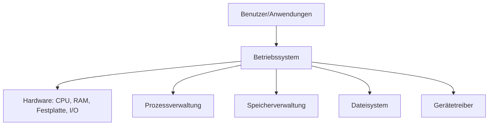
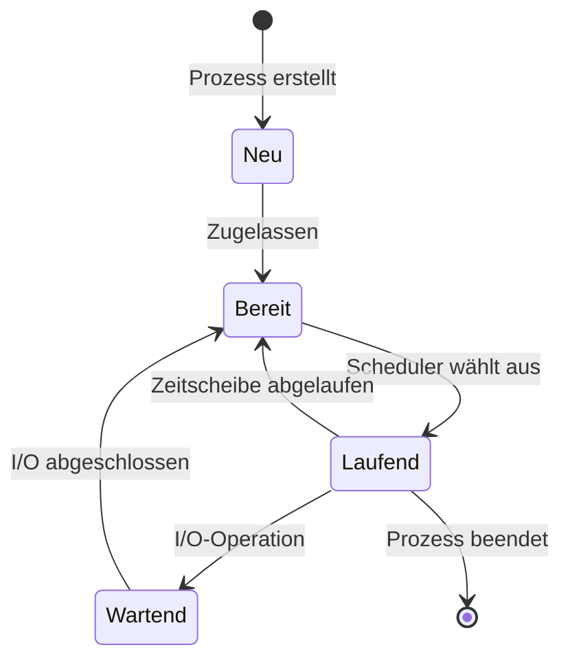
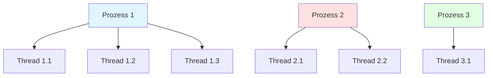
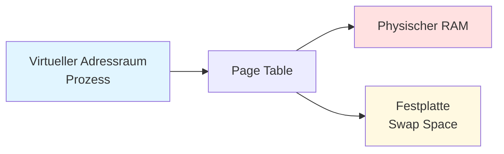
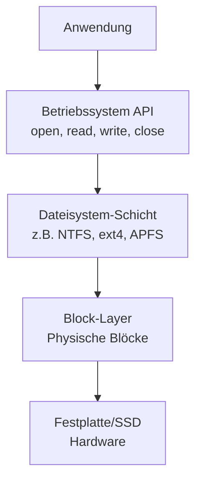

# V14: Betriebssysteme & Rechnerarchitektur – Teil 2

> [!NOTE]
> **Lernziele dieser Vorlesung**:
> - Die Hauptaufgaben eines Betriebssystems verstehen und erklären können
> - Prozessverwaltung und unterschiedliche Scheduling-Algorithmen analysieren
> - Den Unterschied zwischen Prozessen und Threads kennen
> - Das Konzept des virtuellen Speichers und Paging nachvollziehen
> - Dateisystemstrukturen und deren Organisation verstehen
> - Bar Charts und Histogramme mit Matplotlib erstellen
> - Mehrere Plots in Subplots organisieren
> - Verschiedene Achsenskalierungen anwenden
> - Plots professionell anpassen und in verschiedenen Formaten speichern

---

## Teil 1: Theorie - Betriebssysteme & Rechnerarchitektur – Teil 2

### Überblick

In V13 haben wir die Hardware-Grundlagen kennengelernt: Von-Neumann-Architektur, CPU-Aufbau und Cache-Hierarchie. Diese Vorlesung baut darauf auf und behandelt die Software-Schicht, die die Hardware verwaltet: das **Betriebssystem**. Ein Betriebssystem ist die zentrale Vermittlungsinstanz zwischen Hardware und Anwendungen. Es verwaltet Ressourcen wie Prozessoren, Speicher und Dateien und sorgt dafür, dass mehrere Programme gleichzeitig laufen können, ohne sich gegenseitig zu stören.



### Aufgaben eines Betriebssystems

Ein **Betriebssystem** (Operating System, OS) ist eine Systemsoftware, die grundlegende Funktionen für den Betrieb eines Computers bereitstellt. Die wichtigsten Aufgaben lassen sich in fünf Kategorien einteilen:

> [!NOTE]
> **Betriebssystem**: Systemsoftware, die als Vermittler zwischen Hardware und Anwendungssoftware fungiert und grundlegende Dienste wie Prozess-, Speicher- und Dateiverwaltung bereitstellt.

**1. Prozessverwaltung (Process Management)**

Das Betriebssystem verwaltet alle laufenden Programme (Prozesse) und entscheidet, welcher Prozess wann auf der CPU ausgeführt wird. Dies ermöglicht **Multitasking**, also das scheinbar gleichzeitige Ausführen mehrerer Programme. In Wirklichkeit wechselt die CPU sehr schnell zwischen den Prozessen hin und her.

**2. Speicherverwaltung (Memory Management)**

Das OS verwaltet den Arbeitsspeicher (RAM) und teilt ihn den laufenden Prozessen zu. Es stellt sicher, dass jeder Prozess genug Speicher bekommt und dass Prozesse nicht auf den Speicher anderer Prozesse zugreifen können (Speicherschutz). Moderne Betriebssysteme verwenden **virtuellen Speicher**, um mehr Speicher zu simulieren, als physisch vorhanden ist.

**3. Dateisystemverwaltung (File System Management)**

Das Betriebssystem organisiert Daten auf Speichermedien (Festplatten, SSDs) in Form von Dateien und Verzeichnissen. Es kümmert sich um das Erstellen, Lesen, Schreiben und Löschen von Dateien und verwaltet Zugriffsrechte.

**4. Ein-/Ausgabeverwaltung (I/O Management)**

Das OS verwaltet den Zugriff auf Peripheriegeräte wie Tastatur, Maus, Monitor, Drucker und Netzwerkkarten. Es stellt eine einheitliche Schnittstelle bereit, damit Anwendungen nicht direkt mit der Hardware kommunizieren müssen.

**5. Benutzerverwaltung und Sicherheit (User Management & Security)**

Das Betriebssystem verwaltet Benutzerkonten, Passwörter und Zugriffsrechte. Es sorgt dafür, dass verschiedene Benutzer ihre Daten getrennt halten können und dass nicht jeder Benutzer alle Systemfunktionen ausführen darf.

> [!TIP]
> **Beispiel aus dem Alltag**: Wenn Sie in Windows mehrere Programme öffnen (Browser, Word, Spotify), sorgt das Betriebssystem dafür, dass alle Programme ihren Teil der CPU-Zeit bekommen, dass jedes Programm seinen eigenen Speicherbereich hat und dass die Musik aus Spotify über Ihre Lautsprecher ausgegeben wird – alles gleichzeitig und ohne dass Sie sich darum kümmern müssen.

### Prozessverwaltung und Scheduling-Algorithmen

Ein **Prozess** ist eine laufende Instanz eines Programms. Wenn Sie ein Programm (z.B. einen Webbrowser) starten, erzeugt das Betriebssystem einen oder mehrere Prozesse, die den Code des Programms ausführen.

> [!NOTE]
> **Prozess**: Eine laufende Instanz eines Programms mit eigenem Speicherbereich, eigenem Programmzähler (Program Counter) und eigenen Ressourcen (offene Dateien, Netzwerkverbindungen, etc.).

**Prozesszustände**

Ein Prozess kann sich in verschiedenen Zuständen befinden:



- **Neu (New)**: Prozess wird gerade erstellt
- **Bereit (Ready)**: Prozess ist bereit zur Ausführung, wartet aber auf CPU-Zeit
- **Laufend (Running)**: Prozess wird gerade auf der CPU ausgeführt
- **Wartend (Waiting/Blocked)**: Prozess wartet auf ein Ereignis (z.B. Tastatureingabe, Festplattenzugriff)
- **Beendet (Terminated)**: Prozess hat seine Ausführung abgeschlossen

**Scheduling-Algorithmen**

Das **Scheduling** ist der Mechanismus, mit dem das Betriebssystem entscheidet, welcher bereite Prozess als Nächstes auf der CPU ausgeführt wird. Der **Scheduler** ist die Komponente, die diese Entscheidung trifft.

> [!NOTE]
> **Scheduling**: Der Prozess der Auswahl eines bereiten Prozesses zur Ausführung auf der CPU. Ziel ist es, die CPU-Auslastung zu maximieren und faire Verteilung der Rechenzeit zu gewährleisten.

**Wichtige Scheduling-Algorithmen:**

**1. First-Come, First-Served (FCFS)**
- Prozesse werden in der Reihenfolge ihrer Ankunft abgearbeitet
- Einfach zu implementieren, aber kann zu langen Wartezeiten führen
- Problem: Ein langer Prozess blockiert alle nachfolgenden Prozesse

**2. Shortest Job First (SJF)**
- Der Prozess mit der kürzesten Ausführungszeit wird zuerst ausgeführt
- Minimiert durchschnittliche Wartezeit
- Problem: Vorhersage der Ausführungszeit ist schwierig; lange Prozesse können verhungern (Starvation)

**3. Round Robin (RR)**
- Jeder Prozess erhält eine feste Zeitscheibe (Time Quantum, z.B. 10 ms)
- Nach Ablauf der Zeitscheibe wird der Prozess ans Ende der Warteschlange gestellt
- Fair, verhindert Starvation
- Standard in vielen modernen Betriebssystemen

**4. Priority Scheduling**
- Jedem Prozess wird eine Priorität zugewiesen
- Prozesse mit höherer Priorität werden zuerst ausgeführt
- Problem: Niedrigpriorisierte Prozesse können verhungern
- Lösung: **Aging** – Priorität steigt mit Wartezeit

> [!TIP]
> **Vergleich der Algorithmen**: Stellen Sie sich eine Supermarktkasse vor. FCFS ist wie eine normale Warteschlange. SJF wäre eine "Express-Kasse" für Kunden mit wenigen Artikeln. Round Robin entspricht einem System, bei dem jeder Kunde nur 5 Artikel scannen darf und sich dann wieder hinten anstellen muss, bis alle bedient sind.

### Prozesse vs. Threads

**Prozesse** und **Threads** sind beides Ausführungseinheiten, aber mit wichtigen Unterschieden:

> [!NOTE]
> **Thread**: Eine leichtgewichtige Ausführungseinheit innerhalb eines Prozesses. Mehrere Threads desselben Prozesses teilen sich den gleichen Speicherbereich, haben aber eigene Programmzähler und Stacks.

**Unterschied zwischen Prozessen und Threads:**

| Merkmal | Prozess | Thread |
|---------|---------|--------|
| **Speicher** | Eigener, isolierter Speicherbereich | Teilen sich Speicher des Prozesses |
| **Ressourcen** | Eigene Ressourcen (Dateien, etc.) | Teilen Ressourcen des Prozesses |
| **Kommunikation** | Inter-Process Communication (IPC) nötig, aufwändig | Direkt über gemeinsamen Speicher, einfach |
| **Erstellung** | Langsam (viel Overhead) | Schnell (wenig Overhead) |
| **Schutz** | Stark isoliert, Absturz betrifft nur eigenen Prozess | Schwach isoliert, Absturz eines Threads kann ganzen Prozess betreffen |
| **Verwendung** | Unabhängige Programme | Parallelisierung innerhalb eines Programms |

**Wann Threads, wann Prozesse?**

- **Threads verwenden**, wenn:
  - Mehrere Aufgaben innerhalb eines Programms parallel laufen sollen
  - Hohe Kommunikation zwischen Aufgaben nötig ist
  - Beispiel: Webbrowser mit mehreren Tabs, Video-Encoder mit mehreren Encoding-Threads

- **Prozesse verwenden**, wenn:
  - Programme unabhängig voneinander laufen sollen
  - Isolation und Sicherheit wichtig sind
  - Beispiel: Mehrere verschiedene Anwendungen (Browser, Word, Spotify)



> [!WARNING]
> **Thread-Sicherheit**: Wenn mehrere Threads gleichzeitig auf gemeinsame Daten zugreifen, können Race Conditions auftreten. Synchronisationsmechanismen wie Locks oder Semaphoren sind notwendig, um Konsistenz zu gewährleisten.

### Virtueller Speicher und Paging

Moderne Betriebssysteme verwenden **virtuellen Speicher**, um jedem Prozess den Eindruck zu vermitteln, er hätte den gesamten Arbeitsspeicher für sich allein.

> [!NOTE]
> **Virtueller Speicher**: Eine Speicherverwaltungstechnik, bei der jeder Prozess einen eigenen, zusammenhängenden virtuellen Adressraum erhält, der vom Betriebssystem auf den physischen RAM und die Festplatte abgebildet wird.

**Vorteile des virtuellen Speichers:**

1. **Isolation**: Jeder Prozess hat seinen eigenen Adressraum, Prozesse können nicht auf den Speicher anderer Prozesse zugreifen
2. **Mehr Speicher als physisch vorhanden**: Teile des Speichers können auf die Festplatte ausgelagert werden (Swapping)
3. **Einfacheres Speichermanagement**: Prozesse müssen sich nicht um die tatsächliche physische Lage im RAM kümmern

**Paging**

**Paging** ist die am häufigsten verwendete Technik zur Implementierung von virtuellem Speicher. Der virtuelle Adressraum und der physische Speicher werden in gleich große Blöcke aufgeteilt:

- **Pages**: Blöcke im virtuellen Adressraum (typisch 4 KB)
- **Frames**: Blöcke im physischen RAM (gleiche Größe wie Pages)

Die Zuordnung zwischen Pages und Frames wird in der **Page Table** (Seitentabelle) gespeichert.



**Ablauf beim Speicherzugriff:**

1. Prozess greift auf virtuelle Adresse zu (z.B. 0x00400000)
2. CPU spaltet Adresse in Page-Nummer und Offset innerhalb der Page
3. **Memory Management Unit (MMU)** schlägt Page-Nummer in Page Table nach
4. **Zwei Fälle:**
   - **Page Hit**: Page ist im RAM → Zugriff direkt
   - **Page Fault**: Page ist nicht im RAM → OS lädt Page von Festplatte, ggf. wird eine andere Page verdrängt (Swapping)

> [!NOTE]
> **Page Fault**: Eine Exception, die auftritt, wenn ein Prozess auf eine Page zugreift, die nicht im physischen RAM vorhanden ist. Das Betriebssystem muss die Page von der Festplatte laden.

**Vorteile von Paging:**

- **Keine externe Fragmentierung**: Da alle Blöcke gleich groß sind, passt jede freie Frame zu jeder Page
- **Effiziente Speichernutzung**: Nur aktuell benötigte Pages müssen im RAM sein
- **Schutz**: Prozesse können nur auf ihre eigenen Pages zugreifen

**Nachteile:**

- **Interne Fragmentierung**: Wenn ein Prozess weniger Speicher als eine volle Page braucht, bleibt der Rest ungenutzt
- **Overhead**: Page Table selbst benötigt Speicher
- **Performance**: Page Faults sind langsam (Festplattenzugriff kann Millisekunden dauern)

> [!TIP]
> **Swap Space**: Der Bereich auf der Festplatte, der als Erweiterung des RAMs verwendet wird. Windows nennt dies "Auslagerungsdatei" (pagefile.sys), Linux "Swap-Partition" oder "Swap-Datei".

### Dateisysteme und deren Organisation

Ein **Dateisystem** organisiert, wie Daten auf Speichermedien (Festplatten, SSDs) gespeichert, strukturiert und abgerufen werden. Es ist die Schnittstelle zwischen dem Betriebssystem und den physischen Speicherblöcken.

> [!NOTE]
> **Dateisystem**: Eine Methode zur Organisation und Speicherung von Dateien auf einem Speichermedium, inklusive Metadaten wie Dateinamen, Größen, Berechtigungen und Zeitstempeln.

**Hauptaufgaben eines Dateisystems:**

1. **Speicherverwaltung**: Zuordnung von Dateien zu physischen Blöcken auf der Festplatte
2. **Verzeichnisstruktur**: Hierarchische Organisation von Dateien in Ordnern
3. **Metadatenverwaltung**: Speicherung von Dateiattributen (Name, Größe, Erstellungsdatum, Berechtigungen)
4. **Zugriffskontrolle**: Verwaltung von Lese- und Schreibrechten

**Dateisystem-Struktur**

Ein typisches Dateisystem besteht aus mehreren Schichten:



**Hierarchische Verzeichnisstruktur**

Moderne Dateisysteme verwenden eine **Baumstruktur** zur Organisation:

- **Root-Verzeichnis**: Die oberste Ebene (Windows: `C:\`, Linux: `/`)
- **Verzeichnisse/Ordner**: Container für Dateien und Unterverzeichnisse
- **Dateien**: Die eigentlichen Daten

**Wichtige Dateisysteme:**

| Dateisystem | Betriebssystem | Merkmale |
|-------------|----------------|----------|
| **NTFS** | Windows | Journaling, Kompression, Verschlüsselung, große Dateien |
| **ext4** | Linux | Journaling, sehr stabil, hohe Performance |
| **APFS** | macOS/iOS | Optimiert für SSDs, Snapshots, Verschlüsselung |
| **FAT32** | Universal | Einfach, kompatibel, aber Dateigrößenlimit 4 GB |
| **exFAT** | Universal | Weiterentwicklung von FAT, für USB-Sticks |

**Journaling**

Viele moderne Dateisysteme verwenden **Journaling**, um Datenverlust bei Abstürzen zu verhindern.

> [!NOTE]
> **Journaling**: Eine Technik, bei der geplante Änderungen am Dateisystem zunächst in ein "Journal" (Log) geschrieben werden, bevor sie tatsächlich ausgeführt werden. Bei einem Absturz kann das System anhand des Journals die Änderungen wiederherstellen.

**Ablauf:**
1. System schreibt geplante Änderung ins Journal
2. System führt Änderung aus
3. System markiert Änderung im Journal als abgeschlossen

Bei einem Absturz zwischen Schritt 1 und 3 kann das System beim nächsten Start das Journal prüfen und die Änderung entweder abschließen oder rückgängig machen.

**Speicherzuordnung**

Dateisysteme müssen entscheiden, wie Dateien auf die physischen Blöcke der Festplatte verteilt werden. Drei Hauptstrategien:

**1. Zusammenhängende Zuordnung (Contiguous Allocation)**
- Datei belegt aufeinanderfolgende Blöcke
- Vorteil: Schneller Zugriff
- Nachteil: Fragmentierung, Dateigröße schwer erweiterbar

**2. Verkettete Zuordnung (Linked Allocation)**
- Jeder Block enthält Zeiger auf den nächsten Block
- Vorteil: Keine Fragmentierung
- Nachteil: Langsamer wahlfreier Zugriff

**3. Indizierte Zuordnung (Indexed Allocation)**
- Separate Index-Blöcke listen alle Datenblöcke auf
- Vorteil: Schneller wahlfreier Zugriff
- Nachteil: Overhead durch Index-Blöcke
- **Verwendung**: NTFS, ext4 verwenden Varianten dieser Methode

> [!TIP]
> **Defragmentierung**: Bei Festplatten kann es passieren, dass Dateien über die Platte verstreut werden (Fragmentierung). Defragmentierungs-Tools ordnen Dateien neu an, sodass sie zusammenhängend gespeichert sind. Bei SSDs ist Defragmentierung nicht nötig (sogar schädlich), da sie keinen mechanischen Lesekopf haben.

### Zusammenfassung Theorie

Die wichtigsten Konzepte dieser Vorlesung:

1. **Betriebssysteme** verwalten Hardware-Ressourcen und bieten eine Abstraktionsschicht für Anwendungen. Hauptaufgaben sind Prozess-, Speicher-, Datei- und I/O-Verwaltung.

2. **Scheduling-Algorithmen** (FCFS, SJF, Round Robin, Priority Scheduling) entscheiden, welcher Prozess wann auf der CPU läuft. Ziel ist effiziente CPU-Nutzung und faire Zeitverteilung.

3. **Prozesse** sind isolierte Ausführungseinheiten mit eigenem Speicher. **Threads** sind leichtgewichtige Ausführungseinheiten innerhalb eines Prozesses, die sich Speicher teilen.

4. **Virtueller Speicher** und **Paging** ermöglichen es, jedem Prozess einen eigenen Adressraum zu geben und mehr Speicher zu nutzen, als physisch vorhanden ist. Die MMU übersetzt virtuelle Adressen in physische Adressen.

5. **Dateisysteme** organisieren Daten auf Speichermedien in hierarchischen Verzeichnisstrukturen. Moderne Dateisysteme verwenden **Journaling** zur Vermeidung von Datenverlust bei Abstürzen.

---

## Teil 2: Python-Praxis - Plots & Grafiken (Matplotlib) – Teil 2

> [!WARNING]
> **Python-Konsistenz beachten**: Alle Matplotlib-Grundlagen aus V13 werden vorausgesetzt. Neue Konzepte in V14: Bar Charts, Histogramme, erweiterte Subplots, Achsenskalierungen, Annotationen.

### Überblick

In V13 haben wir die Grundlagen von Matplotlib kennengelernt: Linienplots, Scatter Plots, Achsenbeschriftungen, Legenden und einfache Anpassungen. Diese Vorlesung erweitert das Repertoire um wichtige Visualisierungstypen, die in der Datenanalyse und wissenschaftlichen Darstellung unverzichtbar sind. Bar Charts zeigen kategorische Daten, Histogramme visualisieren Häufigkeitsverteilungen, und logarithmische Achsen helfen bei Daten mit großem Wertebereich. Mit Subplots können mehrere Plots übersichtlich in einer Figure organisiert werden.

### Bar Charts – Kategorische Daten visualisieren

**Bar Charts** (Balkendiagramme) eignen sich hervorragend zur Darstellung kategorischer Daten oder zum Vergleich von Werten zwischen verschiedenen Kategorien.

**`plt.bar(x, height, width=0.8, **kwargs)`**

Erstellt ein vertikales Balkendiagramm.

**Parameter:**
- `x`: Positionen der Balken (Liste oder Array)
- `height`: Höhen der Balken (Liste oder Array)
- `width`: Breite der Balken (Standard: 0.8)
- `color`: Farbe(n) der Balken
- `edgecolor`: Farbe der Balkenränder
- `alpha`: Transparenz (0-1)
- `label`: Label für Legende

> [!TIP]
> ```python
> import matplotlib.pyplot as plt
> 
> # Daten
> sprachen = ['Python', 'Java', 'C++', 'JavaScript', 'Go']
> beliebtheit = [85, 65, 55, 80, 45]
> 
> # Bar Chart
> plt.bar(sprachen, beliebtheit, color='steelblue', edgecolor='black')
> plt.xlabel('Programmiersprache')
> plt.ylabel('Beliebtheit (%)')
> plt.title('Beliebtheit von Programmiersprachen 2026')
> plt.grid(axis='y', alpha=0.3)
> plt.show()
> ```

**Horizontale Bar Charts: `plt.barh()`**

Für horizontale Balken (nützlich bei langen Kategorienamen):

```python
plt.barh(sprachen, beliebtheit, color='coral')
plt.xlabel('Beliebtheit (%)')
plt.ylabel('Programmiersprache')
plt.title('Programmiersprachen-Ranking')
```

**Gruppierte Bar Charts**

Mehrere Datensätze nebeneinander darstellen:

> [!TIP]
> ```python
> import numpy as np
> 
> kategorien = ['Q1', 'Q2', 'Q3', 'Q4']
> umsatz_2025 = [50, 60, 70, 80]
> umsatz_2026 = [55, 65, 75, 85]
> 
> x = np.arange(len(kategorien))  # Positionen
> breite = 0.35  # Balkenbreite
> 
> plt.bar(x - breite/2, umsatz_2025, breite, label='2025', color='skyblue')
> plt.bar(x + breite/2, umsatz_2026, breite, label='2026', color='orange')
> 
> plt.xlabel('Quartal')
> plt.ylabel('Umsatz (Mio. €)')
> plt.title('Quartalsumsatz im Vergleich')
> plt.xticks(x, kategorien)  # Labels an x-Positionen
> plt.legend()
> plt.show()
> ```

**Gestapelte Bar Charts**

Werte übereinander stapeln:

```python
plt.bar(kategorien, umsatz_2025, label='2025', color='skyblue')
plt.bar(kategorien, umsatz_2026, bottom=umsatz_2025, label='2026', color='orange')
plt.ylabel('Gesamtumsatz (Mio. €)')
plt.legend()
```

> [!NOTE]
> **`bottom`-Parameter**: Bei gestapelten Bar Charts gibt `bottom` die Höhe an, ab der der nächste Balken beginnt. Für den ersten Datensatz ist `bottom=0` (Standard), für den zweiten `bottom=werte_datensatz1`.

### Histogramme – Verteilungen verstehen

**Histogramme** visualisieren die Häufigkeitsverteilung numerischer Daten durch Gruppierung in Bins (Klassen).

**`plt.hist(x, bins=10, **kwargs)`**

Erstellt ein Histogramm.

**Parameter:**
- `x`: Daten (Liste oder Array)
- `bins`: Anzahl der Bins oder Liste von Bin-Grenzen
- `range`: Tuple `(min, max)` für Wertebereich
- `density`: `True` für normalisierte Dichte (Fläche = 1)
- `cumulative`: `True` für kumulatives Histogramm
- `color`: Füllfarbe
- `edgecolor`: Randfarbe
- `alpha`: Transparenz

> [!TIP]
> ```python
> import numpy as np
> import matplotlib.pyplot as plt
> 
> # Normalverteilte Zufallsdaten
> daten = np.random.normal(100, 15, 1000)  # Mittelwert 100, Standardabweichung 15
> 
> plt.hist(daten, bins=30, color='lightblue', edgecolor='black', alpha=0.7)
> plt.xlabel('Wert')
> plt.ylabel('Häufigkeit')
> plt.title('Verteilung der Messwerte')
> plt.grid(axis='y', alpha=0.3)
> plt.show()
> ```

**Bins intelligent wählen**

Die Anzahl der Bins beeinflusst die Darstellung erheblich:
- **Zu wenige Bins**: Details gehen verloren
- **Zu viele Bins**: Zu viel Rauschen, Muster schwer erkennbar

Faustregeln:
- **Sturges' Regel**: `bins = int(np.log2(len(daten)) + 1)`
- **Freedman-Diaconis**: Berücksichtigt Datenverteilung

```python
# Automatische Bin-Wahl
plt.hist(daten, bins='auto', color='coral', edgecolor='black')
```

**Mehrere Histogramme überlagern**

```python
daten1 = np.random.normal(100, 15, 1000)
daten2 = np.random.normal(110, 10, 1000)

plt.hist(daten1, bins=30, alpha=0.5, label='Gruppe A', color='blue')
plt.hist(daten2, bins=30, alpha=0.5, label='Gruppe B', color='red')
plt.xlabel('Messwert')
plt.ylabel('Häufigkeit')
plt.legend()
plt.title('Vergleich zweier Messreihen')
```

> [!NOTE]
> **Normalisierung mit `density=True`**: Wenn Sie Histogramme mit unterschiedlichen Stichprobengrößen vergleichen möchten, verwenden Sie `density=True`. Die Y-Achse zeigt dann Wahrscheinlichkeitsdichte statt absolute Häufigkeit.

### Mehrere Plots in einer Figure – Subplots

**Subplots** erlauben es, mehrere Plots in einem Grid anzuordnen. Dies ist essenziell für den Vergleich verschiedener Aspekte desselben Datensatzes.

**Methode 1: `plt.subplot(nrows, ncols, index)`**

Erstellt ein Grid und aktiviert einen spezifischen Subplot.

```python
plt.figure(figsize=(12, 8))

# Subplot 1: Linienplot
plt.subplot(2, 2, 1)  # 2 Zeilen, 2 Spalten, Position 1
x = [1, 2, 3, 4, 5]
y = [1, 4, 9, 16, 25]
plt.plot(x, y, 'b-o')
plt.title('Linienplot')

# Subplot 2: Bar Chart
plt.subplot(2, 2, 2)  # Position 2
plt.bar(['A', 'B', 'C'], [10, 20, 15], color='green')
plt.title('Bar Chart')

# Subplot 3: Scatter Plot
plt.subplot(2, 2, 3)  # Position 3
plt.scatter(x, y, c='red', s=100)
plt.title('Scatter Plot')

# Subplot 4: Histogram
plt.subplot(2, 2, 4)  # Position 4
daten = np.random.normal(0, 1, 1000)
plt.hist(daten, bins=20, color='purple', alpha=0.7)
plt.title('Histogramm')

plt.tight_layout()  # Verhindert Überlappungen
plt.show()
```

> [!NOTE]
> **`tight_layout()`**: Diese Funktion passt die Abstände zwischen Subplots automatisch an, damit Titel und Labels nicht überlappen. Sollte immer vor `plt.show()` aufgerufen werden.

**Methode 2: `plt.subplots()` – Objektorientierter Ansatz**

Moderner und flexibler:

```python
fig, axes = plt.subplots(2, 2, figsize=(12, 8))

# axes ist ein 2D-Array: axes[zeile, spalte]
axes[0, 0].plot(x, y, 'b-o')
axes[0, 0].set_title('Linienplot')

axes[0, 1].bar(['A', 'B', 'C'], [10, 20, 15], color='green')
axes[0, 1].set_title('Bar Chart')

axes[1, 0].scatter(x, y, c='red', s=100)
axes[1, 0].set_title('Scatter Plot')

axes[1, 1].hist(np.random.normal(0, 1, 1000), bins=20, color='purple')
axes[1, 1].set_title('Histogramm')

plt.tight_layout()
plt.show()
```

**Ungleichmäßige Subplot-Layouts**

Mit `plt.subplot2grid()` oder `GridSpec` sind komplexere Layouts möglich:

```python
from matplotlib.gridspec import GridSpec

fig = plt.figure(figsize=(12, 8))
gs = GridSpec(3, 3, figure=fig)

# Großer Plot oben (2 Zeilen, 3 Spalten)
ax1 = fig.add_subplot(gs[0:2, :])
ax1.plot([1, 2, 3], [1, 4, 9])
ax1.set_title('Hauptplot')

# Drei kleine Plots unten
ax2 = fig.add_subplot(gs[2, 0])
ax2.bar([1, 2], [3, 5])

ax3 = fig.add_subplot(gs[2, 1])
ax3.scatter([1, 2], [3, 5])

ax4 = fig.add_subplot(gs[2, 2])
ax4.hist([1, 2, 2, 3, 3, 3], bins=3)

plt.tight_layout()
plt.show()
```

### Achsenskalierungen – Logarithmische und andere Skalen

Bei Daten mit großem Wertebereich (mehrere Größenordnungen) sind **logarithmische Achsen** oft besser geeignet als lineare.

**Logarithmische Y-Achse: `plt.yscale('log')`**

```python
x = np.linspace(0, 10, 100)
y = np.exp(x)  # Exponentialfunktion

plt.plot(x, y, 'b-')
plt.yscale('log')  # Logarithmische Y-Achse
plt.xlabel('x')
plt.ylabel('y (log-Skala)')
plt.title('Exponentialfunktion mit log-Achse')
plt.grid(True)
plt.show()
```

**Logarithmische X-Achse: `plt.xscale('log')`**

```python
x = np.logspace(0, 5, 100)  # 10^0 bis 10^5
y = x ** 2

plt.plot(x, y, 'r-')
plt.xscale('log')
plt.xlabel('x (log-Skala)')
plt.ylabel('y')
plt.grid(True)
plt.show()
```

**Log-Log-Plot: Beide Achsen logarithmisch**

```python
plt.loglog(x, y)  # Kurzform für beide Achsen log
plt.xlabel('x (log)')
plt.ylabel('y (log)')
plt.grid(True)
```

> [!TIP]
> **Wann logarithmische Skalen?**
> - Daten über mehrere Größenordnungen (z.B. 1 bis 1.000.000)
> - Exponentielles Wachstum visualisieren
> - Powerlaws erkennen (werden zu Geraden im log-log-Plot)
> - Beispiele: Bevölkerungswachstum, CPU-Leistung über Zeit, Erdbebenstärke (Richter-Skala)

**Andere Skalierungen**

- **`'linear'`**: Standard lineare Skalierung
- **`'log'`**: Logarithmisch zur Basis 10
- **`'symlog'`**: Symmetrisch logarithmisch (erlaubt auch negative Werte)
- **`'logit'`**: Für Wahrscheinlichkeiten (0-1)

```python
plt.yscale('symlog', linthresh=0.1)  # Schwellenwert für linearen Bereich um Null
```

### Anpassungen – Linien, Füllungen, Annotationen

**Erweiterte Linienstile**

```python
x = np.linspace(0, 10, 100)

plt.plot(x, np.sin(x), 'b-', linewidth=2, label='sin(x)')
plt.plot(x, np.cos(x), 'r--', linewidth=2, label='cos(x)')
plt.plot(x, np.tan(x), 'g:', linewidth=2, label='tan(x)', clip_on=True)

plt.ylim(-2, 2)
plt.legend()
plt.grid(True, alpha=0.3)
plt.show()
```

> [!NOTE]
> **`clip_on=True`**: Beschneidet Linien an den Achsengrenzen. Nützlich bei Funktionen mit Singularitäten (z.B. tan(x)).

**Füllungen zwischen Kurven: `fill_between()`**

Bereits in V13 eingeführt, hier erweiterte Anwendung:

```python
x = np.linspace(0, 10, 100)
y1 = np.sin(x)
y2 = np.cos(x)

plt.plot(x, y1, 'b-', label='sin(x)')
plt.plot(x, y2, 'r-', label='cos(x)')

# Füllung wo sin(x) > cos(x)
plt.fill_between(x, y1, y2, where=(y1 > y2), alpha=0.3, color='blue', 
                 interpolate=True, label='sin > cos')

# Füllung wo cos(x) > sin(x)
plt.fill_between(x, y1, y2, where=(y1 <= y2), alpha=0.3, color='red',
                 interpolate=True, label='cos > sin')

plt.legend()
plt.xlabel('x')
plt.ylabel('y')
plt.title('Vergleich sin(x) vs cos(x)')
plt.grid(True, alpha=0.3)
plt.show()
```

**Annotationen: `plt.annotate()`**

Text mit Pfeilen zu bestimmten Punkten hinzufügen:

```python
x = np.linspace(0, 2*np.pi, 100)
y = np.sin(x)

plt.plot(x, y, 'b-')

# Maximum annotieren
max_idx = np.argmax(y)
max_x = x[max_idx]
max_y = y[max_idx]

plt.annotate('Maximum', 
             xy=(max_x, max_y),  # Punkt, der annotiert wird
             xytext=(max_x - 1, max_y - 0.3),  # Position des Textes
             arrowprops=dict(facecolor='red', shrink=0.05, width=2),
             fontsize=12,
             bbox=dict(boxstyle='round,pad=0.5', facecolor='yellow', alpha=0.7))

plt.xlabel('x')
plt.ylabel('sin(x)')
plt.title('Sinusfunktion mit Annotation')
plt.grid(True, alpha=0.3)
plt.show()
```

**Parameter von `annotate()`:**
- `xy`: Koordinaten des annotierten Punktes
- `xytext`: Koordinaten des Textes
- `arrowprops`: Dictionary mit Pfeileinstellungen
  - `facecolor`: Pfeilfarbe
  - `shrink`: Abstand zu Punkt und Text (0-1)
  - `width`: Pfeilbreite
  - `arrowstyle`: z.B. `'->'`, `'-|>'`, `'<->'`
- `bbox`: Rahmen um Text (Dictionary mit `boxstyle`, `facecolor`, `alpha`)

**Vertikale und horizontale Linien**

Bereits in V13 eingeführt, hier Wiederholung mit Kontext:

```python
plt.axhline(y=0, color='black', linewidth=0.8, linestyle='-')  # Nulllinie
plt.axvline(x=np.pi, color='red', linewidth=1.5, linestyle='--', label='x=π')
```

### Plots speichern – Verschiedene Formate

**Speichern mit `plt.savefig()`**

Bereits in V13 eingeführt, hier erweiterte Optionen:

```python
# PNG (Raster-Format, gut für Web)
plt.savefig('plot.png', dpi=300, bbox_inches='tight')

# PDF (Vektor-Format, gut für Publikationen)
plt.savefig('plot.pdf', bbox_inches='tight')

# SVG (Vektor-Format, editierbar in Inkscape/Illustrator)
plt.savefig('plot.svg', bbox_inches='tight')

# Transparenter Hintergrund
plt.savefig('plot_transparent.png', dpi=300, bbox_inches='tight', transparent=True)
```

**Format-Vergleich:**

| Format | Typ | Verwendung | Vorteile | Nachteile |
|--------|-----|------------|----------|-----------|
| **PNG** | Raster | Web, Präsentationen | Gute Kompression, universell | Keine Vektoren, Qualitätsverlust bei Skalierung |
| **PDF** | Vektor | Publikationen, Druck | Skalierbar, hohe Qualität | Größere Dateien |
| **SVG** | Vektor | Web, editierbar | Skalierbar, editierbar | Nicht alle Programme unterstützen es |
| **JPG** | Raster | Fotos | Kleine Dateien | Verlustbehaftet, ungeeignet für Plots |

> [!WARNING]
> **DPI-Wert**: Für Publikationen mind. 300 DPI verwenden. Standard (72 DPI) ist nur für Bildschirmanzeige geeignet. Für Poster 600 DPI empfohlen.

### Praxisbeispiel: Messdaten-Dashboard

Komplettes Beispiel, das mehrere Konzepte kombiniert:

```python
import numpy as np
import matplotlib.pyplot as plt
from matplotlib.gridspec import GridSpec

# Simulierte Sensordaten
np.random.seed(42)
zeit = np.linspace(0, 24, 100)  # 24 Stunden
temperatur = 20 + 5 * np.sin(2 * np.pi * zeit / 24) + np.random.normal(0, 0.5, 100)
druck = 1013 + 10 * np.sin(2 * np.pi * zeit / 24 + np.pi/4) + np.random.normal(0, 2, 100)
fehler = np.random.choice([0, 1], size=100, p=[0.95, 0.05])

# Figure mit GridSpec
fig = plt.figure(figsize=(16, 10))
gs = GridSpec(3, 2, figure=fig, hspace=0.3, wspace=0.3)

# Plot 1: Temperaturverlauf mit Füllung
ax1 = fig.add_subplot(gs[0, :])  # Volle Breite oben
ax1.plot(zeit, temperatur, 'b-', linewidth=2, label='Temperatur')
ax1.fill_between(zeit, 18, temperatur, where=(temperatur >= 18), 
                  alpha=0.3, color='orange', label='> 18°C')
ax1.fill_between(zeit, temperatur, 18, where=(temperatur < 18),
                  alpha=0.3, color='blue', label='< 18°C')
ax1.axhline(y=22, color='red', linestyle='--', linewidth=1, label='Sollwert')
ax1.set_xlabel('Zeit (Stunden)')
ax1.set_ylabel('Temperatur (°C)')
ax1.set_title('Temperaturverlauf über 24 Stunden', fontsize=14, fontweight='bold')
ax1.legend(loc='upper right')
ax1.grid(True, alpha=0.3)

# Plot 2: Druck-Histogramm
ax2 = fig.add_subplot(gs[1, 0])
ax2.hist(druck, bins=20, color='steelblue', edgecolor='black', alpha=0.7)
ax2.set_xlabel('Luftdruck (hPa)')
ax2.set_ylabel('Häufigkeit')
ax2.set_title('Druckverteilung')
ax2.grid(axis='y', alpha=0.3)

# Plot 3: Fehlerrate über Zeit
ax3 = fig.add_subplot(gs[1, 1])
fehler_kumulativ = np.cumsum(fehler)
ax3.plot(zeit, fehler_kumulativ, 'r-', linewidth=2)
ax3.fill_between(zeit, 0, fehler_kumulativ, alpha=0.3, color='red')
ax3.set_xlabel('Zeit (Stunden)')
ax3.set_ylabel('Kumulative Fehler')
ax3.set_title('Fehlerentwicklung')
ax3.grid(True, alpha=0.3)

# Plot 4: Temperatur vs. Druck (Scatter mit Farbkodierung)
ax4 = fig.add_subplot(gs[2, 0])
scatter = ax4.scatter(temperatur, druck, c=zeit, cmap='viridis', s=50, alpha=0.6)
ax4.set_xlabel('Temperatur (°C)')
ax4.set_ylabel('Luftdruck (hPa)')
ax4.set_title('Temperatur-Druck-Korrelation')
ax4.grid(True, alpha=0.3)
cbar = plt.colorbar(scatter, ax=ax4)
cbar.set_label('Zeit (h)')

# Plot 5: Stündliche Statistiken (Bar Chart)
ax5 = fig.add_subplot(gs[2, 1])
stunden = [0, 6, 12, 18, 24]
temp_avg = [temperatur[int(h*100/24):int((h+6)*100/24)].mean() if h < 24 else temperatur[-1] 
            for h in stunden[:-1]]
stunden_labels = ['0-6h', '6-12h', '12-18h', '18-24h']
bars = ax5.bar(stunden_labels, temp_avg, color=['blue', 'green', 'orange', 'red'], 
               edgecolor='black', alpha=0.7)
ax5.set_ylabel('Ø Temperatur (°C)')
ax5.set_title('Temperatur nach Tageszeit')
ax5.grid(axis='y', alpha=0.3)

# Werte auf Balken schreiben
for bar, val in zip(bars, temp_avg):
    height = bar.get_height()
    ax5.text(bar.get_x() + bar.get_width()/2., height,
             f'{val:.1f}°C', ha='center', va='bottom', fontsize=10)

plt.suptitle('Sensor-Dashboard: 24-Stunden-Übersicht', 
             fontsize=16, fontweight='bold', y=0.98)

plt.savefig('sensor_dashboard.png', dpi=300, bbox_inches='tight')
plt.show()
```

### Häufige Fehler und Lösungen

> [!WARNING]
> **Fehler 1: Überlappende Subplots**
> 
> **Problem**: Labels und Titel überschneiden sich zwischen Subplots.
> 
> **Lösung**: Immer `plt.tight_layout()` vor `plt.show()` aufrufen. Alternativ: `plt.subplots_adjust()` für manuelle Kontrolle.

> [!WARNING]
> **Fehler 2: Leere Bins im Histogramm**
> 
> **Problem**: `plt.hist()` zeigt merkwürdige Verteilung mit vielen leeren Bins.
> 
> **Lösung**: Anzahl der Bins anpassen. Verwende `bins='auto'` oder passe die Anzahl manuell an die Datenmenge an (Faustregel: √n bis 2·√n).

> [!WARNING]
> **Fehler 3: Logarithmische Achse mit Null oder negativen Werten**
> 
> **Problem**: `plt.yscale('log')` führt zu Fehlern oder leeren Plots.
> 
> **Lösung**: Logarithmus von 0 oder negativen Zahlen ist undefiniert. Filtere Daten: `daten = daten[daten > 0]` oder verwende `'symlog'` für Daten mit Nulldurchgang.

> [!WARNING]
> **Fehler 4: Gruppierte Bar Charts mit falschen Positionen**
> 
> **Problem**: Balken überlappen sich oder haben falsche Abstände.
> 
> **Lösung**: Verwende `np.arange()` für korrekte x-Positionen und subtrahiere/addiere `breite/2` für nebeneinanderliegende Balken.

> [!WARNING]
> **Fehler 5: Subplot-Indexierung bei `subplots()`**
> 
> **Problem**: Bei `fig, axes = plt.subplots(2, 2)` funktioniert `axes[0]` nicht wie erwartet.
> 
> **Lösung**: Bei 2D-Grids ist `axes` ein 2D-Array. Zugriff mit `axes[zeile, spalte]`. Bei nur einer Zeile/Spalte ist `axes` 1D: `axes[index]`. Bei nur einem Plot ist `axes` direkt das Axes-Objekt.

### Zusammenfassung Python

Die wichtigsten Python-Konzepte dieser Vorlesung:

1. **Bar Charts** (`plt.bar()`, `plt.barh()`) visualisieren kategorische Daten. Gruppierte und gestapelte Bar Charts ermöglichen Vergleiche zwischen mehreren Datensätzen.

2. **Histogramme** (`plt.hist()`) zeigen Häufigkeitsverteilungen. Die Wahl der Bin-Anzahl ist entscheidend für aussagekräftige Darstellungen.

3. **Subplots** organisieren mehrere Plots in einer Figure. `plt.subplots()` ist der moderne, objektorientierte Ansatz. `plt.tight_layout()` verhindert Überlappungen.

4. **Logarithmische Achsenskalierungen** (`plt.xscale('log')`, `plt.yscale('log')`) sind unverzichtbar bei Daten mit großem Wertebereich oder exponentiellem Wachstum.

5. **Annotationen** (`plt.annotate()`) und **erweiterte Füllungen** (`fill_between()`) machen Plots informativer und ansprechender. Verschiedene Speicherformate (PNG, PDF, SVG) decken unterschiedliche Anwendungsfälle ab.

### Neue Python-Funktionen/Methoden

In dieser Lektion wurden folgende Python-Funktionen/Methoden **neu eingeführt** (nicht in V13 behandelt):

**Matplotlib Bar Charts:**
- **`plt.bar(x, height, width, **kwargs)`**: Erstellt vertikales Balkendiagramm
- **`plt.barh(y, width, **kwargs)`**: Erstellt horizontales Balkendiagramm
- **`bottom`-Parameter**: Für gestapelte Bar Charts (Startposition der Balken)

**Matplotlib Histogramme:**
- **`plt.hist(x, bins, **kwargs)`**: Erstellt Histogramm zur Visualisierung von Häufigkeitsverteilungen
- **`bins`-Parameter**: Anzahl oder Liste von Bin-Grenzen
- **`density`-Parameter**: Normalisierung zu Wahrscheinlichkeitsdichte
- **`cumulative`-Parameter**: Kumulatives Histogramm

**Matplotlib Subplots (erweitert):**
- **`plt.subplot(nrows, ncols, index)`**: Erstellt Subplot in Grid-Position
- **`plt.subplots(nrows, ncols, figsize)`**: Erstellt Figure und Grid von Axes (objektorientiert)
- **`plt.subplot2grid(shape, loc, colspan, rowspan)`**: Flexiblere Subplot-Positionierung
- **`GridSpec`**: Noch flexibleres Grid-Layout (aus `matplotlib.gridspec`)

**Matplotlib Achsenskalierungen:**
- **`plt.xscale(value)`**: Setzt X-Achsen-Skalierung ('linear', 'log', 'symlog', 'logit')
- **`plt.yscale(value)`**: Setzt Y-Achsen-Skalierung
- **`plt.loglog()`**: Beide Achsen logarithmisch (Kurzform)

**Matplotlib Annotationen:**
- **`plt.annotate(text, xy, xytext, arrowprops, **kwargs)`**: Fügt Text mit Pfeil zu Punkt hinzu
- **`arrowprops`-Dictionary**: Pfeilkonfiguration (facecolor, shrink, width, arrowstyle)
- **`bbox`-Dictionary**: Rahmen um Annotationstext

**NumPy-Funktionen (für Matplotlib genutzt):**
- **`np.logspace(start, stop, num)`**: Erzeugt logarithmisch verteilte Werte (10^start bis 10^stop)
- **`np.argmax(array)`**: Index des maximalen Werts
- **`np.argmin(array)`**: Index des minimalen Werts
- **`np.cumsum(array)`**: Kumulative Summe entlang Array

**Erweiterte savefig-Optionen:**
- **`transparent`-Parameter**: Transparenter Hintergrund für Plots

---

## Weiterführende Ressourcen

### Theorie
- **Operating Systems: Three Easy Pieces** (Online-Buch): http://pages.cs.wisc.edu/~remzi/OSTEP/
- **Linux Kernel Documentation**: https://www.kernel.org/doc/html/latest/
- **Windows Internals** (Buch-Serie): Detaillierte Einblicke in Windows-Betriebssystem
- **GeeksforGeeks OS Tutorial**: https://www.geeksforgeeks.org/operating-systems/
- **OSDev Wiki**: https://wiki.osdev.org/ (für OS-Entwicklung)

### Python (Matplotlib)
- **Matplotlib Documentation**: https://matplotlib.org/stable/contents.html
- **Matplotlib Gallery**: https://matplotlib.org/stable/gallery/index.html (Hunderte Beispiele!)
- **Matplotlib Cheat Sheet**: https://github.com/matplotlib/cheatsheets
- **Seaborn** (High-level Interface auf Matplotlib): https://seaborn.pydata.org/
- **Plotly** (Alternative für interaktive Plots): https://plotly.com/python/
- **Real Python Matplotlib Tutorial**: https://realpython.com/python-matplotlib-guide/
- **Scientific Visualization – Python & Matplotlib** (Buch): https://github.com/rougier/scientific-visualization-book
