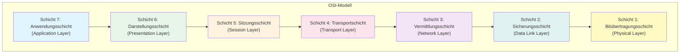
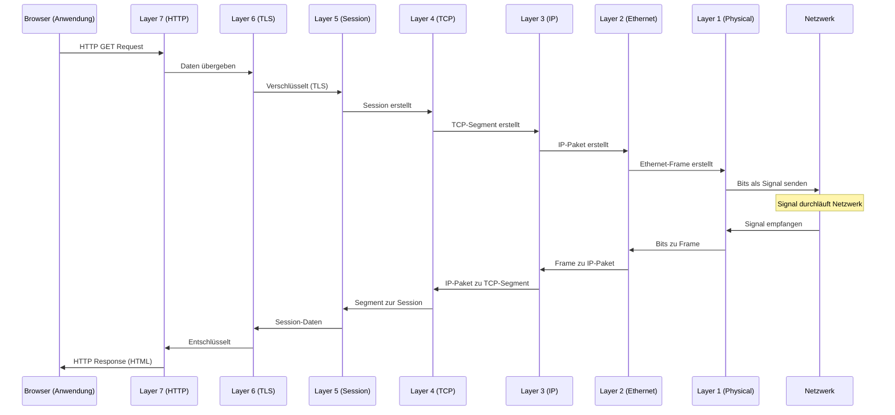
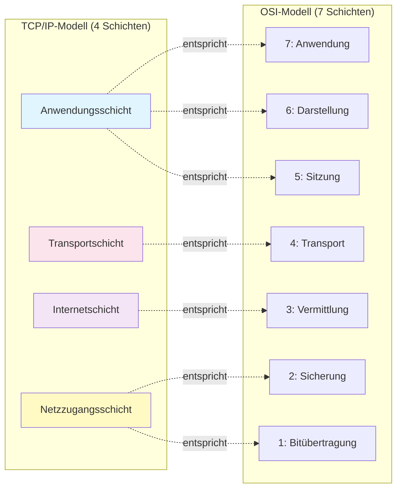
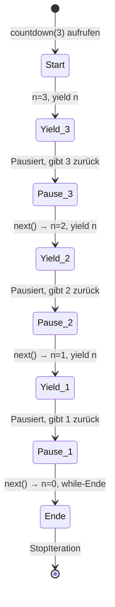
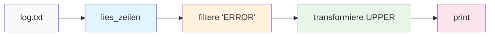
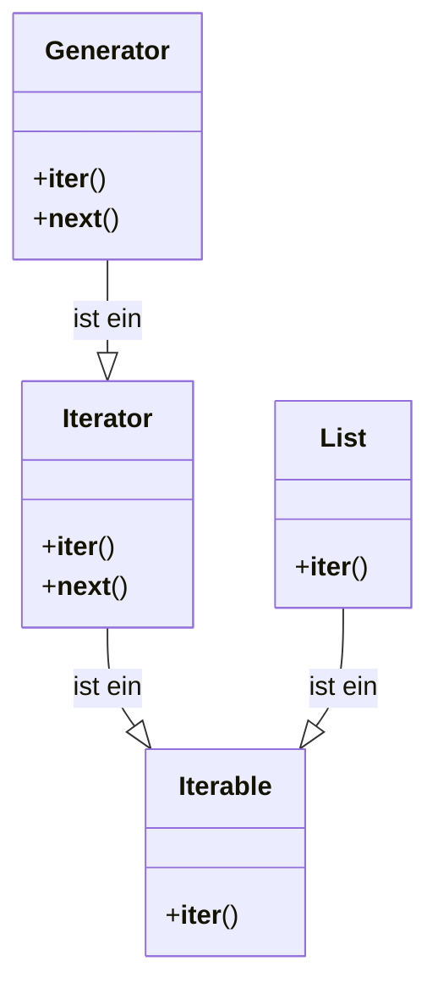

# V15: Netzwerktechnik Grundlagen & Protokolle – Teil 1

> [!NOTE]
> **Lernziele dieser Vorlesung**:
> - Das **OSI-Modell** mit seinen 7 Schichten verstehen und erklären können
> - Den Unterschied zwischen **OSI-Modell** und **TCP/IP-Modell** kennen
> - **IP-Adressen** (IPv4 und IPv6) interpretieren und verstehen
> - **Subnetting** mit **CIDR-Notation** durchführen können
> - Speicher-effiziente Dateiverarbeitung in Python anwenden
> - Das **Generator-Konzept** mit `yield` verstehen und einsetzen
> - **CSV-Dateien** mit dem `csv`-Modul verarbeiten
> - Den Unterschied zwischen **Iterator** und **Iterable** kennen

---

## Teil 1: Theorie - Netzwerktechnik Grundlagen & Protokolle

### Überblick

Moderne Softwaresysteme sind untrennbar mit Netzwerkkommunikation verbunden. Ob Web-APIs, Cloud-Dienste, IoT-Geräte oder verteilte Datenbanken – alle basieren auf standardisierten Netzwerkprotokollen. Das Verständnis dieser Grundlagen ist für jeden Informatiker essentiell, um Netzwerkprobleme zu diagnostizieren, sichere Systeme zu entwerfen und performante Anwendungen zu entwickeln.

In diesem ersten Teil der Netzwerktechnik-Vorlesung fokussieren wir uns auf die fundamentalen Konzepte: Wie ist die Netzwerkkommunikation in Schichten organisiert? Wie werden Geräte im Netzwerk adressiert? Wie teilt man Netzwerke in kleinere Teilnetze auf?

Diese Konzepte bilden das Fundament für das Verständnis von Web-Technologien (HTTP/HTTPS), API-Design (REST), Cloud-Computing und verteilten Systemen. Ein solides Verständnis der Netzwerkgrundlagen ermöglicht es, Fehlermeldungen wie "Connection timeout" oder "Network unreachable" zu verstehen und gezielt zu beheben.

### OSI-Modell: 7 Schichten im Detail

Das **OSI-Modell** (Open Systems Interconnection Model) ist ein konzeptionelles Referenzmodell, das beschreibt, wie Netzwerkkommunikation funktioniert. Es wurde in den 1980er Jahren von der **ISO** (International Organization for Standardization) entwickelt und teilt die Kommunikation in sieben Schichten (Layers) auf.

> [!NOTE]
> **OSI-Modell**: Ein konzeptionelles Framework, das Netzwerkkommunikation in sieben hierarchische Schichten unterteilt, wobei jede Schicht spezifische Aufgaben übernimmt und mit den angrenzenden Schichten kommuniziert.

Jede Schicht erfüllt eine klar definierte Aufgabe und kommuniziert nur mit der Schicht direkt über und unter sich. Dieses Konzept nennt man **Abstraktion** – eine Schicht muss nicht wissen, wie die darunterliegenden Schichten ihre Aufgaben erfüllen. Sie nutzt lediglich deren Dienste über definierte Schnittstellen.

#### Die 7 Schichten des OSI-Modells



**Schicht 7: Anwendungsschicht (Application Layer)**

Die oberste Schicht ist die Schnittstelle zwischen Netzwerk und Anwendungsprogrammen. Hier befinden sich Protokolle, die direkt von Anwendungen genutzt werden.

> [!NOTE]
> **Anwendungsschicht**: Die siebte Schicht des OSI-Modells, die Netzwerkdienste für Endbenutzer-Anwendungen bereitstellt. Sie ermöglicht Anwendungen den Zugriff auf Netzwerkressourcen.

**Beispiel-Protokolle:**
- **HTTP/HTTPS** (Hypertext Transfer Protocol): Web-Kommunikation (Surfen im Internet)
- **FTP** (File Transfer Protocol): Dateiübertragung
- **SMTP** (Simple Mail Transfer Protocol): E-Mail-Versand
- **DNS** (Domain Name System): Namensauflösung (www.example.com → IP-Adresse)
- **SSH** (Secure Shell): Sichere Remote-Verbindungen

**Aufgaben:**
- Bereitstellung von Netzwerkdiensten für Anwendungen
- Benutzerschnittstelle zur Netzwerkkommunikation
- Datenformatierung für spezifische Anwendungen (z.B. HTML für Browser)

> [!TIP]
> Wenn du eine Webseite aufrufst, arbeitet dein Browser auf der Anwendungsschicht und nutzt das HTTP-Protokoll, um Daten vom Server anzufordern.

---

**Schicht 6: Darstellungsschicht (Presentation Layer)**

Diese Schicht ist verantwortlich für die Datenrepräsentation. Sie stellt sicher, dass Daten von der Anwendung in einem Format gesendet werden, das die empfangende Anwendung verstehen kann.

> [!NOTE]
> **Darstellungsschicht**: Die sechste Schicht des OSI-Modells, die für Datentransformation, Verschlüsselung und Kompression zuständig ist. Sie übersetzt zwischen anwendungsspezifischen Datenformaten und einem netzwerkweit verständlichen Format.

**Aufgaben:**
- **Datenkodierung/Dekodierung**: Konvertierung zwischen verschiedenen Zeichensätzen (ASCII, UTF-8, EBCDIC)
- **Verschlüsselung/Entschlüsselung**: SSL/TLS für sichere Übertragungen
- **Kompression/Dekompression**: Reduzierung der Datenmenge für schnellere Übertragung
- **Datenformatierung**: JSON, XML, Binärformate

**Beispiel:**
Wenn du eine verschlüsselte HTTPS-Verbindung nutzt, arbeitet die Darstellungsschicht mit TLS (Transport Layer Security), um Daten zu verschlüsseln, bevor sie gesendet werden, und zu entschlüsseln, wenn sie empfangen werden.

---

**Schicht 5: Sitzungsschicht (Session Layer)**

Die Sitzungsschicht verwaltet und koordiniert Kommunikationssitzungen zwischen Anwendungen auf verschiedenen Geräten.

> [!NOTE]
> **Sitzungsschicht**: Die fünfte Schicht des OSI-Modells, die Sitzungen (Sessions) zwischen Anwendungen aufbaut, verwaltet und abbaut. Sie koordiniert den Datenaustausch und ermöglicht Synchronisation und Wiederaufnahme unterbrochener Verbindungen.

**Aufgaben:**
- **Session-Management**: Aufbau, Verwaltung und Beendigung von Sitzungen
- **Synchronisation**: Einfügen von Synchronisationspunkten (Checkpoints) in Datenströme
- **Dialog-Kontrolle**: Festlegung, wer wann senden darf (Halb-Duplex vs. Voll-Duplex)

**Beispiel:**
Bei einer Video-Konferenz sorgt die Sitzungsschicht dafür, dass die Verbindung zwischen allen Teilnehmern koordiniert wird. Wenn die Verbindung kurzzeitig abbricht, können Daten ab einem Checkpoint wiederaufgenommen werden, ohne komplett von vorne beginnen zu müssen.

---

**Schicht 4: Transportschicht (Transport Layer)**

Die Transportschicht ist verantwortlich für die **zuverlässige** oder **unzuverlässige** Ende-zu-Ende-Kommunikation zwischen Anwendungen auf verschiedenen Hosts.

> [!NOTE]
> **Transportschicht**: Die vierte Schicht des OSI-Modells, die für den zuverlässigen Transport von Daten zwischen Endsystemen sorgt. Sie segmentiert Datenströme, stellt Fehlerkorrektur bereit und implementiert Flusskontrolle.

**Hauptprotokolle:**

**TCP (Transmission Control Protocol)**:
- **Verbindungsorientiert**: Vor Datenaustausch wird eine Verbindung aufgebaut (Three-Way Handshake)
- **Zuverlässig**: Garantiert, dass alle Daten ankommen und in der richtigen Reihenfolge
- **Fehlerkorrektur**: Erkennt verlorene Pakete und fordert erneute Übertragung an
- **Flusskontrolle**: Passt Senderate an, um Überlastung zu vermeiden
- **Verwendung**: HTTP, FTP, E-Mail – überall wo Zuverlässigkeit wichtig ist

**UDP (User Datagram Protocol)**:
- **Verbindungslos**: Daten werden ohne vorherigen Verbindungsaufbau gesendet
- **Unzuverlässig**: Keine Garantie für Ankunft oder Reihenfolge
- **Kein Overhead**: Schneller als TCP, da keine Bestätigungen gesendet werden
- **Verwendung**: Video-Streaming, Online-Gaming, DNS – überall wo Geschwindigkeit wichtiger als Vollständigkeit ist

**Port-Nummern:**
Die Transportschicht nutzt **Ports**, um verschiedene Anwendungen auf demselben Host zu unterscheiden. Ein Port ist eine 16-Bit-Zahl (0-65535).

- **Well-Known Ports** (0-1023): Reserviert für Standarddienste (z.B. HTTP: 80, HTTPS: 443, SSH: 22, FTP: 21)
- **Registered Ports** (1024-49151): Für spezifische Anwendungen registriert
- **Dynamic/Private Ports** (49152-65535): Für temporäre Verbindungen

> [!TIP]
> Die Kombination aus **IP-Adresse** und **Port** wird als **Socket** bezeichnet. Beispiel: `192.168.1.100:8080` bedeutet IP-Adresse `192.168.1.100` und Port `8080`.

---

**Schicht 3: Vermittlungsschicht (Network Layer)**

Die Vermittlungsschicht ist verantwortlich für das **Routing** – die Weiterleitung von Datenpaketen über mehrere Netzwerke hinweg zum Zielhost.

> [!NOTE]
> **Vermittlungsschicht**: Die dritte Schicht des OSI-Modells, die für die logische Adressierung (IP-Adressen) und das Routing von Datenpaketen durch verschiedene Netzwerke zuständig ist. Sie findet den optimalen Pfad vom Sender zum Empfänger.

**Hauptprotokoll: IP (Internet Protocol)**

Das **Internet Protocol** ist das zentrale Protokoll dieser Schicht. Es definiert, wie Pakete adressiert, formatiert und durch das Netzwerk geleitet werden.

**Zwei Versionen:**
- **IPv4**: 32-Bit-Adressen (ca. 4,3 Milliarden eindeutige Adressen)
- **IPv6**: 128-Bit-Adressen (praktisch unendlich viele Adressen)

**Aufgaben:**
- **Logische Adressierung**: Zuweisung von IP-Adressen zu Geräten
- **Routing**: Bestimmung des besten Pfades durch das Netzwerk
- **Paketweiterleitung**: Versenden von Paketen zum nächsten Hop (Router)
- **Fragmentierung**: Aufteilen zu großer Pakete für kleinere Netzwerke

**Weitere Protokolle:**
- **ICMP** (Internet Control Message Protocol): Fehlermeldungen und Diagnose (z.B. `ping`)
- **ARP** (Address Resolution Protocol): Auflösung von IP-Adressen zu MAC-Adressen
- **Routing-Protokolle**: OSPF, BGP – für automatisches Routing in großen Netzwerken

---

**Schicht 2: Sicherungsschicht (Data Link Layer)**

Die Sicherungsschicht stellt zuverlässige Punkt-zu-Punkt-Verbindungen zwischen direkt verbundenen Geräten bereit und erkennt Übertragungsfehler.

> [!NOTE]
> **Sicherungsschicht**: Die zweite Schicht des OSI-Modells, die für die fehlerfreie Übertragung von Datenpaketen (Frames) zwischen direkt verbundenen Knoten sorgt. Sie verwendet physikalische Adressen (MAC-Adressen) und implementiert Fehlererkennung.

**Aufgaben:**
- **Framing**: Strukturierung von Bitströmen in Rahmen (Frames) mit Start- und Ende-Markierungen
- **Physikalische Adressierung**: Verwendung von **MAC-Adressen** (Media Access Control) zur Identifikation von Netzwerkkarten
- **Fehlererkennung**: CRC (Cyclic Redundancy Check) zur Prüfung auf beschädigte Frames
- **Medienzugriffskontrolle**: Regelung, wann Geräte auf das gemeinsame Medium zugreifen dürfen (z.B. CSMA/CD bei Ethernet)

**MAC-Adresse:**
Eine **MAC-Adresse** ist eine weltweit eindeutige 48-Bit-Adresse (dargestellt als 6 Hexadezimal-Paare, z.B. `00:1A:2B:3C:4D:5E`), die fest in die Netzwerkkarte eingebrannt ist.

**Wichtiger Unterschied:**
- **IP-Adresse**: Logische Adresse, kann sich ändern (z.B. bei DHCP)
- **MAC-Adresse**: Physikalische Adresse, fest zugeordnet, ändert sich nie

---

**Schicht 1: Bitübertragungsschicht (Physical Layer)**

Die unterste Schicht ist verantwortlich für die physikalische Übertragung von Rohdaten (Bits) über das Übertragungsmedium.

> [!NOTE]
> **Bitübertragungsschicht**: Die erste Schicht des OSI-Modells, die die physikalischen Eigenschaften der Datenübertragung definiert. Sie legt fest, wie Bits als elektrische, optische oder Funksignale über ein Medium übertragen werden.

**Aufgaben:**
- **Signalübertragung**: Umwandlung von Bits in elektrische, optische oder Funksignale
- **Übertragungsmedium**: Spezifikation des Kabels, der Wellenlänge, der Frequenz
- **Bitrate**: Festlegung der Datenrate (z.B. 1 Gbit/s)
- **Topologie**: Physikalischer Aufbau (Stern, Bus, Ring, Mesh)

**Beispiele für Übertragungsmedien:**
- **Kupferkabel**: Ethernet (CAT5e, CAT6), Telefonleitungen (DSL)
- **Glasfaser**: Hohe Bandbreite, große Reichweite, immun gegen elektromagnetische Störungen
- **Funk**: WLAN (IEEE 802.11), Bluetooth, LTE/5G

**Hardware:**
- Netzwerkkarten (NICs)
- Kabel, Stecker, Repeater
- Hubs (veraltet, arbeiten auf Physical Layer und senden Daten an alle Ports)

---

#### Zusammenspiel der Schichten

Wenn du eine Webseite aufrufst, durchläuft deine Anfrage alle sieben Schichten von oben nach unten beim Senden und von unten nach oben beim Empfangen:



**Encapsulation (Verkapselung):**

Beim Senden werden Daten auf jeder Schicht mit einem **Header** (Kopfdaten) versehen, der Informationen für diese Schicht enthält:

```
[App-Daten] 
→ [HTTP-Header | App-Daten]
→ [TCP-Header | HTTP-Header | App-Daten]
→ [IP-Header | TCP-Header | HTTP-Header | App-Daten]
→ [Ethernet-Header | IP-Header | TCP-Header | HTTP-Header | App-Daten | Ethernet-Trailer]
```

Beim Empfangen werden die Header Schicht für Schicht entfernt (**De-Encapsulation**), bis die ursprünglichen Anwendungsdaten übrig bleiben.

> [!WARNING]
> **Häufiges Missverständnis**: Das OSI-Modell ist ein **Referenzmodell**, keine exakte Implementierung. In der Praxis werden manche Schichten zusammengefasst oder übersprungen. Moderne Netzwerke nutzen hauptsächlich das TCP/IP-Modell, das nur vier Schichten hat.

---

### TCP/IP-Modell im Vergleich

Das **TCP/IP-Modell** (auch Internet Protocol Suite genannt) ist das praktisch eingesetzte Modell im modernen Internet. Es wurde in den 1970er Jahren vom US-Verteidigungsministerium entwickelt und ist weniger abstrakt als das OSI-Modell.

> [!NOTE]
> **TCP/IP-Modell**: Ein vierschichtiges Netzwerkmodell, das die praktische Implementierung von Netzwerkprotokollen im Internet beschreibt. Es kombiniert mehrere OSI-Schichten zu funktionalen Einheiten.

#### Die 4 Schichten des TCP/IP-Modells



**Schicht 4: Anwendungsschicht (Application Layer)**
- Kombiniert OSI-Schichten 5, 6 und 7
- Enthält alle anwendungsorientierten Protokolle: HTTP, FTP, SMTP, DNS, SSH, etc.
- Direkte Schnittstelle zu Anwendungsprogrammen

**Schicht 3: Transportschicht (Transport Layer)**
- Entspricht OSI-Schicht 4
- Hauptprotokolle: **TCP** und **UDP**
- Zuständig für Ende-zu-Ende-Verbindungen zwischen Prozessen

**Schicht 2: Internetschicht (Internet Layer)**
- Entspricht OSI-Schicht 3 (Vermittlungsschicht)
- Hauptprotokoll: **IP** (IPv4, IPv6)
- Zusätzlich: **ICMP**, **ARP**
- Routing und logische Adressierung

**Schicht 1: Netzzugangsschicht (Network Access Layer / Link Layer)**
- Kombiniert OSI-Schichten 1 und 2
- Umfasst physikalische Übertragung und Data Link (z.B. Ethernet, WLAN)
- Hardware-Adressierung (MAC-Adressen)

#### Warum zwei Modelle?

**OSI-Modell:**
- ✅ Detaillierter, klare Trennung von Aufgaben
- ✅ Gut für Lehre und Fehlerbehebung (jede Schicht kann isoliert betrachtet werden)
- ❌ Komplex, in der Praxis oft zu granular

**TCP/IP-Modell:**
- ✅ Einfacher, praktischer
- ✅ Spiegelt reale Implementierung wider
- ✅ Flexibler (Anwendungsschicht fasst mehrere Funktionen zusammen)
- ❌ Weniger präzise Abgrenzung zwischen Schichten

**In der Praxis:**
- Netzwerk-Ingenieure nutzen Terminologie aus beiden Modellen
- Bei Diagnose: "Problem auf Layer 3" → IP-Routing-Problem
- Bei Entwicklung: "TCP-Socket" → Transportschicht-API

---

### IP-Adressen: IPv4 und IPv6

Die **IP-Adresse** ist die logische Adresse eines Geräts in einem Netzwerk. Sie ist das zentrale Element der Vermittlungsschicht (Layer 3) und ermöglicht das Routing von Paketen über verschiedene Netzwerke hinweg.

#### IPv4-Adressen

> [!NOTE]
> **IPv4-Adresse**: Eine 32-Bit-Adresse, die ein Gerät im Netzwerk eindeutig identifiziert. Sie wird in vier Dezimal-Oktetten (0-255) dargestellt, getrennt durch Punkte, z.B. `192.168.1.10`.

**Struktur:**
- 32 Bits insgesamt = 4 Bytes
- Jedes Byte (8 Bits) wird als Dezimalzahl (0-255) dargestellt
- Notation: `A.B.C.D` (z.B. `192.168.1.1`)

**Binäre Darstellung:**
```
IP: 192.168.1.1

Dezimal:  192      .  168      .  1        .  1
Binär:    11000000 .  10101000 .  00000001 .  00000001
```

**Adressraum:**
- 32 Bit → 2³² = **4.294.967.296** mögliche Adressen
- In der Praxis: Viele Adressen sind reserviert (siehe Adressklassen)
- **Problem**: Adressmangel → Deshalb wurde IPv6 entwickelt

**Private vs. Öffentliche IP-Adressen:**

**Private IP-Adressen** (RFC 1918):
- Werden innerhalb privater Netzwerke (z.B. Heimnetzwerke, Firmennetzwerke) verwendet
- Sind **nicht** im öffentlichen Internet routbar
- Können beliebig oft wiederverwendet werden (in verschiedenen Netzwerken)

**Reservierte private Bereiche:**
- `10.0.0.0` - `10.255.255.255` (10.0.0.0/8) – 16,7 Millionen Adressen
- `172.16.0.0` - `172.31.255.255` (172.16.0.0/12) – 1 Million Adressen
- `192.168.0.0` - `192.168.255.255` (192.168.0.0/16) – 65.536 Adressen

**Öffentliche IP-Adressen:**
- Weltweit eindeutig
- Werden vom **ISP** (Internet Service Provider) oder **IANA** (Internet Assigned Numbers Authority) vergeben
- Notwendig, um im öffentlichen Internet erreichbar zu sein

**NAT (Network Address Translation):**
Um den Adressmangel zu mildern, nutzen Router **NAT**, um mehrere private IP-Adressen auf eine öffentliche IP-Adresse abzubilden. Alle Geräte in deinem Heimnetzwerk (z.B. `192.168.1.x`) nutzen die gleiche öffentliche IP deines Routers für Kommunikation mit dem Internet.

> [!TIP]
> Du kannst deine öffentliche IP-Adresse herausfinden, indem du eine Webseite wie [https://whatismyipaddress.com](https://whatismyipaddress.com) besuchst. Deine lokale IP (z.B. `192.168.1.5`) siehst du mit dem Befehl `ipconfig` (Windows) oder `ifconfig`/`ip a` (Linux/Mac).

**Spezielle IPv4-Adressen:**

| Adresse/Bereich | Bedeutung |
|-----------------|-----------|
| `0.0.0.0` | Netzwerk selbst / "Alle Interfaces" (beim Server-Binding) |
| `127.0.0.0/8` | **Loopback** – Adressiert das eigene Gerät (`127.0.0.1` = localhost) |
| `169.254.0.0/16` | **APIPA** (Automatic Private IP Addressing) – Automatisch zugewiesen, wenn kein DHCP-Server vorhanden |
| `255.255.255.255` | **Broadcast** – Sendet an alle Geräte im lokalen Netzwerk |

---

#### IPv6-Adressen

> [!NOTE]
> **IPv6-Adresse**: Eine 128-Bit-Adresse, die ein Gerät im Netzwerk eindeutig identifiziert. Sie wird in acht Hexadezimal-Gruppen dargestellt, getrennt durch Doppelpunkte, z.B. `2001:0db8:85a3:0000:0000:8a2e:0370:7334`.

**Warum IPv6?**
- IPv4-Adressmangel (nur ~4,3 Milliarden Adressen, viele davon reserviert)
- Wachsende Anzahl von Geräten (Smartphones, IoT, Smart Home, etc.)
- Vereinfachtes Routing (effizientere Header-Struktur)
- Bessere Sicherheit (IPsec ist verpflichtend)

**Struktur:**
- 128 Bits insgesamt = 16 Bytes
- Notation: Acht 16-Bit-Gruppen in Hexadezimal, getrennt durch `:` (z.B. `2001:0db8:85a3:0000:0000:8a2e:0370:7334`)
- Adressraum: 2¹²⁸ ≈ **340 Sextillionen** Adressen (genug für jedes Sandkorn auf der Erde)

**Schreibweisen und Vereinfachungen:**

**Regel 1: Führende Nullen weglassen**
```
Original:  2001:0db8:0000:0000:0000:0000:0000:0001
Verkürzt:  2001:db8:0:0:0:0:0:1
```

**Regel 2: Eine zusammenhängende Gruppe von Nullen durch `::` ersetzen**
```
Verkürzt:  2001:db8:0:0:0:0:0:1
Kürzeste:  2001:db8::1
```

> [!WARNING]
> **Achtung**: `::` darf nur **einmal** in einer Adresse vorkommen! Sonst wäre nicht klar, wie viele Null-Gruppen an welcher Stelle sind. `2001::85a3::7334` ist **ungültig**.

**Weitere Beispiele:**
```
Vollständig: 2001:0db8:0000:0000:0000:ff00:0042:8329
Optimal:     2001:db8::ff00:42:8329

Vollständig: fe80:0000:0000:0000:0000:0000:0000:0001
Optimal:     fe80::1

Vollständig: 0000:0000:0000:0000:0000:0000:0000:0001
Optimal:     ::1 (Loopback-Adresse, entspricht 127.0.0.1 bei IPv4)
```

**Wichtige IPv6-Adressbereiche:**

| Präfix | Bedeutung |
|--------|-----------|
| `::1/128` | **Loopback** (localhost) |
| `fe80::/10` | **Link-Local** – Nur im lokalen Netzwerksegment gültig, nicht routbar |
| `fc00::/7` | **Unique Local** – Privat, entspricht IPv4 private addresses |
| `2000::/3` | **Global Unicast** – Öffentliche Adressen, routbar im Internet |
| `ff00::/8` | **Multicast** – Nachricht an eine Gruppe von Empfängern |

**IPv4 vs. IPv6 im Überblick:**

| Eigenschaft | IPv4 | IPv6 |
|-------------|------|------|
| Adresslänge | 32 Bit | 128 Bit |
| Notation | Dezimal mit Punkten | Hexadezimal mit Doppelpunkten |
| Anzahl Adressen | ~4,3 Milliarden | ~340 Sextillionen |
| Header-Größe | Variabel (20-60 Bytes) | Fix (40 Bytes) |
| NAT erforderlich | Ja (wegen Adressmangel) | Nein (genug Adressen) |
| Broadcast | Ja | Nein (Multicast stattdessen) |
| IPsec | Optional | Verpflichtend |
| Loopback | `127.0.0.1` | `::1` |

---

### Subnetting und CIDR-Notation

**Subnetting** ist die Aufteilung eines großen Netzwerks in kleinere Teilnetze (Subnetze). Dies verbessert die Netzwerkeffizienz, Sicherheit und Organisation.

#### Warum Subnetting?

**Vorteile:**
- **Reduzierung von Broadcast-Traffic**: Broadcasts werden nur im eigenen Subnetz gesendet, nicht im gesamten Netzwerk
- **Verbesserte Sicherheit**: Verschiedene Abteilungen können in separaten Subnetzen isoliert werden
- **Effizientere IP-Adressverwaltung**: Nur so viele Adressen wie benötigt pro Subnetz
- **Bessere Organisation**: Logische Gruppierung von Geräten (z.B. Server-Netz, User-Netz, Gäste-Netz)

#### Klassische Subnetzmaske

> [!NOTE]
> **Subnetzmaske**: Eine 32-Bit-Zahl, die angibt, welcher Teil einer IP-Adresse das Netzwerk und welcher Teil den Host identifiziert. Sie wird oft in Dezimal-Notation dargestellt (z.B. `255.255.255.0`) oder als Präfixlänge in CIDR-Notation (z.B. `/24`).

Eine Subnetzmaske teilt eine IP-Adresse in zwei Teile:
1. **Netzwerk-Teil** (Network ID): Identifiziert das Netzwerk
2. **Host-Teil** (Host ID): Identifiziert das Gerät innerhalb des Netzwerks

**Beispiel:**
```
IP-Adresse:     192.168.1.10
Subnetzmaske:   255.255.255.0
Binär (Maske):  11111111.11111111.11111111.00000000

Netzwerk-Teil:  192.168.1      (erste 24 Bits)
Host-Teil:      10             (letzte 8 Bits)
```

**Klassische Subnetzmasken:**

| Maske | Binär | CIDR | Anzahl Hosts | Typische Verwendung |
|-------|-------|------|-------------|---------------------|
| `255.0.0.0` | `11111111.00000000.00000000.00000000` | /8 | 16.777.214 | Sehr große Netzwerke (Class A) |
| `255.255.0.0` | `11111111.11111111.00000000.00000000` | /16 | 65.534 | Große Netzwerke (Class B) |
| `255.255.255.0` | `11111111.11111111.11111111.00000000` | /24 | 254 | Kleine Netzwerke (Class C), Standard-Heimnetzwerke |
| `255.255.255.128` | `11111111.11111111.11111111.10000000` | /25 | 126 | Kleine Subnetze |
| `255.255.255.192` | `11111111.11111111.11111111.11000000` | /26 | 62 | Sehr kleine Subnetze |

> [!NOTE]
> **Anzahl nutzbarer Hosts**: Aus 2ⁿ - 2, wobei n die Anzahl der Host-Bits ist. Die beiden abgezogenen Adressen sind die Netzwerkadresse (alle Host-Bits = 0) und die Broadcast-Adresse (alle Host-Bits = 1).

#### CIDR-Notation (Classless Inter-Domain Routing)

> [!NOTE]
> **CIDR-Notation**: Eine kompakte Schreibweise für IP-Adressen mit Subnetzmaske, bei der die Anzahl der Netzwerk-Bits als Suffix angegeben wird. Format: `IP-Adresse/Präfixlänge`, z.B. `192.168.1.0/24`.

**CIDR** (Classless Inter-Domain Routing) ist ein flexibles Verfahren zur IP-Adresszuweisung, das die veralteten Adressklassen (Class A, B, C) ersetzt. Es ermöglicht beliebige Subnetzgrößen.

**Syntax:**
```
192.168.1.0/24
```

- `192.168.1.0`: Netzwerkadresse
- `/24`: **Präfixlänge** – die ersten 24 Bits sind der Netzwerk-Teil

**Berechnung der Anzahl Hosts:**

Präfixlänge `/n` → `32 - n` Bits für Hosts → `2^(32-n) - 2` nutzbare Adressen

**Beispiele:**

| CIDR | Subnetzmaske | Netzwerk-Bits | Host-Bits | Anzahl Hosts | Netzwerke |
|------|-------------|---------------|-----------|-------------|-----------|
| /8 | 255.0.0.0 | 8 | 24 | 16.777.214 | 256 |
| /16 | 255.255.0.0 | 16 | 16 | 65.534 | 65.536 |
| /24 | 255.255.255.0 | 24 | 8 | 254 | 16.777.216 |
| /25 | 255.255.255.128 | 25 | 7 | 126 | 2x /24 |
| /26 | 255.255.255.192 | 26 | 6 | 62 | 4x /24 |
| /27 | 255.255.255.224 | 27 | 5 | 30 | 8x /24 |
| /28 | 255.255.255.240 | 28 | 4 | 14 | 16x /24 |
| /29 | 255.255.255.248 | 29 | 3 | 6 | 32x /24 |
| /30 | 255.255.255.252 | 30 | 2 | 2 | 64x /24 |

#### Praktisches Beispiel: Subnetting durchführen

**Szenario:**
Ein Unternehmen hat das Netzwerk `192.168.10.0/24` erhalten. Es soll in vier gleich große Subnetze aufgeteilt werden (für Abteilungen: IT, Verwaltung, Produktion, Gäste).

**Schritt 1: Anzahl benötigter Subnetze berechnen**
- 4 Subnetze benötigt
- Für 4 Subnetze: 2² = 4 → **2 zusätzliche Bits** für Subnetz-ID

**Schritt 2: Neue Präfixlänge berechnen**
- Original: `/24`
- Zusätzliche Bits: `2`
- Neue Präfixlänge: `/24 + 2 = /26`

**Schritt 3: Hosts pro Subnetz berechnen**
- Host-Bits: `32 - 26 = 6`
- Anzahl Hosts: `2⁶ - 2 = 64 - 2 = 62` nutzbare Adressen

**Schritt 4: Subnetz-Bereiche ermitteln**

Subnetzmaske `/26` = `255.255.255.192`  
Inkrement (Block-Größe): `256 - 192 = 64`

| Subnetz | Netzwerkadresse | Erste nutzbare IP | Letzte nutzbare IP | Broadcast-Adresse | Verwendung |
|---------|----------------|-------------------|-------------------|-------------------|-----------|
| 1 | `192.168.10.0/26` | `192.168.10.1` | `192.168.10.62` | `192.168.10.63` | IT-Abteilung |
| 2 | `192.168.10.64/26` | `192.168.10.65` | `192.168.10.126` | `192.168.10.127` | Verwaltung |
| 3 | `192.168.10.128/26` | `192.168.10.129` | `192.168.10.190` | `192.168.10.191` | Produktion |
| 4 | `192.168.10.192/26` | `192.168.10.193` | `192.168.10.254` | `192.168.10.255` | Gäste |

> [!TIP]
> **Merkhilfe für Subnetting**:
> - Netzwerkadresse: Alle Host-Bits auf 0
> - Broadcast-Adresse: Alle Host-Bits auf 1
> - Erste nutzbare IP: Netzwerkadresse + 1
> - Letzte nutzbare IP: Broadcast-Adresse - 1

#### Subnetting-Cheat-Sheet

**Schnellreferenz für häufige CIDR-Notationen:**

```
/30 → 2 Hosts   (Point-to-Point-Verbindungen)
/29 → 6 Hosts
/28 → 14 Hosts
/27 → 30 Hosts
/26 → 62 Hosts  (kleines Büro)
/25 → 126 Hosts
/24 → 254 Hosts (Standard-Heimnetzwerk)
/23 → 510 Hosts
/22 → 1022 Hosts
/21 → 2046 Hosts
/20 → 4094 Hosts
```

**Berechnung im Kopf:**
1. Hosts benötigt? → Nächstgrößere Zweierpotenz - 2
2. Beispiel: 50 Hosts → 2⁶ = 64 - 2 = 62 Hosts → `/26` (32 - 6 = 26)

> [!WARNING]
> **Häufige Fehler beim Subnetting**:
> - **Netzwerk- und Broadcast-Adresse vergessen**: Diese können nicht für Hosts verwendet werden!
> - **Überlappende Subnetze**: Wenn du manuell Subnetze definierst, achte darauf, dass sich Bereiche nicht überschneiden.
> - **Falsche Präfixlänge**: `/24` teilt bei `192.168.1.0` das Netzwerk korrekt, aber `/25` würde es halbieren.

---

### Zusammenfassung Theorie

Dieser erste Teil der Netzwerktechnik-Vorlesung hat die fundamentalen Konzepte der Netzwerkkommunikation behandelt:

**OSI-Modell (7 Schichten):**
Das OSI-Modell bietet ein strukturiertes Framework zur Beschreibung von Netzwerkkommunikation. Jede der sieben Schichten (Physical, Data Link, Network, Transport, Session, Presentation, Application) hat klar definierte Aufgaben und kommuniziert nur mit angrenzenden Schichten. Dieses Konzept der Abstraktion ermöglicht modulare Netzwerktechnologien und erleichtert Fehlerdiagnose.

**TCP/IP-Modell (4 Schichten):**
Das TCP/IP-Modell ist die praktische Umsetzung, die im modernen Internet verwendet wird. Es fasst die sieben OSI-Schichten zu vier funktionalen Einheiten zusammen (Network Access, Internet, Transport, Application) und spiegelt die tatsächliche Implementierung von Netzwerkprotokollen wider.

**IP-Adressierung:**
IP-Adressen sind die logischen Adressen, die Geräte im Netzwerk eindeutig identifizieren. IPv4 verwendet 32-Bit-Adressen (ca. 4,3 Milliarden), während IPv6 mit 128-Bit-Adressen praktisch unbegrenzte Adressierungsmöglichkeiten bietet. Private IP-Bereiche ermöglichen die Wiederverwendung von Adressen in lokalen Netzwerken, während NAT die Verbindung zum öffentlichen Internet herstellt.

**Subnetting mit CIDR:**
Subnetting teilt große Netzwerke in kleinere, besser verwaltbare Teilnetze auf. Die CIDR-Notation (`IP/Präfixlänge`) bietet eine flexible Möglichkeit, die Größe von Subnetzen zu definieren. Durch Subnetting werden Netzwerkeffizienz, Sicherheit und Organisation verbessert.

Diese Grundlagen bilden das Fundament für das Verständnis fortgeschrittener Netzwerktechnologien wie Routing-Protokolle, VPNs, Firewalls und Cloud-Networking, die in Teil 2 dieser Vorlesung behandelt werden.

---

## Teil 2: Python Praxis - Große Datenmengen verarbeiten – Teil 1

### Überblick

In der realen Softwareentwicklung arbeiten wir häufig mit großen Datenmengen – Log-Dateien mit Millionen von Zeilen, CSV-Exporte aus Datenbanken mit Gigabyte-Größe, Sensor-Daten von IoT-Geräten oder Netzwerk-Traffic-Analysen. Das naive Einlesen solcher Dateien mit `file.read()` oder `file.readlines()` führt schnell zu **Memory Errors**, da der gesamte Dateiinhalt in den Arbeitsspeicher geladen wird.

Python bietet elegante Mechanismen, um mit großen Datenmengen **speicher-effizient** zu arbeiten: **Generatoren** mit dem `yield`-Keyword, das **Iterator-Protokoll** und spezialisierte Module wie `csv`. Diese Techniken ermöglichen es, selbst terabyte-große Dateien zu verarbeiten, ohne den Arbeitsspeicher zu überlasten.

In diesem Praxis-Teil lernen wir:
- **Speicher-effizientes Einlesen** von Dateien Zeile für Zeile
- Das **Generator-Konzept** mit `yield` zur lazy evaluation
- Den Unterschied zwischen **Iterator** und **Iterable**
- **CSV-Dateien** mit dem `csv`-Modul verarbeiten

Diese Techniken sind unerlässlich für Data Science, Backend-Entwicklung, Log-Analyse und alle Bereiche, in denen große Datenmengen anfallen.

---

### Speicher-effizientes Datei-Einlesen

#### Problem: Naive Ansätze

**Methode 1: Gesamte Datei in Speicher laden**

```python
# ❌ SCHLECHT bei großen Dateien
with open("huge_log.txt", "r") as datei:
    inhalt = datei.read()  # Lädt ALLES in den RAM
    for zeile in inhalt.split("\n"):
        verarbeite(zeile)
```

> [!WARNING]
> **Problem**: Wenn `huge_log.txt` 10 GB groß ist, benötigt dein Programm mindestens 10 GB RAM. Bei mehreren solchen Operationen parallel kommt es zum **MemoryError** oder System-Freeze.

**Methode 2: readlines() – immer noch problematisch**

```python
# ❌ BESSER, aber immer noch problematisch
with open("huge_log.txt", "r") as datei:
    zeilen = datei.readlines()  # Liste mit ALLEN Zeilen im RAM
    for zeile in zeilen:
        verarbeite(zeile)
```

> [!WARNING]
> **Problem**: `.readlines()` erstellt eine Liste mit allen Zeilen. Bei 10 Millionen Zeilen entstehen 10 Millionen String-Objekte im Speicher – plus die Liste selbst.

#### Lösung: Zeile für Zeile iterieren

**Datei-Objekte sind iterierbar!**

File-Objekte in Python implementieren das **Iterator-Protokoll** und können direkt in `for`-Schleifen verwendet werden. Dabei wird **nur eine Zeile zur Zeit** in den Speicher geladen.

> [!NOTE]
> **Iterator-Protokoll**: Ein Programmierkonzept, bei dem Objekte Elemente nacheinander (sequenziell) bereitstellen, ohne alle Elemente gleichzeitig im Speicher zu halten. Implementiert durch die Methoden `__iter__()` und `__next__()`.

```python
# ✅ RICHTIG: Speicher-effizient
with open("huge_log.txt", "r", encoding="utf-8") as datei:
    for zeile in datei:  # Lädt nur EINE Zeile zur Zeit
        zeile = zeile.strip()  # Entfernt \n am Ende
        verarbeite(zeile)
```

**Wie funktioniert das?**

Intern ruft Python bei jedem Schleifendurchlauf `__next__()` auf dem File-Objekt auf. Diese Methode liest die nächste Zeile aus der Datei und gibt sie zurück. Erst wenn keine Zeilen mehr vorhanden sind, wirft sie `StopIteration` und die Schleife endet.

```mermaid
sequenceDiagram
    participant Loop as for-Schleife
    participant File as File-Objekt
    participant Disk as Festplatte
    
    Loop->>File: __next__()
    File->>Disk: Lese Zeile 1
    Disk-->>File: "Zeile 1\n"
    File-->>Loop: "Zeile 1\n"
    
    Loop->>File: __next__()
    File->>Disk: Lese Zeile 2
    Disk-->>File: "Zeile 2\n"
    File-->>Loop: "Zeile 2\n"
    
    Note over Loop,File: ... weitere Zeilen ...
    
    Loop->>File: __next__()
    File->>Disk: Lese nächste Zeile
    Disk-->>File: EOF (End of File)
    File-->>Loop: StopIteration
    Note over Loop: Schleife endet
```

**Speicherverbrauch:**
- Naive Methode (`read()`): **Gesamte Datei** im RAM (z.B. 10 GB)
- Iterator-Methode: **Eine Zeile** im RAM (typisch < 1 KB)
- **Faktor**: ~10.000.000x weniger Speicher!

> [!TIP]
> **Best Practice**: Verwende **immer** die Iterator-Methode für große Dateien. Sie ist nicht nur speicher-effizienter, sondern oft auch schneller, da die Verarbeitung parallel zum Einlesen stattfinden kann (Pipelining).

#### Praktisches Beispiel: Log-Analyse

```python
def analysiere_access_log(dateiname):
    """
    Analysiert eine Apache Access-Log-Datei und zählt HTTP-Statuscodes.
    Speicher-effizient, funktioniert auch bei GB-großen Logs.
    """
    statuscodes = {}
    zeilen_gezaehlt = 0
    
    with open(dateiname, "r", encoding="utf-8") as log:
        for zeile in log:  # Zeile für Zeile
            zeilen_gezaehlt += 1
            
            # Extrahiere Statuscode (z.B. "200", "404")
            # Typisches Format: ... "GET /path HTTP/1.1" 200 1234
            teile = zeile.split()
            if len(teile) >= 9:
                statuscode = teile[8]  # Position des Statuscodes
                statuscodes[statuscode] = statuscodes.get(statuscode, 0) + 1
    
    print(f"Insgesamt {zeilen_gezaehlt} Zeilen verarbeitet.")
    print("Statuscode-Verteilung:")
    for code in sorted(statuscodes.keys()):
        anzahl = statuscodes[code]
        print(f"  {code}: {anzahl} ({anzahl/zeilen_gezaehlt*100:.2f}%)")

# Verwendung:
analysiere_access_log("access.log")
```

**Ausgabe (Beispiel):**
```
Insgesamt 1523487 Zeilen verarbeitet.
Statuscode-Verteilung:
  200: 1245673 (81.77%)
  301: 156324 (10.26%)
  404: 98234 (6.45%)
  500: 23256 (1.53%)
```

**Speicherverbrauch**: Unabhängig von der Dateigröße nur wenige Kilobyte (für `statuscodes`-Dictionary und aktuelle Zeile).

---

### Generator-Konzept mit yield

#### Was sind Generatoren?

> [!NOTE]
> **Generator**: Eine spezielle Python-Funktion, die mit dem `yield`-Keyword Werte **lazy** (bei Bedarf) produziert, anstatt sie alle auf einmal in einer Liste zurückzugeben. Generatoren implementieren das Iterator-Protokoll automatisch.

Generatoren sind ein mächtiges Konzept für speicher-effiziente Datenverarbeitung. Anstatt eine komplette Liste zu erstellen und zurückzugeben, **produziert** ein Generator Werte **on-the-fly** – nur wenn sie angefordert werden.

**Vergleich: Normale Funktion vs. Generator**

```python
# Normale Funktion: Gibt komplette Liste zurück
def zahlen_liste(n):
    """Erstellt Liste mit Zahlen 0 bis n-1."""
    ergebnis = []
    for i in range(n):
        ergebnis.append(i * i)
    return ergebnis

# Aufruf:
quadrate = zahlen_liste(1000000)  # Liste mit 1 Mio. Elementen im RAM!
for zahl in quadrate:
    print(zahl)


# Generator: Produziert Werte bei Bedarf
def zahlen_generator(n):
    """Generiert Zahlen 0 bis n-1 on-the-fly."""
    for i in range(n):
        yield i * i  # Gibt Wert zurück und pausiert

# Aufruf:
quadrate = zahlen_generator(1000000)  # Nur Generator-Objekt, keine Daten!
for zahl in quadrate:  # Erst hier werden Werte generiert
    print(zahl)
```

**Unterschied:**
- **`return`**: Beendet Funktion und gibt Wert zurück. Bei erneutem Aufruf startet Funktion von vorne.
- **`yield`**: Gibt Wert zurück, aber **pausiert** die Funktion. Beim nächsten Aufruf läuft sie ab der Stelle nach `yield` weiter.

> [!NOTE]
> **`yield`**: Ein Python-Keyword, das eine Funktion zu einem Generator macht. Es gibt einen Wert zurück, behält aber den Funktionszustand bei, sodass die Ausführung beim nächsten Aufruf fortgesetzt werden kann.

#### Wie funktioniert yield intern?

```python
def countdown(n):
    """Generator für Countdown von n bis 1."""
    print("Start!")
    while n > 0:
        yield n  # Pausiert hier und gibt n zurück
        n -= 1
    print("Ende!")

# Generator-Objekt erstellen:
gen = countdown(3)
print(type(gen))  # <class 'generator'>

# Manuell Werte abrufen mit next():
print(next(gen))  # Start! \n 3
print(next(gen))  # 2
print(next(gen))  # 1
print(next(gen))  # Ende! \n StopIteration-Exception
```

**Ablauf:**



1. `countdown(3)` erstellt Generator-Objekt, **führt aber noch keinen Code aus**
2. Erster `next()`-Aufruf: Startet Funktion, läuft bis zum ersten `yield`, gibt `3` zurück und **pausiert**
3. Zweiter `next()`-Aufruf: Fortsetzung nach `yield`, `n -= 1`, erneuter `yield`, gibt `2` zurück und **pausiert**
4. Dritter `next()`-Aufruf: Fortsetzung, `n -= 1`, `yield`, gibt `1` zurück und **pausiert**
5. Vierter `next()`-Aufruf: Fortsetzung, `n -= 1` (n=0), while-Bedingung `False`, Funktion endet, wirft `StopIteration`

> [!TIP]
> In `for`-Schleifen musst du `next()` nicht manuell aufrufen. Python macht das automatisch und fängt `StopIteration` ab, um die Schleife zu beenden.

#### Praktisches Beispiel: Datei filtern

**Szenario**: Du hast eine 50 GB große Log-Datei und möchtest nur Zeilen mit "ERROR" anzeigen.

```python
def zeilen_mit_muster(dateiname, muster):
    """
    Generator, der nur Zeilen zurückgibt, die 'muster' enthalten.
    Speicher-effizient: Lädt nie die gesamte Datei.
    """
    with open(dateiname, "r", encoding="utf-8") as datei:
        for zeile in datei:
            if muster in zeile:
                yield zeile.strip()  # Nur gefilterte Zeilen

# Verwendung:
for error_zeile in zeilen_mit_muster("huge.log", "ERROR"):
    print(error_zeile)
```

**Vorteile:**
- **Kein Speicher-Overhead**: Nur die aktuelle Zeile ist im RAM
- **Lazy Evaluation**: Zeilen werden nur bei Bedarf eingelesen und geprüft
- **Sofortiges Feedback**: Erste Ergebnisse erscheinen sofort, ohne auf vollständiges Einlesen zu warten
- **Pipeline-fähig**: Mehrere Generatoren können verkettet werden

#### Generator-Pipelines

Generatoren können **kombiniert** werden, um komplexe Datenverarbeitungs-Pipelines zu bauen:

```python
def lies_zeilen(dateiname):
    """Generator: Liest Datei Zeile für Zeile."""
    with open(dateiname, "r", encoding="utf-8") as datei:
        for zeile in datei:
            yield zeile.strip()

def filtere(zeilen, muster):
    """Generator: Filtert Zeilen nach Muster."""
    for zeile in zeilen:
        if muster in zeile:
            yield zeile

def transformiere(zeilen):
    """Generator: Wandelt Zeilen in Großbuchstaben um."""
    for zeile in zeilen:
        yield zeile.upper()

# Pipeline aufbauen:
zeilen = lies_zeilen("log.txt")          # Generator 1
errors = filtere(zeilen, "ERROR")        # Generator 2 (nimmt Generator 1)
gross = transformiere(errors)            # Generator 3 (nimmt Generator 2)

# Erst hier wird tatsächlich verarbeitet:
for zeile in gross:
    print(zeile)
```



**Speicherverbrauch**: Nur **eine** Zeile zur Zeit durchläuft die gesamte Pipeline! Die Zwischenergebnisse werden nicht gespeichert.

> [!WARNING]
> **Häufiger Fehler**: Generatoren können nur **einmal** durchlaufen werden! Wenn du versuchst, denselben Generator zweimal zu iterieren, ist er beim zweiten Mal leer.
>
> ```python
> gen = zahlen_generator(5)
> print(list(gen))  # [0, 1, 2, 3, 4]
> print(list(gen))  # [] (Generator ist "erschöpft")
> ```
>
> **Lösung**: Generator erneut erstellen oder Ergebnisse in Liste konvertieren (wenn Speicherplatz vorhanden).

---

### Iterator vs. Iterable

Diese beiden Begriffe werden oft verwechselt, sind aber fundamental unterschiedlich.

#### Iterable (Iterierbares Objekt)

> [!NOTE]
> **Iterable**: Ein Objekt, das die `__iter__()`-Methode implementiert und einen **Iterator** zurückgibt. Iterables können in `for`-Schleifen verwendet werden. Beispiele: Liste, Tupel, String, Dictionary, Set, Generator.

Ein **Iterable** ist ein Objekt, über das man iterieren kann. Es kann **mehrfach** durchlaufen werden (außer bei Generatoren).

**Beispiele für Iterables:**
- Listen: `[1, 2, 3]`
- Strings: `"Hallo"`
- Tupel: `(1, 2, 3)`
- Dictionaries: `{"a": 1, "b": 2}`
- Sets: `{1, 2, 3}`
- `range(10)`
- File-Objekte
- **Generatoren** (besondere Art von Iterable)

**Prüfung:**
```python
from collections.abc import Iterable

print(isinstance([1, 2, 3], Iterable))  # True
print(isinstance("Hallo", Iterable))    # True
print(isinstance(42, Iterable))         # False
```

#### Iterator (Iterator-Objekt)

> [!NOTE]
> **Iterator**: Ein Objekt, das die Methoden `__iter__()` (gibt sich selbst zurück) und `__next__()` (gibt nächstes Element zurück oder wirft `StopIteration`) implementiert. Iteratoren merken sich ihre Position und können nur **vorwärts** bewegt werden.

Ein **Iterator** ist ein Objekt, das den **aktuellen Zustand** einer Iteration speichert. Es weiß, welches Element als nächstes kommt.

**Eigenschaften:**
- Kann nur **vorwärts** bewegt werden (keine Rückwärts-Iteration)
- Kann nur **einmal** durchlaufen werden (danach "erschöpft")
- Implementiert `__next__()` und `__iter__()`

**Beispiel:**
```python
# Liste ist Iterable, aber KEIN Iterator:
liste = [1, 2, 3]
print(hasattr(liste, "__iter__"))  # True
print(hasattr(liste, "__next__"))  # False → KEIN Iterator

# Iterator aus Iterable erstellen:
iterator = iter(liste)  # Ruft liste.__iter__() auf
print(type(iterator))   # <class 'list_iterator'>
print(hasattr(iterator, "__next__"))  # True → IST Iterator

# Manuell durchiterieren:
print(next(iterator))  # 1
print(next(iterator))  # 2
print(next(iterator))  # 3
print(next(iterator))  # StopIteration-Exception
```

#### Der Unterschied

| Aspekt | Iterable | Iterator |
|--------|----------|----------|
| **Definition** | Objekt, über das iteriert werden kann | Objekt, das den Iterationszustand hält |
| **Methoden** | `__iter__()` | `__iter__()` + `__next__()` |
| **Mehrfach durchlaufen** | Ja (außer Generatoren) | Nein (einmal erschöpft) |
| **Beispiele** | Liste, Tupel, String, Dict, Set | `list_iterator`, Generator-Objekt |
| **Verhalten** | Gibt Iterator zurück | Gibt nächstes Element zurück |

**Beziehung:**
```python
# Jedes Iterable kann einen Iterator erzeugen:
iterable = [1, 2, 3]
iterator = iter(iterable)  # Ruft iterable.__iter__() auf

# Jeder Iterator ist auch ein Iterable (gibt sich selbst zurück):
print(iter(iterator) is iterator)  # True
```



> [!TIP]
> **Merksatz**: Jeder **Iterator** ist ein **Iterable**, aber nicht jedes **Iterable** ist ein **Iterator**.  
> - **Liste**: Iterable, aber kein Iterator (kann mehrfach durchlaufen werden)
> - **Generator**: Beides (Iterator + Iterable, kann nur einmal durchlaufen werden)

#### Praktisches Beispiel: Eigener Iterator

```python
class CountDown:
    """Iterator-Klasse für Countdown."""
    
    def __init__(self, start):
        self.current = start
    
    def __iter__(self):
        # Iterator gibt sich selbst zurück
        return self
    
    def __next__(self):
        if self.current <= 0:
            raise StopIteration  # Iteration beenden
        
        value = self.current
        self.current -= 1
        return value

# Verwendung:
countdown = CountDown(5)
for zahl in countdown:
    print(zahl)  # 5, 4, 3, 2, 1

# Zweiter Durchlauf funktioniert nicht (Iterator erschöpft):
for zahl in countdown:
    print(zahl)  # Nichts wird ausgegeben
```

**Vergleich mit Generator:**
```python
def countdown_generator(start):
    """Generator-Funktion für Countdown (viel kürzer!)."""
    while start > 0:
        yield start
        start -= 1

# Gleiche Funktionalität, viel weniger Code:
for zahl in countdown_generator(5):
    print(zahl)  # 5, 4, 3, 2, 1
```

> [!TIP]
> **Wann Generatoren nutzen?**  
> Generatoren sind fast immer die bessere Wahl als eigene Iterator-Klassen, da sie:
> - Kürzer und lesbarer sind
> - Automatisch `__iter__()` und `__next__()` implementieren
> - Den Zustand automatisch verwalten

---

### CSV-Modul: Strukturierte Daten verarbeiten

Das **CSV-Format** (Comma-Separated Values) ist eines der häufigsten Austauschformate für tabellarische Daten. Obwohl CSV simpel aussieht (Werte durch Kommas getrennt), gibt es viele Fallstricke: Kommas in Werten, unterschiedliche Trennzeichen (Semikolon in Europa), Anführungszeichen-Escaping, verschiedene Encodings.

> [!NOTE]
> **CSV (Comma-Separated Values)**: Ein Textformat zur Speicherung tabellarischer Daten, bei dem Werte durch ein Trennzeichen (meist Komma oder Semikolon) getrennt werden. Jede Zeile entspricht einer Tabellenzeile, jeder Wert einer Spalte.

Python's **`csv`-Modul** (Standard-Library) bietet robuste Werkzeuge zum Lesen und Schreiben von CSV-Dateien und behandelt Sonderfälle automatisch.

#### CSV-Dateien lesen

**Beispiel-CSV-Datei** (`studenten.csv`):
```csv
Name,Alter,Studiengang,Note
Alice,22,Informatik,1.3
Bob,24,Maschinenbau,2.1
Charlie,23,Informatik,1.7
Diana,25,Elektrotechnik,1.9
```

**Methode 1: csv.reader() – Zeilenweise als Listen**

```python
import csv

with open("studenten.csv", "r", encoding="utf-8") as datei:
    reader = csv.reader(datei)  # Erzeugt Reader-Objekt (Iterator!)
    
    # Erste Zeile ist oft die Kopfzeile:
    kopfzeile = next(reader)
    print(f"Spalten: {kopfzeile}")
    
    # Datenzeilen verarbeiten:
    for zeile in reader:  # zeile ist eine Liste
        name, alter, studiengang, note = zeile
        print(f"{name} ({alter} Jahre) studiert {studiengang}, Note: {note}")
```

**Ausgabe:**
```
Spalten: ['Name', 'Alter', 'Studiengang', 'Note']
Alice (22 Jahre) studiert Informatik, Note: 1.3
Bob (24 Jahre) studiert Maschinenbau, Note: 2.1
Charlie (23 Jahre) studiert Informatik, Note: 1.7
Diana (25 Jahre) studiert Elektrotechnik, Note: 1.9
```

> [!NOTE]
> **`csv.reader(file, delimiter=',', ...)`**: Erzeugt einen Iterator, der jede Zeile der CSV-Datei als **Liste von Strings** zurückgibt. Trennzeichen ist standardmäßig Komma, kann aber angepasst werden (z.B. `delimiter=';'` für Semikolon).

**Methode 2: csv.DictReader() – Zeilenweise als Dictionaries**

```python
import csv

with open("studenten.csv", "r", encoding="utf-8") as datei:
    reader = csv.DictReader(datei)  # Nutzt erste Zeile als Keys
    
    for zeile in reader:  # zeile ist ein Dictionary
        print(f"{zeile['Name']} ({zeile['Alter']} Jahre) studiert {zeile['Studiengang']}, Note: {zeile['Note']}")
```

**Ausgabe:** (identisch zu oben)

> [!NOTE]
> **`csv.DictReader(file, fieldnames=None, ...)`**: Erzeugt einen Iterator, der jede Zeile als **OrderedDict** (Dictionary) zurückgibt, wobei die erste Zeile als Spaltennamen verwendet wird (außer `fieldnames` ist explizit angegeben).

**Vorteile von `DictReader`:**
- ✅ Zugriff über Spaltennamen (lesbarer): `zeile['Name']` statt `zeile[0]`
- ✅ Robuster bei Spaltenänderungen (Reihenfolge egal)
- ✅ Selbstdokumentierend

**Nachteile:**
- ❌ Geringfügig langsamer (Dictionary-Overhead)
- ❌ Mehr Speicher pro Zeile

> [!TIP]
> **Wann was nutzen?**
> - **`csv.reader()`**: Wenn Performance kritisch ist oder keine Kopfzeile vorhanden
> - **`csv.DictReader()`**: Für bessere Lesbarkeit und Wartbarkeit (Standard-Wahl in den meisten Fällen)

#### CSV-Dateien schreiben

**Methode 1: csv.writer() – Zeilenweise als Listen**

```python
import csv

daten = [
    ["Name", "Alter", "Studiengang", "Note"],
    ["Eva", 21, "Informatik", 1.5],
    ["Frank", 26, "Physik", 2.3],
]

with open("neue_studenten.csv", "w", newline='', encoding="utf-8") as datei:
    writer = csv.writer(datei)
    writer.writerows(daten)  # Schreibt alle Zeilen auf einmal
    
    # Alternativ: Einzelne Zeilen schreiben
    # writer.writerow(["Georg", 23, "Chemie", 1.8])
```

> [!NOTE]
> **`csv.writer(file, delimiter=',', ...)`**: Erzeugt ein Writer-Objekt zum Schreiben von CSV-Daten. Zeilen werden als Listen übergeben. Sonderzeichen werden automatisch escaped.

> [!WARNING]
> **Wichtig**: Parameter `newline=''` bei `open()` ist erforderlich! Ohne diesen Parameter werden unter Windows doppelte Zeilenumbrüche eingefügt.

**Methode 2: csv.DictWriter() – Zeilenweise als Dictionaries**

```python
import csv

spalten = ["Name", "Alter", "Studiengang", "Note"]
studenten = [
    {"Name": "Eva", "Alter": 21, "Studiengang": "Informatik", "Note": 1.5},
    {"Name": "Frank", "Alter": 26, "Studiengang": "Physik", "Note": 2.3},
]

with open("neue_studenten.csv", "w", newline='', encoding="utf-8") as datei:
    writer = csv.DictWriter(datei, fieldnames=spalten)
    writer.writeheader()  # Schreibt Kopfzeile
    writer.writerows(studenten)  # Schreibt alle Datenzeilen
```

> [!NOTE]
> **`csv.DictWriter(file, fieldnames, ...)`**: Erzeugt ein Writer-Objekt, das Dictionaries in CSV-Zeilen konvertiert. `fieldnames` definiert die Spaltenreihenfolge. Methode `writeheader()` schreibt die Kopfzeile.

#### Umgang mit verschiedenen Trennzeichen

Europäische CSV-Dateien nutzen oft **Semikolon** (`;`) als Trennzeichen, da Komma als Dezimaltrennzeichen verwendet wird.

**Lesen:**
```python
with open("daten_de.csv", "r", encoding="utf-8") as datei:
    reader = csv.reader(datei, delimiter=';')  # Semikolon statt Komma
    for zeile in reader:
        print(zeile)
```

**Schreiben:**
```python
with open("daten_de.csv", "w", newline='', encoding="utf-8") as datei:
    writer = csv.writer(datei, delimiter=';')
    writer.writerow(["Name", "Alter", "Note"])
    writer.writerow(["Hans", "25", "1,7"])  # Note mit Komma (deutsch)
```

#### CSV + Generatoren: Große CSV-Dateien verarbeiten

Das `csv`-Modul ist **bereits speicher-effizient**, da Reader-Objekte Iteratoren sind! Aber wir können es mit Generatoren kombinieren:

```python
import csv

def lies_csv_gefiltert(dateiname, filter_spalte, filter_wert):
    """
    Generator: Liest CSV und gibt nur Zeilen zurück, wo
    filter_spalte == filter_wert.
    Speicher-effizient auch bei GB-großen CSV-Dateien.
    """
    with open(dateiname, "r", encoding="utf-8") as datei:
        reader = csv.DictReader(datei)
        for zeile in reader:
            if zeile[filter_spalte] == filter_wert:
                yield zeile

# Verwendung: Nur Informatik-Studenten
for student in lies_csv_gefiltert("studenten.csv", "Studiengang", "Informatik"):
    print(f"{student['Name']}: Note {student['Note']}")
```

**Ausgabe:**
```
Alice: Note 1.3
Charlie: Note 1.7
```

**Speicherverbrauch**: Nur eine Zeile zur Zeit im Speicher, unabhängig von der CSV-Größe!

---

### Zusammenfassung Python

In diesem Praxis-Teil haben wir fundamentale Techniken für die Verarbeitung großer Datenmengen in Python gelernt:

**Speicher-effizientes Datei-Einlesen:**
Datei-Objekte implementieren das Iterator-Protokoll und können direkt in `for`-Schleifen verwendet werden. Dabei wird nur eine Zeile zur Zeit in den Speicher geladen, was die Verarbeitung von GB-großen Dateien ermöglicht, ohne den RAM zu überlasten.

**Generatoren mit yield:**
Generatoren produzieren Werte **lazy** (bei Bedarf) anstatt sie alle auf einmal zu erstellen. Das `yield`-Keyword pausiert die Funktion und gibt einen Wert zurück, wobei der Zustand erhalten bleibt. Dies ermöglicht speicher-effiziente Datenverarbeitung und elegante Pipeline-Architekturen.

**Iterator vs. Iterable:**
Ein **Iterable** ist ein Objekt, über das iteriert werden kann (implementiert `__iter__()`). Ein **Iterator** ist ein Objekt, das den Iterationszustand hält (implementiert `__iter__()` und `__next__()`). Jeder Iterator ist ein Iterable, aber nicht umgekehrt. Generatoren sind sowohl Iterator als auch Iterable.

**CSV-Modul:**
Python's `csv`-Modul bietet robuste Werkzeuge zum Lesen und Schreiben von CSV-Dateien. `csv.reader()` und `csv.DictReader()` sind bereits speicher-effizient (Iteratoren) und können mit Generatoren kombiniert werden für maximale Effizienz.

Diese Techniken sind essentiell für:
- **Data Science**: Verarbeitung großer Datasets
- **Backend-Entwicklung**: Log-Analyse, Batch-Processing
- **ETL-Pipelines**: Extract, Transform, Load großer Datenmengen
- **System-Administration**: Monitoring, Log-Aggregation

---

### Neu eingeführte Python-Funktionen/Konzepte

> [!NOTE]
> Diese Konzepte wurden in **V15** erstmalig eingeführt und werden in [`python_topics.md`](../../python_topics.md) dokumentiert.

#### Konzepte

- **Generator-Funktion**: Funktion mit `yield`-Statement, die einen Generator zurückgibt
- **`yield`-Keyword**: Pausiert Funktion und gibt Wert zurück, behält Zustand bei
- **Iterator-Protokoll**: `__iter__()` und `__next__()` Methoden für sequentielle Iteration
- **Iterable**: Objekt mit `__iter__()`-Methode, das über `for`-Schleife iteriert werden kann
- **Lazy Evaluation**: Werte werden erst bei Bedarf berechnet, nicht vorab
- **Generator-Pipeline**: Verkettung mehrerer Generatoren für komplexe Datenverarbeitung

#### csv-Modul (Standard Library)

**`import csv`**

- **`csv.reader(file, delimiter=',', quotechar='"', ...)`**
  - Signatur: `csv.reader(csvfile, dialect='excel', **fmtparams)` → `_csv.reader` (Iterator)
  - Liest CSV-Datei zeilenweise als Listen von Strings
  - Parameter:
    - `file`: Geöffnetes File-Objekt im Text-Modus
    - `delimiter`: Trennzeichen (Standard: Komma)
    - `quotechar`: Zeichen für Anführungszeichen (Standard: doppeltes Anführungszeichen)
  - Beispiel: `reader = csv.reader(datei, delimiter=';')`
  - Gibt Iterator zurück → speicher-effizient
  - Python 2.3+

- **`csv.writer(file, delimiter=',', quotechar='"', ...)`**
  - Signatur: `csv.writer(csvfile, dialect='excel', **fmtparams)` → `_csv.writer`
  - Schreibt Listen als CSV-Zeilen
  - Parameter analog zu `csv.reader()`
  - Wichtig: `open()` mit `newline=''` Parameter!
  - Methoden:
    - `writer.writerow(row)`: Schreibt einzelne Zeile
    - `writer.writerows(rows)`: Schreibt mehrere Zeilen
  - Beispiel: `writer = csv.writer(datei); writer.writerow(['A', 'B', 'C'])`
  - Python 2.3+

- **`csv.DictReader(file, fieldnames=None, ...)`**
  - Signatur: `csv.DictReader(csvfile, fieldnames=None, restkey=None, restval=None, dialect='excel', *args, **kwds)` → Iterator
  - Liest CSV-Datei als Dictionaries (Spaltennamen als Keys)
  - Parameter:
    - `file`: Geöffnetes File-Objekt
    - `fieldnames`: Liste von Spaltennamen (wenn None: erste Zeile wird verwendet)
  - Jede Zeile ist ein `OrderedDict`
  - Beispiel: `reader = csv.DictReader(datei); zeile['Name']`
  - Python 2.3+

- **`csv.DictWriter(file, fieldnames, ...)`**
  - Signatur: `csv.DictWriter(csvfile, fieldnames, restval='', extrasaction='raise', dialect='excel', *args, **kwds)` → `csv.DictWriter`
  - Schreibt Dictionaries als CSV-Zeilen
  - Parameter:
    - `file`: Geöffnetes File-Objekt mit `newline=''`
    - `fieldnames`: Liste von Spaltennamen (definiert Reihenfolge)
  - Methoden:
    - `writer.writeheader()`: Schreibt Kopfzeile mit Spaltennamen
    - `writer.writerow(rowdict)`: Schreibt Dictionary als Zeile
    - `writer.writerows(rowdicts)`: Schreibt mehrere Dictionaries
  - Beispiel: `writer = csv.DictWriter(datei, fieldnames=['Name', 'Alter']); writer.writeheader()`
  - Python 2.3+

#### Built-in Funktionen

- **`iter(iterable)`** (Built-in, Python 2.2+)
  - Signatur: `iter(object[, sentinel])` → `iterator`
  - Gibt Iterator für ein Iterable zurück
  - Ruft `iterable.__iter__()` auf
  - Beispiel: `iterator = iter([1, 2, 3])`
  - Verwendung: Explizite Iterator-Erstellung, Kontrolle über Iteration

- **`next(iterator, default=None)`** (Built-in, Python 2.6+/3.0+)
  - Signatur: `next(iterator[, default])` → `value`
  - Gibt nächstes Element des Iterators zurück
  - Ruft `iterator.__next__()` auf
  - Wirft `StopIteration` wenn erschöpft (außer `default` ist angegeben)
  - Beispiel: `wert = next(iterator)` oder `wert = next(iterator, 'Ende')`
  - Verwendung: Manuelle Iterator-Steuerung, erste n Elemente holen

---

### Häufige Fehler und Tipps

> [!WARNING]
> **Fehler 1: Generator mehrfach durchlaufen**
> ```python
> gen = (x**2 for x in range(5))
> print(list(gen))  # [0, 1, 4, 9, 16]
> print(list(gen))  # [] (leer!)
> ```
> **Lösung**: Generator erneut erstellen oder in Liste konvertieren: `liste = list(gen)`

> [!WARNING]
> **Fehler 2: `newline=''` bei CSV-Schreiben vergessen**
> ```python
> # FALSCH unter Windows:
> with open("data.csv", "w") as f:
>     writer = csv.writer(f)  # Doppelte Zeilenumbrüche!
> 
> # RICHTIG:
> with open("data.csv", "w", newline='') as f:
>     writer = csv.writer(f)
> ```

> [!WARNING]
> **Fehler 3: CSV-Spalten als Strings interpretieren**
> ```python
> for zeile in csv.reader(datei):
>     alter = zeile[1]  # "25" (String!)
>     if alter > 20:  # TypeError! String vs. int
>         pass
> 
> # Richtig: Typ konvertieren
> alter = int(zeile[1])
> ```

> [!WARNING]
> **Fehler 4: Encoding-Probleme ignorieren**
> ```python
> # Ohne encoding → Systemstandard (oft problematisch)
> with open("daten.csv", "r") as f:
>     reader = csv.reader(f)  # UnicodeDecodeError bei Umlauten!
> 
> # Richtig:
> with open("daten.csv", "r", encoding="utf-8") as f:
>     reader = csv.reader(f)
> ```

> [!TIP]
> **Best Practices:**
> 1. **Immer Iterator-Methode** für große Dateien (nicht `read()` oder `readlines()`)
> 2. **Generatoren bevorzugen** gegenüber Listen, wenn Daten nur einmal durchlaufen werden
> 3. **`csv.DictReader`** für bessere Lesbarkeit (außer bei Performance-kritischen Anwendungen)
> 4. **`encoding="utf-8"`** explizit angeben bei `open()`
> 5. **`newline=''`** bei CSV-Schreiboperationen nicht vergessen
> 6. **Type Casting** nach CSV-Lesen (alle Werte sind Strings!)
> 7. **Generator-Pipelines** für komplexe Datenverarbeitung (modular, testbar, speicher-effizient)

