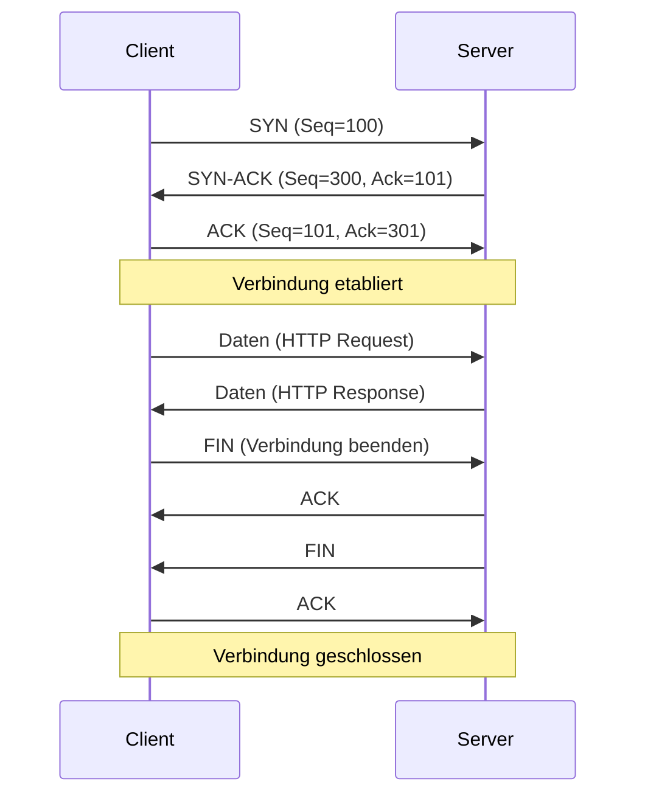
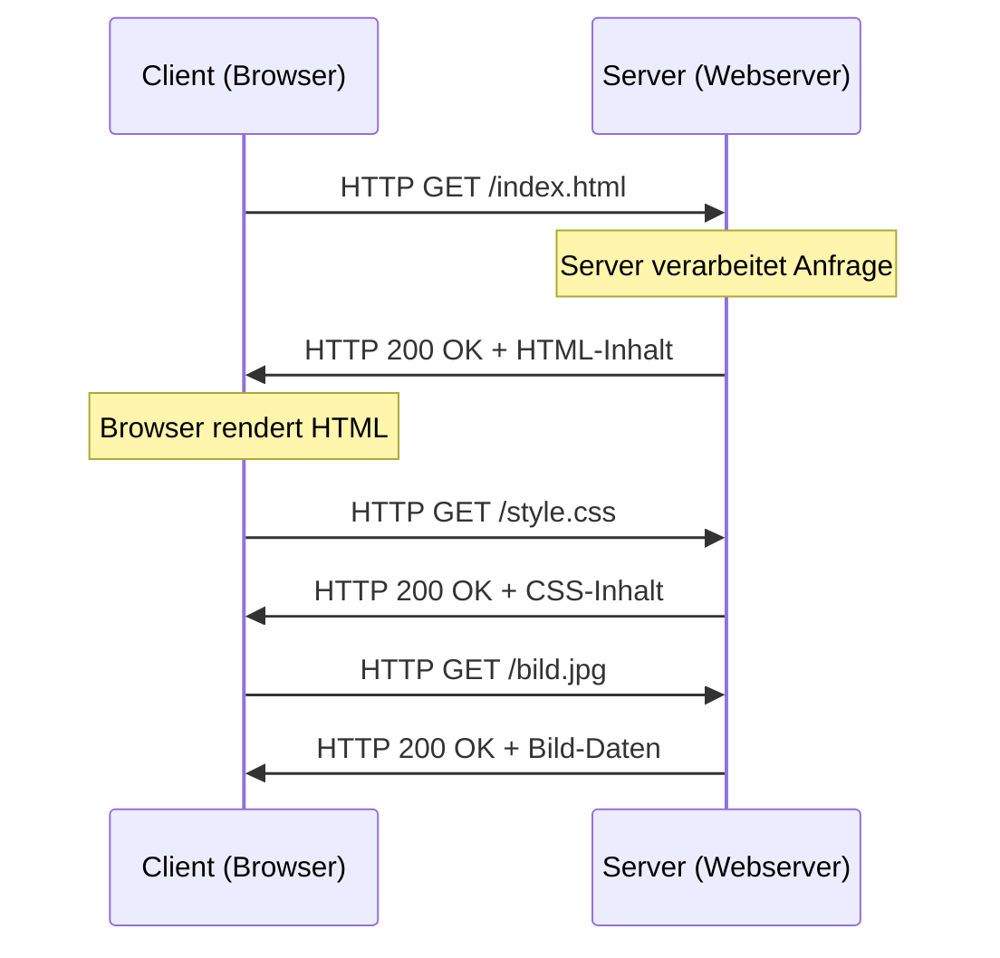
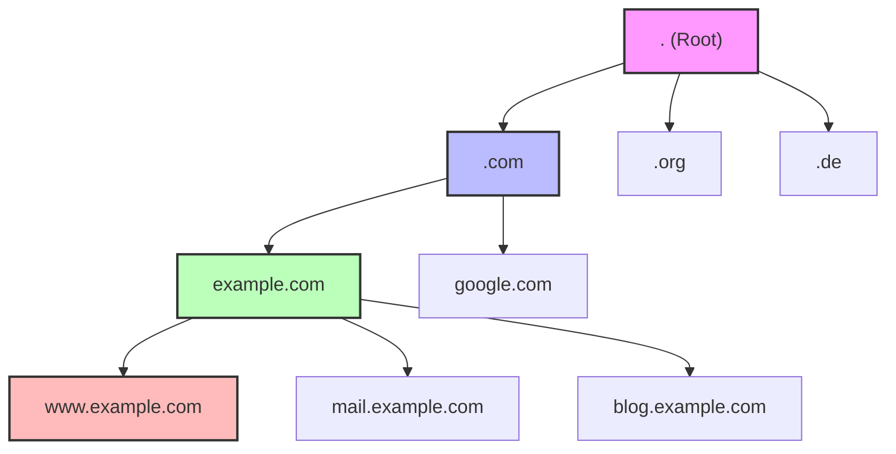
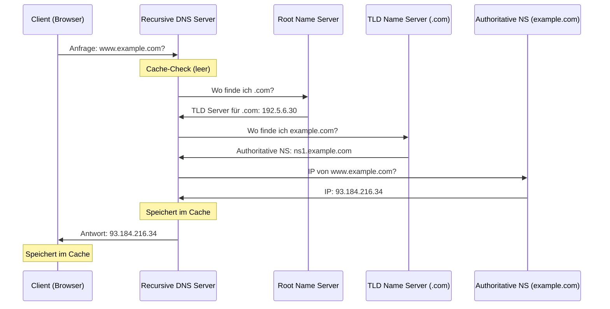
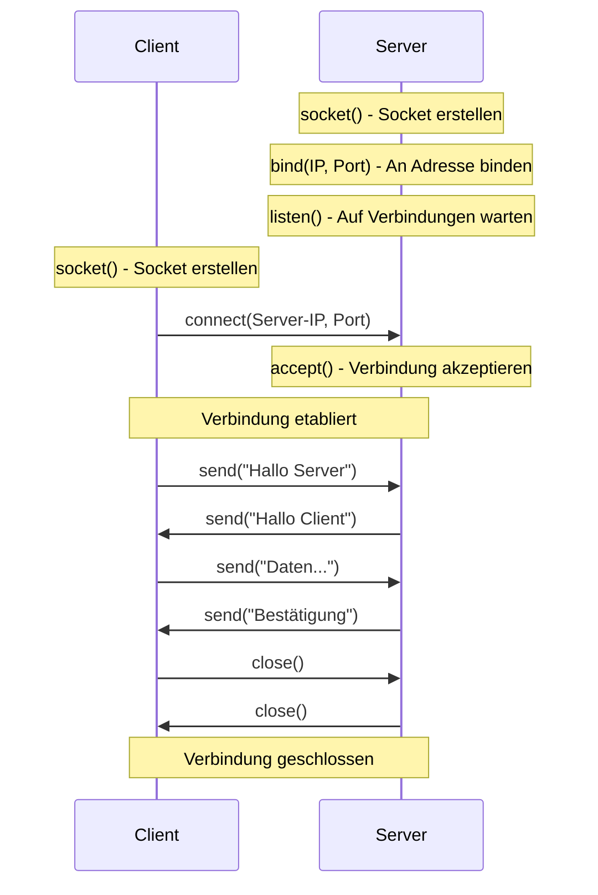

# V16: Netzwerktechnik Grundlagen & Protokolle – Teil 2

> [!NOTE]
> **Lernziele dieser Vorlesung**:
> - **TCP vs. UDP** verstehen: Unterschiede zwischen verbindungsorientiert und verbindungslos
> - **HTTP/HTTPS** und das Request-Response-Modell analysieren
> - **REST-APIs** und deren Prinzipien kennenlernen
> - **DNS** (Domain Name System) und Name Resolution verstehen
> - **Ports und Socket-Kommunikation** praktisch anwenden
> - **Pandas** für Datenanalyse einsetzen: Installation, DataFrames, Filterung, Aggregation
> - **Vektorisierung** statt Schleifen für Performance nutzen

---

## Teil 1: Theorie - Netzwerktechnik Grundlagen & Protokolle – Teil 2

### Überblick

In V15 haben wir die Grundlagen der Netzwerktechnik kennengelernt: das **OSI-Modell** mit seinen sieben Schichten, das **TCP/IP-Modell**, **IPv4- und IPv6-Adressierung** sowie **Subnetting**. Diese Konzepte bilden das Fundament für das Verständnis von Netzwerkkommunikation.

In dieser Vorlesung vertiefen wir unser Wissen und konzentrieren uns auf konkrete **Transport- und Anwendungsprotokolle**, die im Alltag eine zentrale Rolle spielen. Wir analysieren die Unterschiede zwischen **TCP** (verbindungsorientiert) und **UDP** (verbindungslos), verstehen das **HTTP/HTTPS-Protokoll** und das Request-Response-Modell, lernen die Prinzipien von **REST-APIs** kennen, die in modernen Web-Anwendungen allgegenwärtig sind, und beschäftigen uns mit dem **DNS** (Domain Name System), das die Übersetzung von lesbaren Domain-Namen in IP-Adressen ermöglicht. Abschließend betrachten wir **Ports und Socket-Kommunikation**, die die Grundlage für jede Netzwerkprogrammierung darstellen.

Diese Konzepte sind nicht nur theoretisch relevant, sondern bilden die Basis für praktische Anwendungen wie Web-Entwicklung, API-Design, Netzwerk-Troubleshooting und moderne Cloud-Architekturen. Maschinenbau-Ingenieure begegnen diesen Technologien in der Industrie 4.0, bei IoT-Geräten, bei der Maschinen-zu-Maschinen-Kommunikation (M2M) und bei der Integration von Steuerungssystemen.

---

### TCP vs. UDP: Verbindungsorientiert vs. Verbindungslos

Auf der **Transportschicht** (Layer 4 des OSI-Modells) existieren zwei grundlegende Protokolle: **TCP** (Transmission Control Protocol) und **UDP** (User Datagram Protocol). Beide haben unterschiedliche Eigenschaften und Einsatzgebiete.

#### TCP (Transmission Control Protocol)

**TCP** ist ein **verbindungsorientiertes** Protokoll. Das bedeutet, dass vor der Datenübertragung eine stabile Verbindung zwischen Sender und Empfänger aufgebaut wird. Dieser Verbindungsaufbau erfolgt über den sogenannten **Three-Way Handshake**:

1. **SYN** (Synchronize): Der Client sendet ein Paket mit dem SYN-Flag an den Server und signalisiert damit den Wunsch, eine Verbindung aufzubauen.
2. **SYN-ACK** (Synchronize-Acknowledge): Der Server antwortet mit einem SYN-ACK-Paket und bestätigt den Empfang des SYN-Pakets.
3. **ACK** (Acknowledge): Der Client sendet ein ACK-Paket zurück und bestätigt damit die Verbindung. Ab diesem Zeitpunkt ist die Verbindung etabliert und Daten können übertragen werden.



> [!NOTE]
> **Verbindungsorientiert**: Eine Verbindung wird explizit aufgebaut, aufrechterhalten und wieder abgebaut. Während der Verbindung werden Sequenznummern verwendet, um die Reihenfolge der Pakete zu gewährleisten.

**Eigenschaften von TCP**:

- **Zuverlässig**: TCP garantiert, dass alle gesendeten Daten in der richtigen Reihenfolge beim Empfänger ankommen. Verlorene Pakete werden automatisch erneut gesendet.
- **Flusskontrolle**: TCP passt die Übertragungsrate dynamisch an die Kapazität des Empfängers an (Sliding Window Mechanism).
- **Staukontrolle** (Congestion Control): TCP erkennt Netzwerküberlastung und reduziert die Übertragungsrate, um das Netzwerk zu entlasten.
- **Fehlerkorrektur**: TCP verwendet Prüfsummen (Checksums), um Übertragungsfehler zu erkennen. Fehlerhafte Pakete werden verworfen und erneut angefordert.
- **Sequenzierung**: Pakete werden mit Sequenznummern versehen, sodass der Empfänger sie in der richtigen Reihenfolge zusammensetzen kann.
- **Overhead**: Der Verbindungsaufbau und die Fehlerkorrektur verursachen zusätzlichen Overhead (höherer Speicher- und Rechenaufwand).

**Anwendungsfälle für TCP**:

- **HTTP/HTTPS** (Web-Browsing): Zuverlässige Übertragung von Webseiten ist essenziell.
- **E-Mail** (SMTP, IMAP, POP3): E-Mails müssen vollständig und korrekt zugestellt werden.
- **Dateiübertragung** (FTP, SFTP): Dateien dürfen nicht beschädigt oder unvollständig sein.
- **SSH** (Secure Shell): Remote-Administration erfordert zuverlässige Verbindungen.
- **Datenbanken**: Transaktionen müssen konsistent und vollständig sein.

#### UDP (User Datagram Protocol)

**UDP** ist ein **verbindungsloses** Protokoll. Es gibt keinen Verbindungsaufbau, keine Bestätigungen und keine Garantien für die Zustellung oder Reihenfolge der Pakete. UDP sendet einfach Datenpakete (Datagramme) an die Zieladresse.

> [!NOTE]
> **Verbindungslos**: Jedes Paket (Datagramm) wird unabhängig von anderen Paketen versendet. Es gibt keine Verbindung, die aufgebaut oder beendet werden muss.

**Eigenschaften von UDP**:

- **Unzuverlässig**: UDP garantiert weder die Zustellung noch die Reihenfolge der Pakete. Verlorene Pakete werden nicht erneut gesendet.
- **Keine Flusskontrolle**: UDP passt die Übertragungsrate nicht an die Kapazität des Empfängers an.
- **Keine Staukontrolle**: UDP erkennt keine Netzwerküberlastung und sendet weiterhin Daten.
- **Minimaler Overhead**: Da es keinen Verbindungsaufbau und keine Fehlerkorrektur gibt, ist der Header sehr klein (8 Bytes vs. 20-60 Bytes bei TCP).
- **Schnell**: UDP ist schneller als TCP, da es weniger Overhead hat und keine Bestätigungen wartet.
- **Echtzeit-geeignet**: UDP eignet sich für Anwendungen, bei denen Geschwindigkeit wichtiger ist als Zuverlässigkeit.

**Anwendungsfälle für UDP**:

- **Streaming** (Video, Audio): Ein paar verlorene Pakete sind akzeptabel, aber Verzögerungen durch erneutes Senden wären störend.
- **Online-Gaming**: Echtzeitkommunikation ist wichtiger als vollständige Datenübertragung. Ein verlorenes Paket ist besser als eine Verzögerung.
- **DNS** (Domain Name System): DNS-Anfragen sind klein und können einfach wiederholt werden, falls keine Antwort kommt.
- **VoIP** (Voice over IP): Sprachqualität leidet mehr unter Verzögerungen als unter gelegentlichen Paketverlusten.
- **DHCP** (Dynamic Host Configuration Protocol): Netzwerkkonfiguration erfolgt über kleine, schnelle Datagramme.

#### Vergleichstabelle: TCP vs. UDP

| Eigenschaft | TCP | UDP |
|---|---|---|
| **Verbindungstyp** | Verbindungsorientiert | Verbindungslos |
| **Zuverlässigkeit** | Zuverlässig (garantierte Zustellung) | Unzuverlässig (keine Garantie) |
| **Reihenfolge** | Garantiert | Nicht garantiert |
| **Fehlerkorrektur** | Ja (Checksums, Retransmission) | Minimal (nur Checksums) |
| **Flusskontrolle** | Ja | Nein |
| **Staukontrolle** | Ja | Nein |
| **Header-Größe** | 20-60 Bytes | 8 Bytes |
| **Geschwindigkeit** | Langsamer (wegen Overhead) | Schneller |
| **Overhead** | Hoch | Niedrig |
| **Anwendungsbeispiele** | HTTP, HTTPS, FTP, SSH, E-Mail | DNS, Streaming, Gaming, VoIP |

> [!TIP]
> **Faustregel**: Verwende **TCP**, wenn Zuverlässigkeit wichtig ist (z.B. Dateiübertragung, Webanwendungen). Verwende **UDP**, wenn Geschwindigkeit und geringe Latenz wichtiger sind als vollständige Datenübertragung (z.B. Streaming, Gaming).

> [!WARNING]
> **Häufiger Denkfehler**: UDP ist nicht "schlechter" als TCP – es ist einfach für andere Anwendungsfälle optimiert. UDP ist ideal für Echtzeitanwendungen, bei denen ein paar verlorene Pakete akzeptabel sind, aber Verzögerungen durch erneutes Senden inakzeptabel wären.

---

### HTTP/HTTPS und das Request-Response-Modell

**HTTP** (Hypertext Transfer Protocol) ist das Fundament des World Wide Web. Es ist ein **Anwendungsprotokoll** (Layer 7 im OSI-Modell), das die Kommunikation zwischen Webbrowsern (Clients) und Webservern regelt. HTTP basiert auf **TCP** und nutzt das **Request-Response-Modell**.

#### Das Request-Response-Modell

Das Request-Response-Modell ist ein fundamentales Kommunikationsmuster, bei dem ein Client eine **Anfrage** (Request) an einen Server sendet und der Server mit einer **Antwort** (Response) reagiert. Dieses Modell ist zustandslos (stateless), was bedeutet, dass jede Anfrage unabhängig von vorherigen Anfragen behandelt wird. Der Server speichert keine Informationen über frühere Anfragen des Clients.



> [!NOTE]
> **Stateless (Zustandslos)**: HTTP selbst speichert keine Informationen über vorherige Anfragen. Jede Anfrage ist unabhängig. Wenn ein Server Zustandsinformationen benötigt (z.B. für Benutzersitzungen), werden Mechanismen wie **Cookies** oder **Session-Tokens** verwendet.

#### HTTP-Methoden

HTTP definiert verschiedene **Methoden** (auch Verben genannt), die angeben, welche Aktion der Client ausführen möchte:

- **GET**: Fordert eine Ressource vom Server an (z.B. eine Webseite, ein Bild). GET-Anfragen sollten keine Daten auf dem Server ändern (idempotent und sicher).
- **POST**: Sendet Daten an den Server, um eine neue Ressource zu erstellen oder Daten zu verarbeiten (z.B. Formular-Übermittlung, Datei-Upload).
- **PUT**: Ersetzt eine existierende Ressource vollständig oder erstellt sie, falls sie nicht existiert.
- **PATCH**: Aktualisiert eine Ressource teilweise (nur bestimmte Felder).
- **DELETE**: Löscht eine Ressource auf dem Server.
- **HEAD**: Wie GET, aber der Server sendet nur die Header zurück, nicht den Body (nützlich für Metadaten-Abfragen).
- **OPTIONS**: Fragt nach den unterstützten HTTP-Methoden für eine Ressource.

**Beispiel einer GET-Anfrage**:

```http
GET /api/users/42 HTTP/1.1
Host: example.com
User-Agent: Mozilla/5.0
Accept: application/json
```

**Beispiel einer POST-Anfrage**:

```http
POST /api/users HTTP/1.1
Host: example.com
Content-Type: application/json
Content-Length: 45

{"name": "Alice", "email": "alice@example.com"}
```

#### HTTP-Statuscodes

Der Server antwortet mit einem **Statuscode**, der angibt, ob die Anfrage erfolgreich war oder ein Fehler aufgetreten ist. Statuscodes sind dreistellige Zahlen, die in fünf Kategorien unterteilt sind:

| Kategorie | Bereich | Bedeutung | Beispiele |
|---|---|---|---|
| **1xx** | 100-199 | **Informational** (Informativ) | 100 Continue, 101 Switching Protocols |
| **2xx** | 200-299 | **Success** (Erfolg) | 200 OK, 201 Created, 204 No Content |
| **3xx** | 300-399 | **Redirection** (Umleitung) | 301 Moved Permanently, 302 Found, 304 Not Modified |
| **4xx** | 400-499 | **Client Error** (Client-Fehler) | 400 Bad Request, 401 Unauthorized, 404 Not Found, 403 Forbidden |
| **5xx** | 500-599 | **Server Error** (Server-Fehler) | 500 Internal Server Error, 502 Bad Gateway, 503 Service Unavailable |

**Wichtige Statuscodes im Detail**:

- **200 OK**: Die Anfrage war erfolgreich. Der Response enthält die angeforderten Daten.
- **201 Created**: Eine neue Ressource wurde erfolgreich erstellt (typisch nach POST).
- **204 No Content**: Die Anfrage war erfolgreich, aber es gibt keinen Response-Body (z.B. nach DELETE).
- **301 Moved Permanently**: Die Ressource wurde dauerhaft verschoben (neue URL wird im `Location`-Header angegeben).
- **400 Bad Request**: Die Anfrage ist fehlerhaft (z.B. ungültige Syntax, fehlerhafte Parameter).
- **401 Unauthorized**: Authentifizierung ist erforderlich, aber nicht vorhanden oder falsch.
- **403 Forbidden**: Der Client hat keine Berechtigung, auf die Ressource zuzugreifen.
- **404 Not Found**: Die angeforderte Ressource existiert nicht.
- **500 Internal Server Error**: Ein unerwarteter Fehler ist auf dem Server aufgetreten.
- **503 Service Unavailable**: Der Server ist temporär nicht verfügbar (z.B. wegen Wartung oder Überlastung).

> [!TIP]
> **Eselsbrücke für Statuscodes**:
> - **2xx**: "Alles gut!"
> - **3xx**: "Schau woanders!"
> - **4xx**: "Du hast Mist gebaut!"
> - **5xx**: "Ich (Server) habe Mist gebaut!"

#### HTTPS: HTTP Secure

**HTTPS** ist die sichere Variante von HTTP. Der Datenverkehr wird mit **TLS** (Transport Layer Security, früher SSL) verschlüsselt. HTTPS schützt vor:

- **Abhören (Eavesdropping)**: Dritte können die übertragenen Daten nicht lesen.
- **Man-in-the-Middle-Angriffen**: Die Identität des Servers wird durch Zertifikate bestätigt.
- **Manipulation (Tampering)**: Änderungen der Daten während der Übertragung werden erkannt.

HTTPS verwendet Port **443** (statt Port 80 bei HTTP) und erfordert ein gültiges **SSL/TLS-Zertifikat** auf dem Server. Moderne Browser markieren HTTP-Websites als "nicht sicher" und bevorzugen HTTPS.

> [!WARNING]
> **Sicherheit ist kein "Nice-to-have"**: In modernen Webanwendungen ist HTTPS **Pflicht**. Ohne HTTPS sind Passwörter, Kreditkartendaten und persönliche Informationen ungeschützt. Suchmaschinen wie Google bevorzugen HTTPS-Websites in den Suchergebnissen.

---

### REST-APIs: Prinzipien und Methoden

**REST** (Representational State Transfer) ist ein Architekturstil für verteilte Systeme, insbesondere für Web-APIs. RESTful APIs nutzen HTTP-Methoden, um **CRUD**-Operationen (Create, Read, Update, Delete) auf Ressourcen durchzuführen. REST-APIs sind heute der Standard für moderne Webanwendungen, Microservices und Cloud-Plattformen.

#### Die 6 REST-Prinzipien

1. **Client-Server-Architektur**: Die Trennung von Client (Benutzeroberfläche) und Server (Datenverarbeitung) ermöglicht unabhängige Entwicklung und Skalierung.

2. **Stateless (Zustandslos)**: Jede Anfrage vom Client an den Server muss alle notwendigen Informationen enthalten. Der Server speichert keinen Client-Zustand zwischen Anfragen. Dies vereinfacht die Skalierung, da jeder Server jede Anfrage bearbeiten kann.

3. **Cacheable (Zwischenspeicherbar)**: Responses sollten als cacheable (zwischenspeicherbar) oder non-cacheable markiert sein. Caching verbessert die Performance und reduziert die Serverlast.

4. **Uniform Interface (Einheitliche Schnittstelle)**: Die Schnittstelle zwischen Client und Server sollte standardisiert sein. Dies umfasst:
   - **Ressourcen-Identifikation**: Ressourcen werden über URIs (Uniform Resource Identifiers) identifiziert.
   - **Manipulation durch Repräsentationen**: Clients manipulieren Ressourcen über deren Repräsentationen (z.B. JSON, XML).
   - **Selbstbeschreibende Nachrichten**: Jede Nachricht enthält genug Informationen, um zu verstehen, wie sie verarbeitet werden soll.
   - **HATEOAS** (Hypermedia as the Engine of Application State): Responses enthalten Links zu verwandten Ressourcen.

5. **Layered System (Geschichtetes System)**: Die Architektur kann aus mehreren Schichten bestehen (z.B. Load Balancer, Caches, API Gateway). Der Client weiß nicht, ob er direkt mit dem finalen Server kommuniziert oder mit einem Zwischenserver.

6. **Code on Demand (optional)**: Der Server kann ausführbaren Code (z.B. JavaScript) an den Client senden, um dessen Funktionalität zu erweitern. Dieses Prinzip ist optional und wird selten verwendet.

#### RESTful CRUD-Operationen

REST-APIs bilden CRUD-Operationen auf HTTP-Methoden ab:

| Operation | HTTP-Methode | Beispiel | Statuscode bei Erfolg |
|---|---|---|---|
| **Create** | POST | `POST /api/users` | 201 Created |
| **Read (alle)** | GET | `GET /api/users` | 200 OK |
| **Read (einzeln)** | GET | `GET /api/users/42` | 200 OK |
| **Update (vollständig)** | PUT | `PUT /api/users/42` | 200 OK oder 204 No Content |
| **Update (teilweise)** | PATCH | `PATCH /api/users/42` | 200 OK oder 204 No Content |
| **Delete** | DELETE | `DELETE /api/users/42` | 204 No Content oder 200 OK |

> [!NOTE]
> **Ressourcen-Orientierung**: REST-APIs organisieren Daten als Ressourcen (z.B. "users", "products", "orders"). Jede Ressource hat eine eindeutige URI. Die HTTP-Methoden definieren, was mit der Ressource geschehen soll.

#### Beispiel einer RESTful API

**Ressource**: `users` (Benutzer)

- **GET /api/users**: Gibt eine Liste aller Benutzer zurück.
- **GET /api/users/42**: Gibt die Details von Benutzer 42 zurück.
- **POST /api/users**: Erstellt einen neuen Benutzer. Der Request-Body enthält die Benutzerdaten (z.B. JSON).
- **PUT /api/users/42**: Aktualisiert Benutzer 42 vollständig (alle Felder).
- **PATCH /api/users/42**: Aktualisiert Benutzer 42 teilweise (nur bestimmte Felder).
- **DELETE /api/users/42**: Löscht Benutzer 42.

**Beispiel-Request und Response**:

```http
POST /api/users HTTP/1.1
Host: api.example.com
Content-Type: application/json

{
  "name": "Bob",
  "email": "bob@example.com",
  "age": 28
}
```

**Response**:

```http
HTTP/1.1 201 Created
Location: /api/users/123
Content-Type: application/json

{
  "id": 123,
  "name": "Bob",
  "email": "bob@example.com",
  "age": 28,
  "created_at": "2026-01-03T10:30:00Z"
}
```

> [!TIP]
> **Best Practices für REST-APIs**:
> - Verwende **Plural-Formen** für Ressourcen: `/api/users` (nicht `/api/user`)
> - Verwende **Nomen**, keine Verben: `/api/users` (nicht `/api/getUsers`)
> - Verwende **klare Hierarchien**: `/api/users/42/orders` (Bestellungen von Benutzer 42)
> - Versioniere deine API: `/api/v1/users`, `/api/v2/users`
> - Nutze **HTTP-Statuscodes** korrekt
> - Liefere **aussagekräftige Fehlermeldungen** im Response-Body

> [!WARNING]
> **Häufiger Fehler**: GET-Requests sollten **idempotent** und **sicher** sein (keine Änderungen auf dem Server). Verwende POST, PUT, PATCH oder DELETE für Datenänderungen, niemals GET.

---

### DNS: Domain Name System und Name Resolution

Das **Domain Name System (DNS)** ist einer der wichtigsten Dienste im Internet. Es übersetzt menschen-lesbare **Domain-Namen** (z.B. `www.example.com`) in maschinenlesbare **IP-Adressen** (z.B. `93.184.216.34`). Ohne DNS müssten wir uns IP-Adressen merken – eine unpraktische Vorstellung bei Millionen von Websites.

#### Hierarchische Struktur des DNS

DNS ist hierarchisch organisiert. Die Hierarchie wird von rechts nach links gelesen:

**Beispiel**: `www.example.com.`

- **`.` (Root)**: Die unsichtbare Wurzel (wird meist nicht angezeigt).
- **`com` (Top-Level Domain, TLD)**: Die oberste Ebene (z.B. `.com`, `.org`, `.de`, `.edu`).
- **`example` (Second-Level Domain, SLD)**: Die Domain, die von einer Organisation registriert wurde.
- **`www` (Subdomain)**: Eine Subdomain der Second-Level Domain (z.B. `blog.example.com`, `shop.example.com`).



#### DNS-Auflösung (Name Resolution)

Die **DNS-Auflösung** ist der Prozess, bei dem ein Domain-Name in eine IP-Adresse übersetzt wird. Dieser Prozess erfolgt in mehreren Schritten:

1. **Lokaler Cache**: Der Browser prüft zunächst seinen eigenen Cache. Wenn die IP-Adresse dort gespeichert ist, wird sie direkt verwendet.

2. **Betriebssystem-Cache**: Falls der Browser keinen Eintrag hat, fragt das Betriebssystem seinen DNS-Cache ab.

3. **Resolver (Recursive DNS Server)**: Falls lokal kein Eintrag vorhanden ist, sendet der Computer eine Anfrage an einen **Recursive DNS Server** (z.B. vom Internet Service Provider oder öffentliche DNS-Server wie Google DNS `8.8.8.8` oder Cloudflare DNS `1.1.1.1`).

4. **Root Name Server**: Der Recursive DNS Server fragt einen **Root Name Server**. Dieser kennt die IP-Adressen der **TLD Name Server** (z.B. für `.com`, `.org`).

5. **TLD Name Server**: Der Recursive DNS Server fragt den zuständigen **TLD Name Server** (z.B. für `.com`). Dieser kennt die IP-Adressen der **Authoritative Name Server** für `example.com`.

6. **Authoritative Name Server**: Der Recursive DNS Server fragt den **Authoritative Name Server** für `example.com`. Dieser kennt die IP-Adresse von `www.example.com` und sendet sie zurück.

7. **Antwort an Client**: Der Recursive DNS Server speichert die Antwort in seinem Cache und leitet sie an den Client weiter. Der Client speichert die IP-Adresse ebenfalls in seinem Cache.



> [!NOTE]
> **Recursive DNS Server**: Ein DNS-Server, der die gesamte Auflösung für den Client übernimmt. Er fragt alle notwendigen Server ab, bis er die endgültige IP-Adresse gefunden hat. Der Client muss nur eine Anfrage senden und erhält die fertige Antwort.

> [!TIP]
> **DNS-Caching**: DNS-Einträge werden auf mehreren Ebenen gecacht (Browser, Betriebssystem, Resolver), um die Auflösungszeit zu reduzieren. Die **TTL** (Time To Live) bestimmt, wie lange ein Eintrag im Cache bleibt (z.B. 300 Sekunden = 5 Minuten).

#### DNS-Record-Typen

DNS speichert verschiedene Arten von Informationen in **DNS-Records**:

- **A-Record** (Address Record): Ordnet einen Domain-Namen einer IPv4-Adresse zu. Beispiel: `example.com` → `93.184.216.34`
- **AAAA-Record**: Ordnet einen Domain-Namen einer IPv6-Adresse zu. Beispiel: `example.com` → `2606:2800:220:1:248:1893:25c8:1946`
- **CNAME-Record** (Canonical Name): Alias für einen anderen Domain-Namen. Beispiel: `www.example.com` → `example.com`
- **MX-Record** (Mail Exchange): Gibt an, welcher Server für E-Mails zuständig ist. Beispiel: `example.com` → `mail.example.com`
- **NS-Record** (Name Server): Gibt an, welche Name Server für eine Domain zuständig sind.
- **TXT-Record**: Speichert beliebige Textinformationen (z.B. für SPF, DKIM, DMARC bei E-Mail-Authentifizierung).
- **SOA-Record** (Start of Authority): Enthält administrative Informationen über die Zone (z.B. Primary Name Server, E-Mail des Administrators).

> [!WARNING]
> **DNS ist unverschlüsselt**: Traditionelles DNS sendet Anfragen im Klartext, was Sicherheitsrisiken birgt (z.B. DNS-Spoofing, Überwachung). Moderne Alternativen wie **DNS over HTTPS (DoH)** oder **DNS over TLS (DoT)** verschlüsseln DNS-Anfragen.

---

### Ports und Socket-Kommunikation

**Ports** sind numerische Identifikatoren, die verschiedene Anwendungen und Dienste auf einem Computer unterscheiden. Ein **Socket** ist ein Endpunkt für Netzwerkkommunikation – eine Kombination aus IP-Adresse und Port-Nummer.

#### Port-Nummern

Ports sind 16-Bit-Zahlen (Bereich: 0–65535) und werden in drei Kategorien unterteilt:

| Kategorie | Bereich | Beschreibung | Beispiele |
|---|---|---|---|
| **Well-Known Ports** | 0–1023 | Reserviert für Standard-Dienste (erfordern Admin-Rechte) | 80 (HTTP), 443 (HTTPS), 22 (SSH), 25 (SMTP) |
| **Registered Ports** | 1024–49151 | Von IANA registriert für spezifische Anwendungen | 3306 (MySQL), 5432 (PostgreSQL), 8080 (HTTP Proxy) |
| **Dynamic/Private Ports** | 49152–65535 | Frei verwendbar (z.B. für temporäre Client-Verbindungen) | Zufällig zugewiesen |

**Wichtige Well-Known Ports**:

- **20/21 (FTP)**: File Transfer Protocol (Datenübertragung und Steuerung)
- **22 (SSH)**: Secure Shell (verschlüsselte Remote-Administration)
- **23 (Telnet)**: Unverschlüsselte Remote-Administration (veraltet, unsicher)
- **25 (SMTP)**: Simple Mail Transfer Protocol (E-Mail-Versand)
- **53 (DNS)**: Domain Name System (Name-Auflösung)
- **80 (HTTP)**: Hypertext Transfer Protocol (Web-Traffic)
- **110 (POP3)**: Post Office Protocol (E-Mail-Empfang)
- **143 (IMAP)**: Internet Message Access Protocol (E-Mail-Empfang)
- **443 (HTTPS)**: HTTP Secure (verschlüsselter Web-Traffic)
- **3389 (RDP)**: Remote Desktop Protocol (Windows-Remote-Desktop)

> [!NOTE]
> **Socket**: Ein Socket ist ein Endpunkt für Netzwerkkommunikation. Er wird durch eine Kombination aus **IP-Adresse** und **Port-Nummer** identifiziert. Beispiel: `192.168.1.10:8080` bedeutet IP-Adresse `192.168.1.10` und Port `8080`.

#### Socket-Kommunikation

Die Socket-Programmierung ist die Basis für Netzwerkanwendungen. Ein **Server-Socket** wartet auf eingehende Verbindungen, während ein **Client-Socket** eine Verbindung zu einem Server aufbaut.

**Ablauf einer TCP-Socket-Verbindung**:

1. **Server**: Erstellt einen Socket und bindet ihn an eine IP-Adresse und einen Port (Binding).
2. **Server**: Versetzt den Socket in den Lausch-Modus (Listening).
3. **Client**: Erstellt einen Socket und baut eine Verbindung zum Server auf (Connect).
4. **Server**: Akzeptiert die eingehende Verbindung (Accept).
5. **Datenübertragung**: Client und Server tauschen Daten aus (Send/Receive).
6. **Verbindung schließen**: Beide Seiten schließen die Verbindung (Close).



> [!TIP]
> **Praktischer Tipp**: Beim Entwickeln von Netzwerkanwendungen ist es wichtig, die **Firewall** zu beachten. Standardmäßig blockieren Firewalls eingehende Verbindungen auf den meisten Ports. Für Tests solltest du entweder die Firewall temporär deaktivieren (nicht empfohlen in Produktionsumgebungen) oder eine Ausnahme für deinen Port hinzufügen.

> [!WARNING]
> **Port-Konflikte**: Jeder Port kann nur von einem Prozess gleichzeitig verwendet werden. Wenn du versuchst, einen Server auf einem bereits belegten Port zu starten, erhältst du einen Fehler (z.B. "Address already in use"). Prüfe mit Tools wie `netstat` (Windows/Linux) oder `lsof` (Linux/Mac), welche Ports bereits belegt sind.

---

### Zusammenfassung Theorie

In dieser Vorlesung haben wir zentrale Netzwerkprotokolle und -konzepte der Transport- und Anwendungsschicht behandelt. **TCP** bietet zuverlässige, verbindungsorientierte Kommunikation mit Fehlerkorrektur und Flusskontrolle, während **UDP** schnelle, verbindungslose Kommunikation ohne Garantien ermöglicht. Das **HTTP/HTTPS-Protokoll** mit seinem Request-Response-Modell ist das Fundament des Webs, und **REST-APIs** nutzen HTTP-Methoden für ressourcen-orientierte Schnittstellen. Das **DNS** (Domain Name System) übersetzt Domain-Namen in IP-Adressen durch eine hierarchische Struktur und mehrstufige Auflösung. Schließlich verbinden **Ports** und **Sockets** Anwendungen mit Netzwerkverbindungen und ermöglichen die Kommunikation zwischen Client und Server.

Diese Konzepte sind in der modernen IT allgegenwärtig: Web-Entwicklung basiert auf HTTP/HTTPS und REST-APIs, IoT-Geräte nutzen UDP für Echtzeitkommunikation, DNS ist für jede Internet-Verbindung notwendig, und Socket-Programmierung bildet die Grundlage für verteilte Systeme. Maschinenbau-Ingenieure begegnen diesen Technologien bei der Integration von Steuerungssystemen, bei der M2M-Kommunikation in der Industrie 4.0 und bei der Anbindung von Maschinen an Cloud-Plattformen.

---

## Teil 2: Python - Große Datenmengen verarbeiten – Teil 2 (Pandas)

### Überblick

In V15 haben wir gelernt, wie man große Datenmengen speicher-effizient mit **Generatoren**, **Iteratoren** und dem **csv-Modul** verarbeitet. Diese Techniken sind ideal für sequenzielle Verarbeitung von Dateien, bei denen wir Zeile für Zeile arbeiten. In dieser Vorlesung steigen wir auf **Pandas** um – eine leistungsstarke Bibliothek für Datenanalyse, die speziell für tabellarische Daten entwickelt wurde.

**Pandas** ist die meistgenutzte Bibliothek für Datenanalyse in Python. Sie bietet **DataFrames** (tabellarische Datenstrukturen), die das Arbeiten mit strukturierten Daten erheblich vereinfachen. Pandas ermöglicht schnelles Filtern, Sortieren, Gruppieren und Aggregieren von Daten – Operationen, die mit reinem Python und csv-Modul umständlich wären. Besonders wichtig ist die **Vektorisierung**: Statt Schleifen zu verwenden, arbeitet Pandas mit ganzen Spalten gleichzeitig, was zu einer dramatischen Performance-Steigerung führt.

Pandas eignet sich hervorragend für:
- **Datenexploration**: Schnelles Analysieren und Verstehen von Datensätzen.
- **Data Cleaning**: Umgang mit fehlenden Werten, Duplikaten und Inkonsistenzen.
- **Aggregation und Gruppierung**: Berechnung von Statistiken über Teilmengen der Daten (z.B. Durchschnitt pro Kategorie).
- **Zeitreihenanalyse**: Arbeiten mit Datums- und Zeitstempeln.
- **Datenvisualisierung**: Integration mit Matplotlib für schnelle Plots.

> [!NOTE]
> **Pandas**: Eine Open-Source-Bibliothek für Datenanalyse und -manipulation in Python. Der Name steht für "Panel Data" (mehrdimensionale Daten). Pandas basiert auf NumPy und bietet hochoptimierte Datenstrukturen für tabellarische Daten.

---

### Installation und Import

Pandas ist nicht Teil der Python-Standard-Library und muss separat installiert werden. Die Installation erfolgt über **pip**:

```bash
pip install pandas
```

> [!TIP]
> **Empfehlung**: Installiere Pandas in einer **virtuellen Umgebung** (siehe V12), um Versionskonflikte zu vermeiden. Pandas hat mehrere Abhängigkeiten (NumPy, python-dateutil, pytz), die automatisch mit installiert werden.

Nach der Installation kann Pandas mit der konventionellen Abkürzung `pd` importiert werden:

```python
import pandas as pd

# Pandas-Version anzeigen:
print(pd.__version__)  # z.B. "2.2.0"
```

> [!NOTE]
> **Konvention**: Die Abkürzung `pd` für Pandas ist Industriestandard – ähnlich wie `np` für NumPy und `plt` für Matplotlib. Verwende diese Abkürzungen konsistent, um deinen Code lesbar und verständlich für andere Entwickler zu machen.

---

### DataFrames: Tabellarische Datenstrukturen

Das Herzstück von Pandas ist das **DataFrame** – eine zweidimensionale, tabellarische Datenstruktur mit beschrifteten Zeilen und Spalten. Ein DataFrame ähnelt einer Excel-Tabelle oder einer SQL-Tabelle.

#### DataFrame erstellen

Es gibt viele Möglichkeiten, einen DataFrame zu erstellen:

**1. Aus einem Dictionary**:

```python
import pandas as pd

daten = {
    'Name': ['Alice', 'Bob', 'Charlie', 'Diana'],
    'Alter': [25, 30, 35, 28],
    'Stadt': ['Berlin', 'München', 'Hamburg', 'Köln'],
    'Gehalt': [50000, 60000, 55000, 52000]
}

df = pd.DataFrame(daten)
print(df)
```

**Ausgabe**:
```
      Name  Alter     Stadt  Gehalt
0    Alice     25    Berlin   50000
1      Bob     30   München   60000
2  Charlie     35   Hamburg   55000
3    Diana     28      Köln   52000
```

> [!NOTE]
> **Index**: Jede Zeile in einem DataFrame hat einen **Index** (hier 0, 1, 2, 3). Der Index dient als eindeutige Kennung für Zeilen und kann numerisch oder beschriftend sein (z.B. Datumsangaben, IDs).

**2. Aus einer CSV-Datei** (häufigster Fall):

```python
# CSV-Datei einlesen:
df = pd.read_csv('employees.csv')
print(df.head())  # Zeigt erste 5 Zeilen
```

> [!TIP]
> **`pd.read_csv()`** ist extrem flexibel und unterstützt viele Parameter:
> - `sep=';'`: Anderes Trennzeichen (Standard: Komma)
> - `encoding='utf-8'`: Zeichenkodierung festlegen
> - `na_values=['NA', 'N/A', '']`: Welche Werte als fehlend interpretiert werden
> - `parse_dates=['Datum']`: Spalten als Datums-Objekte parsen
> - `index_col='ID'`: Spalte als Index verwenden

**3. Aus einer Liste von Listen**:

```python
daten = [
    ['Alice', 25, 'Berlin'],
    ['Bob', 30, 'München'],
    ['Charlie', 35, 'Hamburg']
]

df = pd.DataFrame(daten, columns=['Name', 'Alter', 'Stadt'])
print(df)
```

#### DataFrame inspizieren

Pandas bietet viele Methoden, um einen schnellen Überblick über die Daten zu erhalten:

**`.head(n)` und `.tail(n)`**: Zeigt die ersten oder letzten `n` Zeilen (Standard: 5).

```python
print(df.head(3))  # Erste 3 Zeilen
print(df.tail(2))  # Letzte 2 Zeilen
```

**`.info()`**: Gibt detaillierte Informationen über den DataFrame aus (Datentypen, fehlende Werte, Speicherverbrauch).

```python
df.info()
```

**Ausgabe**:
```
<class 'pandas.core.frame.DataFrame'>
RangeIndex: 4 entries, 0 to 3
Data columns (total 4 columns):
 #   Column  Non-Null Count  Dtype 
---  ------  --------------  ----- 
 0   Name    4 non-null      object
 1   Alter   4 non-null      int64 
 2   Stadt   4 non-null      object
 3   Gehalt  4 non-null      int64 
dtypes: int64(2), object(2)
memory usage: 256.0+ bytes
```

> [!NOTE]
> **Non-Null Count**: Zeigt an, wie viele nicht-fehlende Werte in jeder Spalte vorhanden sind. Wenn Werte fehlen, ist dies hier sofort erkennbar.

**`.describe()`**: Berechnet deskriptive Statistiken für numerische Spalten (Mittelwert, Standardabweichung, Min, Max, Quartile).

```python
print(df.describe())
```

**Ausgabe**:
```
            Alter        Gehalt
count    4.000000      4.000000
mean    29.500000  54250.000000
std      4.203175   4272.001873
min     25.000000  50000.000000
25%     27.250000  51500.000000
50%     29.000000  53500.000000
75%     31.750000  56250.000000
max     35.000000  60000.000000
```

**`.shape`**: Gibt die Dimensionen des DataFrames zurück (Anzahl Zeilen, Anzahl Spalten).

```python
print(df.shape)  # (4, 4) → 4 Zeilen, 4 Spalten
```

**`.columns`**: Gibt die Spaltennamen als Liste zurück.

```python
print(df.columns)  # Index(['Name', 'Alter', 'Stadt', 'Gehalt'], dtype='object')
```

**`.dtypes`**: Zeigt die Datentypen der Spalten.

```python
print(df.dtypes)
```

**Ausgabe**:
```
Name      object
Alter      int64
Stadt     object
Gehalt     int64
dtype: object
```

> [!WARNING]
> **object-Datentyp**: In Pandas bedeutet `object` meist Strings, kann aber auch gemischte Typen enthalten. Dies ist oft ein Zeichen für nicht-optimale Datentypen. Für Performance-kritische Anwendungen solltest du Datentypen explizit konvertieren (z.B. `category` für kategoriale Daten).

---

### Daten auswählen und filtern

#### Spalten auswählen

**Einzelne Spalte**: Zugriff wie auf ein Dictionary (gibt eine **Series** zurück).

```python
namen = df['Name']
print(namen)
print(type(namen))  # <class 'pandas.core.series.Series'>
```

> [!NOTE]
> **Series**: Eine eindimensionale Datenstruktur in Pandas (wie eine einzelne Spalte). Eine Series hat einen Index und Werte. Ein DataFrame ist im Grunde eine Sammlung von Series.

**Mehrere Spalten**: Verwende eine Liste von Spaltennamen (gibt einen **DataFrame** zurück).

```python
personen = df[['Name', 'Stadt']]
print(personen)
```

**Ausgabe**:
```
      Name     Stadt
0    Alice    Berlin
1      Bob   München
2  Charlie   Hamburg
3    Diana      Köln
```

#### Zeilen auswählen: `.loc[]` und `.iloc[]`

Pandas bietet zwei Hauptmethoden für Zeilen-Zugriff:

**`.loc[]`**: Zugriff über **Labels** (Index-Namen).

```python
# Zeile mit Index 1:
print(df.loc[1])

# Mehrere Zeilen (Index 0 bis 2):
print(df.loc[0:2])  # Achtung: Endindex ist inklusive!

# Spezifische Zeile und Spalte:
print(df.loc[1, 'Name'])  # 'Bob'

# Mehrere Zeilen und Spalten:
print(df.loc[0:2, ['Name', 'Gehalt']])
```

> [!WARNING]
> **Inklusive Endindex**: Bei `.loc[0:2]` sind sowohl Index 0 als auch Index 2 enthalten! Dies ist anders als bei Python-Listen-Slicing, wo der Endindex exklusive ist.

**`.iloc[]`**: Zugriff über **Integer-Position** (wie bei Listen).

```python
# Erste Zeile:
print(df.iloc[0])

# Erste drei Zeilen:
print(df.iloc[0:3])  # Endindex ist exklusive (wie bei Listen)

# Zeile 1, Spalte 2:
print(df.iloc[1, 2])  # 'München'

# Erste zwei Zeilen, erste zwei Spalten:
print(df.iloc[0:2, 0:2])
```

> [!TIP]
> **Faustregel**: Verwende `.loc[]`, wenn du mit beschrifteten Indizes arbeitest (z.B. Datumsangaben, IDs). Verwende `.iloc[]`, wenn du mit numerischen Positionen arbeitest.

#### Filtern mit Bedingungen

Pandas ermöglicht das Filtern von Zeilen basierend auf Bedingungen – ähnlich wie SQL WHERE-Klauseln.

**Einfache Bedingung**:

```python
# Alle Personen über 28 Jahre:
alt = df[df['Alter'] > 28]
print(alt)
```

**Ausgabe**:
```
      Name  Alter     Stadt  Gehalt
1      Bob     30   München   60000
2  Charlie     35   Hamburg   55000
```

**Mehrere Bedingungen** (logische Operatoren: `&` für AND, `|` für OR, `~` für NOT):

```python
# Personen zwischen 25 und 30 Jahren:
bereich = df[(df['Alter'] >= 25) & (df['Alter'] <= 30)]
print(bereich)

# Personen aus Berlin oder München:
staedte = df[(df['Stadt'] == 'Berlin') | (df['Stadt'] == 'München')]
print(staedte)

# Personen NICHT aus Hamburg:
nicht_hamburg = df[~(df['Stadt'] == 'Hamburg')]
print(nicht_hamburg)
```

> [!WARNING]
> **Klammern erforderlich**: Bei mehreren Bedingungen müssen **jede Bedingung in Klammern** gesetzt werden, sonst gibt es Fehler wegen Operator-Präzedenz. Falsch: `df[df['Alter'] > 25 & df['Alter'] < 30]` → Fehler! Richtig: `df[(df['Alter'] > 25) & (df['Alter'] < 30)]`.

**`.isin()`**: Prüft, ob Werte in einer Liste enthalten sind.

```python
# Personen aus bestimmten Städten:
ausgewaehlte = df[df['Stadt'].isin(['Berlin', 'Köln'])]
print(ausgewaehlte)
```

**`.between()`**: Prüft, ob Werte in einem Bereich liegen.

```python
# Gehälter zwischen 50000 und 55000:
gehaelter = df[df['Gehalt'].between(50000, 55000, inclusive='both')]
print(gehaelter)
```

> [!TIP]
> **`inclusive`-Parameter**: `'both'` (beide Grenzen inklusive), `'left'` (nur untere Grenze), `'right'` (nur obere Grenze), `'neither'` (beide exklusive).

---

### Daten sortieren

**`.sort_values()`**: Sortiert den DataFrame nach einer oder mehreren Spalten.

```python
# Nach Alter sortieren (aufsteigend):
sortiert_alter = df.sort_values('Alter')
print(sortiert_alter)

# Nach Alter sortieren (absteigend):
sortiert_alter_desc = df.sort_values('Alter', ascending=False)
print(sortiert_alter_desc)

# Nach mehreren Spalten sortieren:
# Zuerst nach Stadt (aufsteigend), dann nach Alter (absteigend):
sortiert_mehrfach = df.sort_values(['Stadt', 'Alter'], ascending=[True, False])
print(sortiert_mehrfach)
```

> [!NOTE]
> **In-Place-Modifikation**: Standardmäßig gibt `.sort_values()` einen neuen DataFrame zurück. Um den ursprünglichen DataFrame zu ändern, verwende `inplace=True`: `df.sort_values('Alter', inplace=True)`.

---

### Daten aggregieren und gruppieren

#### Aggregatfunktionen

Pandas bietet eine Vielzahl von Aggregatfunktionen für Spalten:

```python
# Durchschnittliches Alter:
print(df['Alter'].mean())  # 29.5

# Summe der Gehälter:
print(df['Gehalt'].sum())  # 217000

# Minimum und Maximum:
print(df['Alter'].min())  # 25
print(df['Alter'].max())  # 35

# Anzahl der Einträge:
print(df['Name'].count())  # 4

# Standardabweichung:
print(df['Gehalt'].std())  # 4272.001873

# Median (50. Perzentil):
print(df['Alter'].median())  # 29.0
```

> [!NOTE]
> **NaN-Handling**: Aggregatfunktionen ignorieren standardmäßig `NaN`-Werte (fehlende Werte). Wenn du `NaN`-Werte einbeziehen möchtest, verwende den Parameter `skipna=False`.

#### Gruppierung mit `.groupby()`

**`.groupby()`** ist eine der mächtigsten Funktionen in Pandas. Sie ermöglicht es, Daten nach Kategorien zu gruppieren und Aggregatfunktionen auf jede Gruppe anzuwenden.

**Beispiel**: Durchschnittliches Gehalt pro Stadt.

```python
# Daten erweitern für besseres Beispiel:
daten_erweitert = {
    'Name': ['Alice', 'Bob', 'Charlie', 'Diana', 'Eve', 'Frank'],
    'Stadt': ['Berlin', 'München', 'Berlin', 'München', 'Berlin', 'Hamburg'],
    'Gehalt': [50000, 60000, 55000, 62000, 52000, 58000]
}

df_erweitert = pd.DataFrame(daten_erweitert)

# Gruppieren nach Stadt und Durchschnitt berechnen:
durchschnitt_pro_stadt = df_erweitert.groupby('Stadt')['Gehalt'].mean()
print(durchschnitt_pro_stadt)
```

**Ausgabe**:
```
Stadt
Berlin      52333.333333
Hamburg     58000.000000
München     61000.000000
Name: Gehalt, dtype: float64
```

**Mehrere Aggregationen gleichzeitig**:

```python
# Durchschnitt, Minimum und Maximum pro Stadt:
statistiken = df_erweitert.groupby('Stadt')['Gehalt'].agg(['mean', 'min', 'max', 'count'])
print(statistiken)
```

**Ausgabe**:
```
               mean    min    max  count
Stadt                                   
Berlin     52333.333  50000  55000      3
Hamburg    58000.000  58000  58000      1
München    61000.000  60000  62000      2
```

> [!TIP]
> **`.agg()`** ist sehr flexibel. Du kannst auch benutzerdefinierte Funktionen übergeben oder unterschiedliche Aggregationen für verschiedene Spalten definieren:
> ```python
> df.groupby('Stadt').agg({
>     'Gehalt': ['mean', 'sum'],
>     'Alter': ['min', 'max']
> })
> ```

---

### Fehlende Werte behandeln

Reale Datensätze enthalten oft **fehlende Werte** (in Pandas dargestellt als `NaN` - Not a Number).

#### Fehlende Werte erkennen

```python
import numpy as np

# DataFrame mit fehlenden Werten:
daten_lückenhaft = {
    'Name': ['Alice', 'Bob', None, 'Diana'],
    'Alter': [25, np.nan, 35, 28],
    'Stadt': ['Berlin', 'München', 'Hamburg', None]
}

df_luecken = pd.DataFrame(daten_lückenhaft)
print(df_luecken)

# Fehlende Werte anzeigen (Boolean-DataFrame):
print(df_luecken.isnull())

# Anzahl fehlender Werte pro Spalte:
print(df_luecken.isnull().sum())
```

**Ausgabe**:
```
    Name  Alter     Stadt
0  Alice   25.0    Berlin
1    Bob    NaN   München
2   None   35.0   Hamburg
3  Diana   28.0      None

    Name  Alter  Stadt
0  False  False  False
1  False   True  False
2   True  False  False
3  False  False   True

Name     1
Alter    1
Stadt    1
dtype: int64
```

#### Fehlende Werte behandeln

**Zeilen mit fehlenden Werten löschen**:

```python
# Alle Zeilen mit mindestens einem NaN entfernen:
df_sauber = df_luecken.dropna()
print(df_sauber)

# Zeilen entfernen, bei denen ALLE Werte NaN sind:
df_sauber2 = df_luecken.dropna(how='all')

# Spalten entfernen, die NaN enthalten:
df_sauber3 = df_luecken.dropna(axis=1)  # axis=1 für Spalten
```

> [!WARNING]
> **Vorsicht mit `.dropna()`**: Das Entfernen von Zeilen kann zu Datenverlust führen, besonders bei Datensätzen mit vielen fehlenden Werten. Überlege, ob Imputation (Ersetzen durch Schätzwerte) sinnvoller ist.

**Fehlende Werte ersetzen**:

```python
# NaN durch einen bestimmten Wert ersetzen:
df_gefuellt = df_luecken.fillna(0)
print(df_gefuellt)

# NaN in spezifischer Spalte ersetzen:
df_luecken['Alter'] = df_luecken['Alter'].fillna(df_luecken['Alter'].mean())
print(df_luecken)

# NaN durch vorherigen Wert ersetzen (Forward Fill):
df_ffill = df_luecken.fillna(method='ffill')

# NaN durch nächsten Wert ersetzen (Backward Fill):
df_bfill = df_luecken.fillna(method='bfill')
```

> [!TIP]
> **Imputation-Strategien**:
> - **Mean/Median**: Für numerische Spalten (Durchschnitt oder Median der Spalte).
> - **Mode**: Für kategoriale Spalten (häufigster Wert).
> - **Forward/Backward Fill**: Für Zeitreihen (vorheriger/nächster Wert).
> - **Konstante**: Für Flags oder Platzhalter (z.B. "Unbekannt", 0).

---

### Performance-Tipps: Vektorisierung statt Schleifen

Der größte Performance-Vorteil von Pandas liegt in der **Vektorisierung**. Statt Element für Element mit Schleifen zu arbeiten, führt Pandas Operationen auf ganzen Spalten gleichzeitig durch. Dies nutzt optimierte C-Code-Implementierungen und ist um Größenordnungen schneller.

#### Beispiel: Schlechte Performance (Schleife)

```python
import time

# DataFrame mit 1 Million Zeilen:
df_gross = pd.DataFrame({
    'Wert1': range(1000000),
    'Wert2': range(1000000, 2000000)
})

# LANGSAM: Mit Schleife
start = time.time()
ergebnis = []
for index, zeile in df_gross.iterrows():
    ergebnis.append(zeile['Wert1'] + zeile['Wert2'])
df_gross['Summe_Schleife'] = ergebnis
ende = time.time()
print(f"Schleife: {ende - start:.2f} Sekunden")  # ~30-60 Sekunden
```

> [!WARNING]
> **`.iterrows()` ist langsam**: Das Iterieren über Zeilen mit `.iterrows()` ist eine der langsamsten Operationen in Pandas. Es sollte nur in absoluten Ausnahmefällen verwendet werden.

#### Beispiel: Gute Performance (Vektorisierung)

```python
# SCHNELL: Mit Vektorisierung
start = time.time()
df_gross['Summe_Vektorisiert'] = df_gross['Wert1'] + df_gross['Wert2']
ende = time.time()
print(f"Vektorisierung: {ende - start:.4f} Sekunden")  # ~0.01 Sekunden
```

**Performance-Vergleich**: Vektorisierung ist hier **1000-mal schneller** als die Schleife!

#### Weitere Performance-Tipps

**`.apply()`**: Falls Vektorisierung nicht direkt möglich ist, verwende `.apply()` mit einer Funktion.

```python
# Funktion auf jede Zeile anwenden:
def berechne_bonus(zeile):
    if zeile['Gehalt'] > 55000:
        return zeile['Gehalt'] * 0.1
    else:
        return zeile['Gehalt'] * 0.05

df['Bonus'] = df.apply(berechne_bonus, axis=1)  # axis=1 für Zeilen
```

> [!NOTE]
> **`.apply()` ist besser als `.iterrows()`**, aber immer noch langsamer als Vektorisierung. Verwende es nur, wenn komplexe Logik erforderlich ist, die nicht vektorisiert werden kann.

**Datentypen optimieren**:

```python
# Speicher-Verbrauch anzeigen:
print(df.memory_usage(deep=True))

# Datentypen konvertieren für weniger Speicher:
df['Alter'] = df['Alter'].astype('int8')  # int8 statt int64 (wenn Werte klein genug)

# Kategoriale Daten als 'category' speichern:
df['Stadt'] = df['Stadt'].astype('category')
```

> [!TIP]
> **`category`-Datentyp**: Für Spalten mit wenigen eindeutigen Werten (z.B. Stadt, Geschlecht, Status) spart der `category`-Typ enorm viel Speicher und beschleunigt Gruppierungen. Statt jeden String zu speichern, verwendet Pandas intern Integer-Codes.

**Chunked Reading**: Bei sehr großen Dateien, die nicht in den Speicher passen:

```python
# Datei in Chunks lesen:
chunk_size = 100000
chunks = []

for chunk in pd.read_csv('huge_file.csv', chunksize=chunk_size):
    # Verarbeite jeden Chunk:
    chunk_gefiltert = chunk[chunk['Alter'] > 30]
    chunks.append(chunk_gefiltert)

# Alle Chunks zusammenführen:
df_gesamt = pd.concat(chunks, ignore_index=True)
```

---

### Praktisches Beispiel: E-Commerce-Daten analysieren

Nehmen wir an, wir haben einen Datensatz mit E-Commerce-Bestellungen und möchten ihn analysieren.

```python
import pandas as pd

# Datensatz einlesen (simuliert):
daten = {
    'Bestellung_ID': [1, 2, 3, 4, 5, 6, 7, 8],
    'Kunde': ['Alice', 'Bob', 'Alice', 'Charlie', 'Bob', 'Diana', 'Alice', 'Charlie'],
    'Produkt': ['Laptop', 'Maus', 'Tastatur', 'Monitor', 'Laptop', 'Maus', 'Monitor', 'Tastatur'],
    'Preis': [1200, 25, 75, 300, 1200, 25, 300, 75],
    'Anzahl': [1, 2, 1, 1, 1, 3, 2, 1],
    'Datum': ['2026-01-01', '2026-01-02', '2026-01-03', '2026-01-03', '2026-01-04', '2026-01-05', '2026-01-06', '2026-01-07']
}

df_orders = pd.DataFrame(daten)

# Datum als datetime parsen:
df_orders['Datum'] = pd.to_datetime(df_orders['Datum'])

# Gesamtpreis pro Bestellung berechnen:
df_orders['Gesamtpreis'] = df_orders['Preis'] * df_orders['Anzahl']

print(df_orders)
```

**Analyse 1: Gesamtumsatz pro Kunde**:

```python
umsatz_pro_kunde = df_orders.groupby('Kunde')['Gesamtpreis'].sum().sort_values(ascending=False)
print("Umsatz pro Kunde:")
print(umsatz_pro_kunde)
```

**Ausgabe**:
```
Kunde
Alice      1875
Bob        1250
Charlie     375
Diana        75
Name: Gesamtpreis, dtype: int64
```

**Analyse 2: Beliebteste Produkte (nach Anzahl Bestellungen)**:

```python
beliebteste_produkte = df_orders.groupby('Produkt')['Anzahl'].sum().sort_values(ascending=False)
print("\nBeliebteste Produkte:")
print(beliebteste_produkte)
```

**Ausgabe**:
```
Produkt
Laptop      2
Monitor     3
Maus        5
Tastatur    2
Name: Anzahl, dtype: int64
```

**Analyse 3: Durchschnittlicher Bestellwert pro Tag**:

```python
durchschnitt_pro_tag = df_orders.groupby('Datum')['Gesamtpreis'].mean()
print("\nDurchschnittlicher Bestellwert pro Tag:")
print(durchschnitt_pro_tag)
```

**Analyse 4: Kunden mit mehr als 2 Bestellungen**:

```python
haeufige_kunden = df_orders.groupby('Kunde').size()
haeufige_kunden = haeufige_kunden[haeufige_kunden > 2]
print("\nKunden mit mehr als 2 Bestellungen:")
print(haeufige_kunden)
```

**Ausgabe**:
```
Kunde
Alice    3
Name: count, dtype: int64
```

> [!TIP]
> **`.size()` vs. `.count()`**: `.size()` zählt alle Zeilen (inkl. NaN), `.count()` zählt nur nicht-NaN-Werte. Für Gruppierungen ist `.size()` oft die richtige Wahl.

---

### Zusammenfassung Python

In dieser Vorlesung haben wir **Pandas** kennengelernt – die wichtigste Bibliothek für Datenanalyse in Python. Pandas bietet **DataFrames**, tabellarische Datenstrukturen, die das Arbeiten mit strukturierten Daten erheblich vereinfachen. Wir haben gelernt, wie man DataFrames erstellt, inspiziert, filtert und sortiert. Mit **`.groupby()`** können wir Daten gruppieren und Aggregatfunktionen anwenden, um aussagekräftige Statistiken zu berechnen. Fehlende Werte lassen sich mit `.isnull()`, `.dropna()` und `.fillna()` erkennen und behandeln.

Der wichtigste Performance-Tipp ist die **Vektorisierung**: Statt Schleifen zu verwenden, arbeitet Pandas mit ganzen Spalten gleichzeitig. Dies führt zu dramatischen Geschwindigkeitsvorteilen – oft um Faktor 100 bis 1000 schneller. Weitere Optimierungen umfassen die Verwendung optimierter Datentypen (z.B. `category` für kategoriale Daten) und Chunked Reading für sehr große Dateien.

Pandas ist das Werkzeug der Wahl für Datenexploration, Data Cleaning, Aggregation und Zeitreihenanalyse. Es bildet die Grundlage für weiterführende Datenanalyse mit Machine Learning (scikit-learn), Visualisierung (Matplotlib, Seaborn) und Big Data (Dask, PySpark). Maschinenbau-Ingenieure nutzen Pandas für Sensor-Datenanalyse, Qualitätskontrolle, Prozessüberwachung und Predictive Maintenance.

---

## Übungsaufgaben

Die Übungsaufgaben findest du in der Datei [V16-Netzwerktechnik-Grundlagen-Protokolle-Teil2_aufgaben.md](V16-Netzwerktechnik-Grundlagen-Protokolle-Teil2_aufgaben.md).

## Lösungen

Die Lösungen zu den Übungsaufgaben findest du in der Datei [V16-Netzwerktechnik-Grundlagen-Protokolle-Teil2_loesungen.md](V16-Netzwerktechnik-Grundlagen-Protokolle-Teil2_loesungen.md).

---

**Ende des Skripts V16: Netzwerktechnik Grundlagen & Protokolle – Teil 2 / Große Datenmengen verarbeiten – Teil 2 (Pandas)**
