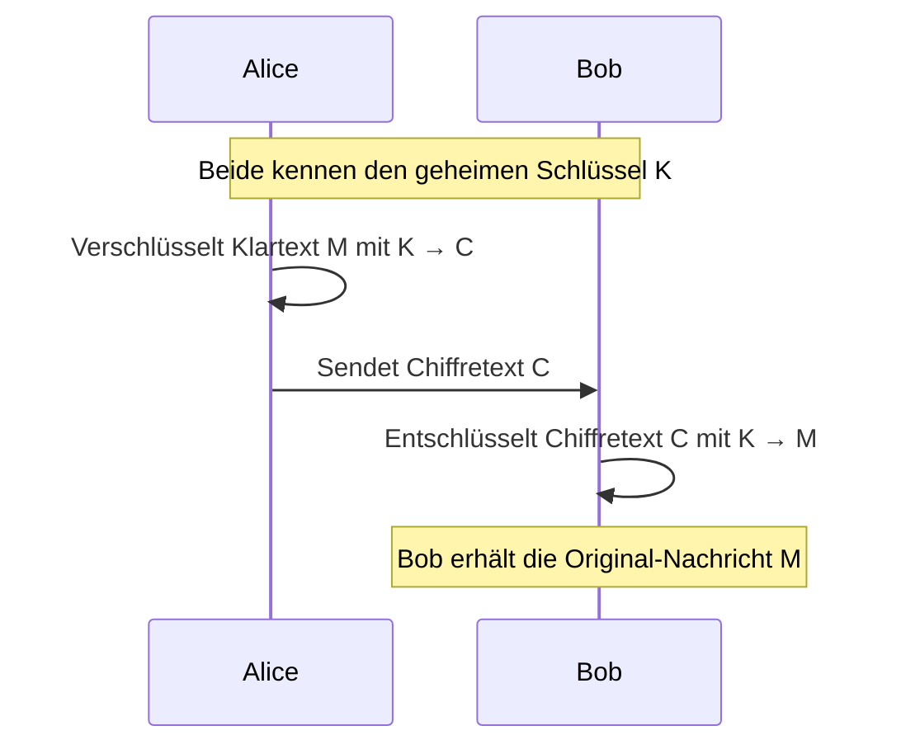
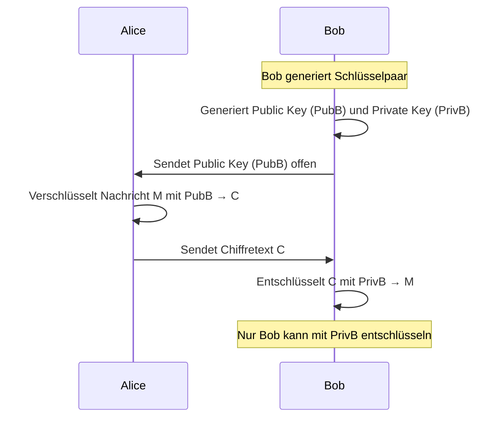
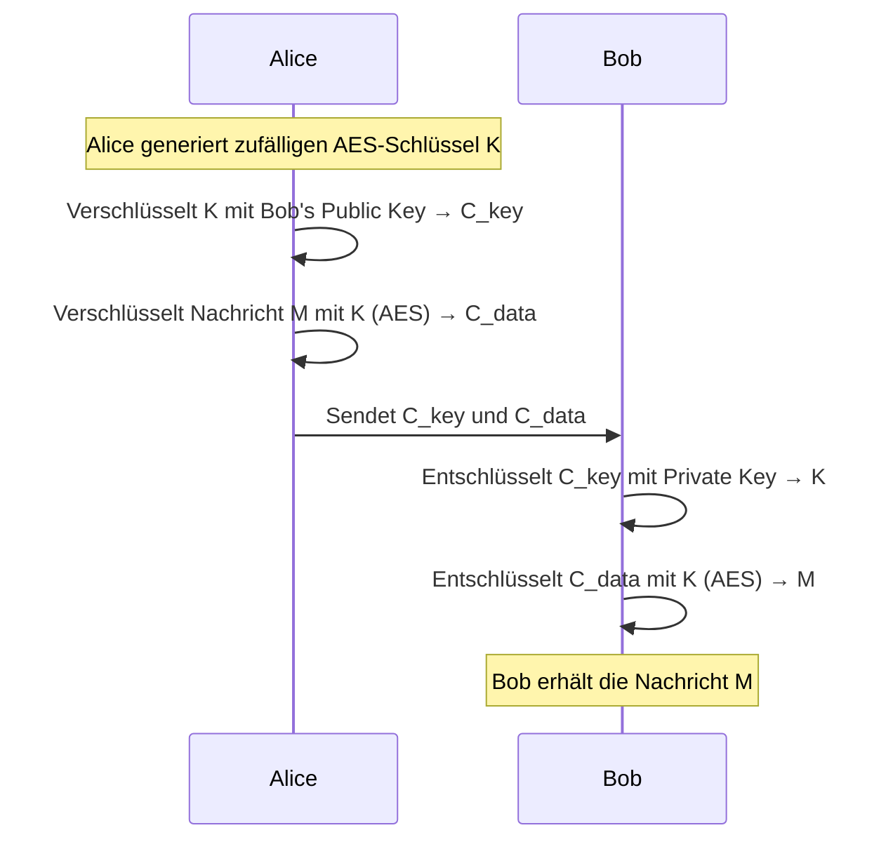
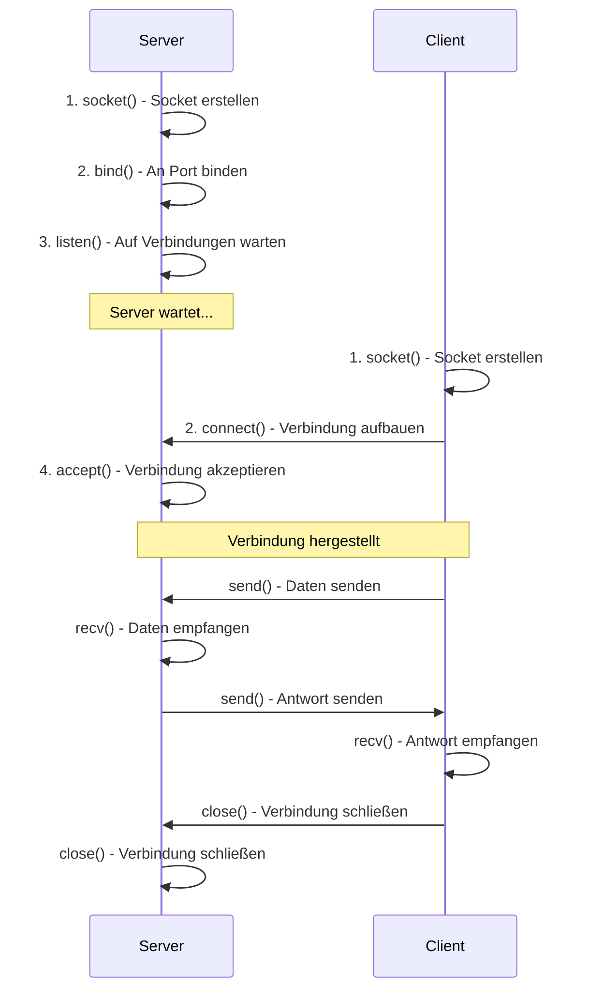

# V17: Kryptografie – Teil 1

> [!NOTE]
> **Lernziele dieser Vorlesung**:
> - Symmetrische Verschlüsselungsverfahren verstehen (AES, DES)
> - Asymmetrische Verschlüsselung und das Public-Key-Konzept beherrschen (RSA)
> - Unterschiede zwischen symmetrischer und asymmetrischer Verschlüsselung kennen
> - Die Schlüsselaustausch-Problematik verstehen und Lösungsansätze kennen
> - Einfache Socket-Programmierung in Python durchführen
> - TCP-Verbindungen zwischen Client und Server aufbauen
> - Daten über Netzwerke senden und empfangen

---

## Teil 1: Theorie - Kryptografie Grundlagen

### Überblick

**Kryptografie** ist die Wissenschaft der sicheren Kommunikation in Anwesenheit von Angreifern. In der modernen digitalen Welt ist Kryptografie allgegenwärtig: beim Online-Banking, beim Versenden von E-Mails, beim Zugriff auf Webseiten (HTTPS), bei verschlüsselten Festplatten und bei der Authentifizierung von Benutzern. Ohne Kryptografie wären nahezu alle digitalen Transaktionen unsicher und könnten von Angreifern mitgelesen oder manipuliert werden.

> [!NOTE]
> **Kryptografie** (von griechisch *kryptós* = verborgen, *gráphein* = schreiben) bezeichnet Verfahren zur Verschlüsselung und Entschlüsselung von Informationen, um deren Vertraulichkeit, Integrität und Authentizität zu gewährleisten.

In der Ingenieurspraxis spielt Kryptografie eine zentrale Rolle bei der Absicherung von Maschinen-zu-Maschinen-Kommunikation (M2M), IoT-Geräten, Steuerungssystemen und Cloud-basierten Fertigungsanwendungen. Verschlüsselte Verbindungen verhindern, dass Sensordaten manipuliert werden oder Steuerungsbefehle von Angreifern abgefangen werden.

Die Kryptografie wird in zwei Hauptkategorien unterteilt:

1. **Symmetrische Verschlüsselung**: Ein gemeinsamer Schlüssel wird für Verschlüsselung und Entschlüsselung verwendet.
2. **Asymmetrische Verschlüsselung**: Ein Schlüsselpaar (öffentlicher und privater Schlüssel) ermöglicht sichere Kommunikation ohne vorherigen Schlüsselaustausch.

### Historischer Kontext: Von Caesar bis AES

Verschlüsselung ist keine moderne Erfindung. Bereits Julius Caesar verwendete eine einfache Substitutions-Chiffre, bei der jeder Buchstabe um eine feste Anzahl von Positionen im Alphabet verschoben wurde (Caesar-Chiffre). Diese Methode war für ihre Zeit ausreichend, wäre heute jedoch in Sekunden geknackt.

Die Geschichte der Kryptografie zeigt eine ständige Weiterentwicklung: Im Zweiten Weltkrieg nutzte Deutschland die Enigma-Maschine, die durch Alan Turing und sein Team in Bletchley Park gebrochen wurde. Diese Arbeit gilt als Geburtsstunde der modernen Informatik. Erst mit dem Aufkommen leistungsfähiger Computer in den 1970er Jahren wurden mathematisch fundierte Verschlüsselungsverfahren wie DES (Data Encryption Standard) entwickelt.

> [!TIP]
> **Beispiel: Caesar-Chiffre (ROT3)**
> 
> Die Caesar-Chiffre verschiebt jeden Buchstaben um eine feste Anzahl von Positionen im Alphabet. Bei ROT3 wird jeder Buchstabe um 3 Positionen verschoben:
> 
> - **Klartext**: `HALLO`
> - **Verschiebung**: +3
> - **Verschlüsselt**: `KDOOR`
> 
> Entschlüsselung: Verschiebung um -3
> 
> **Schwäche**: Es gibt nur 25 mögliche Schlüssel (Verschiebungen 1-25). Ein Angreifer kann alle Möglichkeiten in Sekunden durchprobieren (Brute-Force-Angriff).

### Grundbegriffe der Kryptografie

Bevor wir in die Details der Verschlüsselungsverfahren einsteigen, müssen einige fundamentale Begriffe geklärt werden.

> [!NOTE]
> **Klartext (Plaintext)**: Die unverschlüsselte, lesbare Nachricht.

> [!NOTE]
> **Chiffretext (Ciphertext)**: Die verschlüsselte, unleserliche Nachricht.

> [!NOTE]
> **Schlüssel (Key)**: Eine Information, die den Verschlüsselungs- und Entschlüsselungsprozess steuert. Ohne den korrekten Schlüssel ist es praktisch unmöglich, den Chiffretext zu entschlüsseln.

> [!NOTE]
> **Verschlüsselung (Encryption)**: Der Prozess, bei dem ein Klartext mithilfe eines Schlüssels in einen Chiffretext umgewandelt wird.

> [!NOTE]
> **Entschlüsselung (Decryption)**: Der Prozess, bei dem ein Chiffretext mithilfe eines Schlüssels zurück in den Klartext umgewandelt wird.

> [!NOTE]
> **Algorithmus**: Die mathematische Funktion, die zur Verschlüsselung und Entschlüsselung verwendet wird. Der Algorithmus ist in der Regel öffentlich bekannt (Kerckhoffs' Prinzip).

> [!NOTE]
> **Kerckhoffs' Prinzip**: Die Sicherheit eines Verschlüsselungssystems darf nicht von der Geheimhaltung des Algorithmus abhängen, sondern ausschließlich von der Geheimhaltung des Schlüssels.

Das **Kerckhoffs' Prinzip** ist ein fundamentales Designprinzip der modernen Kryptografie. Es besagt, dass die Sicherheit eines Systems nicht durch "Security by Obscurity" (Sicherheit durch Unklarheit) erreicht werden soll, sondern durch mathematisch starke Algorithmen, deren Sicherheit nur vom Schlüssel abhängt. In der Praxis bedeutet dies: Selbst wenn ein Angreifer den kompletten Quellcode des Verschlüsselungssystems kennt, sollte er ohne den Schlüssel nicht in der Lage sein, den Chiffretext zu entschlüsseln.

> [!WARNING]
> **Häufiger Fehler**: Eigene Verschlüsselungsalgorithmen entwickeln ("Roll your own crypto")
> 
> Viele Entwickler versuchen, eigene Verschlüsselungsverfahren zu erfinden, weil sie glauben, dass ein geheimer Algorithmus sicherer sei. Das Gegenteil ist der Fall: Verschlüsselungsalgorithmen müssen von Kryptografie-Experten über Jahre hinweg analysiert und getestet werden, bevor sie als sicher gelten. Verwende immer etablierte, standardisierte Algorithmen wie AES, RSA oder ECC.

### Symmetrische Verschlüsselung

Bei der **symmetrischen Verschlüsselung** wird derselbe Schlüssel sowohl für die Verschlüsselung als auch für die Entschlüsselung verwendet. Beide Kommunikationspartner müssen den Schlüssel kennen und geheim halten.

> [!NOTE]
> **Symmetrische Verschlüsselung** ist ein Verfahren, bei dem Sender und Empfänger denselben geheimen Schlüssel verwenden. Der Schlüssel muss vor der Kommunikation auf einem sicheren Kanal ausgetauscht werden.

**Prinzip der symmetrischen Verschlüsselung:**



**Vorteile der symmetrischen Verschlüsselung:**
- **Schnelligkeit**: Symmetrische Algorithmen sind sehr performant und können große Datenmengen effizient verschlüsseln. AES kann auf moderner Hardware mehrere Gigabyte pro Sekunde verarbeiten.
- **Einfachheit**: Die Implementierung ist technisch weniger komplex als asymmetrische Verfahren.
- **Bewährte Sicherheit**: Algorithmen wie AES-256 gelten als unknackbar bei korrekter Anwendung.

**Nachteile der symmetrischen Verschlüsselung:**
- **Schlüsselaustausch-Problem**: Wie tauschen Alice und Bob den geheimen Schlüssel sicher aus, wenn sie noch keine sichere Verbindung haben? Wenn der Schlüssel über einen unsicheren Kanal gesendet wird, kann ein Angreifer ihn abfangen.
- **Skalierungsproblem**: Bei $n$ Teilnehmern werden $\frac{n(n-1)}{2}$ unterschiedliche Schlüssel benötigt. Bei 100 Teilnehmern wären das 4.950 verschiedene Schlüssel!
- **Keine Authentifizierung**: Symmetrische Verschlüsselung allein beweist nicht, wer die Nachricht verschlüsselt hat. Jeder, der den Schlüssel besitzt, kann sich als Sender ausgeben.

#### DES (Data Encryption Standard)

Der **Data Encryption Standard (DES)** wurde 1977 vom US-amerikanischen National Institute of Standards and Technology (NIST) als offizieller Verschlüsselungsstandard veröffentlicht. DES war der erste öffentlich zugängliche, standardisierte Verschlüsselungsalgorithmus und dominierte die Kryptografie für mehr als zwei Jahrzehnte.

> [!NOTE]
> **DES (Data Encryption Standard)** ist ein symmetrischer Block-Chiffre-Algorithmus, der 64-Bit-Blöcke mit einem 56-Bit-Schlüssel verschlüsselt. DES galt lange Zeit als sicher, ist aber seit Ende der 1990er Jahre durch Brute-Force-Angriffe knackbar.

**Technische Details von DES:**
- **Blockgröße**: 64 Bit (8 Byte)
- **Schlüssellänge**: 56 Bit effektiv (64 Bit nominal, davon 8 Bit Paritätsbits)
- **Runden**: 16 Feistel-Runden mit Substitutions- und Permutations-Operationen
- **Modi**: ECB, CBC, CFB, OFB (verschiedene Betriebsmodi)

Der DES-Algorithmus arbeitet in Runden: Der Klartext wird in 64-Bit-Blöcke aufgeteilt und jeder Block durchläuft 16 Transformationsrunden. In jeder Runde werden Teile des Blocks mit einem aus dem Hauptschlüssel abgeleiteten Rundenschlüssel kombiniert, substituiert und permutiert.

> [!WARNING]
> **DES ist heute nicht mehr sicher!**
> 
> Die 56-Bit-Schlüssellänge war bereits in den 1990er Jahren umstritten. 1998 demonstrierte die Electronic Frontier Foundation (EFF) mit der "DES Cracker"-Maschine, dass DES-verschlüsselte Nachrichten in weniger als 56 Stunden per Brute-Force geknackt werden können. Heute ist dies in wenigen Stunden möglich. **Verwende DES nicht mehr für neue Anwendungen!**

**3DES (Triple DES)**: Um die Sicherheit von DES zu erhöhen, wurde Triple-DES entwickelt. Dabei wird DES dreimal hintereinander mit unterschiedlichen Schlüsseln angewendet, was die effektive Schlüssellänge auf 112 oder 168 Bit erhöht. 3DES ist sicherer als DES, aber deutlich langsamer als moderne Alternativen wie AES.

#### AES (Advanced Encryption Standard)

Der **Advanced Encryption Standard (AES)** wurde im Jahr 2001 als Nachfolger von DES standardisiert. AES entstand aus einem öffentlichen Wettbewerb, bei dem Kryptografen aus aller Welt Algorithmen einreichten. Der Gewinner, Rijndael (entwickelt von Joan Daemen und Vincent Rijmen), wurde als AES standardisiert.

> [!NOTE]
> **AES (Advanced Encryption Standard)** ist der aktuelle Standard für symmetrische Verschlüsselung. AES verschlüsselt 128-Bit-Blöcke und unterstützt Schlüssellängen von 128, 192 oder 256 Bit. AES gilt als sicher und ist extrem performant.

**Technische Details von AES:**
- **Blockgröße**: 128 Bit (16 Byte)
- **Schlüssellängen**: 128, 192 oder 256 Bit
- **Runden**: 10 Runden (AES-128), 12 Runden (AES-192), 14 Runden (AES-256)
- **Operationen**: SubBytes (Substitution), ShiftRows (Permutation), MixColumns (Diffusion), AddRoundKey (XOR mit Rundenschlüssel)

AES arbeitet mit einer Kombination aus Substitutions- und Permutations-Operationen, die mathematisch so gestaltet sind, dass jede Änderung eines einzigen Bits im Klartext zu einer völlig anderen Ausgabe führt (Avalanche-Effekt). Dieser Effekt ist entscheidend für die Sicherheit: Selbst wenn ein Angreifer zwei verschlüsselte Nachrichten vergleicht, die sich nur minimal unterscheiden, kann er keine Rückschlüsse auf den Schlüssel ziehen.

> [!TIP]
> **Beispiel: AES-Verschlüsselung in der Praxis**
> 
> Eine 256-Bit-AES-Verschlüsselung mit einem zufälligen Schlüssel ist praktisch unknackbar. Die Anzahl der möglichen Schlüssel beträgt $2^{256} \approx 1.16 \times 10^{77}$. Selbst wenn ein Supercomputer 1 Milliarde Schlüssel pro Sekunde testen könnte (was unrealistisch ist), würde es etwa $3.7 \times 10^{60}$ Jahre dauern, alle Schlüssel durchzuprobieren. Zum Vergleich: Das Universum ist etwa $1.4 \times 10^{10}$ Jahre alt.

**Warum ist AES so sicher?**

Die Sicherheit von AES basiert auf mehreren Faktoren:

1. **Schlüssellänge**: 256-Bit-Schlüssel bieten eine astronomische Anzahl an Kombinationen.
2. **Diffusion und Konfusion**: Die Operationen von AES sorgen dafür, dass jede Änderung im Klartext oder Schlüssel das gesamte Chiffrat beeinflusst.
3. **Keine bekannten Schwachstellen**: Trotz intensiver Forschung wurden keine praktisch relevanten Angriffe gegen AES gefunden.
4. **Hardware-Beschleunigung**: Moderne CPUs haben spezielle Instruktionen (AES-NI), die AES extrem schnell machen (bis zu 10 GB/s auf Desktop-CPUs).

**Betriebsmodi von AES:**

AES ist ein Block-Chiffre, das heißt, es verschlüsselt immer Blöcke fester Größe (128 Bit). Um längere Nachrichten zu verschlüsseln, müssen Betriebsmodi verwendet werden:

- **ECB (Electronic Codebook)**: Jeder Block wird unabhängig verschlüsselt. **Unsicher!** Identische Klartextblöcke führen zu identischen Chiffretextblöcken, wodurch Muster sichtbar bleiben.
- **CBC (Cipher Block Chaining)**: Jeder Block wird mit dem vorherigen Chiffretextblock XOR-verknüpft. Benötigt einen Initialisierungsvektor (IV).
- **CTR (Counter Mode)**: Block-Chiffre wird in einen Stream-Chiffre verwandelt. Ermöglicht parallele Verschlüsselung und ist sehr performant.
- **GCM (Galois/Counter Mode)**: Kombiniert Verschlüsselung mit Authentifizierung (AEAD). Empfohlener Modus für neue Anwendungen.

> [!WARNING]
> **ECB-Modus niemals verwenden!**
> 
> Der ECB-Modus ist unsicher, weil identische Klartextblöcke zu identischen Chiffretextblöcken führen. Dies kann Muster im Klartext offenbaren. Ein berühmtes Beispiel ist das "ECB-Pinguin-Bild": Ein Bild eines Pinguins, das mit ECB verschlüsselt wurde, zeigt noch immer die Silhouette des Pinguins im verschlüsselten Bild. Verwende stattdessen CBC, CTR oder GCM.

### Asymmetrische Verschlüsselung

Die **asymmetrische Verschlüsselung** (auch Public-Key-Kryptografie genannt) revolutionierte die Kryptografie in den 1970er Jahren. Sie löst das fundamentale Problem der symmetrischen Verschlüsselung: Wie kann man sicher kommunizieren, ohne zuvor einen geheimen Schlüssel auszutauschen?

> [!NOTE]
> **Asymmetrische Verschlüsselung** verwendet ein Schlüsselpaar bestehend aus einem öffentlichen Schlüssel (Public Key) und einem privaten Schlüssel (Private Key). Der öffentliche Schlüssel wird veröffentlicht, der private Schlüssel bleibt geheim. Was mit dem öffentlichen Schlüssel verschlüsselt wurde, kann nur mit dem privaten Schlüssel entschlüsselt werden.

**Prinzip der asymmetrischen Verschlüsselung:**



**Die geniale Idee:** Jeder Teilnehmer besitzt ein Schlüsselpaar. Der öffentliche Schlüssel kann frei verteilt werden (z.B. auf einer Webseite, per E-Mail, in einem Verzeichnisdienst). Wenn Alice eine vertrauliche Nachricht an Bob senden möchte, verschlüsselt sie die Nachricht mit Bobs öffentlichem Schlüssel. Nur Bob kann die Nachricht mit seinem privaten Schlüssel entschlüsseln. Nicht einmal Alice selbst kann die verschlüsselte Nachricht wieder entschlüsseln!

**Vorteile der asymmetrischen Verschlüsselung:**
- **Kein vorheriger Schlüsselaustausch nötig**: Der öffentliche Schlüssel kann offen übertragen werden.
- **Skalierbarkeit**: Bei $n$ Teilnehmern werden nur $n$ Schlüsselpaare benötigt (statt $\frac{n(n-1)}{2}$ bei symmetrischer Verschlüsselung).
- **Digitale Signaturen möglich**: Mit dem privaten Schlüssel kann signiert werden, mit dem öffentlichen Schlüssel kann die Signatur verifiziert werden (siehe Teil 2).
- **Authentifizierung**: Da nur der Besitzer des privaten Schlüssels Nachrichten entschlüsseln oder signieren kann, ist klar, wer der Kommunikationspartner ist.

**Nachteile der asymmetrischen Verschlüsselung:**
- **Langsam**: Asymmetrische Algorithmen sind etwa 100-1000x langsamer als symmetrische. RSA kann nur wenige Kilobyte pro Sekunde verarbeiten.
- **Größere Schlüssel**: Ein 2048-Bit-RSA-Schlüssel bietet etwa die gleiche Sicherheit wie ein 128-Bit-AES-Schlüssel.
- **Komplexität**: Die mathematischen Grundlagen sind deutlich anspruchsvoller (Primzahlen, modulare Arithmetik, elliptische Kurven).

#### RSA (Rivest-Shamir-Adleman)

**RSA** ist der bekannteste und am weitesten verbreitete asymmetrische Verschlüsselungsalgorithmus. Er wurde 1977 von Ron Rivest, Adi Shamir und Leonard Adleman am MIT entwickelt und ist nach ihren Anfangsbuchstaben benannt. RSA war das erste praktisch einsetzbare Public-Key-Verfahren und gilt bis heute als Industriestandard.

> [!NOTE]
> **RSA** ist ein asymmetrisches Verschlüsselungsverfahren, dessen Sicherheit auf der Schwierigkeit basiert, große Zahlen in ihre Primfaktoren zu zerlegen. Ein typischer RSA-Schlüssel hat heute eine Länge von 2048 oder 4096 Bit.

**Mathematische Grundlagen von RSA:**

RSA basiert auf der Tatsache, dass es einfach ist, zwei große Primzahlen zu multiplizieren, aber extrem schwierig, das Produkt wieder in seine Primfaktoren zu zerlegen.

Beispiel: $p = 61$ und $q = 53$ (zwei Primzahlen)
- **Multiplikation**: $n = p \cdot q = 61 \cdot 53 = 3233$ (einfach)
- **Faktorisierung**: Gegeben $n = 3233$, finde $p$ und $q$ (schwierig bei großen Zahlen)

Bei RSA-2048 hat die Zahl $n$ etwa 617 Dezimalstellen. Die Faktorisierung solch großer Zahlen würde selbst mit den schnellsten Supercomputern Jahrmillionen dauern.

**RSA-Schlüsselgenerierung (vereinfacht):**

1. Wähle zwei große Primzahlen $p$ und $q$
2. Berechne $n = p \cdot q$ (Modulus)
3. Berechne $\phi(n) = (p-1)(q-1)$ (Euler'sche Phi-Funktion)
4. Wähle $e$ mit $1 < e < \phi(n)$ und $\gcd(e, \phi(n)) = 1$ (öffentlicher Exponent, häufig 65537)
5. Berechne $d$ mit $d \cdot e \equiv 1 \mod \phi(n)$ (privater Exponent)

**Öffentlicher Schlüssel**: $(n, e)$  
**Privater Schlüssel**: $(n, d)$ (oder $(p, q, d)$ für schnellere Entschlüsselung)

**RSA-Verschlüsselung und Entschlüsselung:**

- **Verschlüsselung**: $C = M^e \mod n$
- **Entschlüsselung**: $M = C^d \mod n$

Die Sicherheit von RSA hängt davon ab, dass ohne Kenntnis von $p$ und $q$ (die Primfaktoren von $n$) der private Exponent $d$ nicht effizient berechnet werden kann.

> [!TIP]
> **Beispiel: RSA mit kleinen Zahlen**
> 
> (In der Praxis wären die Zahlen viel größer!)
> 
> 1. **Schlüsselgenerierung**:
>    - $p = 61$, $q = 53$
>    - $n = 61 \cdot 53 = 3233$
>    - $\phi(n) = (61-1)(53-1) = 3120$
>    - $e = 17$ (gewählt, da $\gcd(17, 3120) = 1$)
>    - $d = 2753$ (berechnet aus $d \cdot 17 \equiv 1 \mod 3120$)
> 
> 2. **Verschlüsselung** (Klartext $M = 123$):
>    - $C = 123^{17} \mod 3233 = 855$
> 
> 3. **Entschlüsselung**:
>    - $M = 855^{2753} \mod 3233 = 123$
> 
> Die Berechnung von $123^{17} \mod 3233$ und $855^{2753} \mod 3233$ erfolgt mittels modularer Exponentiation (Square-and-Multiply-Algorithmus), nicht durch direkte Berechnung der Potenzen.

> [!WARNING]
> **RSA-Schlüssellängen beachten!**
> 
> - **1024 Bit**: Nicht mehr sicher (kann mit erheblichem Aufwand geknackt werden)
> - **2048 Bit**: Aktueller Mindeststandard (sicher bis mindestens 2030)
> - **3072 Bit**: Erhöhte Sicherheit
> - **4096 Bit**: Maximale Sicherheit (aber deutlich langsamer)
> 
> Die Empfehlung des BSI (Bundesamt für Sicherheit in der Informationstechnik) lautet: Mindestens 2048 Bit für neue Systeme, Migration zu 3072 Bit bis 2023.

### Hybride Verschlüsselung: Das Beste aus beiden Welten

In der Praxis werden symmetrische und asymmetrische Verschlüsselung kombiniert, um die Vorteile beider Verfahren zu nutzen. Diese Kombination nennt man **hybride Verschlüsselung**.

> [!NOTE]
> **Hybride Verschlüsselung** kombiniert die Geschwindigkeit symmetrischer Verfahren mit der Flexibilität asymmetrischer Verfahren. Ein zufälliger symmetrischer Sitzungsschlüssel (Session Key) wird mit dem asymmetrischen Verfahren ausgetauscht und anschließend werden die Daten mit dem symmetrischen Verfahren verschlüsselt.

**Ablauf der hybriden Verschlüsselung:**



**Warum hybrid?**

1. **Performance**: Die eigentlichen Daten werden mit dem schnellen AES verschlüsselt (z.B. 1 GB Videodatei).
2. **Sicherheit**: Der AES-Schlüssel wird mit RSA verschlüsselt und sicher übertragen.
3. **Flexibilität**: Der AES-Schlüssel kann für jede Sitzung neu generiert werden (Perfect Forward Secrecy).

Dieses Verfahren wird bei HTTPS, TLS/SSL, PGP/GPG und vielen anderen sicheren Protokollen eingesetzt.

### Die Schlüsselaustausch-Problematik

Das fundamentale Problem der Kryptografie lautet: Wie können zwei Parteien, die sich noch nie getroffen haben und über einen unsicheren Kanal kommunizieren, einen gemeinsamen geheimen Schlüssel vereinbaren?

> [!NOTE]
> **Schlüsselaustausch-Problem** bezeichnet die Herausforderung, wie zwei Parteien über einen unsicheren Kanal einen geheimen Schlüssel etablieren können, ohne dass ein Angreifer diesen Schlüssel erfährt.

**Historische Lösungsansätze:**

1. **Courier (physischer Transport)**: Ein vertrauenswürdiger Bote überbringt den Schlüssel persönlich. (Aufwändig, kostspielig, nicht skalierbar)
2. **Pre-Shared Keys**: Schlüssel werden im Voraus über einen sicheren Kanal ausgetauscht. (Funktioniert nur, wenn ein sicherer Kanal existiert)
3. **Key Distribution Center (KDC)**: Eine zentrale, vertrauenswürdige Instanz vermittelt Schlüssel. (Single Point of Failure, Vertrauensproblem)

**Moderne Lösung: Diffie-Hellman-Schlüsselaustausch**

Der Diffie-Hellman-Algorithmus (1976) war der erste Durchbruch. Er ermöglicht es zwei Parteien, über einen unsicheren Kanal einen gemeinsamen geheimen Schlüssel zu vereinbaren, ohne dass ein Angreifer, der die Kommunikation mithört, den Schlüssel rekonstruieren kann.

Das Diffie-Hellman-Verfahren wird ausführlich in Vorlesung V18 (Kryptografie Teil 2) behandelt, zusammen mit digitalen Signaturen, Zertifikaten und PKI.

### Zusammenfassung Theorie

Die wichtigsten Punkte dieser Vorlesung:

- **Symmetrische Verschlüsselung** (AES, DES) verwendet einen gemeinsamen Schlüssel für Ver- und Entschlüsselung. Sie ist schnell, benötigt aber sicheren Schlüsselaustausch.
- **DES** ist veraltet und unsicher (56-Bit-Schlüssel). **AES** ist der aktuelle Standard und gilt als sicher (128/192/256-Bit-Schlüssel).
- **Asymmetrische Verschlüsselung** (RSA) verwendet Schlüsselpaare (öffentlich/privat). Sie löst das Schlüsselaustausch-Problem, ist aber langsam.
- **RSA** basiert auf der Schwierigkeit der Primfaktorzerlegung. Mindestens 2048-Bit-Schlüssel verwenden!
- **Hybride Verschlüsselung** kombiniert die Vorteile: Sitzungsschlüssel wird asymmetrisch ausgetauscht, Daten werden symmetrisch verschlüsselt.
- **Kerckhoffs' Prinzip**: Die Sicherheit liegt im Schlüssel, nicht im Algorithmus. Verwende standardisierte, geprüfte Verfahren!

---

## Teil 2: Python-Praxis - Netzwerk-Programmierung (Basics: Socket, HTTP) – Teil 1

> [!WARNING]
> **Python-Konsistenz beachten**: Prüfe [../../python_topics.md](../../python_topics.md) für bereits eingeführte Konzepte! Alle hier verwendeten Python-Funktionen werden auf ihre Erst-Einführung geprüft.

### Überblick

Moderne Maschinen und Produktionssysteme kommunizieren ständig über Netzwerke: Sensoren senden Messwerte an zentrale Server, CNC-Maschinen empfangen G-Code-Programme, Roboter werden remote gesteuert, und SCADA-Systeme überwachen Fertigungslinien in Echtzeit. Die Fähigkeit, Netzwerk-Programme zu schreiben, ist daher für Ingenieure von zentraler Bedeutung.

In dieser Python-Praxis lernen wir die Grundlagen der Netzwerk-Programmierung mit dem **`socket`-Modul**. Sockets sind die fundamentale Schnittstelle für Netzwerk-Kommunikation in Betriebssystemen und bilden die Basis für alle höheren Protokolle wie HTTP, FTP, SMTP usw.

**Wichtige Konzepte:**
- **Socket**: Ein Endpunkt für Netzwerk-Kommunikation (ähnlich einer Steckdose für Daten)
- **Client-Server-Modell**: Ein Server wartet auf Verbindungen, Clients bauen Verbindungen auf
- **TCP (Transmission Control Protocol)**: Verbindungsorientiertes, zuverlässiges Protokoll
- **IP-Adresse und Port**: Eindeutige Identifikation eines Netzwerk-Dienstes

### Socket-Grundlagen

Ein **Socket** ist ein Software-Endpunkt für Netzwerk-Kommunikation. Man kann sich einen Socket wie eine Telefonverbindung vorstellen: Ein Teilnehmer (Server) hat eine Nummer und wartet auf Anrufe, ein anderer Teilnehmer (Client) wählt die Nummer und baut eine Verbindung auf.

> [!NOTE]
> Ein **Socket** ist eine Abstraktion für einen Kommunikationsendpunkt. Über Sockets können Programme Daten über ein Netzwerk senden und empfangen. Ein Socket wird durch eine IP-Adresse und einen Port identifiziert.

> [!NOTE]
> **IP-Adresse**: Eine eindeutige Adresse im Netzwerk (z.B. `192.168.1.100` oder `127.0.0.1` für localhost).

> [!NOTE]
> **Port**: Eine Nummer zwischen 0 und 65535, die einen bestimmten Dienst auf einem Computer identifiziert. Bekannte Ports: 80 (HTTP), 443 (HTTPS), 22 (SSH), 21 (FTP).

> [!NOTE]
> **TCP (Transmission Control Protocol)**: Ein verbindungsorientiertes Protokoll, das garantiert, dass Daten vollständig und in der richtigen Reihenfolge ankommen. TCP ist zuverlässig, aber langsamer als UDP.

**Das Client-Server-Modell:**



### Das `socket`-Modul in Python

Python bietet mit dem **`socket`-Modul** eine einfache Schnittstelle zur Netzwerk-Programmierung. Alle socket-Funktionen sind Teil der Python-Standardbibliothek, es muss nichts zusätzlich installiert werden.

> [!NOTE]
> Das **`socket`-Modul** ist Teil der Python-Standardbibliothek und bietet low-level Zugriff auf Netzwerk-Schnittstellen. Es ermöglicht die Programmierung von TCP- und UDP-basierten Netzwerk-Anwendungen.

**Import:**

```python
import socket
```

#### Socket erstellen: `socket.socket()`

Die Funktion `socket.socket()` erstellt einen neuen Socket.

> [!NOTE]
> **`socket.socket(family, type)`** erstellt ein Socket-Objekt.
> 
> - `family`: Adressfamilie (meist `socket.AF_INET` für IPv4)
> - `type`: Socket-Typ (meist `socket.SOCK_STREAM` für TCP)
> 
> **Signatur**: `socket.socket(family=AF_INET, type=SOCK_STREAM)` → `socket`
> 
> **Beispiel**:
> ```python
> # TCP-Socket für IPv4 erstellen
> sock = socket.socket(socket.AF_INET, socket.SOCK_STREAM)
> ```

**Wichtige Konstanten:**
- `socket.AF_INET`: IPv4-Adressfamilie
- `socket.AF_INET6`: IPv6-Adressfamilie
- `socket.SOCK_STREAM`: TCP (verbindungsorientiert, zuverlässig)
- `socket.SOCK_DGRAM`: UDP (verbindungslos, nicht garantiert)

> [!TIP]
> **Beispiel: Socket erstellen**
> ```python
> import socket
> 
> # TCP-Socket (Transmission Control Protocol)
> tcp_socket = socket.socket(socket.AF_INET, socket.SOCK_STREAM)
> 
> # UDP-Socket (User Datagram Protocol)
> udp_socket = socket.socket(socket.AF_INET, socket.SOCK_DGRAM)
> ```

#### Server-Socket: Binden und Lauschen

Ein Server muss seinen Socket an eine bestimmte Adresse und einen Port binden, damit Clients wissen, wo sie sich verbinden können.

> [!NOTE]
> **`.bind(address)`** bindet einen Socket an eine Adresse (IP und Port).
> 
> - `address`: Tupel `(host, port)`, z.B. `("localhost", 8080)`
> 
> **Signatur**: `socket.bind((host, port))` → `None`
> 
> **Beispiel**:
> ```python
> sock.bind(("localhost", 8080))  # Server lauscht auf localhost:8080
> ```

> [!NOTE]
> **`.listen(backlog)`** versetzt den Socket in den "listening"-Modus, sodass er Verbindungen akzeptieren kann.
> 
> - `backlog`: Maximale Anzahl wartender Verbindungen in der Queue (Standard: meist 5)
> 
> **Signatur**: `socket.listen(backlog=5)` → `None`
> 
> **Beispiel**:
> ```python
> sock.listen(5)  # Akzeptiert bis zu 5 wartende Verbindungen
> ```

> [!NOTE]
> **`.accept()`** wartet auf eine eingehende Verbindung und gibt ein neues Socket-Objekt sowie die Client-Adresse zurück.
> 
> **Signatur**: `socket.accept()` → `(socket, address)`
> 
> - Rückgabe: Tupel `(client_socket, client_address)`
> - `client_socket`: Neuer Socket für die Kommunikation mit dem Client
> - `client_address`: Tupel `(client_ip, client_port)`
> 
> **Beispiel**:
> ```python
> client_sock, client_addr = sock.accept()
> print(f"Verbindung von {client_addr}")
> ```

> [!TIP]
> **Beispiel: Einfacher Server**
> ```python
> import socket
> 
> # Socket erstellen
> server_socket = socket.socket(socket.AF_INET, socket.SOCK_STREAM)
> 
> # An localhost:8080 binden
> server_socket.bind(("localhost", 8080))
> 
> # Auf Verbindungen warten
> server_socket.listen(1)
> print("Server lauscht auf Port 8080...")
> 
> # Verbindung akzeptieren (blockiert bis Client sich verbindet)
> client_socket, client_address = server_socket.accept()
> print(f"Verbindung von {client_address} hergestellt")
> 
> # Socket schließen
> client_socket.close()
> server_socket.close()
> ```

#### Client-Socket: Verbinden

Ein Client baut eine Verbindung zu einem Server auf, indem er die `connect()`-Methode aufruft.

> [!NOTE]
> **`.connect(address)`** baut eine Verbindung zu einem Remote-Socket auf.
> 
> - `address`: Tupel `(host, port)`, z.B. `("localhost", 8080)` oder `("192.168.1.100", 5000)`
> 
> **Signatur**: `socket.connect((host, port))` → `None`
> 
> **Beispiel**:
> ```python
> sock.connect(("localhost", 8080))  # Verbindet sich mit Server auf Port 8080
> ```

> [!TIP]
> **Beispiel: Einfacher Client**
> ```python
> import socket
> 
> # Socket erstellen
> client_socket = socket.socket(socket.AF_INET, socket.SOCK_STREAM)
> 
> # Mit Server verbinden
> client_socket.connect(("localhost", 8080))
> print("Verbindung zum Server hergestellt")
> 
> # Socket schließen
> client_socket.close()
> ```

#### Daten senden und empfangen

Sobald eine Verbindung hergestellt ist, können Daten gesendet und empfangen werden.

> [!NOTE]
> **`.send(bytes)`** sendet Daten über den Socket.
> 
> - `bytes`: Byte-String (nicht normaler String!)
> - Rückgabe: Anzahl der gesendeten Bytes (kann weniger sein als len(bytes))
> 
> **Signatur**: `socket.send(bytes)` → `int`
> 
> **Beispiel**:
> ```python
> nachricht = "Hallo Server"
> sock.send(nachricht.encode("utf-8"))  # String zu Bytes konvertieren
> ```

> [!NOTE]
> **`.sendall(bytes)`** sendet alle Daten über den Socket (blockiert, bis alles gesendet wurde).
> 
> - `bytes`: Byte-String
> - Kein Rückgabewert (oder Exception bei Fehler)
> 
> **Signatur**: `socket.sendall(bytes)` → `None`
> 
> **Beispiel**:
> ```python
> nachricht = "Hallo Server"
> sock.sendall(nachricht.encode("utf-8"))
> ```

> [!NOTE]
> **`.recv(bufsize)`** empfängt Daten vom Socket.
> 
> - `bufsize`: Maximale Anzahl zu empfangender Bytes (typisch: 1024, 4096, 8192)
> - Rückgabe: Byte-String (leer bei geschlossener Verbindung)
> 
> **Signatur**: `socket.recv(bufsize)` → `bytes`
> 
> **Beispiel**:
> ```python
> daten = sock.recv(1024)  # Empfange bis zu 1024 Bytes
> nachricht = daten.decode("utf-8")  # Bytes zu String konvertieren
> ```

> [!WARNING]
> **Wichtig: Encoding und Decoding**
> 
> Sockets arbeiten mit **Bytes**, nicht mit Strings! Du musst Strings vor dem Senden in Bytes konvertieren (`.encode()`) und empfangene Bytes in Strings zurückkonvertieren (`.decode()`).
> 
> ```python
> # String → Bytes
> text = "Hallo"
> bytes_data = text.encode("utf-8")
> 
> # Bytes → String
> text = bytes_data.decode("utf-8")
> ```

> [!TIP]
> **Beispiel: Echo-Server (vollständig)**
> ```python
> import socket
> 
> # Server-Socket erstellen
> server_socket = socket.socket(socket.AF_INET, socket.SOCK_STREAM)
> server_socket.bind(("localhost", 8080))
> server_socket.listen(1)
> print("Echo-Server läuft auf Port 8080...")
> 
> # Auf Client warten
> client_socket, client_address = server_socket.accept()
> print(f"Verbindung von {client_address}")
> 
> # Daten empfangen
> daten = client_socket.recv(1024)
> nachricht = daten.decode("utf-8")
> print(f"Empfangen: {nachricht}")
> 
> # Echo zurücksenden
> antwort = f"ECHO: {nachricht}"
> client_socket.sendall(antwort.encode("utf-8"))
> 
> # Verbindung schließen
> client_socket.close()
> server_socket.close()
> print("Server beendet")
> ```

> [!TIP]
> **Beispiel: Echo-Client (vollständig)**
> ```python
> import socket
> 
> # Client-Socket erstellen
> client_socket = socket.socket(socket.AF_INET, socket.SOCK_STREAM)
> client_socket.connect(("localhost", 8080))
> print("Verbunden mit Echo-Server")
> 
> # Nachricht senden
> nachricht = "Hallo vom Client"
> client_socket.sendall(nachricht.encode("utf-8"))
> print(f"Gesendet: {nachricht}")
> 
> # Antwort empfangen
> daten = client_socket.recv(1024)
> antwort = daten.decode("utf-8")
> print(f"Antwort: {antwort}")
> 
> # Verbindung schließen
> client_socket.close()
> print("Verbindung geschlossen")
> ```

### Multi-Client-Server mit Endlos-Schleife

In der Praxis soll ein Server nicht nach einer Verbindung beendet werden, sondern kontinuierlich auf neue Clients warten. Dies erreicht man mit einer Endlos-Schleife.

> [!TIP]
> **Beispiel: Multi-Client Echo-Server**
> ```python
> import socket
> 
> # Server-Socket erstellen und konfigurieren
> server_socket = socket.socket(socket.AF_INET, socket.SOCK_STREAM)
> server_socket.bind(("localhost", 8080))
> server_socket.listen(5)  # Queue für bis zu 5 wartende Clients
> print("Multi-Client Echo-Server läuft auf Port 8080...")
> print("Drücke Strg+C zum Beenden")
> 
> try:
>     while True:  # Endlos-Schleife
>         # Auf nächsten Client warten
>         client_socket, client_address = server_socket.accept()
>         print(f"\n[Neue Verbindung] {client_address}")
>         
>         try:
>             # Daten empfangen
>             daten = client_socket.recv(1024)
>             if daten:
>                 nachricht = daten.decode("utf-8")
>                 print(f"[{client_address}] Empfangen: {nachricht}")
>                 
>                 # Echo zurücksenden
>                 antwort = f"ECHO: {nachricht}"
>                 client_socket.sendall(antwort.encode("utf-8"))
>                 print(f"[{client_address}] Gesendet: {antwort}")
>         
>         except Exception as e:
>             print(f"[{client_address}] Fehler: {e}")
>         
>         finally:
>             # Client-Verbindung schließen
>             client_socket.close()
>             print(f"[{client_address}] Verbindung geschlossen")
> 
> except KeyboardInterrupt:
>     print("\n\nServer wird beendet...")
>     server_socket.close()
>     print("Server beendet")
> ```

### Praktisches Beispiel: Maschinenbau-Sensor-Server

Ein realistischeres Beispiel: Ein Server empfängt Sensordaten von einer CNC-Maschine und speichert sie.

> [!TIP]
> **Beispiel: Sensor-Daten-Server**
> ```python
> import socket
> import json
> from datetime import datetime
> 
> def start_sensor_server(host="localhost", port=5000):
>     """Startet einen Server, der Sensordaten empfängt und auswertet."""
>     
>     server_socket = socket.socket(socket.AF_INET, socket.SOCK_STREAM)
>     server_socket.bind((host, port))
>     server_socket.listen(5)
>     print(f"Sensor-Server läuft auf {host}:{port}")
>     print("Warte auf CNC-Maschinen-Verbindungen...")
>     
>     try:
>         while True:
>             client_socket, client_address = server_socket.accept()
>             print(f"\n[{datetime.now()}] Verbindung von {client_address}")
>             
>             try:
>                 # JSON-Daten empfangen
>                 daten = client_socket.recv(4096)
>                 if daten:
>                     json_string = daten.decode("utf-8")
>                     sensor_daten = json.loads(json_string)
>                     
>                     # Daten auswerten
>                     maschine_id = sensor_daten.get("maschine_id", "Unbekannt")
>                     temperatur = sensor_daten.get("temperatur", 0)
>                     drehzahl = sensor_daten.get("drehzahl", 0)
>                     vibration = sensor_daten.get("vibration", 0)
>                     
>                     print(f"Maschine {maschine_id}:")
>                     print(f"  - Temperatur: {temperatur}°C")
>                     print(f"  - Drehzahl: {drehzahl} RPM")
>                     print(f"  - Vibration: {vibration} mm/s")
>                     
>                     # Warnung bei kritischen Werten
>                     warnungen = []
>                     if temperatur > 80:
>                         warnungen.append("⚠️ Temperatur zu hoch!")
>                     if drehzahl > 12000:
>                         warnungen.append("⚠️ Drehzahl zu hoch!")
>                     if vibration > 5.0:
>                         warnungen.append("⚠️ Vibration zu hoch!")
>                     
>                     # Antwort senden
>                     if warnungen:
>                         antwort = {"status": "WARNUNG", "meldungen": warnungen}
>                     else:
>                         antwort = {"status": "OK", "meldungen": ["Alle Werte im Normbereich"]}
>                     
>                     client_socket.sendall(json.dumps(antwort).encode("utf-8"))
>             
>             except json.JSONDecodeError:
>                 print("Fehler: Ungültige JSON-Daten")
>             except Exception as e:
>                 print(f"Fehler: {e}")
>             finally:
>                 client_socket.close()
>     
>     except KeyboardInterrupt:
>         print("\n\nServer wird beendet...")
>         server_socket.close()
> 
> if __name__ == "__main__":
>     start_sensor_server()
> ```

### Häufige Fehler und Lösungen

> [!WARNING]
> **Fehler 1: "Address already in use" (Port bereits belegt)**
> 
> Wenn ein Server-Programm abstürzt oder nicht sauber beendet wird, bleibt der Port möglicherweise blockiert. Das Betriebssystem hält den Port für einige Zeit (TIME_WAIT) reserviert.
> 
> **Lösung**: Setze die `SO_REUSEADDR`-Option:
> ```python
> server_socket = socket.socket(socket.AF_INET, socket.SOCK_STREAM)
> server_socket.setsockopt(socket.SOL_SOCKET, socket.SO_REUSEADDR, 1)
> server_socket.bind(("localhost", 8080))
> ```

> [!WARNING]
> **Fehler 2: Vergessen, Bytes zu encodieren/decodieren**
> 
> Sockets arbeiten mit Bytes, nicht mit Strings. Ein häufiger Fehler ist:
> ```python
> # Falsch:
> sock.send("Hallo")  # TypeError: a bytes-like object is required
> 
> # Richtig:
> sock.send("Hallo".encode("utf-8"))
> ```

> [!WARNING]
> **Fehler 3: Socket nicht schließen**
> 
> Nicht geschlossene Sockets können zu Ressourcen-Lecks führen. Verwende `try-finally` oder `with`-Statement:
> ```python
> sock = socket.socket(socket.AF_INET, socket.SOCK_STREAM)
> try:
>     sock.connect(("localhost", 8080))
>     # Arbeit mit Socket...
> finally:
>     sock.close()  # Wird immer ausgeführt
> ```

> [!WARNING]
> **Fehler 4: Unvollständige Datenübertragung**
> 
> `.send()` garantiert nicht, dass alle Daten gesendet werden! Verwende `.sendall()`:
> ```python
> # Unsicher:
> sock.send(daten)  # Könnte nur Teile senden
> 
> # Sicher:
> sock.sendall(daten)  # Sendet alle Daten (oder wirft Exception)
> ```

> [!WARNING]
> **Fehler 5: Blockierendes `.accept()` und `.recv()`**
> 
> `.accept()` und `.recv()` blockieren (warten), bis eine Verbindung/Daten ankommen. Dies kann das Programm "einfrieren". Für produktive Anwendungen sollte man Timeouts setzen oder asynchrone Programmierung (z.B. `asyncio`) verwenden.
> 
> ```python
> # Timeout setzen (5 Sekunden)
> sock.settimeout(5.0)
> try:
>     daten = sock.recv(1024)
> except socket.timeout:
>     print("Timeout: Keine Daten empfangen")
> ```

### Zusammenfassung Python

Die wichtigsten Python-Konzepte dieser Vorlesung:

- **Socket-Programmierung** ermöglicht Netzwerk-Kommunikation zwischen Programmen.
- **Server** erstellen Socket, binden an Port (`bind()`), lauschen (`listen()`), akzeptieren Verbindungen (`accept()`).
- **Clients** erstellen Socket, verbinden sich mit Server (`connect()`).
- **Daten senden** mit `.send()` oder `.sendall()` (empfohlen), **empfangen** mit `.recv(bufsize)`.
- **Wichtig**: Sockets arbeiten mit **Bytes**, nicht Strings. Verwende `.encode()` und `.decode()`.
- **Best Practice**: Sockets immer mit `try-finally` oder `with`-Statement schließen.
- **Multi-Client-Server**: Endlos-Schleife mit `while True` für kontinuierlichen Betrieb.

### Neue Python-Funktionen/Methoden

Die folgenden Python-Funktionen und Methoden wurden in dieser Vorlesung **neu eingeführt**:

**`socket`-Modul:**
- `socket.socket(family, type)` – Erstellt einen Socket
- `socket.AF_INET` – Konstante für IPv4
- `socket.AF_INET6` – Konstante für IPv6
- `socket.SOCK_STREAM` – Konstante für TCP
- `socket.SOCK_DGRAM` – Konstante für UDP
- `.bind((host, port))` – Bindet Socket an Adresse
- `.listen(backlog)` – Versetzt Socket in Listening-Modus
- `.accept()` – Akzeptiert eingehende Verbindung
- `.connect((host, port))` – Baut Verbindung zu Server auf
- `.send(bytes)` – Sendet Daten (kann unvollständig sein)
- `.sendall(bytes)` – Sendet alle Daten (blockiert bis komplett)
- `.recv(bufsize)` – Empfängt Daten
- `.close()` – Schließt Socket
- `.setsockopt(level, optname, value)` – Setzt Socket-Optionen
- `.settimeout(seconds)` – Setzt Timeout für blockierende Operationen
- `socket.SOL_SOCKET` – Konstante für Socket-Level-Optionen
- `socket.SO_REUSEADDR` – Konstante für Adress-Wiederverwendung
- `socket.timeout` – Exception bei Timeout

**String-Methoden (bekannt, aber hier relevant):**
- `.encode(encoding)` – String zu Bytes konvertieren
- `.decode(encoding)` – Bytes zu String konvertieren

---

## Weiterführende Ressourcen

### Theorie
- **BSI (Bundesamt für Sicherheit in der Informationstechnik)**: Kryptographische Verfahren: Empfehlungen und Schlüssellängen – https://www.bsi.bund.de/
- **NIST (National Institute of Standards and Technology)**: Advanced Encryption Standard (AES) – https://csrc.nist.gov/publications/fips
- **Computerphile (YouTube-Kanal)**: Hervorragende Videos zu AES, RSA, Diffie-Hellman und anderen Kryptografie-Themen
- **"The Code Book" von Simon Singh**: Unterhaltsame Geschichte der Kryptografie von Caesar bis RSA

### Python
- **Python-Dokumentation `socket`**: https://docs.python.org/3/library/socket.html
- **Real Python**: Socket Programming in Python – https://realpython.com/python-sockets/
- **Python `ssl`-Modul** (für verschlüsselte Sockets/TLS): https://docs.python.org/3/library/ssl.html
- **`asyncio` für asynchrone Socket-Programmierung**: https://docs.python.org/3/library/asyncio.html

